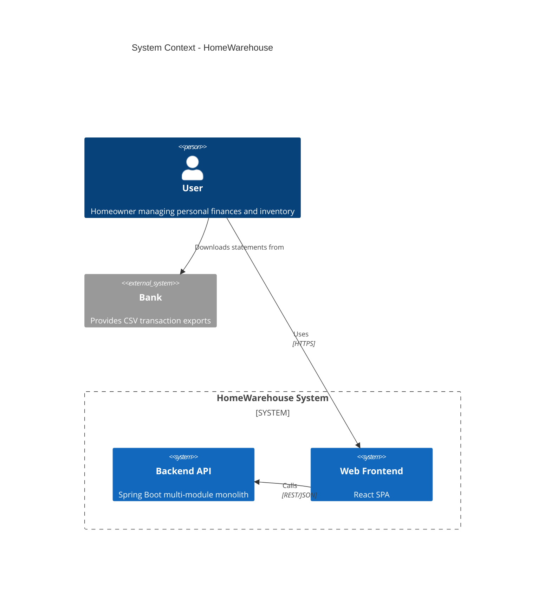
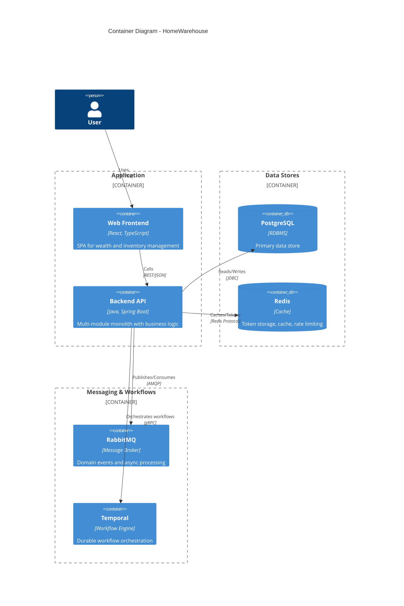
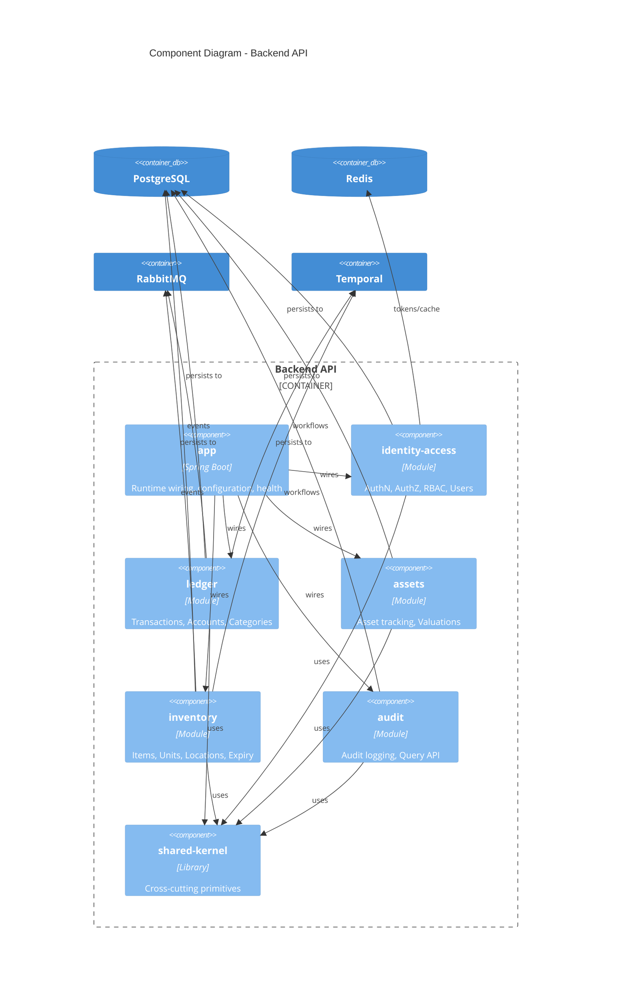
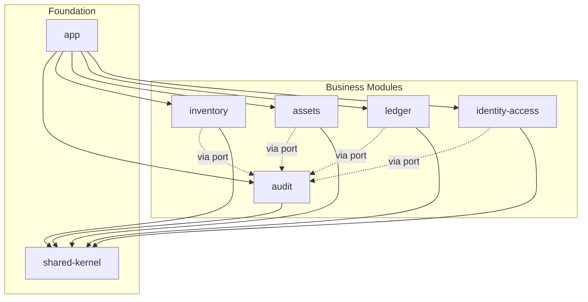
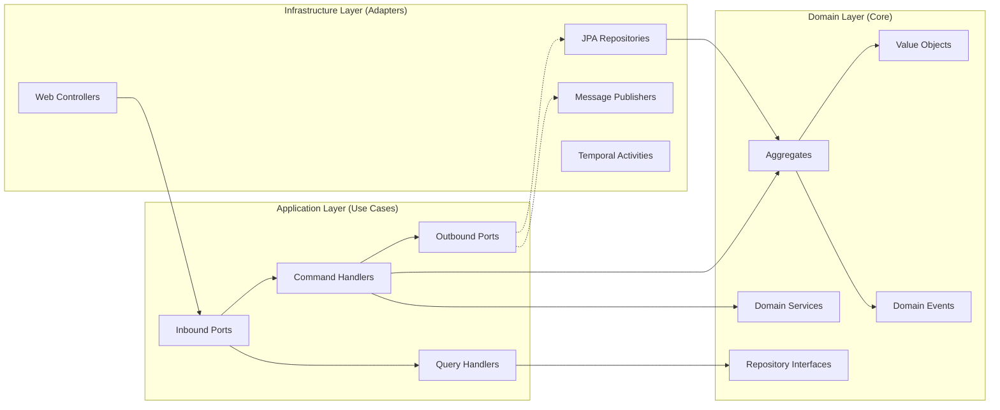
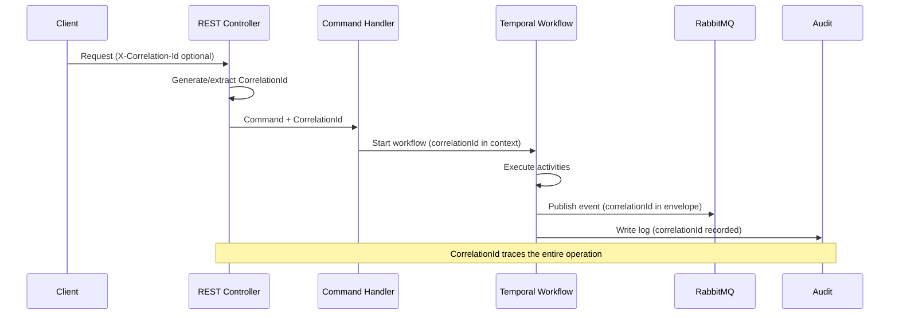
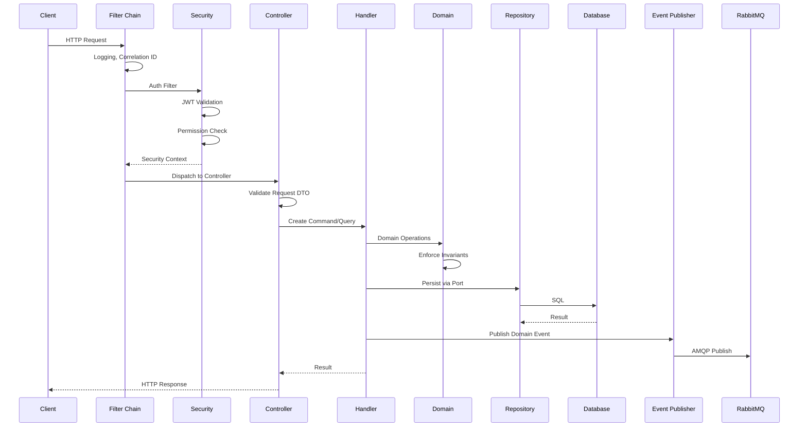

# HomeWarehouse - System Architecture

## Purpose

This document describes the technical architecture of HomeWarehouse, including the overall system design, module boundaries, architectural patterns, and technology choices.

## Scope

### In Scope

- System context and container views (C4-lite)
- Backend module structure and boundaries
- Hexagonal architecture implementation
- DDD patterns and conventions
- Vertical slice organization
- Gradle multi-module build structure
- Inter-module communication patterns
- Technology stack decisions

### Out of Scope

- Detailed API specifications (see [API](../api/04-api.md))
- Database schema details (see [Data Model](../database/03-data-model.md))
- Security implementation details (see [Security](../security/02-security.md))
- Infrastructure provisioning (see [Infrastructure](../infra/08-infra-plan.md))

## Architectural Principles

| Principle | Description |
|-----------|-------------|
| Screaming Architecture | Package and module names reflect business domains, not technical layers |
| Hexagonal Architecture | Domain core is framework-agnostic; adapters handle external concerns |
| Domain-Driven Design | Explicit aggregates, value objects, bounded contexts |
| Vertical Slicing | Features organized by use case, not horizontal layers |
| SOLID Principles | Single responsibility, open/closed, Liskov, interface segregation, dependency inversion |
| Explicit Dependencies | No hidden couplings; dependencies declared in build and injected at runtime |
| Fail Fast | Validate early, surface errors quickly, use typed errors |
| Auditability First | Every mutation leaves a traceable record |

## System Context (C4 Level 1)



## Container Diagram (C4 Level 2)



## Component Diagram (C4 Level 3 - Backend)



## Backend Module Structure

### Module Boundaries (Bounded Contexts)

| Module | Bounded Context | Responsibility |
|--------|-----------------|----------------|
| `identity-access` | Identity & Access Management | User authentication, JWT management, roles, permissions, RBAC enforcement |
| `ledger` | Financial Ledger | Accounts, transactions, categories, CSV import pipeline |
| `assets` | Asset Management | Asset entities, valuations, net worth calculations |
| `inventory` | Home Inventory | Item catalog, units, locations, expiry tracking, notifications |
| `audit` | Audit Trail | Immutable audit log, query interface |
| `shared-kernel` | Cross-Cutting | Primitives, identifiers, time, money, errors, correlation |
| `app` | Application Assembly | Spring Boot main, wiring, health, metrics |

### Module Dependency Rules



**Rules:**
1. All business modules depend on `shared-kernel` only for primitives
2. No business module depends directly on another business module's internal classes
3. Cross-module communication happens via:
   - Ports/interfaces defined in the calling module
   - Domain events via RabbitMQ
   - Temporal workflows orchestrating activities from multiple modules
4. `app` module wires everything together; no business logic here

## Gradle Multi-Module Build Structure

```
HomeWarehouse/
├── settings.gradle.kts           # Root settings, include all modules
├── build.gradle.kts              # Root build (version catalog ref)
├── gradle/
│   └── libs.versions.toml        # Version catalog
├── build-logic/
│   ├── settings.gradle.kts
│   └── src/main/kotlin/
│       ├── homewarehouse.java-conventions.gradle.kts
│       ├── homewarehouse.spring-boot-conventions.gradle.kts
│       ├── homewarehouse.testing-conventions.gradle.kts
│       └── homewarehouse.quality-conventions.gradle.kts
├── backend/
│   ├── shared-kernel/
│   │   └── build.gradle.kts
│   ├── identity-access/
│   │   └── build.gradle.kts
│   ├── ledger/
│   │   └── build.gradle.kts
│   ├── assets/
│   │   └── build.gradle.kts
│   ├── inventory/
│   │   └── build.gradle.kts
│   ├── audit/
│   │   └── build.gradle.kts
│   └── app/
│       └── build.gradle.kts
└── web/
    └── (React project)
```

### Convention Plugins

| Plugin | Purpose |
|--------|---------|
| `homewarehouse.java-conventions` | Java toolchain (21), compiler options, common dependencies |
| `homewarehouse.spring-boot-conventions` | Spring Boot plugin, actuator, common starters |
| `homewarehouse.testing-conventions` | JUnit 5, Testcontainers, test configuration |
| `homewarehouse.quality-conventions` | Spotless, Checkstyle, SpotBugs, OWASP Dependency-Check |

### Adding a New Module

1. Create directory under `backend/` with `build.gradle.kts`
2. Apply relevant convention plugins
3. Add to `settings.gradle.kts`: `include(":backend:new-module")`
4. Define internal package structure following hexagonal layout
5. Register Spring configuration in `app` module

## Hexagonal Architecture per Module

Each business module follows this internal structure:

```
backend/ledger/
├── build.gradle.kts
└── src/
    ├── main/
    │   ├── java/
    │   │   └── com/homewarehouse/ledger/
    │   │       ├── domain/                 # Pure domain model
    │   │       │   ├── model/              # Aggregates, entities, value objects
    │   │       │   ├── service/            # Domain services
    │   │       │   ├── event/              # Domain events
    │   │       │   └── repository/         # Repository interfaces (ports)
    │   │       ├── application/            # Use cases (vertical slices)
    │   │       │   ├── command/            # Write operations
    │   │       │   │   ├── createtransaction/
    │   │       │   │   │   ├── CreateTransactionCommand.java
    │   │       │   │   │   ├── CreateTransactionHandler.java
    │   │       │   │   │   └── CreateTransactionResult.java
    │   │       │   │   └── importcsv/
    │   │       │   │       └── ...
    │   │       │   ├── query/              # Read operations
    │   │       │   │   ├── gettransactions/
    │   │       │   │   │   ├── GetTransactionsQuery.java
    │   │       │   │   │   ├── GetTransactionsHandler.java
    │   │       │   │   │   └── TransactionListResult.java
    │   │       │   │   └── getaccount/
    │   │       │   │       └── ...
    │   │       │   └── port/               # Application-level ports
    │   │       │       ├── in/             # Inbound ports (use case interfaces)
    │   │       │       └── out/            # Outbound ports (persistence, messaging)
    │   │       └── infrastructure/         # Adapters
    │   │           ├── persistence/        # JPA repositories, entities
    │   │           │   ├── JpaTransactionRepository.java
    │   │           │   └── TransactionJpaEntity.java
    │   │           ├── messaging/          # RabbitMQ producers/consumers
    │   │           │   └── LedgerEventPublisher.java
    │   │           ├── temporal/           # Temporal activities
    │   │           │   └── LedgerActivitiesImpl.java
    │   │           └── web/                # REST controllers
    │   │               ├── TransactionController.java
    │   │               └── dto/
    │   │                   ├── CreateTransactionRequest.java
    │   │                   └── TransactionResponse.java
    │   └── resources/
    │       └── (module-specific configs)
    └── test/
        ├── java/
        │   └── com/homewarehouse/ledger/
        │       ├── domain/                 # Unit tests for domain
        │       ├── application/            # Use case tests
        │       └── infrastructure/         # Integration tests
        └── resources/
```

### Hexagonal Layer Responsibilities



### Dependency Direction

- **Domain** depends on nothing (pure Java, no Spring annotations)
- **Application** depends on Domain only
- **Infrastructure** depends on Application and Domain (implements ports)

## Vertical Slice Organization

Within the `application` layer, code is organized by feature/use case:

```
application/
├── command/
│   ├── createtransaction/
│   │   ├── CreateTransactionCommand.java      # Input DTO
│   │   ├── CreateTransactionHandler.java      # Orchestrates the use case
│   │   └── CreateTransactionResult.java       # Output DTO
│   ├── updatetransaction/
│   ├── deletetransaction/
│   └── importbankcsv/
│       ├── ImportBankCsvCommand.java
│       ├── ImportBankCsvHandler.java
│       ├── CsvMappingTemplate.java
│       └── ImportResult.java
└── query/
    ├── gettransactions/
    ├── getaccountbalance/
    └── exporttransactions/
```

**Benefits:**
- All code for a feature is co-located
- Easy to understand scope of changes
- Reduces merge conflicts
- Natural mapping to user stories

## Domain-Driven Design Patterns

### Aggregates

| Module | Aggregates |
|--------|------------|
| identity-access | User, Role, Permission |
| ledger | Account, Transaction, ImportJob |
| assets | Asset, Valuation |
| inventory | InventoryItem, InventoryUnit, Location |
| audit | AuditEntry (immutable) |

### Value Objects (Examples)

```java
// shared-kernel
public record UserId(UUID value) {}
public record Money(BigDecimal amount, Currency currency) {}
public record DateRange(LocalDate start, LocalDate end) {}
public record CorrelationId(String value) {}

// ledger
public record TransactionId(UUID value) {}
public record AccountId(UUID value) {}
public record CategoryId(UUID value) {}

// inventory
public record LocationPath(List<String> segments) {}  // e.g., ["Kitchen", "Pantry", "Shelf 2"]
public record ExpiryWindow(LocalDate bestBefore, LocalDate expiresAt) {}
```

### Domain Events

```java
// ledger
public record TransactionCreated(
    TransactionId id,
    AccountId accountId,
    Money amount,
    Instant occurredAt,
    CorrelationId correlationId
) implements DomainEvent {}

// inventory
public record InventoryUnitExpiring(
    InventoryUnitId id,
    InventoryItemId itemId,
    LocalDate expiresAt,
    int daysRemaining,
    Instant occurredAt,
    CorrelationId correlationId
) implements DomainEvent {}
```

### Invariants

Domain aggregates enforce business rules:

```java
// Transaction invariant: amount must be positive for expenses
public class Transaction {
    public static Transaction createExpense(Money amount, ...) {
        if (amount.isNegativeOrZero()) {
            throw new InvalidTransactionException("Expense amount must be positive");
        }
        // ...
    }
}

// InventoryUnit invariant: expiresAt must be after bestBefore
public class InventoryUnit {
    private void validateExpiryWindow(LocalDate bestBefore, LocalDate expiresAt) {
        if (expiresAt != null && bestBefore != null && expiresAt.isBefore(bestBefore)) {
            throw new InvalidExpiryWindowException("Expiration cannot be before best-before date");
        }
    }
}
```

## Cross-Cutting Concerns

### shared-kernel Contents

The `shared-kernel` module contains ONLY:

| Category | Contents |
|----------|----------|
| Identifiers | `UserId`, `CorrelationId`, `IdempotencyKey` |
| Time | `TimeProvider` interface, `Clock` abstraction |
| Money | `Money`, `Currency` value objects |
| Errors | `DomainException`, `ErrorCode`, error model |
| Events | `DomainEvent` interface, `EventMetadata` |
| Logging | Structured logging abstractions |
| Validation | Common validation utilities |

**Strictly NOT in shared-kernel:**
- No domain logic from specific modules
- No persistence code
- No web/HTTP code
- No message broker code
- No Spring-specific code

### Correlation ID Propagation



## Request Lifecycle



## Technology Stack Summary

| Layer | Technology | Purpose |
|-------|------------|---------|
| Runtime | Java 21 | LTS, virtual threads support |
| Framework | Spring Boot 3.x | Application framework |
| Build | Gradle 8.x (Kotlin DSL) | Build automation |
| Database | PostgreSQL 16 | Primary persistence |
| Cache | Redis 7 | Tokens, cache, rate limiting |
| Messaging | RabbitMQ 3.x | Domain events |
| Workflows | Temporal | Durable orchestration |
| Frontend | React 18, TypeScript 5 | Web SPA |
| Container | Docker, Kubernetes | Deployment |
| IaC | Terraform, Helm | Infrastructure |

## Quality Attributes Mapping

| Quality | Architectural Support |
|---------|----------------------|
| Security | Hexagonal isolation, explicit permission checks at ports |
| Testability | Domain has no dependencies, easy to unit test |
| Maintainability | Vertical slices, clear module boundaries |
| Evolvability | Can extract modules to microservices via existing ports |
| Reliability | Temporal for durable workflows, RabbitMQ for reliable messaging |
| Auditability | Dedicated audit module, correlation ID propagation |

## Related Documents

- [Security](../security/02-security.md) - Security architecture and implementation
- [Data Model](../database/03-data-model.md) - Database schema and tables
- [Workflows](../workflows/05-workflows-temporal.md) - Temporal workflow designs
- [Events](../events/06-events-rabbitmq.md) - RabbitMQ event architecture
- [ADR-0001](../adrs/0001-record-architecture-decisions.md) - Architectural decisions record
