# HomeWarehouse - Project Backlog

## Purpose

This document defines the implementation backlog for HomeWarehouse, organized as epics, stories, and tasks with explicit Phase 2 increments and ordering.

## Backlog Organization

| Level | Description | Example |
|-------|-------------|---------|
| Epic | Major feature area | Identity & Access Management |
| Story | User-facing capability | As a user, I can log in |
| Task | Technical implementation unit | Implement JWT validation |

## Phase 2 Implementation Order

The implementation is structured in increments, each building on the previous:

```mermaid
gantt
    title Phase 2 Implementation Increments
    dateFormat X
    axisFormat %s

    section Foundation
    Increment 1 - Project Skeleton     :a1, 0, 1
    Increment 2 - Identity & Audit     :a2, after a1, 2

    section Core Features
    Increment 3 - Ledger Basics        :a3, after a2, 2
    Increment 4 - Assets               :a4, after a3, 1
    Increment 5 - Inventory Basics     :a5, after a4, 2

    section Workflows
    Increment 6 - Purchase Workflow    :a6, after a5, 2
    Increment 7 - CSV Import           :a7, after a6, 2
    Increment 8 - Expiry & Alerts      :a8, after a7, 1

    section Polish
    Increment 9 - Dashboard            :a9, after a8, 1
    Increment 10 - Infrastructure      :a10, after a9, 1
```

---

## Increment 1: Project Skeleton

**Goal:** Runnable empty project with build infrastructure.

### Epic: Project Setup

#### Story: Initialize Backend Project
- [ ] **TASK-001**: Create Gradle multi-module project structure
  - settings.gradle.kts with all modules
  - Root build.gradle.kts
  - libs.versions.toml version catalog
- [ ] **TASK-002**: Create build-logic convention plugins
  - homewarehouse.java-conventions
  - homewarehouse.spring-boot-conventions
  - homewarehouse.testing-conventions
  - homewarehouse.quality-conventions
- [ ] **TASK-003**: Create module scaffolds
  - shared-kernel module
  - identity-access module
  - ledger module
  - assets module
  - inventory module
  - audit module
  - app module (Spring Boot main)
- [ ] **TASK-004**: Configure quality tools
  - Spotless for formatting
  - Checkstyle configuration
  - SpotBugs with FindSecBugs
  - OWASP Dependency-Check

#### Story: Initialize Frontend Project
- [ ] **TASK-005**: Create React + TypeScript project with Vite
  - Project structure as documented
  - ESLint + Prettier configuration
  - Tailwind CSS setup
- [ ] **TASK-006**: Install core dependencies
  - React Router
  - TanStack Query
  - Zustand
  - Axios
  - React Hook Form + Zod

#### Story: Local Development Environment
- [ ] **TASK-007**: Create Docker Compose configuration
  - PostgreSQL, Redis, RabbitMQ, Temporal
  - .env.template
  - README with startup instructions

**Acceptance Criteria:**
- [ ] `./gradlew build` succeeds (no code yet, just structure)
- [ ] `npm run build` succeeds in web directory
- [ ] `docker-compose up -d` starts all services
- [ ] Minimal Spring Boot app starts and connects to services

---

## Increment 2: Identity & Access + Audit Foundation

**Goal:** Secure authentication with audit logging.

### Epic: Identity & Access Management

#### Story: User Authentication (US-A01, US-A03)
- [ ] **TASK-010**: Create IAM domain model
  - User aggregate with value objects
  - Password hashing with BCrypt
  - Domain events for auth actions
- [ ] **TASK-011**: Create IAM persistence layer
  - JPA entities for users, roles, permissions
  - Flyway migrations V2
  - Repository implementations
- [ ] **TASK-012**: Implement login endpoint
  - POST /api/v1/auth/login
  - JWT generation (RS256)
  - Refresh token generation and Redis storage
- [ ] **TASK-013**: Implement logout endpoint
  - POST /api/v1/auth/logout
  - Redis token revocation
- [ ] **TASK-014**: Implement token refresh (US-A02)
  - POST /api/v1/auth/refresh
  - Token rotation
  - Old token invalidation

#### Story: JWT Security
- [ ] **TASK-015**: Implement JWT validation filter
  - Algorithm constraint (RS256 only, no "none")
  - Issuer/audience validation
  - Expiration with clock skew
  - Claims extraction
- [ ] **TASK-016**: Configure Spring Security
  - SecurityFilterChain configuration
  - Stateless session
  - CORS configuration

#### Story: RBAC Implementation (US-A04)
- [ ] **TASK-017**: Implement permission checking
  - PreAuthorize annotation support
  - Custom permission evaluator
  - Permission extraction from JWT
- [ ] **TASK-018**: Create IAM admin endpoints
  - CRUD roles
  - CRUD permissions
  - User-role assignments
- [ ] **TASK-019**: Seed default roles and permissions
  - Flyway migration V10, V11
  - ADMIN, USER, READONLY roles
  - All permission codes

### Epic: Audit Foundation

#### Story: Audit Logging (US-AU01, US-AU03)
- [ ] **TASK-020**: Create audit domain model
  - AuditEntry aggregate (immutable)
  - Audit event types
- [ ] **TASK-021**: Create audit persistence
  - Flyway migration V6
  - JPA entity
  - Query repository
- [ ] **TASK-022**: Implement audit service
  - Async audit writing
  - Correlation ID propagation
  - Before/after state capture
- [ ] **TASK-023**: Create audit query endpoint (US-AU02)
  - GET /api/v1/audit with filters
  - Admin-only access

### Epic: Frontend Auth

#### Story: Login UI
- [ ] **TASK-024**: Create login page
  - Login form with validation
  - Error handling
  - Redirect after login
- [ ] **TASK-025**: Implement auth store and API client
  - Zustand auth store
  - Axios interceptors for token refresh
  - Protected route component
- [ ] **TASK-026**: Create basic app layout
  - Header with user menu
  - Sidebar navigation
  - Logout functionality

**Acceptance Criteria:**
- [ ] User can log in with username/password
- [ ] Access token expires after 15 minutes
- [ ] Refresh token rotation works
- [ ] Logout revokes tokens
- [ ] All auth events are audited
- [ ] Admin can view audit logs

---

## Increment 3: Ledger Basics

**Goal:** Basic transaction recording and viewing.

### Epic: Ledger Module

#### Story: Financial Accounts (US-W01)
- [ ] **TASK-030**: Create ledger domain model
  - Account aggregate
  - Transaction aggregate
  - Category entity
  - Money value object (shared-kernel)
- [ ] **TASK-031**: Create ledger persistence
  - Flyway migration V3
  - JPA entities
  - Repositories
- [ ] **TASK-032**: Implement account endpoints
  - CRUD /api/v1/ledger/accounts
  - Ownership validation
  - Audit integration

#### Story: Transaction Management (US-W02, US-W03, US-W04)
- [ ] **TASK-033**: Implement transaction endpoints
  - CRUD /api/v1/ledger/transactions
  - Filtering and pagination
  - Category assignment
- [ ] **TASK-034**: Implement category endpoints
  - CRUD /api/v1/ledger/categories
  - Hierarchical categories
- [ ] **TASK-035**: Implement data export (US-W23)
  - GET /api/v1/ledger/export
  - CSV and JSON formats

### Epic: Ledger Frontend

#### Story: Ledger UI
- [ ] **TASK-036**: Create accounts page
  - Account list
  - Account form modal
  - Delete confirmation
- [ ] **TASK-037**: Create transactions page
  - Transaction list with filters
  - Transaction form
  - Pagination
- [ ] **TASK-038**: Create category management
  - Category tree view
  - Category CRUD

**Acceptance Criteria:**
- [ ] User can create and manage accounts
- [ ] User can record transactions
- [ ] User can filter transactions by date, account, category
- [ ] User can export transactions
- [ ] All changes are audited

---

## Increment 4: Assets & Net Worth

**Goal:** Asset tracking and net worth calculation.

### Epic: Assets Module

#### Story: Asset Management (US-W10, US-W11)
- [ ] **TASK-040**: Create assets domain model
  - Asset aggregate
  - Valuation entity
  - Asset categories
- [ ] **TASK-041**: Create assets persistence
  - Flyway migration V4
  - JPA entities
  - Repositories
- [ ] **TASK-042**: Implement asset endpoints
  - CRUD /api/v1/assets
  - Valuation recording
  - Idempotency

#### Story: Net Worth Calculation (US-W12, US-W13)
- [ ] **TASK-043**: Implement net worth endpoint
  - GET /api/v1/assets/net-worth
  - Asset/liability calculation
  - Breakdown by category
- [ ] **TASK-044**: Implement net worth history
  - GET /api/v1/assets/net-worth/history
  - Periodic aggregation

### Epic: Assets Frontend

#### Story: Assets UI
- [ ] **TASK-045**: Create assets page
  - Asset list/grid view
  - Asset form
  - Valuation form
- [ ] **TASK-046**: Create net worth page (US-W14)
  - Net worth summary card
  - Asset allocation chart
  - Net worth over time chart

**Acceptance Criteria:**
- [ ] User can register assets of all categories
- [ ] User can record valuations
- [ ] Net worth calculation is correct
- [ ] Charts display correctly

---

## Increment 5: Inventory Basics

**Goal:** Basic inventory tracking without workflows.

### Epic: Inventory Module

#### Story: Inventory Items (US-I01)
- [ ] **TASK-050**: Create inventory domain model
  - InventoryItem aggregate
  - InventoryUnit entity
  - Location aggregate
  - Expiry handling
- [ ] **TASK-051**: Create inventory persistence
  - Flyway migration V5
  - JPA entities with location hierarchy
  - Repositories
- [ ] **TASK-052**: Implement item endpoints
  - CRUD /api/v1/inventory/items
  - Perishable configuration

#### Story: Inventory Units (US-I02, US-I03, US-I04, US-I05)
- [ ] **TASK-053**: Implement unit endpoints
  - POST /api/v1/inventory/units (bulk add)
  - POST /api/v1/inventory/units/{id}/consume
  - POST /api/v1/inventory/units/{id}/move
- [ ] **TASK-054**: Implement location endpoints (US-I10, US-I11)
  - CRUD /api/v1/inventory/locations
  - Hierarchical path management
  - GET /api/v1/inventory/locations/{id}/units

### Epic: Inventory Frontend

#### Story: Inventory UI
- [ ] **TASK-055**: Create inventory items page
  - Item list with filters
  - Item form
  - Quick add form (US-I03)
- [ ] **TASK-056**: Create units management
  - Unit list by item/location
  - Consume button
  - Move modal
- [ ] **TASK-057**: Create location tree (US-I06)
  - Hierarchical tree view
  - Location contents
  - Add/rename location

**Acceptance Criteria:**
- [ ] User can create items and configure perishability
- [ ] User can add multiple units at once
- [ ] User can consume and move units
- [ ] Location hierarchy works correctly

---

## Increment 6: Purchase Registration Workflow

**Goal:** Atomic purchase registration with Temporal.

### Epic: Temporal Integration

#### Story: Temporal Setup
- [ ] **TASK-060**: Configure Temporal client
  - Spring Boot Temporal integration
  - Worker configuration
  - Namespace setup

#### Story: Purchase Workflow (US-P01, US-P02)
- [ ] **TASK-061**: Implement PurchaseRegistrationWorkflow
  - Workflow interface and implementation
  - Activity interfaces
- [ ] **TASK-062**: Implement workflow activities
  - ValidationActivity
  - CreateTransactionActivity
  - CreateUnitsActivity
  - PublishEventActivity
  - WriteAuditActivity
- [ ] **TASK-063**: Implement saga compensation
  - Rollback on failure
  - Audit failed attempts
- [ ] **TASK-064**: Create purchase endpoint
  - POST /api/v1/purchases
  - Workflow triggering
  - Async response handling

### Epic: RabbitMQ Events

#### Story: Event Publishing
- [ ] **TASK-065**: Configure RabbitMQ
  - Exchange/queue topology
  - Publisher confirms
  - DLQ configuration
- [ ] **TASK-066**: Implement event publisher
  - EventEnvelope wrapper
  - Correlation ID propagation
  - Idempotency keys
- [ ] **TASK-067**: Publish PurchaseRegistered event
  - From workflow activity
  - Consumer in audit module

### Epic: Purchase Frontend

#### Story: Purchase UI
- [ ] **TASK-068**: Create purchase form
  - Account selection
  - Item/quantity/location picker
  - Total calculation
  - Submit to workflow

**Acceptance Criteria:**
- [ ] Purchase creates both transaction and units atomically
- [ ] Failed purchases are rolled back
- [ ] Events are published and consumed
- [ ] All actions are audited with correlation

---

## Increment 7: CSV Import Workflow

**Goal:** Complete CSV import pipeline.

### Epic: CSV Import

#### Story: CSV Upload and Mapping (US-W20, US-W21)
- [ ] **TASK-070**: Create import persistence
  - Flyway migration V8
  - Job, file, mapping, staging tables
- [ ] **TASK-071**: Implement upload endpoint
  - POST /api/v1/imports/csv
  - File storage
  - Job creation
- [ ] **TASK-072**: Implement mapping endpoints
  - CRUD /api/v1/imports/mappings
  - Mapping templates

#### Story: Preview and Validation (US-W22, US-W24)
- [ ] **TASK-073**: Implement preview endpoint
  - GET /api/v1/imports/{jobId}/preview
  - Parse with mapping
  - Validation results
- [ ] **TASK-074**: Implement deduplication
  - Idempotency key generation
  - Duplicate detection

#### Story: Import Workflow
- [ ] **TASK-075**: Implement CsvImportWorkflow
  - Workflow definition
  - ParseAndStageActivity
  - DeduplicateActivity
  - PersistBatchActivity
- [ ] **TASK-076**: Implement confirm endpoint
  - POST /api/v1/imports/{jobId}/confirm
  - Workflow triggering
- [ ] **TASK-077**: Publish BankMovementsImported event

### Epic: Import Frontend

#### Story: Import Wizard UI
- [ ] **TASK-078**: Create import wizard component
  - Step 1: Upload
  - Step 2: Mapping selection/creation
  - Step 3: Preview with validation
  - Step 4: Confirmation
  - Step 5: Progress and results

**Acceptance Criteria:**
- [ ] User can upload CSV and select/create mapping
- [ ] Preview shows parsed data and errors
- [ ] Duplicates are detected
- [ ] Import completes successfully
- [ ] All actions audited

---

## Increment 8: Expiry & Notifications

**Goal:** Automated expiry detection and notifications.

### Epic: Expiry Processing

#### Story: Expiry Check Workflow (US-I20, US-I21)
- [ ] **TASK-080**: Implement ExpiryCheckWorkflow
  - Cron schedule (daily at 6 AM)
  - FindExpiringUnitsActivity
  - MarkExpiredActivity
  - CreateNotificationActivity
- [ ] **TASK-081**: Implement notification persistence
  - Flyway migration V7
  - Notification entity
  - Repository
- [ ] **TASK-082**: Publish expiry events
  - InventoryUnitExpiringSoon
  - InventoryUnitExpired

#### Story: Notification API
- [ ] **TASK-083**: Implement notification endpoints
  - GET /api/v1/notifications
  - GET /api/v1/notifications/unread-count
  - POST /api/v1/notifications/{id}/read
  - POST /api/v1/notifications/{id}/dismiss

#### Story: Alerts Endpoint (US-I22)
- [ ] **TASK-084**: Implement alerts endpoint
  - GET /api/v1/inventory/alerts
  - Expiring soon and expired lists

### Epic: Notification Frontend

#### Story: Notification UI
- [ ] **TASK-085**: Create notification bell component
  - Unread count badge
  - Dropdown with recent notifications
- [ ] **TASK-086**: Create alerts page
  - Expiring items list
  - Expired items list
  - Quick actions (consume/dispose)

**Acceptance Criteria:**
- [ ] Daily workflow finds expiring units
- [ ] Notifications are created
- [ ] User sees notifications in UI
- [ ] User can dismiss notifications

---

## Increment 9: Dashboard & Polish

**Goal:** Complete dashboard and UI polish.

### Epic: Dashboard

#### Story: Dashboard Page (US-D01, US-D02, US-D03, US-D04)
- [ ] **TASK-090**: Create dashboard components
  - Net worth summary card
  - Monthly cashflow chart
  - Expiring items card
  - Recent notifications widget
  - Quick actions panel
- [ ] **TASK-091**: Create dashboard API aggregations
  - Cashflow summary endpoint
  - Dashboard data endpoint (if needed)

### Epic: Admin Features

#### Story: Admin UI
- [ ] **TASK-092**: Create admin pages
  - User management
  - Role management
  - Permission matrix
- [ ] **TASK-093**: Create audit log viewer
  - Filterable audit log table
  - Detail view

### Epic: Quality & Polish

#### Story: Error Handling
- [ ] **TASK-094**: Implement global error handling
  - Backend exception handlers
  - Frontend error boundaries
  - User-friendly error messages

#### Story: Testing
- [ ] **TASK-095**: Write backend unit tests
  - Domain model tests
  - Use case tests
- [ ] **TASK-096**: Write backend integration tests
  - Testcontainers setup
  - Repository tests
  - API tests
- [ ] **TASK-097**: Write workflow tests
  - Temporal test framework
  - Activity mocking
- [ ] **TASK-098**: Write frontend tests
  - Component tests
  - Hook tests

**Acceptance Criteria:**
- [ ] Dashboard shows all required data
- [ ] Admin can manage users and roles
- [ ] Audit log is searchable
- [ ] Test coverage meets targets

---

## Increment 10: Infrastructure & CI

**Goal:** Production-ready deployment.

### Epic: CI/CD

#### Story: GitHub Actions
- [ ] **TASK-100**: Create CI pipeline
  - Build backend and frontend
  - Run tests
  - Run quality checks
  - Dependency vulnerability scan
- [ ] **TASK-101**: Create Docker build workflow
  - Build Docker images
  - Push to registry (optional)

### Epic: Kubernetes Deployment

#### Story: Helm Charts
- [ ] **TASK-102**: Create Helm charts
  - homewarehouse chart
  - homewarehouse-deps chart
  - Values files

#### Story: Terraform
- [ ] **TASK-103**: Create Terraform modules
  - Namespace module
  - Secrets module
  - Helm release module
- [ ] **TASK-104**: Create environment configuration
  - home-cluster environment
  - terraform.tfvars.template

### Epic: Documentation

#### Story: Runbooks
- [ ] **TASK-105**: Create operational runbooks
  - Deployment runbook
  - Backup/restore runbook
  - Troubleshooting guide

**Acceptance Criteria:**
- [ ] CI pipeline runs on every PR
- [ ] Application deploys to Kubernetes via Terraform
- [ ] docker-compose works for local dev
- [ ] Runbooks are complete

---

## Future Scope (Post-v1)

### Epic: Mobile Support
- Android Kotlin app
- API compatibility verification

### Epic: External Notifications
- Email integration
- Telegram bot

### Epic: Automation
- Bank sync (Open Banking)
- Market data for investments
- Barcode scanning for inventory

### Epic: Multi-User
- Family sharing
- Household management
- Access controls per household

---

## Definition of Done

A story is complete when:

- [ ] Code implemented and follows architecture patterns
- [ ] Unit tests pass with adequate coverage
- [ ] Integration tests pass
- [ ] No critical security issues
- [ ] No high-severity dependency vulnerabilities
- [ ] Code reviewed (if applicable)
- [ ] Documentation updated
- [ ] Audit logging implemented for mutations
- [ ] Feature works end-to-end

## Related Documents

- [Overview](../overview/00-overview.md) - User stories reference
- [Architecture](../architecture/01-architecture.md) - Implementation patterns
- [Security](../security/02-security.md) - Security requirements
