# HomeWarehouse - Data Model

## Purpose

This document defines the complete PostgreSQL database schema for HomeWarehouse, including all tables, relationships, indexes, constraints, and data retention policies.

## Scope

### In Scope

- Complete table definitions for all modules
- Entity relationships and foreign keys
- Indexes for query optimization
- Constraints for data integrity
- Idempotency key strategies
- Retention policies
- Flyway migration organization

### Out of Scope

- Stored procedures (not used in this architecture)
- Database-level security (see Infrastructure docs)
- Replication and backup strategies (see Infrastructure docs)

## Database Overview

| Database | PostgreSQL 16+ |
|----------|----------------|
| Character Set | UTF-8 |
| Timezone | All timestamps stored in UTC (TIMESTAMPTZ) |
| Schema | public (single schema) |
| Extensions | pgcrypto (for gen_random_uuid()) |

## Entity Relationship Diagram

```mermaid
erDiagram
    %% Identity Access Module
    IAM_USERS ||--o{ IAM_USER_ROLES : has
    IAM_ROLES ||--o{ IAM_USER_ROLES : assigned_to
    IAM_ROLES ||--o{ IAM_ROLE_PERMISSIONS : has
    IAM_PERMISSIONS ||--o{ IAM_ROLE_PERMISSIONS : granted_to

    %% Ledger Module
    LEDGER_ACCOUNTS ||--o{ LEDGER_TRANSACTIONS : contains
    LEDGER_TRANSACTIONS ||--o{ LEDGER_TRANSACTION_LINES : contains
    LEDGER_CATEGORIES ||--o{ LEDGER_TRANSACTIONS : categorizes

    %% Assets Module
    ASSET_ENTITIES ||--o{ ASSET_VALUATIONS : valued_by

    %% Inventory Module
    INVENTORY_ITEMS ||--o{ INVENTORY_UNITS : instantiated_as
    INVENTORY_LOCATIONS ||--o{ INVENTORY_UNITS : stores
    INVENTORY_LOCATIONS ||--o{ INVENTORY_LOCATIONS : parent_of

    %% CSV Import
    CSV_IMPORT_JOBS ||--o{ CSV_IMPORT_FILES : has
    CSV_IMPORT_JOBS ||--o{ CSV_IMPORT_STAGING_ROWS : stages
    CSV_IMPORT_MAPPINGS ||--o{ CSV_IMPORT_JOBS : uses

    %% Cross-module references (user ownership)
    IAM_USERS ||--o{ LEDGER_ACCOUNTS : owns
    IAM_USERS ||--o{ ASSET_ENTITIES : owns
    IAM_USERS ||--o{ INVENTORY_ITEMS : owns
    IAM_USERS ||--o{ NOTIFICATIONS : receives
    IAM_USERS ||--o{ AUDIT_LOG : performed_by

    IAM_USERS {
        uuid id PK
        string username UK
        string email UK
        string password_hash
        boolean enabled
        timestamptz created_at
        timestamptz updated_at
    }

    IAM_ROLES {
        uuid id PK
        string name UK
        string description
        timestamptz created_at
    }

    IAM_PERMISSIONS {
        uuid id PK
        string code UK
        string description
        timestamptz created_at
    }

    IAM_USER_ROLES {
        uuid user_id FK
        uuid role_id FK
        timestamptz assigned_at
    }

    IAM_ROLE_PERMISSIONS {
        uuid role_id FK
        uuid permission_id FK
        timestamptz granted_at
    }

    LEDGER_ACCOUNTS {
        uuid id PK
        uuid user_id FK
        string name
        string account_type
        string currency
        boolean active
        timestamptz created_at
        timestamptz updated_at
    }

    LEDGER_CATEGORIES {
        uuid id PK
        uuid user_id FK
        string name
        string category_type
        uuid parent_id FK
        timestamptz created_at
    }

    LEDGER_TRANSACTIONS {
        uuid id PK
        uuid account_id FK
        uuid category_id FK
        string transaction_type
        decimal amount
        string currency
        string description
        date transaction_date
        string counterparty
        string reference
        uuid idempotency_key UK
        uuid correlation_id
        timestamptz created_at
        timestamptz updated_at
    }

    LEDGER_TRANSACTION_LINES {
        uuid id PK
        uuid transaction_id FK
        uuid account_id FK
        decimal debit
        decimal credit
        timestamptz created_at
    }

    ASSET_ENTITIES {
        uuid id PK
        uuid user_id FK
        string name
        string asset_category
        string description
        string currency
        boolean active
        timestamptz created_at
        timestamptz updated_at
    }

    ASSET_VALUATIONS {
        uuid id PK
        uuid asset_id FK
        date valuation_date
        decimal value
        string source
        text notes
        uuid idempotency_key UK
        timestamptz created_at
    }

    INVENTORY_ITEMS {
        uuid id PK
        uuid user_id FK
        string name
        string description
        string category
        boolean is_perishable
        integer default_expiry_days
        timestamptz created_at
        timestamptz updated_at
    }

    INVENTORY_LOCATIONS {
        uuid id PK
        uuid user_id FK
        string name
        uuid parent_id FK
        string path
        integer depth
        timestamptz created_at
        timestamptz updated_at
    }

    INVENTORY_UNITS {
        uuid id PK
        uuid item_id FK
        uuid location_id FK
        date purchase_date
        date best_before
        date expires_at
        string status
        decimal purchase_price
        string currency
        uuid idempotency_key UK
        uuid correlation_id
        timestamptz created_at
        timestamptz updated_at
    }

    NOTIFICATIONS {
        uuid id PK
        uuid user_id FK
        string notification_type
        string title
        text message
        string status
        uuid reference_entity_type
        uuid reference_entity_id
        timestamptz created_at
        timestamptz read_at
        timestamptz dismissed_at
    }

    AUDIT_LOG {
        uuid id PK
        uuid user_id FK
        string action
        string entity_type
        uuid entity_id
        jsonb before_state
        jsonb after_state
        inet ip_address
        text user_agent
        uuid correlation_id
        timestamptz occurred_at
    }

    CSV_IMPORT_MAPPINGS {
        uuid id PK
        uuid user_id FK
        string name
        string bank_name
        jsonb column_mappings
        timestamptz created_at
        timestamptz updated_at
    }

    CSV_IMPORT_JOBS {
        uuid id PK
        uuid user_id FK
        uuid mapping_id FK
        string status
        string file_name
        integer total_rows
        integer imported_rows
        integer skipped_rows
        integer error_rows
        uuid correlation_id
        timestamptz created_at
        timestamptz started_at
        timestamptz completed_at
    }

    CSV_IMPORT_FILES {
        uuid id PK
        uuid job_id FK
        string original_filename
        string stored_path
        bigint file_size
        string content_hash
        timestamptz uploaded_at
    }

    CSV_IMPORT_STAGING_ROWS {
        uuid id PK
        uuid job_id FK
        integer row_number
        jsonb raw_data
        jsonb parsed_data
        string status
        text error_message
        uuid idempotency_key
        timestamptz created_at
        timestamptz processed_at
    }
```



## Table Specifications

### Module: identity-access

#### Table: iam_users

| Purpose | Stores user accounts for authentication |
|---------|----------------------------------------|
| Owning Module | identity-access |
| Aggregate Root | Yes |

| Column | Type | Nullable | Default | Description |
|--------|------|----------|---------|-------------|
| id | UUID | NO | gen_random_uuid() | Primary key |
| username | VARCHAR(100) | NO | - | Unique login identifier |
| email | VARCHAR(255) | NO | - | Unique email address |
| password_hash | VARCHAR(255) | NO | - | BCrypt hashed password |
| enabled | BOOLEAN | NO | true | Account active status |
| created_at | TIMESTAMPTZ | NO | NOW() | Creation timestamp |
| updated_at | TIMESTAMPTZ | NO | NOW() | Last update timestamp |

**Constraints:**
```sql
CONSTRAINT pk_iam_users PRIMARY KEY (id),
CONSTRAINT uq_iam_users_username UNIQUE (username),
CONSTRAINT uq_iam_users_email UNIQUE (email),
CONSTRAINT ck_iam_users_username_length CHECK (length(username) >= 3)
```

**Indexes:**
```sql
CREATE INDEX idx_iam_users_enabled ON iam_users (enabled) WHERE enabled = true;
```

---

#### Table: iam_roles

| Purpose | Defines roles that group permissions |
|---------|-------------------------------------|
| Owning Module | identity-access |
| Aggregate Root | Yes |

| Column | Type | Nullable | Default | Description |
|--------|------|----------|---------|-------------|
| id | UUID | NO | gen_random_uuid() | Primary key |
| name | VARCHAR(100) | NO | - | Unique role name (e.g., ADMIN, USER) |
| description | VARCHAR(500) | YES | - | Human-readable description |
| created_at | TIMESTAMPTZ | NO | NOW() | Creation timestamp |

**Constraints:**
```sql
CONSTRAINT pk_iam_roles PRIMARY KEY (id),
CONSTRAINT uq_iam_roles_name UNIQUE (name)
```

---

#### Table: iam_permissions

| Purpose | Defines granular permission codes |
|---------|----------------------------------|
| Owning Module | identity-access |
| Aggregate Root | Yes |

| Column | Type | Nullable | Default | Description |
|--------|------|----------|---------|-------------|
| id | UUID | NO | gen_random_uuid() | Primary key |
| code | VARCHAR(100) | NO | - | Unique permission code (e.g., ledger:transactions:read) |
| description | VARCHAR(500) | YES | - | Human-readable description |
| created_at | TIMESTAMPTZ | NO | NOW() | Creation timestamp |

**Constraints:**
```sql
CONSTRAINT pk_iam_permissions PRIMARY KEY (id),
CONSTRAINT uq_iam_permissions_code UNIQUE (code)
```

---

#### Table: iam_user_roles

| Purpose | Many-to-many relationship: users to roles |
|---------|------------------------------------------|
| Owning Module | identity-access |
| Aggregate Root | No (join table) |

| Column | Type | Nullable | Default | Description |
|--------|------|----------|---------|-------------|
| user_id | UUID | NO | - | Reference to iam_users |
| role_id | UUID | NO | - | Reference to iam_roles |
| assigned_at | TIMESTAMPTZ | NO | NOW() | When role was assigned |

**Constraints:**
```sql
CONSTRAINT pk_iam_user_roles PRIMARY KEY (user_id, role_id),
CONSTRAINT fk_iam_user_roles_user FOREIGN KEY (user_id) REFERENCES iam_users(id) ON DELETE CASCADE,
CONSTRAINT fk_iam_user_roles_role FOREIGN KEY (role_id) REFERENCES iam_roles(id) ON DELETE CASCADE
```

---

#### Table: iam_role_permissions

| Purpose | Many-to-many relationship: roles to permissions |
|---------|------------------------------------------------|
| Owning Module | identity-access |
| Aggregate Root | No (join table) |

| Column | Type | Nullable | Default | Description |
|--------|------|----------|---------|-------------|
| role_id | UUID | NO | - | Reference to iam_roles |
| permission_id | UUID | NO | - | Reference to iam_permissions |
| granted_at | TIMESTAMPTZ | NO | NOW() | When permission was granted |

**Constraints:**
```sql
CONSTRAINT pk_iam_role_permissions PRIMARY KEY (role_id, permission_id),
CONSTRAINT fk_iam_role_permissions_role FOREIGN KEY (role_id) REFERENCES iam_roles(id) ON DELETE CASCADE,
CONSTRAINT fk_iam_role_permissions_permission FOREIGN KEY (permission_id) REFERENCES iam_permissions(id) ON DELETE CASCADE
```

---

### Module: ledger

#### Table: ledger_accounts

| Purpose | Financial accounts (bank, credit card, cash, etc.) |
|---------|---------------------------------------------------|
| Owning Module | ledger |
| Aggregate Root | Yes |

| Column | Type | Nullable | Default | Description |
|--------|------|----------|---------|-------------|
| id | UUID | NO | gen_random_uuid() | Primary key |
| user_id | UUID | NO | - | Owner reference |
| name | VARCHAR(200) | NO | - | Account display name |
| account_type | VARCHAR(50) | NO | - | CHECKING, SAVINGS, CREDIT_CARD, CASH, LOAN, etc. |
| currency | CHAR(3) | NO | - | ISO 4217 currency code |
| active | BOOLEAN | NO | true | Whether account is active |
| created_at | TIMESTAMPTZ | NO | NOW() | Creation timestamp |
| updated_at | TIMESTAMPTZ | NO | NOW() | Last update timestamp |
| version | INTEGER | NO | 1 | Optimistic locking |

**Constraints:**
```sql
CONSTRAINT pk_ledger_accounts PRIMARY KEY (id),
CONSTRAINT fk_ledger_accounts_user FOREIGN KEY (user_id) REFERENCES iam_users(id),
CONSTRAINT ck_ledger_accounts_type CHECK (account_type IN ('CHECKING', 'SAVINGS', 'CREDIT_CARD', 'CASH', 'LOAN', 'MORTGAGE', 'INVESTMENT', 'OTHER'))
```

**Indexes:**
```sql
CREATE INDEX idx_ledger_accounts_user ON ledger_accounts (user_id);
CREATE INDEX idx_ledger_accounts_active ON ledger_accounts (user_id, active) WHERE active = true;
```

---

#### Table: ledger_categories

| Purpose | Transaction categories for classification |
|---------|------------------------------------------|
| Owning Module | ledger |
| Aggregate Root | Yes |

| Column | Type | Nullable | Default | Description |
|--------|------|----------|---------|-------------|
| id | UUID | NO | gen_random_uuid() | Primary key |
| user_id | UUID | NO | - | Owner reference |
| name | VARCHAR(100) | NO | - | Category name |
| category_type | VARCHAR(20) | NO | - | INCOME, EXPENSE, TRANSFER |
| parent_id | UUID | YES | - | Parent category for hierarchy |
| created_at | TIMESTAMPTZ | NO | NOW() | Creation timestamp |

**Constraints:**
```sql
CONSTRAINT pk_ledger_categories PRIMARY KEY (id),
CONSTRAINT fk_ledger_categories_user FOREIGN KEY (user_id) REFERENCES iam_users(id),
CONSTRAINT fk_ledger_categories_parent FOREIGN KEY (parent_id) REFERENCES ledger_categories(id),
CONSTRAINT uq_ledger_categories_name UNIQUE (user_id, name, parent_id),
CONSTRAINT ck_ledger_categories_type CHECK (category_type IN ('INCOME', 'EXPENSE', 'TRANSFER'))
```

**Indexes:**
```sql
CREATE INDEX idx_ledger_categories_user ON ledger_categories (user_id);
CREATE INDEX idx_ledger_categories_parent ON ledger_categories (parent_id);
```

---

#### Table: ledger_transactions

| Purpose | Financial transaction records |
|---------|------------------------------|
| Owning Module | ledger |
| Aggregate Root | Yes |

| Column | Type | Nullable | Default | Description |
|--------|------|----------|---------|-------------|
| id | UUID | NO | gen_random_uuid() | Primary key |
| account_id | UUID | NO | - | Reference to ledger_accounts |
| category_id | UUID | YES | - | Reference to ledger_categories |
| transaction_type | VARCHAR(20) | NO | - | INCOME, EXPENSE, TRANSFER |
| amount | DECIMAL(19,4) | NO | - | Transaction amount (always positive) |
| currency | CHAR(3) | NO | - | ISO 4217 currency code |
| description | VARCHAR(500) | YES | - | Transaction description |
| transaction_date | DATE | NO | - | Date of transaction |
| counterparty | VARCHAR(200) | YES | - | Who transaction was with |
| reference | VARCHAR(200) | YES | - | External reference (bank ref, check number) |
| idempotency_key | UUID | YES | - | Dedupe key for imports |
| correlation_id | UUID | YES | - | Workflow correlation ID |
| created_at | TIMESTAMPTZ | NO | NOW() | Creation timestamp |
| updated_at | TIMESTAMPTZ | NO | NOW() | Last update timestamp |
| version | INTEGER | NO | 1 | Optimistic locking |

**Constraints:**
```sql
CONSTRAINT pk_ledger_transactions PRIMARY KEY (id),
CONSTRAINT fk_ledger_transactions_account FOREIGN KEY (account_id) REFERENCES ledger_accounts(id),
CONSTRAINT fk_ledger_transactions_category FOREIGN KEY (category_id) REFERENCES ledger_categories(id),
CONSTRAINT uq_ledger_transactions_idempotency UNIQUE (idempotency_key),
CONSTRAINT ck_ledger_transactions_amount CHECK (amount > 0),
CONSTRAINT ck_ledger_transactions_type CHECK (transaction_type IN ('INCOME', 'EXPENSE', 'TRANSFER'))
```

**Indexes:**
```sql
CREATE INDEX idx_ledger_transactions_account ON ledger_transactions (account_id);
CREATE INDEX idx_ledger_transactions_date ON ledger_transactions (account_id, transaction_date DESC);
CREATE INDEX idx_ledger_transactions_category ON ledger_transactions (category_id);
CREATE INDEX idx_ledger_transactions_correlation ON ledger_transactions (correlation_id);
```

---

#### Table: ledger_transaction_lines

| Purpose | Double-entry accounting lines (optional, for advanced use) |
|---------|-----------------------------------------------------------|
| Owning Module | ledger |
| Aggregate Root | No (child of ledger_transactions) |

| Column | Type | Nullable | Default | Description |
|--------|------|----------|---------|-------------|
| id | UUID | NO | gen_random_uuid() | Primary key |
| transaction_id | UUID | NO | - | Parent transaction |
| account_id | UUID | NO | - | Account for this line |
| debit | DECIMAL(19,4) | NO | 0 | Debit amount |
| credit | DECIMAL(19,4) | NO | 0 | Credit amount |
| created_at | TIMESTAMPTZ | NO | NOW() | Creation timestamp |

**Constraints:**
```sql
CONSTRAINT pk_ledger_transaction_lines PRIMARY KEY (id),
CONSTRAINT fk_ledger_transaction_lines_tx FOREIGN KEY (transaction_id) REFERENCES ledger_transactions(id) ON DELETE CASCADE,
CONSTRAINT fk_ledger_transaction_lines_account FOREIGN KEY (account_id) REFERENCES ledger_accounts(id),
CONSTRAINT ck_ledger_transaction_lines_amounts CHECK (debit >= 0 AND credit >= 0 AND NOT (debit > 0 AND credit > 0))
```

**Indexes:**
```sql
CREATE INDEX idx_ledger_transaction_lines_tx ON ledger_transaction_lines (transaction_id);
```

---

### Module: assets

#### Table: asset_entities

| Purpose | Assets owned (vehicles, property, investments) |
|---------|-----------------------------------------------|
| Owning Module | assets |
| Aggregate Root | Yes |

| Column | Type | Nullable | Default | Description |
|--------|------|----------|---------|-------------|
| id | UUID | NO | gen_random_uuid() | Primary key |
| user_id | UUID | NO | - | Owner reference |
| name | VARCHAR(200) | NO | - | Asset name |
| asset_category | VARCHAR(50) | NO | - | Category (see enum) |
| description | TEXT | YES | - | Detailed description |
| currency | CHAR(3) | NO | - | Valuation currency |
| active | BOOLEAN | NO | true | Whether still owned |
| created_at | TIMESTAMPTZ | NO | NOW() | Creation timestamp |
| updated_at | TIMESTAMPTZ | NO | NOW() | Last update timestamp |
| version | INTEGER | NO | 1 | Optimistic locking |

**Asset Categories:**
- BANK_ACCOUNT
- CASH
- CREDIT_CARD (liability)
- LOAN (liability)
- MORTGAGE (liability)
- INDEX_FUND
- STOCK
- CRYPTO
- VEHICLE
- REAL_ESTATE
- INVENTORY_VALUE
- OTHER_ASSET
- OTHER_LIABILITY

**Constraints:**
```sql
CONSTRAINT pk_asset_entities PRIMARY KEY (id),
CONSTRAINT fk_asset_entities_user FOREIGN KEY (user_id) REFERENCES iam_users(id)
```

**Indexes:**
```sql
CREATE INDEX idx_asset_entities_user ON asset_entities (user_id);
CREATE INDEX idx_asset_entities_category ON asset_entities (user_id, asset_category);
```

---

#### Table: asset_valuations

| Purpose | Point-in-time valuations of assets |
|---------|-----------------------------------|
| Owning Module | assets |
| Aggregate Root | No (child of asset_entities) |

| Column | Type | Nullable | Default | Description |
|--------|------|----------|---------|-------------|
| id | UUID | NO | gen_random_uuid() | Primary key |
| asset_id | UUID | NO | - | Reference to asset |
| valuation_date | DATE | NO | - | Date of valuation |
| value | DECIMAL(19,4) | NO | - | Monetary value (positive for assets, use asset category to determine net worth calculation) |
| source | VARCHAR(100) | YES | - | Source of valuation (MANUAL, BANK_SYNC, MARKET) |
| notes | TEXT | YES | - | Notes about valuation |
| idempotency_key | UUID | YES | - | Dedupe key |
| created_at | TIMESTAMPTZ | NO | NOW() | Creation timestamp |

**Constraints:**
```sql
CONSTRAINT pk_asset_valuations PRIMARY KEY (id),
CONSTRAINT fk_asset_valuations_asset FOREIGN KEY (asset_id) REFERENCES asset_entities(id) ON DELETE CASCADE,
CONSTRAINT uq_asset_valuations_idempotency UNIQUE (idempotency_key),
CONSTRAINT uq_asset_valuations_date UNIQUE (asset_id, valuation_date)
```

**Indexes:**
```sql
CREATE INDEX idx_asset_valuations_asset_date ON asset_valuations (asset_id, valuation_date DESC);
```

---

### Module: inventory

#### Table: inventory_items

| Purpose | Catalog of inventory item types |
|---------|--------------------------------|
| Owning Module | inventory |
| Aggregate Root | Yes |

| Column | Type | Nullable | Default | Description |
|--------|------|----------|---------|-------------|
| id | UUID | NO | gen_random_uuid() | Primary key |
| user_id | UUID | NO | - | Owner reference |
| name | VARCHAR(200) | NO | - | Item name |
| description | TEXT | YES | - | Item description |
| category | VARCHAR(100) | YES | - | Item category (user-defined) |
| is_perishable | BOOLEAN | NO | false | Whether item expires |
| default_expiry_days | INTEGER | YES | - | Default days until expiry (for quick add) |
| created_at | TIMESTAMPTZ | NO | NOW() | Creation timestamp |
| updated_at | TIMESTAMPTZ | NO | NOW() | Last update timestamp |
| version | INTEGER | NO | 1 | Optimistic locking |

**Constraints:**
```sql
CONSTRAINT pk_inventory_items PRIMARY KEY (id),
CONSTRAINT fk_inventory_items_user FOREIGN KEY (user_id) REFERENCES iam_users(id),
CONSTRAINT uq_inventory_items_name UNIQUE (user_id, name),
CONSTRAINT ck_inventory_items_expiry CHECK (default_expiry_days IS NULL OR default_expiry_days > 0)
```

**Indexes:**
```sql
CREATE INDEX idx_inventory_items_user ON inventory_items (user_id);
CREATE INDEX idx_inventory_items_category ON inventory_items (user_id, category);
CREATE INDEX idx_inventory_items_perishable ON inventory_items (user_id, is_perishable) WHERE is_perishable = true;
```

---

#### Table: inventory_locations

| Purpose | Hierarchical storage locations |
|---------|-------------------------------|
| Owning Module | inventory |
| Aggregate Root | Yes |

| Column | Type | Nullable | Default | Description |
|--------|------|----------|---------|-------------|
| id | UUID | NO | gen_random_uuid() | Primary key |
| user_id | UUID | NO | - | Owner reference |
| name | VARCHAR(100) | NO | - | Location name |
| parent_id | UUID | YES | - | Parent location (null = root) |
| path | VARCHAR(1000) | NO | - | Materialized path (e.g., "Kitchen/Pantry/Shelf 2") |
| depth | INTEGER | NO | 0 | Hierarchy depth |
| created_at | TIMESTAMPTZ | NO | NOW() | Creation timestamp |
| updated_at | TIMESTAMPTZ | NO | NOW() | Last update timestamp |
| version | INTEGER | NO | 1 | Optimistic locking |

**Constraints:**
```sql
CONSTRAINT pk_inventory_locations PRIMARY KEY (id),
CONSTRAINT fk_inventory_locations_user FOREIGN KEY (user_id) REFERENCES iam_users(id),
CONSTRAINT fk_inventory_locations_parent FOREIGN KEY (parent_id) REFERENCES inventory_locations(id),
CONSTRAINT uq_inventory_locations_path UNIQUE (user_id, path)
```

**Indexes:**
```sql
CREATE INDEX idx_inventory_locations_user ON inventory_locations (user_id);
CREATE INDEX idx_inventory_locations_parent ON inventory_locations (parent_id);
CREATE INDEX idx_inventory_locations_path ON inventory_locations USING gist (path gist_trgm_ops);
```

---

#### Table: inventory_units

| Purpose | Individual physical units with location and expiry |
|---------|---------------------------------------------------|
| Owning Module | inventory |
| Aggregate Root | No (child of inventory_items, but independently managed) |

| Column | Type | Nullable | Default | Description |
|--------|------|----------|---------|-------------|
| id | UUID | NO | gen_random_uuid() | Primary key |
| item_id | UUID | NO | - | Reference to inventory_items |
| location_id | UUID | NO | - | Current location |
| purchase_date | DATE | YES | - | When purchased |
| best_before | DATE | YES | - | Best-before date |
| expires_at | DATE | YES | - | Hard expiration date |
| status | VARCHAR(20) | NO | 'AVAILABLE' | AVAILABLE, CONSUMED, EXPIRED, DISPOSED |
| purchase_price | DECIMAL(19,4) | YES | - | Purchase price per unit |
| currency | CHAR(3) | YES | - | Price currency |
| idempotency_key | UUID | YES | - | Dedupe key for purchase workflow |
| correlation_id | UUID | YES | - | Workflow correlation ID |
| created_at | TIMESTAMPTZ | NO | NOW() | Creation timestamp |
| updated_at | TIMESTAMPTZ | NO | NOW() | Last update timestamp |
| version | INTEGER | NO | 1 | Optimistic locking |

**Constraints:**
```sql
CONSTRAINT pk_inventory_units PRIMARY KEY (id),
CONSTRAINT fk_inventory_units_item FOREIGN KEY (item_id) REFERENCES inventory_items(id),
CONSTRAINT fk_inventory_units_location FOREIGN KEY (location_id) REFERENCES inventory_locations(id),
CONSTRAINT uq_inventory_units_idempotency UNIQUE (idempotency_key),
CONSTRAINT ck_inventory_units_status CHECK (status IN ('AVAILABLE', 'CONSUMED', 'EXPIRED', 'DISPOSED')),
CONSTRAINT ck_inventory_units_expiry CHECK (expires_at IS NULL OR best_before IS NULL OR expires_at >= best_before)
```

**Indexes:**
```sql
CREATE INDEX idx_inventory_units_item ON inventory_units (item_id);
CREATE INDEX idx_inventory_units_location ON inventory_units (location_id);
CREATE INDEX idx_inventory_units_expires ON inventory_units (expires_at) WHERE status = 'AVAILABLE';
CREATE INDEX idx_inventory_units_status ON inventory_units (item_id, status);
CREATE INDEX idx_inventory_units_correlation ON inventory_units (correlation_id);
```

---

### Module: audit

#### Table: audit_log

| Purpose | Immutable audit trail for all system changes |
|---------|---------------------------------------------|
| Owning Module | audit |
| Aggregate Root | Yes (append-only) |

| Column | Type | Nullable | Default | Description |
|--------|------|----------|---------|-------------|
| id | UUID | NO | gen_random_uuid() | Primary key |
| user_id | UUID | NO | - | Who performed the action |
| action | VARCHAR(100) | NO | - | Action type (CREATE, UPDATE, DELETE, LOGIN, etc.) |
| entity_type | VARCHAR(100) | NO | - | Entity type affected |
| entity_id | UUID | YES | - | Entity ID (null for non-entity actions) |
| before_state | JSONB | YES | - | State before change (for updates/deletes) |
| after_state | JSONB | YES | - | State after change (for creates/updates) |
| ip_address | INET | YES | - | Client IP address |
| user_agent | TEXT | YES | - | Client user agent |
| correlation_id | UUID | YES | - | Request/workflow correlation ID |
| occurred_at | TIMESTAMPTZ | NO | NOW() | When action occurred |

**Constraints:**
```sql
CONSTRAINT pk_audit_log PRIMARY KEY (id)
-- Note: No FK to iam_users to allow audit records to survive user deletion
-- Note: No UPDATE or DELETE operations should be allowed on this table
```

**Indexes:**
```sql
CREATE INDEX idx_audit_log_user ON audit_log (user_id);
CREATE INDEX idx_audit_log_entity ON audit_log (entity_type, entity_id);
CREATE INDEX idx_audit_log_action ON audit_log (action);
CREATE INDEX idx_audit_log_occurred ON audit_log (occurred_at DESC);
CREATE INDEX idx_audit_log_correlation ON audit_log (correlation_id);
```

**Retention Policy:**
- Audit logs retained indefinitely for legal/compliance
- Consider partitioning by occurred_at for large volumes
- Archive to cold storage after 2 years (future enhancement)

---

### Module: notifications

#### Table: notifications

| Purpose | In-app notifications for users |
|---------|-------------------------------|
| Owning Module | inventory (primarily), cross-cutting |
| Aggregate Root | Yes |

| Column | Type | Nullable | Default | Description |
|--------|------|----------|---------|-------------|
| id | UUID | NO | gen_random_uuid() | Primary key |
| user_id | UUID | NO | - | Recipient user |
| notification_type | VARCHAR(50) | NO | - | Type (EXPIRY_WARNING, EXPIRED, SYSTEM, etc.) |
| title | VARCHAR(200) | NO | - | Notification title |
| message | TEXT | NO | - | Notification body |
| status | VARCHAR(20) | NO | 'UNREAD' | UNREAD, READ, DISMISSED |
| reference_entity_type | VARCHAR(100) | YES | - | Related entity type |
| reference_entity_id | UUID | YES | - | Related entity ID |
| created_at | TIMESTAMPTZ | NO | NOW() | Creation timestamp |
| read_at | TIMESTAMPTZ | YES | - | When marked as read |
| dismissed_at | TIMESTAMPTZ | YES | - | When dismissed |

**Constraints:**
```sql
CONSTRAINT pk_notifications PRIMARY KEY (id),
CONSTRAINT fk_notifications_user FOREIGN KEY (user_id) REFERENCES iam_users(id) ON DELETE CASCADE,
CONSTRAINT ck_notifications_status CHECK (status IN ('UNREAD', 'READ', 'DISMISSED'))
```

**Indexes:**
```sql
CREATE INDEX idx_notifications_user_status ON notifications (user_id, status, created_at DESC);
CREATE INDEX idx_notifications_unread ON notifications (user_id, created_at DESC) WHERE status = 'UNREAD';
```

**Retention Policy:**
- Dismissed notifications: 90 days
- Read notifications: 180 days
- Unread notifications: kept until dismissed

---

### CSV Import Tables

#### Table: csv_import_mappings

| Purpose | User-defined CSV column mapping templates |
|---------|------------------------------------------|
| Owning Module | ledger |
| Aggregate Root | Yes |

| Column | Type | Nullable | Default | Description |
|--------|------|----------|---------|-------------|
| id | UUID | NO | gen_random_uuid() | Primary key |
| user_id | UUID | NO | - | Owner reference |
| name | VARCHAR(200) | NO | - | Template name |
| bank_name | VARCHAR(200) | YES | - | Bank this mapping is for |
| column_mappings | JSONB | NO | - | Column mapping configuration |
| created_at | TIMESTAMPTZ | NO | NOW() | Creation timestamp |
| updated_at | TIMESTAMPTZ | NO | NOW() | Last update timestamp |

**column_mappings JSON structure:**
```json
{
  "dateColumn": "Transaction Date",
  "dateFormat": "MM/dd/yyyy",
  "amountColumn": "Amount",
  "descriptionColumn": "Description",
  "referenceColumn": "Reference Number",
  "counterpartyColumn": "Payee",
  "categoryColumn": null,
  "signConvention": "NEGATIVE_IS_EXPENSE",
  "skipHeaderRows": 1,
  "delimiter": ","
}
```

**Constraints:**
```sql
CONSTRAINT pk_csv_import_mappings PRIMARY KEY (id),
CONSTRAINT fk_csv_import_mappings_user FOREIGN KEY (user_id) REFERENCES iam_users(id),
CONSTRAINT uq_csv_import_mappings_name UNIQUE (user_id, name)
```

---

#### Table: csv_import_jobs

| Purpose | Tracks CSV import job status |
|---------|------------------------------|
| Owning Module | ledger |
| Aggregate Root | Yes |

| Column | Type | Nullable | Default | Description |
|--------|------|----------|---------|-------------|
| id | UUID | NO | gen_random_uuid() | Primary key |
| user_id | UUID | NO | - | Owner reference |
| mapping_id | UUID | YES | - | Selected mapping template |
| status | VARCHAR(30) | NO | 'UPLOADED' | Job status |
| file_name | VARCHAR(500) | YES | - | Original filename |
| total_rows | INTEGER | YES | - | Total rows in file |
| imported_rows | INTEGER | YES | 0 | Successfully imported |
| skipped_rows | INTEGER | YES | 0 | Skipped (duplicates) |
| error_rows | INTEGER | YES | 0 | Failed rows |
| correlation_id | UUID | NO | - | Workflow correlation ID |
| created_at | TIMESTAMPTZ | NO | NOW() | Creation timestamp |
| started_at | TIMESTAMPTZ | YES | - | Processing start time |
| completed_at | TIMESTAMPTZ | YES | - | Processing end time |

**Status values:**
- UPLOADED - File uploaded, awaiting mapping
- MAPPED - Mapping selected, awaiting preview
- PREVIEWING - Generating preview
- PREVIEW_READY - Preview available for review
- CONFIRMING - User confirmed, starting import
- PROCESSING - Import in progress
- COMPLETED - Import finished successfully
- FAILED - Import failed
- CANCELLED - User cancelled

**Constraints:**
```sql
CONSTRAINT pk_csv_import_jobs PRIMARY KEY (id),
CONSTRAINT fk_csv_import_jobs_user FOREIGN KEY (user_id) REFERENCES iam_users(id),
CONSTRAINT fk_csv_import_jobs_mapping FOREIGN KEY (mapping_id) REFERENCES csv_import_mappings(id)
```

**Indexes:**
```sql
CREATE INDEX idx_csv_import_jobs_user ON csv_import_jobs (user_id, created_at DESC);
CREATE INDEX idx_csv_import_jobs_status ON csv_import_jobs (status);
CREATE INDEX idx_csv_import_jobs_correlation ON csv_import_jobs (correlation_id);
```

---

#### Table: csv_import_files

| Purpose | Stores uploaded file metadata |
|---------|------------------------------|
| Owning Module | ledger |
| Aggregate Root | No (child of csv_import_jobs) |

| Column | Type | Nullable | Default | Description |
|--------|------|----------|---------|-------------|
| id | UUID | NO | gen_random_uuid() | Primary key |
| job_id | UUID | NO | - | Parent job |
| original_filename | VARCHAR(500) | NO | - | Original filename |
| stored_path | VARCHAR(1000) | NO | - | Path to stored file |
| file_size | BIGINT | NO | - | File size in bytes |
| content_hash | VARCHAR(64) | NO | - | SHA-256 hash for integrity |
| uploaded_at | TIMESTAMPTZ | NO | NOW() | Upload timestamp |

**Constraints:**
```sql
CONSTRAINT pk_csv_import_files PRIMARY KEY (id),
CONSTRAINT fk_csv_import_files_job FOREIGN KEY (job_id) REFERENCES csv_import_jobs(id) ON DELETE CASCADE
```

---

#### Table: csv_import_staging_rows

| Purpose | Staging table for parsed CSV rows during import |
|---------|------------------------------------------------|
| Owning Module | ledger |
| Aggregate Root | No (child of csv_import_jobs) |

| Column | Type | Nullable | Default | Description |
|--------|------|----------|---------|-------------|
| id | UUID | NO | gen_random_uuid() | Primary key |
| job_id | UUID | NO | - | Parent job |
| row_number | INTEGER | NO | - | Original row number in CSV |
| raw_data | JSONB | NO | - | Raw CSV row as JSON |
| parsed_data | JSONB | YES | - | Parsed/mapped data |
| status | VARCHAR(20) | NO | 'PENDING' | Row processing status |
| error_message | TEXT | YES | - | Error details if failed |
| idempotency_key | UUID | YES | - | Computed idempotency key for this row |
| created_at | TIMESTAMPTZ | NO | NOW() | Creation timestamp |
| processed_at | TIMESTAMPTZ | YES | - | When processed |

**Status values:**
- PENDING - Awaiting processing
- VALID - Passed validation
- INVALID - Failed validation
- DUPLICATE - Matches existing transaction
- IMPORTED - Successfully imported
- FAILED - Import failed

**Constraints:**
```sql
CONSTRAINT pk_csv_import_staging_rows PRIMARY KEY (id),
CONSTRAINT fk_csv_import_staging_rows_job FOREIGN KEY (job_id) REFERENCES csv_import_jobs(id) ON DELETE CASCADE,
CONSTRAINT uq_csv_import_staging_rows_row UNIQUE (job_id, row_number)
```

**Indexes:**
```sql
CREATE INDEX idx_csv_import_staging_job ON csv_import_staging_rows (job_id);
CREATE INDEX idx_csv_import_staging_status ON csv_import_staging_rows (job_id, status);
```

**Retention Policy:**
- Staging rows: Deleted 30 days after job completion
- Cleanup job runs daily

---

## Common Patterns

### Timestamp Management

All tables include:
- `created_at TIMESTAMPTZ NOT NULL DEFAULT NOW()`
- `updated_at TIMESTAMPTZ NOT NULL DEFAULT NOW()` (where applicable)

Update trigger:
```sql
CREATE OR REPLACE FUNCTION update_updated_at_column()
RETURNS TRIGGER AS $$
BEGIN
    NEW.updated_at = NOW();
    RETURN NEW;
END;
$$ LANGUAGE plpgsql;

CREATE TRIGGER set_updated_at
    BEFORE UPDATE ON table_name
    FOR EACH ROW
    EXECUTE FUNCTION update_updated_at_column();
```

### Optimistic Locking

Tables with concurrent access include:
- `version INTEGER NOT NULL DEFAULT 1`

Application must check and increment version on updates:
```sql
UPDATE ledger_transactions
SET amount = ?, version = version + 1, updated_at = NOW()
WHERE id = ? AND version = ?
```

### Idempotency Keys

Tables supporting idempotent operations include:
- `idempotency_key UUID UNIQUE`

Key generation strategies:
- CSV Import: Hash of (account_id, transaction_date, amount, description, reference)
- Purchase Workflow: Provided by client or generated from request hash
- Valuations: Hash of (asset_id, valuation_date)

---

## Flyway Migration Organization

```
backend/app/src/main/resources/db/migration/
├── V1__create_extensions.sql
├── V2__create_iam_tables.sql
├── V3__create_ledger_tables.sql
├── V4__create_asset_tables.sql
├── V5__create_inventory_tables.sql
├── V6__create_audit_tables.sql
├── V7__create_notification_tables.sql
├── V8__create_csv_import_tables.sql
├── V9__create_triggers.sql
├── V10__seed_default_roles.sql
└── V11__seed_default_permissions.sql
```

---

## Data Retention Summary

| Table | Retention | Cleanup Strategy |
|-------|-----------|------------------|
| iam_* | Indefinite | N/A |
| ledger_* | Indefinite | User can delete transactions |
| asset_* | Indefinite | User can delete assets |
| inventory_items | Indefinite | User can delete items |
| inventory_units | Indefinite | Status changes, soft-delete pattern |
| audit_log | Indefinite | Archive after 2 years (future) |
| notifications | 90-180 days by status | Scheduled cleanup job |
| csv_import_staging_rows | 30 days after completion | Scheduled cleanup job |
| csv_import_files | 30 days after completion | Scheduled cleanup job + file deletion |

---

## Related Documents

- [Architecture](../architecture/01-architecture.md) - Module structure and bounded contexts
- [Security](../security/02-security.md) - IAM table security requirements
- [API](../api/04-api.md) - API endpoints for data operations
- [Workflows](../workflows/05-workflows-temporal.md) - Workflow-related data patterns
