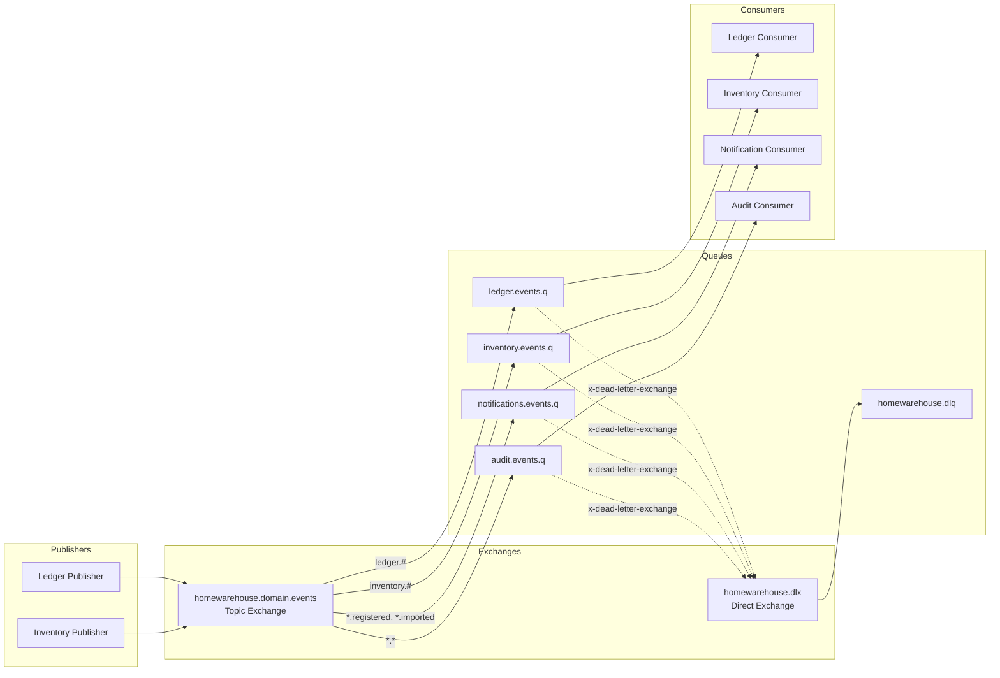
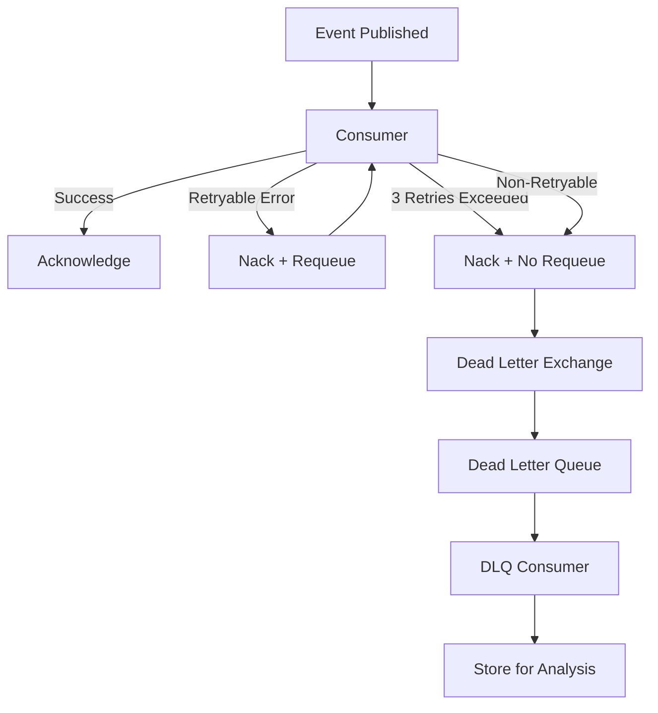

# HomeWarehouse - RabbitMQ Event Architecture

## Purpose

This document defines the event-driven architecture using RabbitMQ for HomeWarehouse, including exchange/queue topology, event schemas, reliability patterns, and consumer implementation guidelines.

## Scope

### In Scope

- RabbitMQ topology (exchanges, queues, bindings)
- Domain event definitions and schemas
- Publishing and consuming patterns
- Reliability guarantees (confirms, acks, DLQ)
- Event versioning strategy
- Testing approaches

### Out of Scope

- RabbitMQ cluster deployment (see Infrastructure docs)
- Monitoring and alerting configuration
- Performance tuning

## Design Principles

| Principle | Implementation |
|-----------|----------------|
| At-Least-Once Delivery | Publisher confirms + consumer manual acks |
| Idempotent Processing | All consumers use idempotency keys |
| Durability | Durable exchanges, queues, and persistent messages |
| Loose Coupling | Topic exchanges with routing keys |
| Dead Letter Handling | All queues have DLQ configuration |
| Event Versioning | Version field in envelope, backward compatible |

## Connection Configuration

### Spring Boot Configuration

```yaml
spring:
  rabbitmq:
    host: ${RABBITMQ_HOST:localhost}
    port: ${RABBITMQ_PORT:5672}
    username: ${RABBITMQ_USERNAME:homewarehouse}
    password: ${RABBITMQ_PASSWORD:secret}
    virtual-host: homewarehouse
    publisher-confirm-type: correlated
    publisher-returns: true
    template:
      mandatory: true
    listener:
      simple:
        acknowledge-mode: manual
        prefetch: 10
        default-requeue-rejected: false
```

## Topology

### Exchange and Queue Diagram



### Exchanges

| Exchange | Type | Durable | Description |
|----------|------|---------|-------------|
| homewarehouse.domain.events | topic | Yes | Main domain event exchange |
| homewarehouse.dlx | direct | Yes | Dead letter exchange |

### Queues

| Queue | Bindings | DLX | TTL | Description |
|-------|----------|-----|-----|-------------|
| ledger.events.q | ledger.# | homewarehouse.dlx | - | Ledger-related events |
| inventory.events.q | inventory.# | homewarehouse.dlx | - | Inventory-related events |
| notifications.events.q | *.registered, *.imported, inventory.*.expired | homewarehouse.dlx | - | Events that trigger notifications |
| audit.events.q | *.* | homewarehouse.dlx | - | All events for audit logging |
| homewarehouse.dlq | - | - | 7d | Dead letter queue |

### Queue Configuration

```java
@Configuration
public class RabbitMQConfig {

    @Bean
    public TopicExchange domainEventsExchange() {
        return ExchangeBuilder
            .topicExchange("homewarehouse.domain.events")
            .durable(true)
            .build();
    }

    @Bean
    public DirectExchange deadLetterExchange() {
        return ExchangeBuilder
            .directExchange("homewarehouse.dlx")
            .durable(true)
            .build();
    }

    @Bean
    public Queue ledgerEventsQueue() {
        return QueueBuilder
            .durable("ledger.events.q")
            .deadLetterExchange("homewarehouse.dlx")
            .deadLetterRoutingKey("ledger.events.dlq")
            .build();
    }

    @Bean
    public Queue inventoryEventsQueue() {
        return QueueBuilder
            .durable("inventory.events.q")
            .deadLetterExchange("homewarehouse.dlx")
            .deadLetterRoutingKey("inventory.events.dlq")
            .build();
    }

    @Bean
    public Queue deadLetterQueue() {
        return QueueBuilder
            .durable("homewarehouse.dlq")
            .ttl(7 * 24 * 60 * 60 * 1000)  // 7 days
            .build();
    }

    @Bean
    public Binding ledgerEventsBinding() {
        return BindingBuilder
            .bind(ledgerEventsQueue())
            .to(domainEventsExchange())
            .with("ledger.#");
    }
}
```

---

## Event Envelope Schema

All events are wrapped in a standard envelope:

```json
{
  "envelope": {
    "eventId": "uuid",
    "eventType": "ledger.transaction.created",
    "version": 1,
    "occurredAt": "2024-01-15T10:30:00.000Z",
    "correlationId": "uuid",
    "idempotencyKey": "uuid",
    "source": "homewarehouse-backend",
    "userId": "uuid"
  },
  "payload": {
    // Event-specific data
  }
}
```

### Envelope Fields

| Field | Type | Required | Description |
|-------|------|----------|-------------|
| eventId | UUID | Yes | Unique event identifier |
| eventType | string | Yes | Dot-notation event type |
| version | integer | Yes | Schema version for this event type |
| occurredAt | ISO-8601 | Yes | When the event occurred |
| correlationId | UUID | Yes | Traces related operations |
| idempotencyKey | UUID | Yes | For consumer deduplication |
| source | string | Yes | Publishing service/module |
| userId | UUID | No | User who triggered the event |

### Java Implementation

```java
public record EventEnvelope<T>(
    UUID eventId,
    String eventType,
    int version,
    Instant occurredAt,
    CorrelationId correlationId,
    UUID idempotencyKey,
    String source,
    UUID userId,
    T payload
) {
    public static <T> EventEnvelope<T> wrap(T payload, String eventType, CorrelationId correlationId) {
        return new EventEnvelope<>(
            UUID.randomUUID(),
            eventType,
            1,
            Instant.now(),
            correlationId,
            UUID.randomUUID(),
            "homewarehouse-backend",
            SecurityContextHolder.getUserId(),
            payload
        );
    }
}
```

---

## Domain Events

### Ledger Events

#### ledger.transaction.created (v1)

```java
public record TransactionCreatedEvent(
    UUID transactionId,
    UUID accountId,
    String transactionType,
    BigDecimal amount,
    String currency,
    LocalDate transactionDate,
    String description,
    UUID categoryId
) {}
```

**Routing Key:** `ledger.transaction.created`

**Payload:**
```json
{
  "transactionId": "uuid",
  "accountId": "uuid",
  "transactionType": "EXPENSE",
  "amount": "125.50",
  "currency": "USD",
  "transactionDate": "2024-01-15",
  "description": "Weekly groceries",
  "categoryId": "uuid"
}
```

---

#### ledger.transaction.updated (v1)

```java
public record TransactionUpdatedEvent(
    UUID transactionId,
    BigDecimal oldAmount,
    BigDecimal newAmount,
    String oldDescription,
    String newDescription
) {}
```

**Routing Key:** `ledger.transaction.updated`

---

#### ledger.transaction.deleted (v1)

```java
public record TransactionDeletedEvent(
    UUID transactionId,
    UUID accountId
) {}
```

**Routing Key:** `ledger.transaction.deleted`

---

#### ledger.import.completed (v1)

Alias for: `ledger.bank-movements.imported`

```java
public record BankMovementsImportedEvent(
    UUID importJobId,
    UUID accountId,
    int totalRows,
    int importedRows,
    int skippedRows,
    int errorRows,
    BigDecimal totalAmount,
    LocalDate earliestDate,
    LocalDate latestDate
) {}
```

**Routing Key:** `ledger.bank-movements.imported`

---

### Inventory Events

#### inventory.unit.created (v1)

```java
public record InventoryUnitCreatedEvent(
    UUID unitId,
    UUID itemId,
    String itemName,
    UUID locationId,
    String locationPath,
    LocalDate purchaseDate,
    LocalDate expiresAt,
    BigDecimal purchasePrice,
    String currency
) {}
```

**Routing Key:** `inventory.unit.created`

---

#### inventory.unit.consumed (v1)

```java
public record InventoryUnitConsumedEvent(
    UUID unitId,
    UUID itemId,
    UUID locationId
) {}
```

**Routing Key:** `inventory.unit.consumed`

---

#### inventory.unit.moved (v1)

```java
public record InventoryUnitMovedEvent(
    UUID unitId,
    UUID itemId,
    UUID oldLocationId,
    UUID newLocationId,
    String newLocationPath
) {}
```

**Routing Key:** `inventory.unit.moved`

---

#### inventory.unit.expiring-soon (v1)

```java
public record InventoryUnitExpiringSoonEvent(
    UUID unitId,
    UUID itemId,
    String itemName,
    UUID userId,
    UUID locationId,
    String locationPath,
    LocalDate expiresAt,
    int daysRemaining
) {}
```

**Routing Key:** `inventory.unit.expiring-soon`

---

#### inventory.unit.expired (v1)

```java
public record InventoryUnitExpiredEvent(
    UUID unitId,
    UUID itemId,
    String itemName,
    UUID userId,
    UUID locationId,
    String locationPath,
    LocalDate expiresAt
) {}
```

**Routing Key:** `inventory.unit.expired`

---

### Cross-Domain Events

#### purchase.registered (v1)

```java
public record PurchaseRegisteredEvent(
    UUID correlationId,
    UUID transactionId,
    List<UUID> unitIds,
    UUID accountId,
    BigDecimal totalAmount,
    String currency,
    LocalDate purchaseDate,
    String counterparty,
    int itemCount
) {}
```

**Routing Key:** `purchase.registered`

---

## Publishing

### Event Publisher Interface

```java
public interface DomainEventPublisher {

    <T> void publish(T event, String routingKey, CorrelationId correlationId);

    <T> void publishWithConfirm(T event, String routingKey, CorrelationId correlationId);
}
```

### Implementation with Publisher Confirms

```java
@Service
@Slf4j
public class RabbitMQEventPublisher implements DomainEventPublisher {

    private final RabbitTemplate rabbitTemplate;
    private final ObjectMapper objectMapper;

    @Override
    public <T> void publishWithConfirm(T event, String routingKey, CorrelationId correlationId) {
        EventEnvelope<T> envelope = EventEnvelope.wrap(event, routingKey, correlationId);

        CorrelationData correlationData = new CorrelationData(envelope.eventId().toString());

        rabbitTemplate.convertAndSend(
            "homewarehouse.domain.events",
            routingKey,
            envelope,
            message -> {
                message.getMessageProperties().setDeliveryMode(MessageDeliveryMode.PERSISTENT);
                message.getMessageProperties().setContentType(MediaType.APPLICATION_JSON_VALUE);
                message.getMessageProperties().setHeader("x-event-type", routingKey);
                message.getMessageProperties().setHeader("x-correlation-id", correlationId.value());
                return message;
            },
            correlationData
        );

        // Wait for confirm (with timeout)
        try {
            CorrelationData.Confirm confirm = correlationData.getFuture().get(5, TimeUnit.SECONDS);
            if (!confirm.isAck()) {
                log.error("Message not confirmed: {} - {}", envelope.eventId(), confirm.getReason());
                throw new EventPublishingException("Message not confirmed by broker");
            }
        } catch (Exception e) {
            log.error("Failed to confirm message: {}", envelope.eventId(), e);
            throw new EventPublishingException("Failed to publish event", e);
        }
    }
}
```

### Confirm Callback Configuration

```java
@PostConstruct
public void init() {
    rabbitTemplate.setConfirmCallback((correlationData, ack, cause) -> {
        if (!ack) {
            log.error("Message not acknowledged: {} - {}",
                correlationData != null ? correlationData.getId() : "unknown",
                cause);
        }
    });

    rabbitTemplate.setReturnsCallback(returned -> {
        log.error("Message returned: {} - {} - {}",
            returned.getRoutingKey(),
            returned.getReplyCode(),
            returned.getReplyText());
    });
}
```

---

## Consuming

### Consumer Interface

```java
@FunctionalInterface
public interface EventHandler<T> {
    void handle(EventEnvelope<T> envelope) throws Exception;
}
```

### Base Consumer with Manual Ack

```java
@Slf4j
public abstract class BaseEventConsumer<T> {

    @Autowired
    private IdempotencyService idempotencyService;

    protected void processWithAck(
            EventEnvelope<T> envelope,
            Message message,
            Channel channel,
            EventHandler<T> handler
    ) {
        long deliveryTag = message.getMessageProperties().getDeliveryTag();

        try {
            // Check idempotency
            if (idempotencyService.isProcessed(envelope.idempotencyKey())) {
                log.info("Skipping duplicate event: {}", envelope.eventId());
                channel.basicAck(deliveryTag, false);
                return;
            }

            // Process event
            handler.handle(envelope);

            // Mark as processed
            idempotencyService.markProcessed(envelope.idempotencyKey());

            // Acknowledge
            channel.basicAck(deliveryTag, false);

        } catch (RetryableException e) {
            log.warn("Retryable error processing event: {}", envelope.eventId(), e);
            // Requeue for retry
            channel.basicNack(deliveryTag, false, true);

        } catch (Exception e) {
            log.error("Failed to process event: {}", envelope.eventId(), e);
            // Send to DLQ (no requeue)
            channel.basicNack(deliveryTag, false, false);
        }
    }
}
```

### Example Consumer Implementation

```java
@Component
@Slf4j
public class NotificationEventConsumer extends BaseEventConsumer<Object> {

    private final NotificationService notificationService;

    @RabbitListener(queues = "notifications.events.q")
    public void handleEvent(
            @Payload String payload,
            Message message,
            Channel channel
    ) throws Exception {
        String eventType = message.getMessageProperties().getHeader("x-event-type");

        switch (eventType) {
            case "purchase.registered" -> handlePurchaseRegistered(payload, message, channel);
            case "inventory.unit.expiring-soon" -> handleExpiringSoon(payload, message, channel);
            case "inventory.unit.expired" -> handleExpired(payload, message, channel);
            default -> {
                log.debug("Ignoring unhandled event type: {}", eventType);
                channel.basicAck(message.getMessageProperties().getDeliveryTag(), false);
            }
        }
    }

    private void handlePurchaseRegistered(String payload, Message message, Channel channel) {
        EventEnvelope<PurchaseRegisteredEvent> envelope = parseEnvelope(payload, PurchaseRegisteredEvent.class);

        processWithAck(envelope, message, channel, env -> {
            notificationService.createNotification(
                env.userId(),
                NotificationType.PURCHASE_REGISTERED,
                "Purchase Recorded",
                String.format("Recorded purchase of %d items for %s %s",
                    env.payload().itemCount(),
                    env.payload().totalAmount(),
                    env.payload().currency())
            );
        });
    }

    private void handleExpiringSoon(String payload, Message message, Channel channel) {
        EventEnvelope<InventoryUnitExpiringSoonEvent> envelope =
            parseEnvelope(payload, InventoryUnitExpiringSoonEvent.class);

        processWithAck(envelope, message, channel, env -> {
            InventoryUnitExpiringSoonEvent event = env.payload();
            notificationService.createNotification(
                event.userId(),
                NotificationType.EXPIRY_WARNING,
                "Item Expiring Soon",
                String.format("%s at %s expires in %d days",
                    event.itemName(),
                    event.locationPath(),
                    event.daysRemaining()),
                "inventory_unit",
                event.unitId()
            );
        });
    }
}
```

---

## Idempotency

### Idempotency Service

```java
@Service
public class RedisIdempotencyService implements IdempotencyService {

    private final StringRedisTemplate redisTemplate;
    private static final Duration TTL = Duration.ofDays(7);

    @Override
    public boolean isProcessed(UUID idempotencyKey) {
        return Boolean.TRUE.equals(
            redisTemplate.hasKey("idempotency:" + idempotencyKey.toString())
        );
    }

    @Override
    public void markProcessed(UUID idempotencyKey) {
        redisTemplate.opsForValue().set(
            "idempotency:" + idempotencyKey.toString(),
            Instant.now().toString(),
            TTL
        );
    }
}
```

---

## Dead Letter Handling

### DLQ Consumer

```java
@Component
@Slf4j
public class DeadLetterConsumer {

    private final DeadLetterRepository deadLetterRepository;
    private final AlertService alertService;

    @RabbitListener(queues = "homewarehouse.dlq")
    public void handleDeadLetter(
            @Payload String payload,
            Message message,
            Channel channel
    ) throws Exception {
        String originalQueue = message.getMessageProperties().getHeader("x-death");
        String eventType = message.getMessageProperties().getHeader("x-event-type");
        String reason = message.getMessageProperties().getHeader("x-death-reason");

        log.error("Dead letter received - Type: {}, Queue: {}, Reason: {}",
            eventType, originalQueue, reason);

        // Store for analysis
        deadLetterRepository.save(new DeadLetterRecord(
            UUID.randomUUID(),
            eventType,
            originalQueue,
            reason,
            payload,
            Instant.now()
        ));

        // Alert if threshold exceeded
        long recentCount = deadLetterRepository.countSince(Instant.now().minus(Duration.ofHours(1)));
        if (recentCount > 10) {
            alertService.sendAlert("High DLQ volume: " + recentCount + " messages in last hour");
        }

        channel.basicAck(message.getMessageProperties().getDeliveryTag(), false);
    }
}
```

### Retry Strategy



---

## Event Versioning

### Version Field

All events include a version field:

```java
public record EventEnvelope<T>(
    // ...
    int version,  // Schema version
    // ...
    T payload
) {}
```

### Backward Compatibility Rules

1. **Add fields only** - Never remove or rename fields
2. **Optional new fields** - New fields must have defaults
3. **Version bump** - Increment version when schema changes
4. **Consumer tolerance** - Consumers ignore unknown fields

### Example: Adding a Field

**v1:**
```json
{
  "transactionId": "uuid",
  "amount": "100.00"
}
```

**v2 (backward compatible):**
```json
{
  "transactionId": "uuid",
  "amount": "100.00",
  "originalCurrency": "EUR"  // New optional field
}
```

### Consumer Version Handling

```java
@RabbitListener(queues = "ledger.events.q")
public void handleTransactionCreated(EventEnvelope<JsonNode> envelope) {
    int version = envelope.version();
    JsonNode payload = envelope.payload();

    TransactionCreatedEvent event;
    if (version >= 2) {
        event = parseV2(payload);
    } else {
        event = parseV1(payload);
    }

    processEvent(event);
}
```

---

## Testing

### Unit Testing Publisher

```java
@ExtendWith(MockitoExtension.class)
class RabbitMQEventPublisherTest {

    @Mock
    private RabbitTemplate rabbitTemplate;

    @InjectMocks
    private RabbitMQEventPublisher publisher;

    @Test
    void shouldPublishEventWithCorrectRoutingKey() {
        TransactionCreatedEvent event = new TransactionCreatedEvent(...);

        publisher.publish(event, "ledger.transaction.created", correlationId);

        verify(rabbitTemplate).convertAndSend(
            eq("homewarehouse.domain.events"),
            eq("ledger.transaction.created"),
            any(EventEnvelope.class),
            any(),
            any()
        );
    }
}
```

### Integration Testing with TestContainers

```java
@SpringBootTest
@Testcontainers
class EventIntegrationTest {

    @Container
    static RabbitMQContainer rabbitMQ = new RabbitMQContainer("rabbitmq:3.12-management");

    @Autowired
    private DomainEventPublisher publisher;

    @Autowired
    private TestEventListener testListener;

    @Test
    void shouldPublishAndConsumeEvent() throws Exception {
        TransactionCreatedEvent event = new TransactionCreatedEvent(...);

        publisher.publish(event, "ledger.transaction.created", correlationId);

        await().atMost(Duration.ofSeconds(5))
            .until(() -> testListener.getReceivedEvents().size() == 1);

        assertThat(testListener.getReceivedEvents().get(0))
            .extracting(e -> e.payload().transactionId())
            .isEqualTo(event.transactionId());
    }
}
```

---

## Monitoring

### Key Metrics

| Metric | Description |
|--------|-------------|
| rabbitmq_published_total | Total messages published by type |
| rabbitmq_consumed_total | Total messages consumed by queue |
| rabbitmq_acked_total | Messages acknowledged |
| rabbitmq_nacked_total | Messages rejected |
| rabbitmq_dlq_total | Messages sent to DLQ |
| rabbitmq_queue_depth | Current queue depth |
| rabbitmq_consumer_lag | Consumer processing lag |

### Alerts

| Alert | Condition | Severity |
|-------|-----------|----------|
| HighDLQRate | DLQ messages > 10/hour | Warning |
| QueueBacklog | Queue depth > 1000 | Warning |
| ConsumerDown | No consumers on queue | Critical |
| PublishFailures | Confirm failures > 5/minute | Warning |

---

## Related Documents

- [Architecture](../architecture/01-architecture.md) - Event publishing from modules
- [Workflows](../workflows/05-workflows-temporal.md) - Workflows publishing events
- [Infrastructure](../infra/08-infra-plan.md) - RabbitMQ deployment
