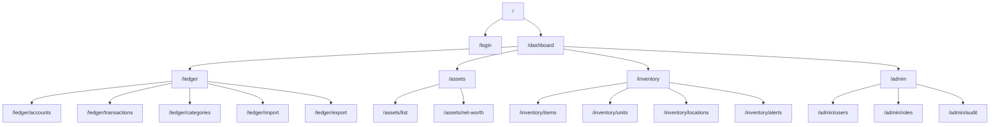
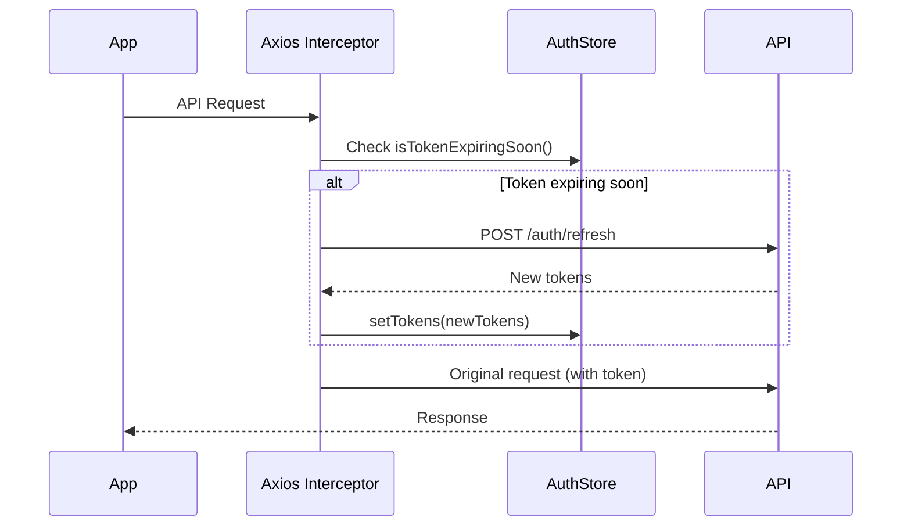
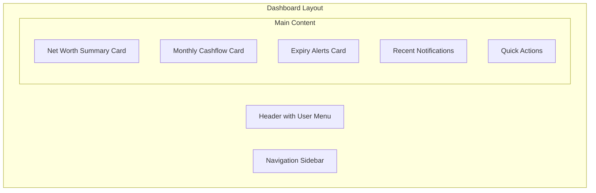
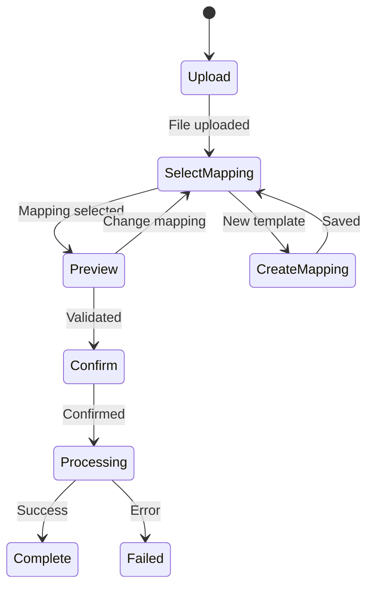

# HomeWarehouse - Frontend Architecture

## Purpose

This document defines the frontend architecture for the HomeWarehouse React web application, including routing, state management, authentication handling, and component structure.

## Scope

### In Scope

- React application structure
- Routing and page layout
- State management approach
- Authentication token handling
- API client design
- Component organization
- Security considerations

### Out of Scope

- Visual design specifications
- Detailed component APIs
- Mobile application (future scope)
- End-to-end testing details

## Technology Stack

| Technology | Version | Purpose |
|------------|---------|---------|
| React | 18.x | UI framework |
| TypeScript | 5.x | Type safety |
| React Router | 6.x | Routing |
| TanStack Query | 5.x | Server state management |
| Zustand | 4.x | Client state management |
| Axios | 1.x | HTTP client |
| React Hook Form | 7.x | Form handling |
| Zod | 3.x | Validation |
| Tailwind CSS | 3.x | Styling |
| Vite | 5.x | Build tool |

## Project Structure

```
web/
├── index.html
├── package.json
├── tsconfig.json
├── vite.config.ts
├── tailwind.config.js
├── .env.template
├── public/
│   └── favicon.ico
└── src/
    ├── main.tsx
    ├── App.tsx
    ├── vite-env.d.ts
    ├── api/
    │   ├── client.ts
    │   ├── auth.ts
    │   ├── ledger.ts
    │   ├── assets.ts
    │   ├── inventory.ts
    │   └── types/
    │       ├── auth.ts
    │       ├── ledger.ts
    │       ├── assets.ts
    │       └── inventory.ts
    ├── components/
    │   ├── common/
    │   │   ├── Button.tsx
    │   │   ├── Input.tsx
    │   │   ├── Modal.tsx
    │   │   ├── Table.tsx
    │   │   ├── Pagination.tsx
    │   │   ├── LoadingSpinner.tsx
    │   │   └── ErrorBoundary.tsx
    │   ├── layout/
    │   │   ├── AppLayout.tsx
    │   │   ├── Sidebar.tsx
    │   │   ├── Header.tsx
    │   │   └── NotificationBell.tsx
    │   ├── auth/
    │   │   └── ProtectedRoute.tsx
    │   ├── ledger/
    │   │   ├── TransactionList.tsx
    │   │   ├── TransactionForm.tsx
    │   │   ├── AccountSelector.tsx
    │   │   └── CategorySelector.tsx
    │   ├── assets/
    │   │   ├── AssetList.tsx
    │   │   ├── AssetForm.tsx
    │   │   ├── ValuationForm.tsx
    │   │   └── NetWorthChart.tsx
    │   ├── inventory/
    │   │   ├── ItemList.tsx
    │   │   ├── UnitList.tsx
    │   │   ├── LocationTree.tsx
    │   │   ├── QuickAddForm.tsx
    │   │   ├── ConsumeButton.tsx
    │   │   └── ExpiryAlerts.tsx
    │   ├── import/
    │   │   ├── CsvUpload.tsx
    │   │   ├── MappingEditor.tsx
    │   │   ├── PreviewTable.tsx
    │   │   └── ImportWizard.tsx
    │   └── admin/
    │       ├── RoleList.tsx
    │       ├── PermissionMatrix.tsx
    │       └── AuditLogViewer.tsx
    ├── hooks/
    │   ├── useAuth.ts
    │   ├── useNotifications.ts
    │   ├── useDebounce.ts
    │   └── usePagination.ts
    ├── pages/
    │   ├── LoginPage.tsx
    │   ├── DashboardPage.tsx
    │   ├── LedgerPage.tsx
    │   ├── TransactionsPage.tsx
    │   ├── AssetsPage.tsx
    │   ├── NetWorthPage.tsx
    │   ├── InventoryPage.tsx
    │   ├── LocationsPage.tsx
    │   ├── ImportPage.tsx
    │   ├── AdminPage.tsx
    │   ├── AuditPage.tsx
    │   └── NotFoundPage.tsx
    ├── store/
    │   ├── authStore.ts
    │   └── uiStore.ts
    ├── utils/
    │   ├── formatters.ts
    │   ├── validators.ts
    │   └── constants.ts
    └── styles/
        └── globals.css
```

## Routing

### Route Map



### Route Configuration

```typescript
// src/App.tsx
import { BrowserRouter, Routes, Route, Navigate } from 'react-router-dom';
import { ProtectedRoute } from './components/auth/ProtectedRoute';
import { AppLayout } from './components/layout/AppLayout';

export function App() {
  return (
    <BrowserRouter>
      <Routes>
        {/* Public routes */}
        <Route path="/login" element={<LoginPage />} />

        {/* Protected routes */}
        <Route element={<ProtectedRoute />}>
          <Route element={<AppLayout />}>
            <Route path="/" element={<Navigate to="/dashboard" replace />} />
            <Route path="/dashboard" element={<DashboardPage />} />

            {/* Ledger */}
            <Route path="/ledger">
              <Route index element={<Navigate to="transactions" replace />} />
              <Route path="accounts" element={<AccountsPage />} />
              <Route path="transactions" element={<TransactionsPage />} />
              <Route path="categories" element={<CategoriesPage />} />
              <Route path="import" element={<ImportPage />} />
              <Route path="export" element={<ExportPage />} />
            </Route>

            {/* Assets */}
            <Route path="/assets">
              <Route index element={<AssetsPage />} />
              <Route path="net-worth" element={<NetWorthPage />} />
            </Route>

            {/* Inventory */}
            <Route path="/inventory">
              <Route index element={<InventoryPage />} />
              <Route path="items" element={<ItemsPage />} />
              <Route path="units" element={<UnitsPage />} />
              <Route path="locations" element={<LocationsPage />} />
              <Route path="alerts" element={<AlertsPage />} />
            </Route>

            {/* Admin (requires ADMIN role) */}
            <Route path="/admin" element={<RequireRole role="ADMIN" />}>
              <Route index element={<AdminPage />} />
              <Route path="users" element={<UsersPage />} />
              <Route path="roles" element={<RolesPage />} />
              <Route path="audit" element={<AuditPage />} />
            </Route>
          </Route>
        </Route>

        {/* 404 */}
        <Route path="*" element={<NotFoundPage />} />
      </Routes>
    </BrowserRouter>
  );
}
```

## Authentication & Token Handling

### Security Approach

| Concern | Approach | Rationale |
|---------|----------|-----------|
| Access Token Storage | In-memory (React state/context) | Not vulnerable to XSS via storage APIs |
| Refresh Token Storage | In-memory | Same security level as access token |
| Token Refresh | Automatic before expiry | Seamless user experience |
| Page Refresh | Re-authentication or secure cookie | Trade-off: UX vs security |

### Auth Store (Zustand)

```typescript
// src/store/authStore.ts
import { create } from 'zustand';

interface AuthState {
  accessToken: string | null;
  refreshToken: string | null;
  expiresAt: Date | null;
  user: User | null;
  isAuthenticated: boolean;

  // Actions
  setTokens: (tokens: AuthTokens) => void;
  setUser: (user: User) => void;
  logout: () => void;
  isTokenExpiringSoon: () => boolean;
}

interface AuthTokens {
  accessToken: string;
  refreshToken: string;
  expiresAt: string;
}

export const useAuthStore = create<AuthState>((set, get) => ({
  accessToken: null,
  refreshToken: null,
  expiresAt: null,
  user: null,
  isAuthenticated: false,

  setTokens: (tokens) => set({
    accessToken: tokens.accessToken,
    refreshToken: tokens.refreshToken,
    expiresAt: new Date(tokens.expiresAt),
    isAuthenticated: true,
  }),

  setUser: (user) => set({ user }),

  logout: () => set({
    accessToken: null,
    refreshToken: null,
    expiresAt: null,
    user: null,
    isAuthenticated: false,
  }),

  isTokenExpiringSoon: () => {
    const { expiresAt } = get();
    if (!expiresAt) return true;

    const bufferMs = 2 * 60 * 1000; // 2 minutes
    return Date.now() > expiresAt.getTime() - bufferMs;
  },
}));
```

### Token Refresh Flow



### Axios Client with Interceptor

```typescript
// src/api/client.ts
import axios, { AxiosError, InternalAxiosRequestConfig } from 'axios';
import { useAuthStore } from '../store/authStore';

const API_BASE_URL = import.meta.env.VITE_API_URL || 'http://localhost:8080/api/v1';

export const apiClient = axios.create({
  baseURL: API_BASE_URL,
  headers: {
    'Content-Type': 'application/json',
  },
});

// Request interceptor - add token
apiClient.interceptors.request.use(
  async (config: InternalAxiosRequestConfig) => {
    const { accessToken, isTokenExpiringSoon, refreshToken } = useAuthStore.getState();

    // Check if refresh needed
    if (accessToken && isTokenExpiringSoon() && refreshToken) {
      try {
        await refreshTokens();
      } catch (error) {
        // Will be handled by response interceptor
      }
    }

    const currentToken = useAuthStore.getState().accessToken;
    if (currentToken) {
      config.headers.Authorization = `Bearer ${currentToken}`;
    }

    return config;
  },
  (error) => Promise.reject(error)
);

// Response interceptor - handle 401
apiClient.interceptors.response.use(
  (response) => response,
  async (error: AxiosError) => {
    const originalRequest = error.config;

    if (error.response?.status === 401 && !originalRequest?._retry) {
      originalRequest._retry = true;

      const { refreshToken } = useAuthStore.getState();
      if (refreshToken) {
        try {
          await refreshTokens();
          return apiClient(originalRequest);
        } catch (refreshError) {
          useAuthStore.getState().logout();
          window.location.href = '/login';
        }
      } else {
        useAuthStore.getState().logout();
        window.location.href = '/login';
      }
    }

    return Promise.reject(error);
  }
);

async function refreshTokens(): Promise<void> {
  const { refreshToken, setTokens } = useAuthStore.getState();

  const response = await axios.post(`${API_BASE_URL}/auth/refresh`, {
    refreshToken,
  });

  setTokens(response.data);
}
```

### Protected Route Component

```typescript
// src/components/auth/ProtectedRoute.tsx
import { Navigate, Outlet, useLocation } from 'react-router-dom';
import { useAuthStore } from '../../store/authStore';

export function ProtectedRoute() {
  const isAuthenticated = useAuthStore((state) => state.isAuthenticated);
  const location = useLocation();

  if (!isAuthenticated) {
    return <Navigate to="/login" state={{ from: location }} replace />;
  }

  return <Outlet />;
}

interface RequireRoleProps {
  role: string;
  children?: React.ReactNode;
}

export function RequireRole({ role }: RequireRoleProps) {
  const user = useAuthStore((state) => state.user);
  const location = useLocation();

  if (!user?.roles?.includes(role)) {
    return <Navigate to="/dashboard" state={{ from: location }} replace />;
  }

  return <Outlet />;
}
```

## State Management

### Server State (TanStack Query)

Used for all API data:

```typescript
// src/hooks/useTransactions.ts
import { useQuery, useMutation, useQueryClient } from '@tanstack/react-query';
import { getTransactions, createTransaction } from '../api/ledger';

export function useTransactions(filters: TransactionFilters) {
  return useQuery({
    queryKey: ['transactions', filters],
    queryFn: () => getTransactions(filters),
    staleTime: 30_000, // 30 seconds
  });
}

export function useCreateTransaction() {
  const queryClient = useQueryClient();

  return useMutation({
    mutationFn: createTransaction,
    onSuccess: () => {
      queryClient.invalidateQueries({ queryKey: ['transactions'] });
    },
  });
}
```

### Client State (Zustand)

Used for UI state and auth:

```typescript
// src/store/uiStore.ts
import { create } from 'zustand';

interface UIState {
  sidebarOpen: boolean;
  theme: 'light' | 'dark';
  notifications: Notification[];

  toggleSidebar: () => void;
  setTheme: (theme: 'light' | 'dark') => void;
  addNotification: (notification: Notification) => void;
  dismissNotification: (id: string) => void;
}

export const useUIStore = create<UIState>((set) => ({
  sidebarOpen: true,
  theme: 'light',
  notifications: [],

  toggleSidebar: () => set((state) => ({ sidebarOpen: !state.sidebarOpen })),
  setTheme: (theme) => set({ theme }),
  addNotification: (notification) =>
    set((state) => ({ notifications: [...state.notifications, notification] })),
  dismissNotification: (id) =>
    set((state) => ({
      notifications: state.notifications.filter((n) => n.id !== id),
    })),
}));
```

## Page Layouts

### Dashboard Page



**Components:**
- Net Worth Card: Shows total assets, liabilities, net worth
- Cashflow Card: Bar chart of income vs expenses (current month)
- Expiry Alerts: List of items expiring in next 7 days
- Recent Notifications: Latest 5 notifications
- Quick Actions: Add transaction, Add inventory, Record purchase

### Ledger Page

**Features:**
- Transaction list with filters (account, category, date range, type)
- Inline transaction creation
- Bulk actions (categorize, delete)
- Export button

### Assets Page

**Features:**
- Asset grid/list view
- Valuation history chart per asset
- Net worth over time chart
- Asset allocation pie chart

### Inventory Page

**Features:**
- Item catalog view
- Unit list with location tree
- Quick add form
- Consume/move/dispose actions
- Expiry calendar view

### Import Wizard



**Steps:**
1. **Upload**: Drop zone for CSV file
2. **Select Mapping**: Choose existing template or create new
3. **Preview**: Show parsed data, validation errors, duplicates
4. **Confirm**: Select target account, confirm import
5. **Processing**: Progress indicator
6. **Complete**: Summary of imported/skipped/failed rows

## API Client Layer

### Type Definitions

```typescript
// src/api/types/ledger.ts
export interface Transaction {
  id: string;
  accountId: string;
  accountName: string;
  categoryId: string | null;
  categoryName: string | null;
  transactionType: 'INCOME' | 'EXPENSE' | 'TRANSFER';
  amount: string;
  currency: string;
  description: string;
  transactionDate: string;
  counterparty: string | null;
  reference: string | null;
  createdAt: string;
}

export interface CreateTransactionRequest {
  accountId: string;
  categoryId?: string;
  transactionType: 'INCOME' | 'EXPENSE' | 'TRANSFER';
  amount: string;
  currency: string;
  description: string;
  transactionDate: string;
  counterparty?: string;
  reference?: string;
  idempotencyKey?: string;
}

export interface TransactionFilters {
  accountId?: string;
  categoryId?: string;
  type?: 'INCOME' | 'EXPENSE' | 'TRANSFER';
  dateFrom?: string;
  dateTo?: string;
  search?: string;
  page?: number;
  size?: number;
  sort?: string;
}
```

### API Functions

```typescript
// src/api/ledger.ts
import { apiClient } from './client';
import type {
  Transaction,
  CreateTransactionRequest,
  TransactionFilters,
  PaginatedResponse,
} from './types/ledger';

export async function getTransactions(
  filters: TransactionFilters
): Promise<PaginatedResponse<Transaction>> {
  const { data } = await apiClient.get('/ledger/transactions', { params: filters });
  return data;
}

export async function createTransaction(
  request: CreateTransactionRequest
): Promise<Transaction> {
  const { data } = await apiClient.post('/ledger/transactions', request);
  return data;
}

export async function updateTransaction(
  id: string,
  request: Partial<CreateTransactionRequest>
): Promise<Transaction> {
  const { data } = await apiClient.put(`/ledger/transactions/${id}`, request);
  return data;
}

export async function deleteTransaction(id: string): Promise<void> {
  await apiClient.delete(`/ledger/transactions/${id}`);
}
```

## Form Handling

### Example: Transaction Form

```typescript
// src/components/ledger/TransactionForm.tsx
import { useForm } from 'react-hook-form';
import { zodResolver } from '@hookform/resolvers/zod';
import { z } from 'zod';
import { useCreateTransaction } from '../../hooks/useTransactions';

const transactionSchema = z.object({
  accountId: z.string().uuid(),
  categoryId: z.string().uuid().optional(),
  transactionType: z.enum(['INCOME', 'EXPENSE', 'TRANSFER']),
  amount: z.string().regex(/^\d+(\.\d{1,2})?$/, 'Invalid amount'),
  currency: z.string().length(3),
  description: z.string().min(1).max(500),
  transactionDate: z.string().regex(/^\d{4}-\d{2}-\d{2}$/),
  counterparty: z.string().max(200).optional(),
});

type TransactionFormData = z.infer<typeof transactionSchema>;

export function TransactionForm({ onSuccess }: { onSuccess: () => void }) {
  const createTransaction = useCreateTransaction();

  const {
    register,
    handleSubmit,
    formState: { errors, isSubmitting },
    reset,
  } = useForm<TransactionFormData>({
    resolver: zodResolver(transactionSchema),
    defaultValues: {
      transactionType: 'EXPENSE',
      currency: 'USD',
      transactionDate: new Date().toISOString().split('T')[0],
    },
  });

  const onSubmit = async (data: TransactionFormData) => {
    try {
      await createTransaction.mutateAsync(data);
      reset();
      onSuccess();
    } catch (error) {
      // Error handling
    }
  };

  return (
    <form onSubmit={handleSubmit(onSubmit)}>
      {/* Form fields */}
    </form>
  );
}
```

## Error Handling

### Error Boundary

```typescript
// src/components/common/ErrorBoundary.tsx
import { Component, ErrorInfo, ReactNode } from 'react';

interface Props {
  children: ReactNode;
  fallback?: ReactNode;
}

interface State {
  hasError: boolean;
  error: Error | null;
}

export class ErrorBoundary extends Component<Props, State> {
  constructor(props: Props) {
    super(props);
    this.state = { hasError: false, error: null };
  }

  static getDerivedStateFromError(error: Error): State {
    return { hasError: true, error };
  }

  componentDidCatch(error: Error, errorInfo: ErrorInfo) {
    console.error('Error caught by boundary:', error, errorInfo);
    // Could send to error tracking service
  }

  render() {
    if (this.state.hasError) {
      return this.props.fallback || (
        <div className="error-fallback">
          <h2>Something went wrong</h2>
          <button onClick={() => this.setState({ hasError: false, error: null })}>
            Try again
          </button>
        </div>
      );
    }

    return this.props.children;
  }
}
```

### API Error Handling

```typescript
// src/utils/errorHandler.ts
import { AxiosError } from 'axios';

interface ApiError {
  code: string;
  message: string;
  details?: Array<{ field: string; message: string }>;
}

export function handleApiError(error: unknown): string {
  if (error instanceof AxiosError && error.response?.data?.error) {
    const apiError: ApiError = error.response.data.error;
    return apiError.message;
  }

  if (error instanceof Error) {
    return error.message;
  }

  return 'An unexpected error occurred';
}

export function getFieldErrors(error: unknown): Record<string, string> {
  if (error instanceof AxiosError && error.response?.data?.error?.details) {
    const details = error.response.data.error.details;
    return details.reduce((acc, { field, message }) => {
      acc[field] = message;
      return acc;
    }, {} as Record<string, string>);
  }

  return {};
}
```

## Security Considerations

### XSS Prevention

1. **React's Built-in Protection**: React escapes values in JSX by default
2. **Avoid `dangerouslySetInnerHTML`**: Never use with user input
3. **Content Security Policy**: Configure CSP headers (backend responsibility)
4. **Input Sanitization**: Validate and sanitize all user inputs

### Token Security

| Risk | Mitigation |
|------|------------|
| XSS stealing tokens | In-memory storage, no localStorage |
| Token in URL | Never pass tokens in URLs |
| Token logging | Avoid logging tokens, mask in debug |
| Refresh token theft | Same protections as access token |

### HTTPS

- All API calls over HTTPS (configured in production)
- Reject mixed content

## Testing Strategy

### Unit Tests

- Jest + React Testing Library
- Test components in isolation
- Mock API calls with MSW

### Integration Tests

- Test full user flows
- Use MSW for API mocking

### E2E Tests (Future)

- Playwright or Cypress
- Test critical paths:
  - Login flow
  - Create transaction
  - Register purchase
  - CSV import

## Build & Deployment

### Environment Variables

```
# .env.template
VITE_API_URL=http://localhost:8080/api/v1
VITE_APP_NAME=HomeWarehouse
```

### Build Commands

```json
{
  "scripts": {
    "dev": "vite",
    "build": "tsc && vite build",
    "preview": "vite preview",
    "lint": "eslint src --ext ts,tsx",
    "test": "vitest",
    "test:coverage": "vitest --coverage"
  }
}
```

### Production Build

```bash
npm run build
# Output in dist/
```

## Related Documents

- [API](../api/04-api.md) - Backend API endpoints
- [Security](../security/02-security.md) - Security requirements
- [Infrastructure](../infra/08-infra-plan.md) - Frontend deployment
