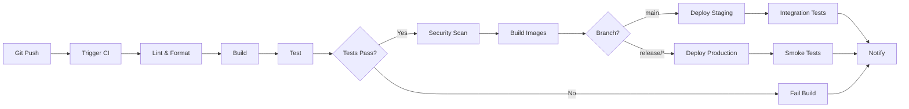

# CI/CD Pipeline Guide

## Overview

This guide describes the continuous integration and continuous deployment pipeline for HomeWarehouse using GitHub Actions.

## Pipeline Architecture



## GitHub Actions Workflows

### Main CI/CD Workflow

```yaml
# .github/workflows/ci-cd.yml
name: CI/CD Pipeline

on:
  push:
    branches: [main, develop, 'release/**']
  pull_request:
    branches: [main, develop]

env:
  REGISTRY: ghcr.io
  IMAGE_NAME_BACKEND: ${{ github.repository }}/backend
  IMAGE_NAME_FRONTEND: ${{ github.repository }}/frontend

jobs:
  # ============================================
  # Code Quality Checks
  # ============================================
  code-quality:
    name: Code Quality
    runs-on: ubuntu-latest
    steps:
      - name: Checkout code
        uses: actions/checkout@v4

      - name: Set up JDK 21
        uses: actions/setup-java@v4
        with:
          java-version: '21'
          distribution: 'temurin'
          cache: 'gradle'

      - name: Set up Node.js
        uses: actions/setup-node@v4
        with:
          node-version: '18'
          cache: 'npm'
          cache-dependency-path: web/package-lock.json

      - name: Backend - Check formatting
        run: ./gradlew spotlessCheck

      - name: Backend - Lint
        run: ./gradlew checkstyleMain checkstyleTest

      - name: Frontend - Install dependencies
        run: cd web && npm ci

      - name: Frontend - Lint
        run: cd web && npm run lint

      - name: Frontend - Type check
        run: cd web && npm run type-check

  # ============================================
  # Backend Build and Test
  # ============================================
  backend-test:
    name: Backend Tests
    runs-on: ubuntu-latest
    needs: code-quality
    services:
      postgres:
        image: postgres:16
        env:
          POSTGRES_DB: test
          POSTGRES_USER: test
          POSTGRES_PASSWORD: test
        options: >-
          --health-cmd pg_isready
          --health-interval 10s
          --health-timeout 5s
          --health-retries 5
        ports:
          - 5432:5432

      redis:
        image: redis:7
        options: >-
          --health-cmd "redis-cli ping"
          --health-interval 10s
          --health-timeout 5s
          --health-retries 5
        ports:
          - 6379:6379

    steps:
      - name: Checkout code
        uses: actions/checkout@v4

      - name: Set up JDK 21
        uses: actions/setup-java@v4
        with:
          java-version: '21'
          distribution: 'temurin'
          cache: 'gradle'

      - name: Run unit tests
        run: ./gradlew test

      - name: Run integration tests
        env:
          SPRING_DATASOURCE_URL: jdbc:postgresql://localhost:5432/test
          SPRING_DATASOURCE_USERNAME: test
          SPRING_DATASOURCE_PASSWORD: test
          SPRING_REDIS_HOST: localhost
          SPRING_REDIS_PORT: 6379
        run: ./gradlew integrationTest

      - name: Generate test coverage
        run: ./gradlew jacocoTestReport

      - name: Upload coverage to Codecov
        uses: codecov/codecov-action@v3
        with:
          files: ./backend/build/reports/jacoco/test/jacocoTestReport.xml
          flags: backend

      - name: Archive test results
        if: always()
        uses: actions/upload-artifact@v3
        with:
          name: backend-test-results
          path: |
            backend/**/build/reports/tests/
            backend/**/build/test-results/

  # ============================================
  # Frontend Build and Test
  # ============================================
  frontend-test:
    name: Frontend Tests
    runs-on: ubuntu-latest
    needs: code-quality
    steps:
      - name: Checkout code
        uses: actions/checkout@v4

      - name: Set up Node.js
        uses: actions/setup-node@v4
        with:
          node-version: '18'
          cache: 'npm'
          cache-dependency-path: web/package-lock.json

      - name: Install dependencies
        run: cd web && npm ci

      - name: Run tests
        run: cd web && npm run test:coverage

      - name: Upload coverage to Codecov
        uses: codecov/codecov-action@v3
        with:
          files: ./web/coverage/coverage-final.json
          flags: frontend

      - name: Build
        run: cd web && npm run build

      - name: Archive build artifacts
        uses: actions/upload-artifact@v3
        with:
          name: frontend-build
          path: web/dist

  # ============================================
  # Security Scanning
  # ============================================
  security-scan:
    name: Security Scan
    runs-on: ubuntu-latest
    needs: [backend-test, frontend-test]
    steps:
      - name: Checkout code
        uses: actions/checkout@v4

      - name: Run Trivy vulnerability scanner
        uses: aquasecurity/trivy-action@master
        with:
          scan-type: 'fs'
          scan-ref: '.'
          format: 'sarif'
          output: 'trivy-results.sarif'

      - name: Upload Trivy results to GitHub Security
        uses: github/codeql-action/upload-sarif@v2
        with:
          sarif_file: 'trivy-results.sarif'

      - name: Backend - OWASP Dependency Check
        run: ./gradlew dependencyCheckAnalyze

      - name: Frontend - NPM Audit
        run: cd web && npm audit --audit-level=high

  # ============================================
  # Build Docker Images
  # ============================================
  build-images:
    name: Build Docker Images
    runs-on: ubuntu-latest
    needs: [backend-test, frontend-test, security-scan]
    if: github.event_name == 'push'
    permissions:
      contents: read
      packages: write
    steps:
      - name: Checkout code
        uses: actions/checkout@v4

      - name: Log in to Container Registry
        uses: docker/login-action@v3
        with:
          registry: ${{ env.REGISTRY }}
          username: ${{ github.actor }}
          password: ${{ secrets.GITHUB_TOKEN }}

      - name: Extract metadata (backend)
        id: meta-backend
        uses: docker/metadata-action@v5
        with:
          images: ${{ env.REGISTRY }}/${{ env.IMAGE_NAME_BACKEND }}
          tags: |
            type=ref,event=branch
            type=ref,event=pr
            type=semver,pattern={{version}}
            type=semver,pattern={{major}}.{{minor}}
            type=sha,prefix={{branch}}-

      - name: Build and push backend image
        uses: docker/build-push-action@v5
        with:
          context: ./backend
          push: true
          tags: ${{ steps.meta-backend.outputs.tags }}
          labels: ${{ steps.meta-backend.outputs.labels }}
          cache-from: type=registry,ref=${{ env.REGISTRY }}/${{ env.IMAGE_NAME_BACKEND }}:buildcache
          cache-to: type=registry,ref=${{ env.REGISTRY }}/${{ env.IMAGE_NAME_BACKEND }}:buildcache,mode=max

      - name: Extract metadata (frontend)
        id: meta-frontend
        uses: docker/metadata-action@v5
        with:
          images: ${{ env.REGISTRY }}/${{ env.IMAGE_NAME_FRONTEND }}
          tags: |
            type=ref,event=branch
            type=ref,event=pr
            type=semver,pattern={{version}}
            type=semver,pattern={{major}}.{{minor}}
            type=sha,prefix={{branch}}-

      - name: Build and push frontend image
        uses: docker/build-push-action@v5
        with:
          context: ./web
          push: true
          tags: ${{ steps.meta-frontend.outputs.tags }}
          labels: ${{ steps.meta-frontend.outputs.labels }}
          cache-from: type=registry,ref=${{ env.REGISTRY }}/${{ env.IMAGE_NAME_FRONTEND }}:buildcache
          cache-to: type=registry,ref=${{ env.REGISTRY }}/${{ env.IMAGE_NAME_FRONTEND }}:buildcache,mode=max

  # ============================================
  # Deploy to Staging
  # ============================================
  deploy-staging:
    name: Deploy to Staging
    runs-on: ubuntu-latest
    needs: build-images
    if: github.ref == 'refs/heads/main'
    environment:
      name: staging
      url: https://staging.homewarehouse.io
    steps:
      - name: Checkout code
        uses: actions/checkout@v4

      - name: Configure kubectl
        uses: azure/k8s-set-context@v3
        with:
          method: kubeconfig
          kubeconfig: ${{ secrets.KUBECONFIG_STAGING }}

      - name: Deploy to Kubernetes
        run: |
          kubectl set image deployment/homewarehouse-backend \
            backend=${{ env.REGISTRY }}/${{ env.IMAGE_NAME_BACKEND }}:${{ github.sha }} \
            -n homewarehouse-staging

          kubectl set image deployment/homewarehouse-frontend \
            frontend=${{ env.REGISTRY }}/${{ env.IMAGE_NAME_FRONTEND }}:${{ github.sha }} \
            -n homewarehouse-staging

          kubectl rollout status deployment/homewarehouse-backend -n homewarehouse-staging
          kubectl rollout status deployment/homewarehouse-frontend -n homewarehouse-staging

      - name: Run smoke tests
        run: |
          ./scripts/smoke-tests.sh https://staging.homewarehouse.io

      - name: Notify Slack
        if: always()
        uses: 8398a7/action-slack@v3
        with:
          status: ${{ job.status }}
          text: 'Staging deployment ${{ job.status }}'
          webhook_url: ${{ secrets.SLACK_WEBHOOK }}

  # ============================================
  # Deploy to Production
  # ============================================
  deploy-production:
    name: Deploy to Production
    runs-on: ubuntu-latest
    needs: build-images
    if: startsWith(github.ref, 'refs/heads/release/')
    environment:
      name: production
      url: https://homewarehouse.io
    steps:
      - name: Checkout code
        uses: actions/checkout@v4

      - name: Configure kubectl
        uses: azure/k8s-set-context@v3
        with:
          method: kubeconfig
          kubeconfig: ${{ secrets.KUBECONFIG_PRODUCTION }}

      - name: Deploy with Helm
        run: |
          helm upgrade --install homewarehouse ./infrastructure/helm/homewarehouse \
            --namespace homewarehouse \
            --set backend.image.tag=${{ github.sha }} \
            --set frontend.image.tag=${{ github.sha }} \
            --values infrastructure/helm/values-production.yaml \
            --wait \
            --timeout 10m

      - name: Run smoke tests
        run: |
          ./scripts/smoke-tests.sh https://homewarehouse.io

      - name: Create GitHub Release
        if: success()
        uses: actions/create-release@v1
        env:
          GITHUB_TOKEN: ${{ secrets.GITHUB_TOKEN }}
        with:
          tag_name: ${{ github.ref_name }}
          release_name: Release ${{ github.ref_name }}
          draft: false
          prerelease: false

      - name: Notify Slack
        if: always()
        uses: 8398a7/action-slack@v3
        with:
          status: ${{ job.status }}
          text: 'Production deployment ${{ job.status }}'
          webhook_url: ${{ secrets.SLACK_WEBHOOK }}
```

## Pull Request Workflow

```yaml
# .github/workflows/pr-checks.yml
name: Pull Request Checks

on:
  pull_request:
    branches: [main, develop]

jobs:
  pr-title-check:
    name: Check PR Title
    runs-on: ubuntu-latest
    steps:
      - name: Validate PR title
        uses: amannn/action-semantic-pull-request@v5
        env:
          GITHUB_TOKEN: ${{ secrets.GITHUB_TOKEN }}

  label-check:
    name: Check Labels
    runs-on: ubuntu-latest
    steps:
      - name: Check for required labels
        uses: mheap/github-action-required-labels@v5
        with:
          mode: exactly
          count: 1
          labels: "bug, feature, enhancement, documentation, breaking-change"

  size-check:
    name: Check PR Size
    runs-on: ubuntu-latest
    steps:
      - name: Check PR size
        uses: codelytv/pr-size-labeler@v1
        with:
          xs_label: 'size/xs'
          xs_max_size: '10'
          s_label: 'size/s'
          s_max_size: '100'
          m_label: 'size/m'
          m_max_size: '500'
          l_label: 'size/l'
          l_max_size: '1000'
          xl_label: 'size/xl'
          fail_if_xl: 'true'
```

## Dependabot Configuration

```yaml
# .github/dependabot.yml
version: 2
updates:
  # Backend dependencies
  - package-ecosystem: "gradle"
    directory: "/"
    schedule:
      interval: "weekly"
      day: "monday"
    open-pull-requests-limit: 10
    reviewers:
      - "backend-team"
    labels:
      - "dependencies"
      - "backend"

  # Frontend dependencies
  - package-ecosystem: "npm"
    directory: "/web"
    schedule:
      interval: "weekly"
      day: "monday"
    open-pull-requests-limit: 10
    reviewers:
      - "frontend-team"
    labels:
      - "dependencies"
      - "frontend"

  # Docker dependencies
  - package-ecosystem: "docker"
    directory: "/infrastructure/docker"
    schedule:
      interval: "weekly"
    labels:
      - "dependencies"
      - "docker"

  # GitHub Actions
  - package-ecosystem: "github-actions"
    directory: "/"
    schedule:
      interval: "weekly"
    labels:
      - "dependencies"
      - "github-actions"
```

## Smoke Tests Script

```bash
#!/bin/bash
# scripts/smoke-tests.sh

set -e

BASE_URL=$1

if [ -z "$BASE_URL" ]; then
    echo "Usage: $0 <base-url>"
    exit 1
fi

echo "Running smoke tests against $BASE_URL"

# Test 1: Health check
echo "Test 1: Health check"
HEALTH=$(curl -s -o /dev/null -w "%{http_code}" "$BASE_URL/actuator/health")
if [ "$HEALTH" != "200" ]; then
    echo "❌ Health check failed: $HEALTH"
    exit 1
fi
echo "✅ Health check passed"

# Test 2: Frontend loads
echo "Test 2: Frontend loads"
FRONTEND=$(curl -s -o /dev/null -w "%{http_code}" "$BASE_URL")
if [ "$FRONTEND" != "200" ]; then
    echo "❌ Frontend load failed: $FRONTEND"
    exit 1
fi
echo "✅ Frontend load passed"

# Test 3: API responds
echo "Test 3: API responds"
API=$(curl -s -o /dev/null -w "%{http_code}" "$BASE_URL/api/v1/health")
if [ "$API" != "200" ]; then
    echo "❌ API health failed: $API"
    exit 1
fi
echo "✅ API health passed"

echo "All smoke tests passed! ✅"
```

## Database Migration Workflow

```yaml
# .github/workflows/database-migration.yml
name: Database Migration

on:
  workflow_dispatch:
    inputs:
      environment:
        description: 'Environment to migrate'
        required: true
        type: choice
        options:
          - staging
          - production

jobs:
  migrate:
    name: Run Database Migration
    runs-on: ubuntu-latest
    environment: ${{ inputs.environment }}
    steps:
      - name: Checkout code
        uses: actions/checkout@v4

      - name: Set up JDK 21
        uses: actions/setup-java@v4
        with:
          java-version: '21'
          distribution: 'temurin'

      - name: Configure database connection
        run: |
          echo "DATABASE_URL=${{ secrets.DATABASE_URL }}" >> $GITHUB_ENV
          echo "DATABASE_USERNAME=${{ secrets.DATABASE_USERNAME }}" >> $GITHUB_ENV
          echo "DATABASE_PASSWORD=${{ secrets.DATABASE_PASSWORD }}" >> $GITHUB_ENV

      - name: Run Flyway migration
        run: ./gradlew flywayMigrate

      - name: Notify on success
        if: success()
        uses: 8398a7/action-slack@v3
        with:
          status: success
          text: 'Database migration completed for ${{ inputs.environment }}'
          webhook_url: ${{ secrets.SLACK_WEBHOOK }}

      - name: Notify on failure
        if: failure()
        uses: 8398a7/action-slack@v3
        with:
          status: failure
          text: 'Database migration FAILED for ${{ inputs.environment }}'
          webhook_url: ${{ secrets.SLACK_WEBHOOK }}
```

## Secrets Management

### Required Secrets

Add these secrets in GitHub Settings → Secrets and variables → Actions:

**Repository Secrets:**
- `GITHUB_TOKEN` (automatically provided)
- `CODECOV_TOKEN` (from Codecov)
- `SLACK_WEBHOOK` (Slack webhook URL)

**Environment Secrets (Staging):**
- `KUBECONFIG_STAGING` (Kubernetes config for staging)
- `DATABASE_URL` (Staging database URL)
- `DATABASE_USERNAME`
- `DATABASE_PASSWORD`

**Environment Secrets (Production):**
- `KUBECONFIG_PRODUCTION` (Kubernetes config for production)
- `DATABASE_URL` (Production database URL)
- `DATABASE_USERNAME`
- `DATABASE_PASSWORD`

## Branch Protection Rules

Configure in GitHub Settings → Branches:

**Main Branch:**
- ✅ Require pull request before merging
- ✅ Require approvals: 2
- ✅ Require status checks to pass
  - code-quality
  - backend-test
  - frontend-test
  - security-scan
- ✅ Require branches to be up to date
- ✅ Require conversation resolution
- ✅ Require signed commits
- ✅ Include administrators

**Develop Branch:**
- ✅ Require pull request before merging
- ✅ Require approvals: 1
- ✅ Require status checks to pass

## Deployment Strategies

### Blue-Green Deployment

```yaml
# Add to deploy job
- name: Blue-Green Deployment
  run: |
    # Deploy green version
    kubectl apply -f k8s/deployment-green.yaml

    # Wait for green to be ready
    kubectl wait --for=condition=ready pod -l version=green

    # Run smoke tests on green
    ./scripts/smoke-tests.sh https://green.homewarehouse.io

    # Switch traffic to green
    kubectl patch service homewarehouse -p '{"spec":{"selector":{"version":"green"}}}'

    # Keep blue running for 5 minutes (rollback window)
    sleep 300

    # Delete blue deployment
    kubectl delete -f k8s/deployment-blue.yaml
```

### Canary Deployment

```yaml
# Add to deploy job
- name: Canary Deployment
  run: |
    # Deploy canary with 10% traffic
    kubectl apply -f k8s/deployment-canary.yaml
    kubectl patch service homewarehouse -p '{"spec":{"selector":{"version":"canary"}}}'

    # Monitor metrics for 10 minutes
    sleep 600

    # If successful, gradually increase traffic
    # 10% → 25% → 50% → 100%
```

## Monitoring Integration

### Datadog Integration

```yaml
- name: Send metrics to Datadog
  uses: masci/datadog@v1
  with:
    api-key: ${{ secrets.DATADOG_API_KEY }}
    events: |
      - title: "Deployment to ${{ github.event.inputs.environment }}"
        text: "Version ${{ github.sha }} deployed"
        alert_type: "info"
```

## Best Practices

1. **Fast Feedback:** Keep CI pipeline under 10 minutes
2. **Parallel Jobs:** Run independent jobs in parallel
3. **Caching:** Cache dependencies (Gradle, npm)
4. **Security:** Scan for vulnerabilities on every commit
5. **Automated Tests:** Require tests to pass before merge
6. **Protected Branches:** Enforce code review
7. **Semantic Versioning:** Use conventional commits
8. **Rollback Plan:** Always have a rollback strategy
9. **Monitoring:** Monitor deployments with alerts
10. **Documentation:** Keep CI/CD docs up to date

## Troubleshooting

### Failed Tests

```bash
# Download test artifacts
gh run download <run-id>

# View test results locally
cat backend-test-results/index.html
```

### Failed Deployment

```bash
# Check deployment status
kubectl rollout status deployment/homewarehouse-backend -n homewarehouse

# View deployment logs
kubectl logs -f deployment/homewarehouse-backend -n homewarehouse

# Rollback deployment
kubectl rollout undo deployment/homewarehouse-backend -n homewarehouse
```

## Summary

This CI/CD pipeline provides:
- Automated testing and quality checks
- Security scanning
- Docker image building
- Multi-environment deployments
- Smoke tests and monitoring
- Automated database migrations
- Comprehensive notifications
