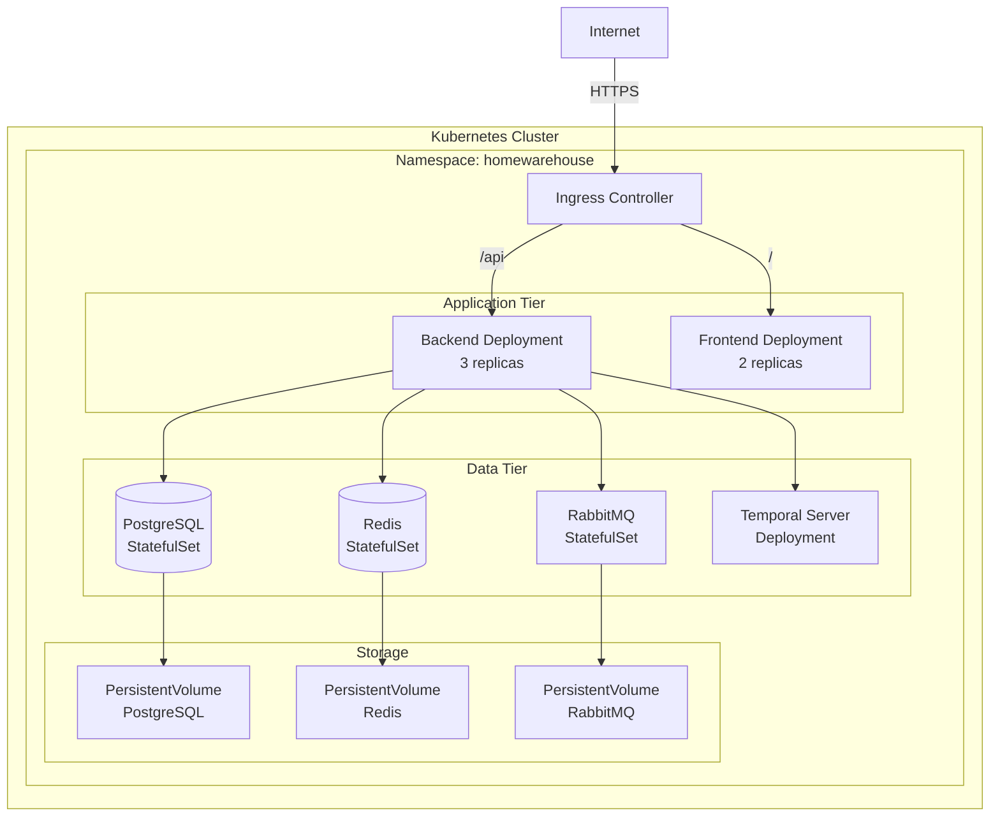

# Kubernetes Deployment Guide

## Overview

This guide provides detailed instructions for deploying the HomeWarehouse application to a Kubernetes cluster using Helm charts and best practices for production deployments.

## Prerequisites

- Kubernetes cluster (v1.27+)
- kubectl configured
- Helm 3.x installed
- Docker registry access
- SSL/TLS certificates (for production)

## Architecture



## Namespace Setup

### Create Namespace

```yaml
# infrastructure/kubernetes/namespace.yaml
apiVersion: v1
kind: Namespace
metadata:
  name: homewarehouse
  labels:
    app.kubernetes.io/name: homewarehouse
    app.kubernetes.io/instance: production
```

Apply:
```bash
kubectl apply -f infrastructure/kubernetes/namespace.yaml
```

### Resource Quotas

```yaml
# infrastructure/kubernetes/resource-quota.yaml
apiVersion: v1
kind: ResourceQuota
metadata:
  name: homewarehouse-quota
  namespace: homewarehouse
spec:
  hard:
    requests.cpu: "20"
    requests.memory: 40Gi
    limits.cpu: "40"
    limits.memory: 80Gi
    persistentvolumeclaims: "10"
```

Apply:
```bash
kubectl apply -f infrastructure/kubernetes/resource-quota.yaml
```

## PostgreSQL Deployment

### StatefulSet

```yaml
# infrastructure/helm/homewarehouse/templates/postgresql-statefulset.yaml
apiVersion: apps/v1
kind: StatefulSet
metadata:
  name: {{ include "homewarehouse.fullname" . }}-postgresql
  namespace: {{ .Release.Namespace }}
  labels:
    {{- include "homewarehouse.labels" . | nindent 4 }}
    app.kubernetes.io/component: database
spec:
  serviceName: {{ include "homewarehouse.fullname" . }}-postgresql
  replicas: 1
  selector:
    matchLabels:
      {{- include "homewarehouse.selectorLabels" . | nindent 6 }}
      app.kubernetes.io/component: database
  template:
    metadata:
      labels:
        {{- include "homewarehouse.selectorLabels" . | nindent 8 }}
        app.kubernetes.io/component: database
    spec:
      containers:
      - name: postgresql
        image: postgres:16-alpine
        ports:
        - name: postgresql
          containerPort: 5432
        env:
        - name: POSTGRES_DB
          value: {{ .Values.postgresql.database }}
        - name: POSTGRES_USER
          valueFrom:
            secretKeyRef:
              name: {{ include "homewarehouse.fullname" . }}-secrets
              key: postgres-username
        - name: POSTGRES_PASSWORD
          valueFrom:
            secretKeyRef:
              name: {{ include "homewarehouse.fullname" . }}-secrets
              key: postgres-password
        - name: PGDATA
          value: /var/lib/postgresql/data/pgdata
        volumeMounts:
        - name: data
          mountPath: /var/lib/postgresql/data
        resources:
          requests:
            memory: {{ .Values.postgresql.resources.requests.memory }}
            cpu: {{ .Values.postgresql.resources.requests.cpu }}
          limits:
            memory: {{ .Values.postgresql.resources.limits.memory }}
            cpu: {{ .Values.postgresql.resources.limits.cpu }}
        livenessProbe:
          exec:
            command:
            - pg_isready
            - -U
            - {{ .Values.postgresql.user }}
          initialDelaySeconds: 30
          periodSeconds: 10
          timeoutSeconds: 5
        readinessProbe:
          exec:
            command:
            - pg_isready
            - -U
            - {{ .Values.postgresql.user }}
          initialDelaySeconds: 5
          periodSeconds: 5
          timeoutSeconds: 3
  volumeClaimTemplates:
  - metadata:
      name: data
    spec:
      accessModes: ["ReadWriteOnce"]
      storageClassName: {{ .Values.postgresql.storageClass }}
      resources:
        requests:
          storage: {{ .Values.postgresql.storage }}
```

### Service

```yaml
# infrastructure/helm/homewarehouse/templates/postgresql-service.yaml
apiVersion: v1
kind: Service
metadata:
  name: {{ include "homewarehouse.fullname" . }}-postgresql
  namespace: {{ .Release.Namespace }}
  labels:
    {{- include "homewarehouse.labels" . | nindent 4 }}
    app.kubernetes.io/component: database
spec:
  type: ClusterIP
  clusterIP: None  # Headless service for StatefulSet
  ports:
  - name: postgresql
    port: 5432
    targetPort: postgresql
  selector:
    {{- include "homewarehouse.selectorLabels" . | nindent 4 }}
    app.kubernetes.io/component: database
```

## Redis Deployment

```yaml
# infrastructure/helm/homewarehouse/templates/redis-statefulset.yaml
apiVersion: apps/v1
kind: StatefulSet
metadata:
  name: {{ include "homewarehouse.fullname" . }}-redis
  namespace: {{ .Release.Namespace }}
spec:
  serviceName: {{ include "homewarehouse.fullname" . }}-redis
  replicas: 1
  selector:
    matchLabels:
      {{- include "homewarehouse.selectorLabels" . | nindent 6 }}
      app.kubernetes.io/component: cache
  template:
    metadata:
      labels:
        {{- include "homewarehouse.selectorLabels" . | nindent 8 }}
        app.kubernetes.io/component: cache
    spec:
      containers:
      - name: redis
        image: redis:7-alpine
        ports:
        - name: redis
          containerPort: 6379
        command:
        - redis-server
        - --requirepass
        - $(REDIS_PASSWORD)
        - --maxmemory
        - 256mb
        - --maxmemory-policy
        - allkeys-lru
        env:
        - name: REDIS_PASSWORD
          valueFrom:
            secretKeyRef:
              name: {{ include "homewarehouse.fullname" . }}-secrets
              key: redis-password
        volumeMounts:
        - name: data
          mountPath: /data
        resources:
          requests:
            memory: 256Mi
            cpu: 100m
          limits:
            memory: 512Mi
            cpu: 500m
        livenessProbe:
          exec:
            command:
            - redis-cli
            - ping
          initialDelaySeconds: 30
          periodSeconds: 10
        readinessProbe:
          exec:
            command:
            - redis-cli
            - ping
          initialDelaySeconds: 5
          periodSeconds: 5
  volumeClaimTemplates:
  - metadata:
      name: data
    spec:
      accessModes: ["ReadWriteOnce"]
      storageClassName: {{ .Values.redis.storageClass }}
      resources:
        requests:
          storage: 10Gi
```

## Backend Deployment

```yaml
# infrastructure/helm/homewarehouse/templates/backend-deployment.yaml
apiVersion: apps/v1
kind: Deployment
metadata:
  name: {{ include "homewarehouse.fullname" . }}-backend
  namespace: {{ .Release.Namespace }}
  labels:
    {{- include "homewarehouse.labels" . | nindent 4 }}
    app.kubernetes.io/component: backend
spec:
  replicas: {{ .Values.backend.replicaCount }}
  selector:
    matchLabels:
      {{- include "homewarehouse.selectorLabels" . | nindent 6 }}
      app.kubernetes.io/component: backend
  template:
    metadata:
      labels:
        {{- include "homewarehouse.selectorLabels" . | nindent 8 }}
        app.kubernetes.io/component: backend
      annotations:
        checksum/config: {{ include (print $.Template.BasePath "/backend-configmap.yaml") . | sha256sum }}
    spec:
      containers:
      - name: backend
        image: {{ .Values.backend.image.repository }}:{{ .Values.backend.image.tag }}
        imagePullPolicy: {{ .Values.backend.image.pullPolicy }}
        ports:
        - name: http
          containerPort: 8080
        env:
        - name: SPRING_PROFILES_ACTIVE
          value: {{ .Values.backend.profile }}
        - name: DATABASE_URL
          value: "jdbc:postgresql://{{ include "homewarehouse.fullname" . }}-postgresql:5432/{{ .Values.postgresql.database }}"
        - name: DATABASE_USERNAME
          valueFrom:
            secretKeyRef:
              name: {{ include "homewarehouse.fullname" . }}-secrets
              key: postgres-username
        - name: DATABASE_PASSWORD
          valueFrom:
            secretKeyRef:
              name: {{ include "homewarehouse.fullname" . }}-secrets
              key: postgres-password
        - name: REDIS_HOST
          value: {{ include "homewarehouse.fullname" . }}-redis
        - name: REDIS_PASSWORD
          valueFrom:
            secretKeyRef:
              name: {{ include "homewarehouse.fullname" . }}-secrets
              key: redis-password
        - name: RABBITMQ_HOST
          value: {{ include "homewarehouse.fullname" . }}-rabbitmq
        - name: RABBITMQ_USERNAME
          valueFrom:
            secretKeyRef:
              name: {{ include "homewarehouse.fullname" . }}-secrets
              key: rabbitmq-username
        - name: RABBITMQ_PASSWORD
          valueFrom:
            secretKeyRef:
              name: {{ include "homewarehouse.fullname" . }}-secrets
              key: rabbitmq-password
        - name: JWT_PUBLIC_KEY
          valueFrom:
            secretKeyRef:
              name: {{ include "homewarehouse.fullname" . }}-secrets
              key: jwt-public-key
        - name: JWT_PRIVATE_KEY
          valueFrom:
            secretKeyRef:
              name: {{ include "homewarehouse.fullname" . }}-secrets
              key: jwt-private-key
        resources:
          requests:
            memory: {{ .Values.backend.resources.requests.memory }}
            cpu: {{ .Values.backend.resources.requests.cpu }}
          limits:
            memory: {{ .Values.backend.resources.limits.memory }}
            cpu: {{ .Values.backend.resources.limits.cpu }}
        livenessProbe:
          httpGet:
            path: /actuator/health/liveness
            port: http
          initialDelaySeconds: 60
          periodSeconds: 10
          timeoutSeconds: 5
          failureThreshold: 3
        readinessProbe:
          httpGet:
            path: /actuator/health/readiness
            port: http
          initialDelaySeconds: 30
          periodSeconds: 5
          timeoutSeconds: 3
          failureThreshold: 3
        startupProbe:
          httpGet:
            path: /actuator/health/liveness
            port: http
          initialDelaySeconds: 0
          periodSeconds: 10
          timeoutSeconds: 5
          failureThreshold: 30
      initContainers:
      - name: wait-for-db
        image: busybox:1.36
        command:
        - sh
        - -c
        - |
          until nc -z {{ include "homewarehouse.fullname" . }}-postgresql 5432; do
            echo "Waiting for PostgreSQL..."
            sleep 2
          done
          echo "PostgreSQL is ready!"
```

## Frontend Deployment

```yaml
# infrastructure/helm/homewarehouse/templates/frontend-deployment.yaml
apiVersion: apps/v1
kind: Deployment
metadata:
  name: {{ include "homewarehouse.fullname" . }}-frontend
  namespace: {{ .Release.Namespace }}
spec:
  replicas: {{ .Values.frontend.replicaCount }}
  selector:
    matchLabels:
      {{- include "homewarehouse.selectorLabels" . | nindent 6 }}
      app.kubernetes.io/component: frontend
  template:
    metadata:
      labels:
        {{- include "homewarehouse.selectorLabels" . | nindent 8 }}
        app.kubernetes.io/component: frontend
    spec:
      containers:
      - name: frontend
        image: {{ .Values.frontend.image.repository }}:{{ .Values.frontend.image.tag }}
        imagePullPolicy: {{ .Values.frontend.image.pullPolicy }}
        ports:
        - name: http
          containerPort: 80
        resources:
          requests:
            memory: 128Mi
            cpu: 100m
          limits:
            memory: 256Mi
            cpu: 500m
        livenessProbe:
          httpGet:
            path: /
            port: http
          initialDelaySeconds: 10
          periodSeconds: 10
        readinessProbe:
          httpGet:
            path: /
            port: http
          initialDelaySeconds: 5
          periodSeconds: 5
```

## Ingress

```yaml
# infrastructure/helm/homewarehouse/templates/ingress.yaml
apiVersion: networking.k8s.io/v1
kind: Ingress
metadata:
  name: {{ include "homewarehouse.fullname" . }}
  namespace: {{ .Release.Namespace }}
  annotations:
    cert-manager.io/cluster-issuer: letsencrypt-prod
    nginx.ingress.kubernetes.io/ssl-redirect: "true"
    nginx.ingress.kubernetes.io/proxy-body-size: "10m"
spec:
  ingressClassName: nginx
  tls:
  - hosts:
    - {{ .Values.ingress.host }}
    secretName: {{ include "homewarehouse.fullname" . }}-tls
  rules:
  - host: {{ .Values.ingress.host }}
    http:
      paths:
      - path: /api
        pathType: Prefix
        backend:
          service:
            name: {{ include "homewarehouse.fullname" . }}-backend
            port:
              number: 8080
      - path: /
        pathType: Prefix
        backend:
          service:
            name: {{ include "homewarehouse.fullname" . }}-frontend
            port:
              number: 80
```

## Secrets Management

### Create Secrets

```bash
# Generate JWT key pair
ssh-keygen -t rsa -b 4096 -m PEM -f jwt-key
openssl rsa -in jwt-key -pubout -outform PEM -out jwt-key.pub

# Create Kubernetes secret
kubectl create secret generic homewarehouse-secrets \
  --from-literal=postgres-username=homewarehouse \
  --from-literal=postgres-password=$(openssl rand -base64 32) \
  --from-literal=redis-password=$(openssl rand -base64 32) \
  --from-literal=rabbitmq-username=homewarehouse \
  --from-literal=rabbitmq-password=$(openssl rand -base64 32) \
  --from-file=jwt-private-key=jwt-key \
  --from-file=jwt-public-key=jwt-key.pub \
  --namespace=homewarehouse
```

### Sealed Secrets (Recommended for GitOps)

```yaml
# infrastructure/kubernetes/sealed-secret.yaml
apiVersion: bitnami.com/v1alpha1
kind: SealedSecret
metadata:
  name: homewarehouse-secrets
  namespace: homewarehouse
spec:
  encryptedData:
    postgres-password: AgBy3i4OJSWK+PiTySYZZA9...
    redis-password: AgBz9XGtKPQa+ztfWWNx...
    # ... encrypted values
```

## Helm Values

```yaml
# infrastructure/helm/homewarehouse/values.yaml
replicaCount: 1

image:
  pullPolicy: IfNotPresent

backend:
  replicaCount: 3
  image:
    repository: your-registry/homewarehouse-backend
    tag: "1.0.0"
    pullPolicy: IfNotPresent
  profile: production
  resources:
    requests:
      memory: "512Mi"
      cpu: "500m"
    limits:
      memory: "2Gi"
      cpu: "2000m"
  autoscaling:
    enabled: true
    minReplicas: 3
    maxReplicas: 10
    targetCPUUtilizationPercentage: 70
    targetMemoryUtilizationPercentage: 80

frontend:
  replicaCount: 2
  image:
    repository: your-registry/homewarehouse-frontend
    tag: "1.0.0"
    pullPolicy: IfNotPresent
  resources:
    requests:
      memory: "128Mi"
      cpu: "100m"
    limits:
      memory: "256Mi"
      cpu: "500m"

postgresql:
  database: homewarehouse
  user: homewarehouse
  storage: 50Gi
  storageClass: standard-rwo
  resources:
    requests:
      memory: "1Gi"
      cpu: "500m"
    limits:
      memory: "4Gi"
      cpu: "2000m"

redis:
  storage: 10Gi
  storageClass: standard-rwo

rabbitmq:
  storage: 20Gi
  storageClass: standard-rwo

temporal:
  enabled: true
  replicaCount: 1

ingress:
  enabled: true
  host: homewarehouse.local
  tls:
    enabled: true
```

## Deployment Commands

### Install Helm Chart

```bash
# Add Helm repository (if using external chart repo)
helm repo add homewarehouse https://charts.homewarehouse.io
helm repo update

# Install
helm install homewarehouse ./infrastructure/helm/homewarehouse \
  --namespace homewarehouse \
  --create-namespace \
  --values values-production.yaml

# Upgrade
helm upgrade homewarehouse ./infrastructure/helm/homewarehouse \
  --namespace homewarehouse \
  --values values-production.yaml

# Rollback
helm rollback homewarehouse 1 --namespace homewarehouse
```

### Verify Deployment

```bash
# Check pod status
kubectl get pods -n homewarehouse

# Check services
kubectl get services -n homewarehouse

# Check ingress
kubectl get ingress -n homewarehouse

# View logs
kubectl logs -f deployment/homewarehouse-backend -n homewarehouse

# Describe pod
kubectl describe pod <pod-name> -n homewarehouse
```

## Horizontal Pod Autoscaling

```yaml
# infrastructure/helm/homewarehouse/templates/backend-hpa.yaml
apiVersion: autoscaling/v2
kind: HorizontalPodAutoscaler
metadata:
  name: {{ include "homewarehouse.fullname" . }}-backend
  namespace: {{ .Release.Namespace }}
spec:
  scaleTargetRef:
    apiVersion: apps/v1
    kind: Deployment
    name: {{ include "homewarehouse.fullname" . }}-backend
  minReplicas: {{ .Values.backend.autoscaling.minReplicas }}
  maxReplicas: {{ .Values.backend.autoscaling.maxReplicas }}
  metrics:
  - type: Resource
    resource:
      name: cpu
      target:
        type: Utilization
        averageUtilization: {{ .Values.backend.autoscaling.targetCPUUtilizationPercentage }}
  - type: Resource
    resource:
      name: memory
      target:
        type: Utilization
        averageUtilization: {{ .Values.backend.autoscaling.targetMemoryUtilizationPercentage }}
  behavior:
    scaleDown:
      stabilizationWindowSeconds: 300
      policies:
      - type: Percent
        value: 50
        periodSeconds: 60
    scaleUp:
      stabilizationWindowSeconds: 0
      policies:
      - type: Percent
        value: 100
        periodSeconds: 30
      - type: Pods
        value: 2
        periodSeconds: 30
      selectPolicy: Max
```

## Monitoring

### Service Monitor (Prometheus)

```yaml
# infrastructure/helm/homewarehouse/templates/servicemonitor.yaml
apiVersion: monitoring.coreos.com/v1
kind: ServiceMonitor
metadata:
  name: {{ include "homewarehouse.fullname" . }}-backend
  namespace: {{ .Release.Namespace }}
spec:
  selector:
    matchLabels:
      {{- include "homewarehouse.selectorLabels" . | nindent 6 }}
      app.kubernetes.io/component: backend
  endpoints:
  - port: http
    path: /actuator/prometheus
    interval: 30s
```

## Backup Strategy

### PostgreSQL Backup CronJob

```yaml
# infrastructure/kubernetes/backup-cronjob.yaml
apiVersion: batch/v1
kind: CronJob
metadata:
  name: postgresql-backup
  namespace: homewarehouse
spec:
  schedule: "0 2 * * *"  # Daily at 2 AM
  jobTemplate:
    spec:
      template:
        spec:
          containers:
          - name: backup
            image: postgres:16-alpine
            command:
            - /bin/sh
            - -c
            - |
              BACKUP_FILE="/backups/backup-$(date +%Y%m%d-%H%M%S).sql.gz"
              pg_dump -h homewarehouse-postgresql -U homewarehouse homewarehouse | gzip > $BACKUP_FILE
              echo "Backup created: $BACKUP_FILE"
            env:
            - name: PGPASSWORD
              valueFrom:
                secretKeyRef:
                  name: homewarehouse-secrets
                  key: postgres-password
            volumeMounts:
            - name: backups
              mountPath: /backups
          restartPolicy: OnFailure
          volumes:
          - name: backups
            persistentVolumeClaim:
              claimName: postgresql-backups
```

## Troubleshooting

### Common Issues

#### Pods not starting

```bash
# Check pod events
kubectl describe pod <pod-name> -n homewarehouse

# Check logs
kubectl logs <pod-name> -n homewarehouse

# Check resource constraints
kubectl top pods -n homewarehouse
```

#### Database connection issues

```bash
# Test PostgreSQL connection
kubectl run -it --rm debug --image=postgres:16-alpine --restart=Never -- \
  psql -h homewarehouse-postgresql -U homewarehouse -d homewarehouse

# Check service endpoints
kubectl get endpoints -n homewarehouse
```

#### Ingress not working

```bash
# Check ingress status
kubectl describe ingress homewarehouse -n homewarehouse

# Check TLS certificate
kubectl get certificate -n homewarehouse

# View ingress controller logs
kubectl logs -n ingress-nginx -l app.kubernetes.io/name=ingress-nginx
```

## Best Practices

1. **Always use resource limits** to prevent resource starvation
2. **Implement health checks** (liveness, readiness, startup probes)
3. **Use Secrets** for sensitive data, never in ConfigMaps
4. **Enable autoscaling** for production workloads
5. **Regular backups** of stateful data
6. **Monitor metrics** and set up alerts
7. **Use namespaces** to isolate environments
8. **Implement network policies** for security
9. **Regular security scans** of container images
10. **GitOps approach** with version-controlled manifests

## Summary

This guide provides a complete Kubernetes deployment setup for HomeWarehouse with:
- StatefulSets for stateful services (PostgreSQL, Redis, RabbitMQ)
- Deployments for stateless services (Backend, Frontend)
- Ingress with TLS termination
- Horizontal Pod Autoscaling
- Monitoring integration
- Backup strategy
- Troubleshooting guidance
