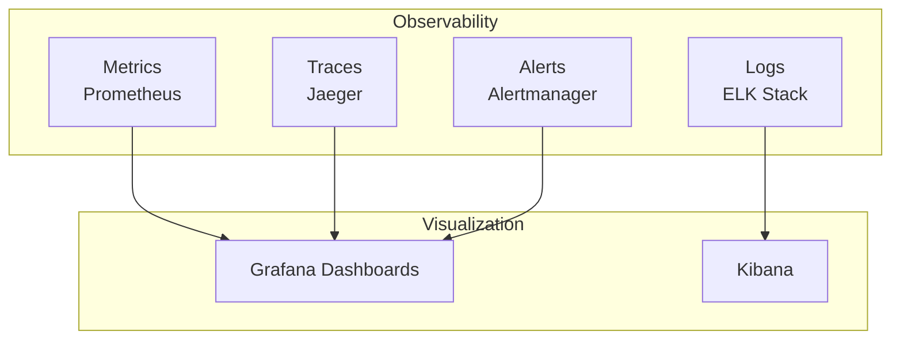

# Monitoring & Observability Guide

## Overview

This guide covers the complete monitoring and observability strategy for HomeWarehouse, including metrics, logs, traces, and alerts.

## Observability Pillars



## Metrics with Prometheus

### Backend Metrics Configuration

```yaml
# backend/src/main/resources/application.yml
management:
  endpoints:
    web:
      exposure:
        include: health,info,metrics,prometheus
  metrics:
    export:
      prometheus:
        enabled: true
    tags:
      application: ${spring.application.name}
      environment: ${spring.profiles.active}
    distribution:
      percentiles-histogram:
        http.server.requests: true
  health:
    probes:
      enabled: true
```

### Custom Metrics

```java
// src/main/java/com/homewarehouse/config/MetricsConfiguration.java
@Configuration
public class MetricsConfiguration {

    @Bean
    public MeterRegistryCustomizer<MeterRegistry> metricsCommonTags() {
        return registry -> registry.config()
            .commonTags(
                "application", "homewarehouse",
                "region", "us-east-1"
            );
    }
}

// Custom business metrics
@Service
public class TransactionMetricsService {

    private final Counter transactionCreatedCounter;
    private final Counter transactionFailedCounter;
    private final Timer transactionProcessingTime;
    private final Gauge activeTransactions;

    public TransactionMetricsService(MeterRegistry registry) {
        this.transactionCreatedCounter = Counter.builder("transactions.created")
            .description("Total transactions created")
            .tag("type", "all")
            .register(registry);

        this.transactionFailedCounter = Counter.builder("transactions.failed")
            .description("Total failed transactions")
            .register(registry);

        this.transactionProcessingTime = Timer.builder("transactions.processing.time")
            .description("Transaction processing duration")
            .publishPercentiles(0.5, 0.95, 0.99)
            .register(registry);

        this.activeTransactions = Gauge.builder("transactions.active", () -> getActiveCount())
            .description("Currently active transactions")
            .register(registry);
    }

    public void recordTransactionCreated(TransactionType type) {
        transactionCreatedCounter.increment();
    }

    public void recordTransactionFailed(String reason) {
        transactionFailedCounter.increment();
    }

    public <T> T timeTransaction(Supplier<T> operation) {
        return transactionProcessingTime.record(operation);
    }

    private double getActiveCount() {
        // Return actual active transaction count
        return 0;
    }
}
```

### Prometheus Configuration

```yaml
# infrastructure/prometheus/prometheus.yml
global:
  scrape_interval: 15s
  evaluation_interval: 15s
  external_labels:
    cluster: 'homewarehouse-prod'
    region: 'us-east-1'

scrape_configs:
  # Backend application
  - job_name: 'homewarehouse-backend'
    kubernetes_sd_configs:
      - role: pod
        namespaces:
          names:
            - homewarehouse
    relabel_configs:
      - source_labels: [__meta_kubernetes_pod_label_app]
        action: keep
        regex: homewarehouse-backend
      - source_labels: [__meta_kubernetes_pod_annotation_prometheus_io_scrape]
        action: keep
        regex: true
      - source_labels: [__meta_kubernetes_pod_annotation_prometheus_io_path]
        action: replace
        target_label: __metrics_path__
        regex: (.+)
      - source_labels: [__address__, __meta_kubernetes_pod_annotation_prometheus_io_port]
        action: replace
        regex: ([^:]+)(?::\d+)?;(\d+)
        replacement: $1:$2
        target_label: __address__

  # PostgreSQL
  - job_name: 'postgres'
    static_configs:
      - targets: ['postgres-exporter:9187']

  # Redis
  - job_name: 'redis'
    static_configs:
      - targets: ['redis-exporter:9121']

  # RabbitMQ
  - job_name: 'rabbitmq'
    static_configs:
      - targets: ['rabbitmq:15692']

  # Node Exporter
  - job_name: 'node'
    kubernetes_sd_configs:
      - role: node
```

## Logging with ELK Stack

### Structured Logging Configuration

```xml
<!-- backend/src/main/resources/logback-spring.xml -->
<?xml version="1.0" encoding="UTF-8"?>
<configuration>
    <include resource="org/springframework/boot/logging/logback/defaults.xml"/>

    <springProperty scope="context" name="applicationName" source="spring.application.name"/>
    <springProperty scope="context" name="environment" source="spring.profiles.active"/>

    <!-- Console appender with JSON format -->
    <appender name="CONSOLE" class="ch.qos.logback.core.ConsoleAppender">
        <encoder class="net.logstash.logback.encoder.LogstashEncoder">
            <customFields>{"application":"${applicationName}","environment":"${environment}"}</customFields>
            <includeMdc>true</includeMdc>
            <includeContext>true</includeContext>
            <includeCallerData>false</includeCallerData>
        </encoder>
    </appender>

    <!-- File appender -->
    <appender name="FILE" class="ch.qos.logback.core.rolling.RollingFileAppender">
        <file>logs/homewarehouse.log</file>
        <rollingPolicy class="ch.qos.logback.core.rolling.TimeBasedRollingPolicy">
            <fileNamePattern>logs/homewarehouse.%d{yyyy-MM-dd}.log</fileNamePattern>
            <maxHistory>30</maxHistory>
            <totalSizeCap>1GB</totalSizeCap>
        </rollingPolicy>
        <encoder class="net.logstash.logback.encoder.LogstashEncoder"/>
    </appender>

    <!-- Async appender for performance -->
    <appender name="ASYNC" class="ch.qos.logback.classic.AsyncAppender">
        <queueSize>512</queueSize>
        <discardingThreshold>0</discardingThreshold>
        <appender-ref ref="FILE"/>
    </appender>

    <root level="INFO">
        <appender-ref ref="CONSOLE"/>
        <appender-ref ref="ASYNC"/>
    </root>

    <!-- Application loggers -->
    <logger name="com.homewarehouse" level="DEBUG"/>
    <logger name="org.springframework.web" level="INFO"/>
    <logger name="org.hibernate.SQL" level="DEBUG"/>
</configuration>
```

### Structured Logging in Code

```java
@Service
@Slf4j
public class TransactionService {

    public void createTransaction(CreateTransactionCommand command) {
        // Use structured logging with MDC
        try (MDC.MDCCloseable mdc = MDC.putCloseable("transactionId", command.getId().toString())) {
            log.info("Creating transaction",
                keyValue("accountId", command.getAccountId()),
                keyValue("amount", command.getAmount()),
                keyValue("type", command.getType())
            );

            // Business logic...

            log.info("Transaction created successfully",
                keyValue("transactionId", result.getId())
            );
        } catch (Exception e) {
            log.error("Failed to create transaction",
                keyValue("error", e.getMessage()),
                e
            );
            throw e;
        }
    }

    private KeyValuePair keyValue(String key, Object value) {
        return new KeyValuePair(key, value);
    }
}
```

### Filebeat Configuration

```yaml
# infrastructure/logging/filebeat.yml
filebeat.inputs:
  - type: container
    paths:
      - '/var/lib/docker/containers/*/*.log'
    processors:
      - add_kubernetes_metadata:
          host: ${NODE_NAME}
          matchers:
            - logs_path:
                logs_path: "/var/lib/docker/containers/"

output.elasticsearch:
  hosts: ['${ELASTICSEARCH_HOST:elasticsearch}:${ELASTICSEARCH_PORT:9200}']
  username: ${ELASTICSEARCH_USERNAME}
  password: ${ELASTICSEARCH_PASSWORD}
  index: "homewarehouse-%{+yyyy.MM.dd}"

setup.template.name: "homewarehouse"
setup.template.pattern: "homewarehouse-*"
setup.kibana:
  host: "${KIBANA_HOST:kibana}:${KIBANA_PORT:5601}"
```

## Distributed Tracing

### OpenTelemetry Configuration

```yaml
# backend/src/main/resources/application.yml
management:
  tracing:
    sampling:
      probability: 1.0  # Sample 100% in dev, reduce in prod
  zipkin:
    tracing:
      endpoint: ${ZIPKIN_ENDPOINT:http://localhost:9411/api/v2/spans}

spring:
  application:
    name: homewarehouse-backend
```

### Custom Spans

```java
@Service
public class TransactionService {

    private final Tracer tracer;

    public TransactionService(Tracer tracer) {
        this.tracer = tracer;
    }

    public Transaction createTransaction(CreateTransactionCommand command) {
        Span span = tracer.spanBuilder("transaction.create")
            .setAttribute("transaction.type", command.getType().toString())
            .setAttribute("transaction.amount", command.getAmount().toString())
            .startSpan();

        try (Scope scope = span.makeCurrent()) {
            // Database operation
            Span dbSpan = tracer.spanBuilder("transaction.save")
                .setAttribute("db.system", "postgresql")
                .setAttribute("db.operation", "INSERT")
                .startSpan();

            try {
                Transaction transaction = repository.save(createFromCommand(command));
                dbSpan.setStatus(StatusCode.OK);
                return transaction;
            } catch (Exception e) {
                dbSpan.recordException(e);
                dbSpan.setStatus(StatusCode.ERROR, e.getMessage());
                throw e;
            } finally {
                dbSpan.end();
            }
        } finally {
            span.end();
        }
    }
}
```

## Grafana Dashboards

### Main Dashboard Configuration

```json
{
  "dashboard": {
    "title": "HomeWarehouse - Main Dashboard",
    "panels": [
      {
        "title": "Request Rate",
        "targets": [
          {
            "expr": "rate(http_server_requests_seconds_count{application=\"homewarehouse\"}[5m])"
          }
        ]
      },
      {
        "title": "Response Time (p95)",
        "targets": [
          {
            "expr": "histogram_quantile(0.95, rate(http_server_requests_seconds_bucket[5m]))"
          }
        ]
      },
      {
        "title": "Error Rate",
        "targets": [
          {
            "expr": "rate(http_server_requests_seconds_count{application=\"homewarehouse\",status=~\"5..\"}[5m])"
          }
        ]
      },
      {
        "title": "Database Connections",
        "targets": [
          {
            "expr": "hikaricp_connections_active{application=\"homewarehouse\"}"
          }
        ]
      },
      {
        "title": "JVM Memory Usage",
        "targets": [
          {
            "expr": "jvm_memory_used_bytes{application=\"homewarehouse\"} / jvm_memory_max_bytes{application=\"homewarehouse\"} * 100"
          }
        ]
      }
    ]
  }
}
```

## Alerting Rules

### Prometheus Alerting Rules

```yaml
# infrastructure/prometheus/alerts.yml
groups:
  - name: homewarehouse_alerts
    interval: 30s
    rules:
      # High error rate
      - alert: HighErrorRate
        expr: |
          rate(http_server_requests_seconds_count{status=~"5.."}[5m]) > 0.05
        for: 5m
        labels:
          severity: critical
        annotations:
          summary: "High error rate detected"
          description: "Error rate is {{ $value }}% over the last 5 minutes"

      # High response time
      - alert: HighResponseTime
        expr: |
          histogram_quantile(0.95, rate(http_server_requests_seconds_bucket[5m])) > 2
        for: 10m
        labels:
          severity: warning
        annotations:
          summary: "High response time detected"
          description: "95th percentile response time is {{ $value }}s"

      # Database connection pool exhausted
      - alert: DatabaseConnectionPoolExhausted
        expr: |
          hikaricp_connections_active / hikaricp_connections_max > 0.9
        for: 5m
        labels:
          severity: critical
        annotations:
          summary: "Database connection pool nearly exhausted"
          description: "Connection pool usage is {{ $value }}%"

      # Service down
      - alert: ServiceDown
        expr: up{job="homewarehouse-backend"} == 0
        for: 1m
        labels:
          severity: critical
        annotations:
          summary: "Service is down"
          description: "{{ $labels.instance }} has been down for more than 1 minute"

      # High memory usage
      - alert: HighMemoryUsage
        expr: |
          (jvm_memory_used_bytes{area="heap"} / jvm_memory_max_bytes{area="heap"}) > 0.9
        for: 5m
        labels:
          severity: warning
        annotations:
          summary: "High JVM memory usage"
          description: "Heap memory usage is {{ $value }}%"

      # RabbitMQ queue growing
      - alert: RabbitMQQueueGrowing
        expr: |
          rabbitmq_queue_messages > 1000
        for: 10m
        labels:
          severity: warning
        annotations:
          summary: "RabbitMQ queue growing"
          description: "Queue {{ $labels.queue }} has {{ $value }} messages"

      # Transaction failure rate
      - alert: HighTransactionFailureRate
        expr: |
          rate(transactions_failed_total[5m]) > 10
        for: 5m
        labels:
          severity: critical
        annotations:
          summary: "High transaction failure rate"
          description: "Transaction failures: {{ $value }} per second"
```

### Alertmanager Configuration

```yaml
# infrastructure/prometheus/alertmanager.yml
global:
  resolve_timeout: 5m
  slack_api_url: '${SLACK_WEBHOOK_URL}'

route:
  group_by: ['alertname', 'cluster', 'service']
  group_wait: 10s
  group_interval: 10s
  repeat_interval: 12h
  receiver: 'default'
  routes:
    - match:
        severity: critical
      receiver: 'pagerduty'
      continue: true
    - match:
        severity: warning
      receiver: 'slack'

receivers:
  - name: 'default'
    slack_configs:
      - channel: '#alerts'
        title: 'HomeWarehouse Alert'
        text: '{{ range .Alerts }}{{ .Annotations.description }}{{ end }}'

  - name: 'slack'
    slack_configs:
      - channel: '#alerts'
        title: '{{ .GroupLabels.alertname }}'
        text: '{{ range .Alerts }}{{ .Annotations.description }}{{ end }}'
        send_resolved: true

  - name: 'pagerduty'
    pagerduty_configs:
      - service_key: '${PAGERDUTY_SERVICE_KEY}'
        description: '{{ .GroupLabels.alertname }}'
```

## Health Checks

### Application Health Indicators

```java
@Component
public class DatabaseHealthIndicator implements HealthIndicator {

    private final DataSource dataSource;

    public DatabaseHealthIndicator(DataSource dataSource) {
        this.dataSource = dataSource;
    }

    @Override
    public Health health() {
        try (Connection connection = dataSource.getConnection()) {
            if (connection.isValid(1)) {
                return Health.up()
                    .withDetail("database", "PostgreSQL")
                    .withDetail("validationQuery", "SELECT 1")
                    .build();
            }
        } catch (Exception e) {
            return Health.down()
                .withDetail("error", e.getMessage())
                .build();
        }

        return Health.down().build();
    }
}

@Component
public class RabbitMQHealthIndicator implements HealthIndicator {

    private final ConnectionFactory connectionFactory;

    public RabbitMQHealthIndicator(ConnectionFactory connectionFactory) {
        this.connectionFactory = connectionFactory;
    }

    @Override
    public Health health() {
        try (Connection connection = connectionFactory.newConnection()) {
            if (connection.isOpen()) {
                return Health.up()
                    .withDetail("broker", "RabbitMQ")
                    .build();
            }
        } catch (Exception e) {
            return Health.down()
                .withDetail("error", e.getMessage())
                .build();
        }

        return Health.down().build();
    }
}
```

## SLI/SLO/SLA Definition

### Service Level Indicators (SLIs)

| Metric | Target | Measurement |
|--------|--------|-------------|
| Availability | 99.9% | Uptime monitoring |
| Latency (p95) | < 500ms | Response time |
| Error Rate | < 0.1% | 5xx responses |
| Throughput | > 100 req/s | Request rate |

### Service Level Objectives (SLOs)

```yaml
# infrastructure/monitoring/slo.yml
slos:
  - name: api_availability
    target: 99.9
    sli:
      expression: |
        (sum(rate(http_server_requests_seconds_count{status!~"5.."}[30d]))
        /
        sum(rate(http_server_requests_seconds_count[30d]))) * 100

  - name: api_latency
    target: 95
    threshold: 0.5  # 500ms
    sli:
      expression: |
        histogram_quantile(0.95,
          rate(http_server_requests_seconds_bucket[30d])
        )
```

## Monitoring Best Practices

1. **Four Golden Signals:**
   - Latency: How long requests take
   - Traffic: How many requests
   - Errors: Rate of failed requests
   - Saturation: Resource utilization

2. **USE Method (Resources):**
   - Utilization: % time resource is busy
   - Saturation: Queue depth
   - Errors: Error count

3. **RED Method (Services):**
   - Rate: Requests per second
   - Errors: Failed requests per second
   - Duration: Request latency distribution

4. **Logging Levels:**
   - ERROR: Action required
   - WARN: Potential issue
   - INFO: General information
   - DEBUG: Detailed debugging (dev only)

5. **Alert Fatigue Prevention:**
   - Alert on symptoms, not causes
   - Group related alerts
   - Use appropriate severity levels
   - Set meaningful thresholds
   - Implement auto-resolution

## Summary

This monitoring strategy provides:
- Comprehensive metrics collection
- Structured, searchable logs
- Distributed tracing for debugging
- Real-time dashboards
- Proactive alerting
- Health check monitoring
- SLI/SLO tracking
- Production-ready observability
