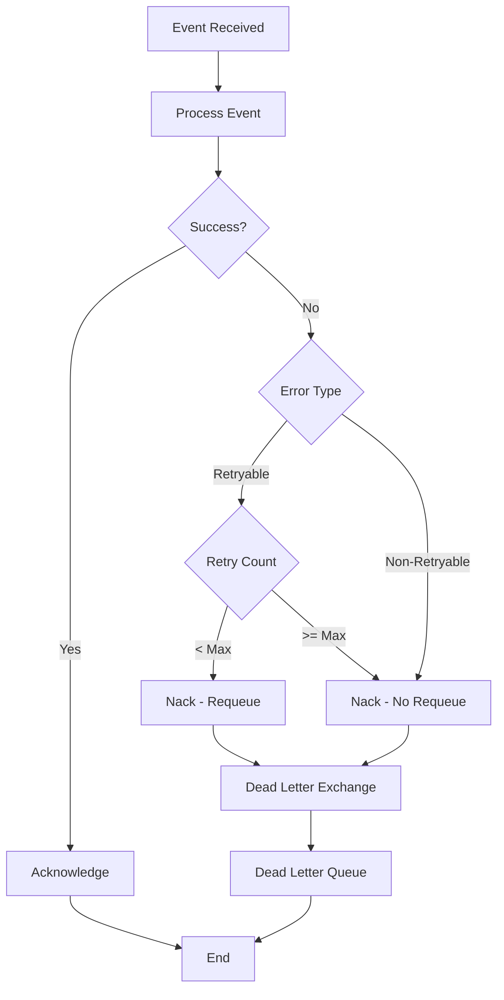

# RabbitMQ Implementation Guide

## Purpose

This guide provides comprehensive instructions for implementing RabbitMQ messaging in HomeWarehouse, including topology setup, publisher/consumer patterns, error handling, and monitoring.

## Prerequisites

Before implementing RabbitMQ messaging:

- [ ] RabbitMQ server is running (via docker-compose or deployed)
- [ ] Spring Boot application dependencies configured
- [ ] Understanding of AMQP concepts (exchanges, queues, routing keys)
- [ ] Understanding of at-least-once delivery semantics

## Project Setup

### Dependencies

Add to `backend/build.gradle.kts`:

```kotlin
dependencies {
    // Spring AMQP
    implementation("org.springframework.boot:spring-boot-starter-amqp")

    // For JSON serialization
    implementation("com.fasterxml.jackson.core:jackson-databind")
    implementation("com.fasterxml.jackson.datatype:jackson-datatype-jsr310")

    // Testing
    testImplementation("org.springframework.amqp:spring-rabbit-test")
    testImplementation("org.testcontainers:rabbitmq")
}
```

### Spring Configuration

Create `RabbitMQConfiguration.java`:

```java
package com.homewarehouse.app.config;

import com.fasterxml.jackson.databind.ObjectMapper;
import com.fasterxml.jackson.databind.SerializationFeature;
import com.fasterxml.jackson.datatype.jsr310.JavaTimeModule;
import org.springframework.amqp.core.*;
import org.springframework.amqp.rabbit.config.SimpleRabbitListenerContainerFactory;
import org.springframework.amqp.rabbit.connection.ConnectionFactory;
import org.springframework.amqp.rabbit.core.RabbitTemplate;
import org.springframework.amqp.support.converter.Jackson2JsonMessageConverter;
import org.springframework.amqp.support.converter.MessageConverter;
import org.springframework.boot.autoconfigure.amqp.SimpleRabbitListenerContainerFactoryConfigurer;
import org.springframework.context.annotation.Bean;
import org.springframework.context.annotation.Configuration;

@Configuration
public class RabbitMQConfiguration {

    public static final String DOMAIN_EVENTS_EXCHANGE = "homewarehouse.domain.events";
    public static final String DEAD_LETTER_EXCHANGE = "homewarehouse.dlx";
    public static final String DEAD_LETTER_QUEUE = "homewarehouse.dlq";

    // Queue names
    public static final String LEDGER_EVENTS_QUEUE = "ledger.events.q";
    public static final String INVENTORY_EVENTS_QUEUE = "inventory.events.q";
    public static final String NOTIFICATIONS_EVENTS_QUEUE = "notifications.events.q";
    public static final String AUDIT_EVENTS_QUEUE = "audit.events.q";

    @Bean
    public MessageConverter jsonMessageConverter() {
        ObjectMapper mapper = new ObjectMapper();
        mapper.registerModule(new JavaTimeModule());
        mapper.disable(SerializationFeature.WRITE_DATES_AS_TIMESTAMPS);
        return new Jackson2JsonMessageConverter(mapper);
    }

    @Bean
    public RabbitTemplate rabbitTemplate(
            ConnectionFactory connectionFactory,
            MessageConverter messageConverter
    ) {
        RabbitTemplate template = new RabbitTemplate(connectionFactory);
        template.setMessageConverter(messageConverter);

        // Enable publisher confirms
        template.setConfirmCallback((correlationData, ack, cause) -> {
            if (!ack) {
                String id = correlationData != null ? correlationData.getId() : "unknown";
                log.error("Message not confirmed: {} - {}", id, cause);
            }
        });

        // Enable publisher returns (for unroutable messages)
        template.setReturnsCallback(returned -> {
            log.error("Message returned: {} - {} - {}",
                returned.getRoutingKey(),
                returned.getReplyCode(),
                returned.getReplyText());
        });

        template.setMandatory(true);

        return template;
    }

    @Bean
    public SimpleRabbitListenerContainerFactory rabbitListenerContainerFactory(
            ConnectionFactory connectionFactory,
            SimpleRabbitListenerContainerFactoryConfigurer configurer,
            MessageConverter messageConverter
    ) {
        SimpleRabbitListenerContainerFactory factory = new SimpleRabbitListenerContainerFactory();
        configurer.configure(factory, connectionFactory);

        factory.setMessageConverter(messageConverter);
        factory.setAcknowledgeMode(AcknowledgeMode.MANUAL);
        factory.setPrefetchCount(10);
        factory.setDefaultRequeueRejected(false); // Send to DLQ on failure

        return factory;
    }

    // ==================== Exchanges ====================

    @Bean
    public TopicExchange domainEventsExchange() {
        return ExchangeBuilder
            .topicExchange(DOMAIN_EVENTS_EXCHANGE)
            .durable(true)
            .build();
    }

    @Bean
    public DirectExchange deadLetterExchange() {
        return ExchangeBuilder
            .directExchange(DEAD_LETTER_EXCHANGE)
            .durable(true)
            .build();
    }

    // ==================== Queues ====================

    @Bean
    public Queue ledgerEventsQueue() {
        return QueueBuilder
            .durable(LEDGER_EVENTS_QUEUE)
            .withArgument("x-dead-letter-exchange", DEAD_LETTER_EXCHANGE)
            .withArgument("x-dead-letter-routing-key", "ledger.events.dlq")
            .build();
    }

    @Bean
    public Queue inventoryEventsQueue() {
        return QueueBuilder
            .durable(INVENTORY_EVENTS_QUEUE)
            .withArgument("x-dead-letter-exchange", DEAD_LETTER_EXCHANGE)
            .withArgument("x-dead-letter-routing-key", "inventory.events.dlq")
            .build();
    }

    @Bean
    public Queue notificationsEventsQueue() {
        return QueueBuilder
            .durable(NOTIFICATIONS_EVENTS_QUEUE)
            .withArgument("x-dead-letter-exchange", DEAD_LETTER_EXCHANGE)
            .withArgument("x-dead-letter-routing-key", "notifications.events.dlq")
            .build();
    }

    @Bean
    public Queue auditEventsQueue() {
        return QueueBuilder
            .durable(AUDIT_EVENTS_QUEUE)
            .withArgument("x-dead-letter-exchange", DEAD_LETTER_EXCHANGE)
            .withArgument("x-dead-letter-routing-key", "audit.events.dlq")
            .build();
    }

    @Bean
    public Queue deadLetterQueue() {
        return QueueBuilder
            .durable(DEAD_LETTER_QUEUE)
            .ttl(7 * 24 * 60 * 60 * 1000) // 7 days
            .build();
    }

    // ==================== Bindings ====================

    @Bean
    public Binding ledgerEventsBinding(
            Queue ledgerEventsQueue,
            TopicExchange domainEventsExchange
    ) {
        return BindingBuilder
            .bind(ledgerEventsQueue)
            .to(domainEventsExchange)
            .with("ledger.#");
    }

    @Bean
    public Binding inventoryEventsBinding(
            Queue inventoryEventsQueue,
            TopicExchange domainEventsExchange
    ) {
        return BindingBuilder
            .bind(inventoryEventsQueue)
            .to(domainEventsExchange)
            .with("inventory.#");
    }

    @Bean
    public Binding notificationsEventsBinding(
            Queue notificationsEventsQueue,
            TopicExchange domainEventsExchange
    ) {
        return BindingBuilder
            .bind(notificationsEventsQueue)
            .to(domainEventsExchange)
            .with("*.registered");
    }

    @Bean
    public Binding notificationsExpiryBinding(
            Queue notificationsEventsQueue,
            TopicExchange domainEventsExchange
    ) {
        return BindingBuilder
            .bind(notificationsEventsQueue)
            .to(domainEventsExchange)
            .with("inventory.unit.expired");
    }

    @Bean
    public Binding notificationsExpiringSoonBinding(
            Queue notificationsEventsQueue,
            TopicExchange domainEventsExchange
    ) {
        return BindingBuilder
            .bind(notificationsEventsQueue)
            .to(domainEventsExchange)
            .with("inventory.unit.expiring-soon");
    }

    @Bean
    public Binding auditEventsBinding(
            Queue auditEventsQueue,
            TopicExchange domainEventsExchange
    ) {
        return BindingBuilder
            .bind(auditEventsQueue)
            .to(domainEventsExchange)
            .with("*.*"); // All events for audit
    }

    @Bean
    public Binding deadLetterBinding(
            Queue deadLetterQueue,
            DirectExchange deadLetterExchange
    ) {
        return BindingBuilder
            .bind(deadLetterQueue)
            .to(deadLetterExchange)
            .with("#"); // Catch all dead letters
    }
}
```

### Application Properties

```yaml
# application.yml
spring:
  rabbitmq:
    host: ${RABBITMQ_HOST:localhost}
    port: ${RABBITMQ_PORT:5672}
    username: ${RABBITMQ_USERNAME:homewarehouse}
    password: ${RABBITMQ_PASSWORD:secret}
    virtual-host: homewarehouse

    # Publisher confirms
    publisher-confirm-type: correlated
    publisher-returns: true

    # Connection settings
    connection-timeout: 10000
    requested-heartbeat: 60

    # Template settings
    template:
      mandatory: true
      retry:
        enabled: true
        initial-interval: 1000
        max-attempts: 3
        max-interval: 10000
        multiplier: 2.0

    # Listener settings
    listener:
      simple:
        acknowledge-mode: manual
        prefetch: 10
        default-requeue-rejected: false
        retry:
          enabled: true
          initial-interval: 1000
          max-attempts: 3
          max-interval: 10000
          multiplier: 2.0
```

---

## Event Envelope Design

### Event Envelope Structure

All events are wrapped in a standard envelope:

```java
package com.homewarehouse.shared.events;

import lombok.Builder;
import lombok.Value;

import java.time.Instant;
import java.util.UUID;

@Value
@Builder
public class EventEnvelope<T> {
    UUID eventId;
    String eventType;
    int version;
    Instant occurredAt;
    UUID correlationId;
    UUID idempotencyKey;
    String source;
    UUID userId;
    T payload;

    public static <T> EventEnvelope<T> wrap(
            T payload,
            String eventType,
            UUID correlationId,
            UUID userId
    ) {
        return EventEnvelope.<T>builder()
            .eventId(UUID.randomUUID())
            .eventType(eventType)
            .version(1)
            .occurredAt(Instant.now())
            .correlationId(correlationId)
            .idempotencyKey(UUID.randomUUID())
            .source("homewarehouse-backend")
            .userId(userId)
            .payload(payload)
            .build();
    }
}
```

### Domain Event Interface

```java
package com.homewarehouse.shared.events;

public interface DomainEvent {
    String getEventType();
}
```

### Example Domain Event

```java
package com.homewarehouse.ledger.domain.event;

import com.homewarehouse.shared.events.DomainEvent;
import lombok.Builder;
import lombok.Value;

import java.math.BigDecimal;
import java.time.LocalDate;
import java.util.UUID;

@Value
@Builder
public class TransactionCreatedEvent implements DomainEvent {
    UUID transactionId;
    UUID accountId;
    String transactionType;
    BigDecimal amount;
    String currency;
    LocalDate transactionDate;
    String description;
    UUID categoryId;

    @Override
    public String getEventType() {
        return "ledger.transaction.created";
    }
}
```

---

## Publishing Events

### Event Publisher Interface

```java
package com.homewarehouse.shared.events;

import java.util.UUID;

public interface DomainEventPublisher {

    /**
     * Publish event asynchronously (fire and forget)
     */
    <T extends DomainEvent> void publish(T event, UUID correlationId, UUID userId);

    /**
     * Publish event with confirmation (waits for broker ack)
     */
    <T extends DomainEvent> void publishWithConfirm(T event, UUID correlationId, UUID userId);
}
```

### Event Publisher Implementation

```java
package com.homewarehouse.shared.infrastructure.messaging;

import com.homewarehouse.shared.events.DomainEvent;
import com.homewarehouse.shared.events.DomainEventPublisher;
import com.homewarehouse.shared.events.EventEnvelope;
import lombok.RequiredArgsConstructor;
import lombok.extern.slf4j.Slf4j;
import org.springframework.amqp.core.Message;
import org.springframework.amqp.core.MessageProperties;
import org.springframework.amqp.rabbit.connection.CorrelationData;
import org.springframework.amqp.rabbit.core.RabbitTemplate;
import org.springframework.stereotype.Service;

import java.util.UUID;
import java.util.concurrent.TimeUnit;

@Service
@RequiredArgsConstructor
@Slf4j
public class RabbitMQEventPublisher implements DomainEventPublisher {

    private static final String EXCHANGE = "homewarehouse.domain.events";

    private final RabbitTemplate rabbitTemplate;

    @Override
    public <T extends DomainEvent> void publish(T event, UUID correlationId, UUID userId) {
        try {
            EventEnvelope<T> envelope = EventEnvelope.wrap(
                event,
                event.getEventType(),
                correlationId,
                userId
            );

            String routingKey = event.getEventType();

            log.info("Publishing event: {} with routing key: {}", envelope.getEventId(), routingKey);

            rabbitTemplate.convertAndSend(
                EXCHANGE,
                routingKey,
                envelope,
                this::configureMessage
            );

            log.debug("Event published successfully: {}", envelope.getEventId());

        } catch (Exception e) {
            log.error("Failed to publish event: {}", event.getEventType(), e);
            throw new EventPublishingException("Failed to publish event", e);
        }
    }

    @Override
    public <T extends DomainEvent> void publishWithConfirm(
            T event,
            UUID correlationId,
            UUID userId
    ) {
        try {
            EventEnvelope<T> envelope = EventEnvelope.wrap(
                event,
                event.getEventType(),
                correlationId,
                userId
            );

            String routingKey = event.getEventType();
            CorrelationData correlationData = new CorrelationData(envelope.getEventId().toString());

            log.info("Publishing event with confirm: {} with routing key: {}",
                envelope.getEventId(), routingKey);

            rabbitTemplate.convertAndSend(
                EXCHANGE,
                routingKey,
                envelope,
                this::configureMessage,
                correlationData
            );

            // Wait for confirmation (with timeout)
            CorrelationData.Confirm confirm = correlationData.getFuture()
                .get(5, TimeUnit.SECONDS);

            if (!confirm.isAck()) {
                String reason = confirm.getReason();
                log.error("Event not confirmed: {} - {}", envelope.getEventId(), reason);
                throw new EventPublishingException(
                    "Event not confirmed by broker: " + reason
                );
            }

            log.info("Event confirmed: {}", envelope.getEventId());

        } catch (EventPublishingException e) {
            throw e;
        } catch (Exception e) {
            log.error("Failed to publish event with confirm: {}", event.getEventType(), e);
            throw new EventPublishingException("Failed to publish event", e);
        }
    }

    private Message configureMessage(Message message) {
        MessageProperties props = message.getMessageProperties();

        // Set delivery mode to persistent
        props.setDeliveryMode(MessageDeliveryMode.PERSISTENT);

        // Set content type
        props.setContentType("application/json");

        // Add custom headers
        props.setHeader("x-event-version", "1");
        props.setHeader("x-source", "homewarehouse-backend");

        return message;
    }
}
```

### Publishing from Domain Service

```java
package com.homewarehouse.ledger.domain.service;

import com.homewarehouse.ledger.domain.event.TransactionCreatedEvent;
import com.homewarehouse.shared.events.DomainEventPublisher;
import lombok.RequiredArgsConstructor;
import org.springframework.stereotype.Service;
import org.springframework.transaction.annotation.Transactional;

@Service
@RequiredArgsConstructor
public class TransactionService {

    private final TransactionRepository transactionRepository;
    private final DomainEventPublisher eventPublisher;

    @Transactional
    public Transaction createTransaction(CreateTransactionCommand command) {
        // Create transaction
        Transaction transaction = Transaction.create(/* ... */);

        // Save to database
        Transaction saved = transactionRepository.save(transaction);

        // Publish event
        TransactionCreatedEvent event = TransactionCreatedEvent.builder()
            .transactionId(saved.getId().value())
            .accountId(saved.getAccountId().value())
            .transactionType(saved.getType().name())
            .amount(saved.getAmount().getAmount())
            .currency(saved.getAmount().getCurrency().getCurrencyCode())
            .transactionDate(saved.getTransactionDate())
            .description(saved.getDescription())
            .categoryId(saved.getCategoryId() != null ? saved.getCategoryId().value() : null)
            .build();

        eventPublisher.publish(event, saved.getCorrelationId(), command.getUserId());

        return saved;
    }
}
```

---

## Consuming Events

### Base Event Consumer

Create a base class with common functionality:

```java
package com.homewarehouse.shared.infrastructure.messaging;

import com.homewarehouse.shared.events.EventEnvelope;
import com.rabbitmq.client.Channel;
import lombok.RequiredArgsConstructor;
import lombok.extern.slf4j.Slf4j;
import org.springframework.amqp.core.Message;

import java.io.IOException;

@Slf4j
@RequiredArgsConstructor
public abstract class BaseEventConsumer {

    private final IdempotencyService idempotencyService;

    protected <T> void processWithAck(
            EventEnvelope<T> envelope,
            Message message,
            Channel channel,
            EventHandler<T> handler
    ) {
        long deliveryTag = message.getMessageProperties().getDeliveryTag();

        try {
            log.info("Processing event: {} - {}", envelope.getEventId(), envelope.getEventType());

            // Check idempotency
            if (idempotencyService.isProcessed(envelope.getIdempotencyKey())) {
                log.info("Event already processed (idempotent): {}", envelope.getEventId());
                channel.basicAck(deliveryTag, false);
                return;
            }

            // Process event
            handler.handle(envelope);

            // Mark as processed
            idempotencyService.markProcessed(envelope.getIdempotencyKey());

            // Acknowledge
            channel.basicAck(deliveryTag, false);

            log.info("Event processed successfully: {}", envelope.getEventId());

        } catch (RetryableException e) {
            log.warn("Retryable error processing event: {} - will requeue",
                envelope.getEventId(), e);

            try {
                // Requeue for retry
                channel.basicNack(deliveryTag, false, true);
            } catch (IOException ioException) {
                log.error("Failed to nack message", ioException);
            }

        } catch (NonRetryableException e) {
            log.error("Non-retryable error processing event: {} - sending to DLQ",
                envelope.getEventId(), e);

            try {
                // Send to DLQ (no requeue)
                channel.basicNack(deliveryTag, false, false);
            } catch (IOException ioException) {
                log.error("Failed to nack message", ioException);
            }

        } catch (Exception e) {
            log.error("Unexpected error processing event: {} - sending to DLQ",
                envelope.getEventId(), e);

            try {
                // Send to DLQ
                channel.basicNack(deliveryTag, false, false);
            } catch (IOException ioException) {
                log.error("Failed to nack message", ioException);
            }
        }
    }

    @FunctionalInterface
    protected interface EventHandler<T> {
        void handle(EventEnvelope<T> envelope) throws Exception;
    }
}
```

### Event Consumer Implementation

```java
package com.homewarehouse.inventory.infrastructure.messaging;

import com.homewarehouse.inventory.application.command.createnotification.CreateNotificationCommand;
import com.homewarehouse.inventory.application.command.createnotification.CreateNotificationHandler;
import com.homewarehouse.inventory.domain.event.InventoryUnitExpiringSoonEvent;
import com.homewarehouse.shared.events.EventEnvelope;
import com.homewarehouse.shared.infrastructure.messaging.BaseEventConsumer;
import com.homewarehouse.shared.infrastructure.messaging.IdempotencyService;
import com.fasterxml.jackson.core.type.TypeReference;
import com.fasterxml.jackson.databind.ObjectMapper;
import com.rabbitmq.client.Channel;
import lombok.extern.slf4j.Slf4j;
import org.springframework.amqp.core.Message;
import org.springframework.amqp.rabbit.annotation.RabbitListener;
import org.springframework.messaging.handler.annotation.Payload;
import org.springframework.stereotype.Component;

@Component
@Slf4j
public class NotificationEventConsumer extends BaseEventConsumer {

    private final ObjectMapper objectMapper;
    private final CreateNotificationHandler createNotificationHandler;

    public NotificationEventConsumer(
            IdempotencyService idempotencyService,
            ObjectMapper objectMapper,
            CreateNotificationHandler createNotificationHandler
    ) {
        super(idempotencyService);
        this.objectMapper = objectMapper;
        this.createNotificationHandler = createNotificationHandler;
    }

    @RabbitListener(queues = "notifications.events.q")
    public void handleEvent(
            @Payload String payload,
            Message message,
            Channel channel
    ) throws Exception {
        String eventType = message.getMessageProperties()
            .getHeader("x-event-type");

        if (eventType == null) {
            eventType = extractEventTypeFromPayload(payload);
        }

        log.debug("Received event type: {}", eventType);

        switch (eventType) {
            case "inventory.unit.expiring-soon":
                handleExpiringSoon(payload, message, channel);
                break;

            case "inventory.unit.expired":
                handleExpired(payload, message, channel);
                break;

            case "purchase.registered":
                handlePurchaseRegistered(payload, message, channel);
                break;

            default:
                log.debug("Ignoring unhandled event type: {}", eventType);
                channel.basicAck(message.getMessageProperties().getDeliveryTag(), false);
        }
    }

    private void handleExpiringSoon(String payload, Message message, Channel channel) {
        EventEnvelope<InventoryUnitExpiringSoonEvent> envelope =
            parseEnvelope(payload, new TypeReference<>() {});

        processWithAck(envelope, message, channel, env -> {
            InventoryUnitExpiringSoonEvent event = env.getPayload();

            CreateNotificationCommand command = CreateNotificationCommand.builder()
                .userId(event.getUserId())
                .notificationType("EXPIRY_WARNING")
                .title("Item Expiring Soon")
                .message(String.format(
                    "%s at %s expires in %d days",
                    event.getItemName(),
                    event.getLocationPath(),
                    event.getDaysRemaining()
                ))
                .referenceEntityType("inventory_unit")
                .referenceEntityId(event.getUnitId())
                .build();

            createNotificationHandler.handle(command);
        });
    }

    private void handleExpired(String payload, Message message, Channel channel) {
        // Similar implementation...
    }

    private void handlePurchaseRegistered(String payload, Message message, Channel channel) {
        // Similar implementation...
    }

    private <T> EventEnvelope<T> parseEnvelope(String payload, TypeReference<EventEnvelope<T>> typeRef) {
        try {
            return objectMapper.readValue(payload, typeRef);
        } catch (Exception e) {
            log.error("Failed to parse event envelope", e);
            throw new NonRetryableException("Invalid event format", e);
        }
    }

    private String extractEventTypeFromPayload(String payload) {
        try {
            return objectMapper.readTree(payload)
                .path("envelope")
                .path("eventType")
                .asText();
        } catch (Exception e) {
            log.warn("Failed to extract event type from payload", e);
            return "unknown";
        }
    }
}
```

### Idempotency Service

```java
package com.homewarehouse.shared.infrastructure.messaging;

import lombok.RequiredArgsConstructor;
import org.springframework.data.redis.core.StringRedisTemplate;
import org.springframework.stereotype.Service;

import java.time.Duration;
import java.time.Instant;
import java.util.UUID;

@Service
@RequiredArgsConstructor
public class RedisIdempotencyService implements IdempotencyService {

    private static final Duration TTL = Duration.ofDays(7);
    private static final String KEY_PREFIX = "event:idempotency:";

    private final StringRedisTemplate redisTemplate;

    @Override
    public boolean isProcessed(UUID idempotencyKey) {
        String key = KEY_PREFIX + idempotencyKey.toString();
        return Boolean.TRUE.equals(redisTemplate.hasKey(key));
    }

    @Override
    public void markProcessed(UUID idempotencyKey) {
        String key = KEY_PREFIX + idempotencyKey.toString();
        redisTemplate.opsForValue().set(
            key,
            Instant.now().toString(),
            TTL
        );
    }
}
```

---

## Error Handling

### Retry Strategy



### Retryable vs Non-Retryable Errors

```java
// Retryable errors (temporary issues)
public class RetryableException extends RuntimeException {
    public RetryableException(String message, Throwable cause) {
        super(message, cause);
    }
}

// Examples:
- Database connection timeout
- External service temporarily unavailable
- Lock acquisition failure

// Non-retryable errors (permanent issues)
public class NonRetryableException extends RuntimeException {
    public NonRetryableException(String message, Throwable cause) {
        super(message, cause);
    }
}

// Examples:
- Invalid event format
- Business rule violation
- Entity not found
- Validation failure
```

### Dead Letter Queue Consumer

```java
package com.homewarehouse.shared.infrastructure.messaging;

import com.rabbitmq.client.Channel;
import lombok.RequiredArgsConstructor;
import lombok.extern.slf4j.Slf4j;
import org.springframework.amqp.core.Message;
import org.springframework.amqp.rabbit.annotation.RabbitListener;
import org.springframework.messaging.handler.annotation.Payload;
import org.springframework.stereotype.Component;

@Component
@RequiredArgsConstructor
@Slf4j
public class DeadLetterQueueConsumer {

    private final DeadLetterRepository deadLetterRepository;
    private final AlertService alertService;

    @RabbitListener(queues = "homewarehouse.dlq")
    public void handleDeadLetter(
            @Payload String payload,
            Message message,
            Channel channel
    ) throws Exception {
        long deliveryTag = message.getMessageProperties().getDeliveryTag();

        try {
            // Extract metadata
            String originalQueue = extractOriginalQueue(message);
            String eventType = message.getMessageProperties().getHeader("x-event-type");
            String reason = extractDeathReason(message);

            log.error("Dead letter received - Type: {}, Queue: {}, Reason: {}",
                eventType, originalQueue, reason);

            // Store for analysis
            DeadLetterRecord record = DeadLetterRecord.builder()
                .id(UUID.randomUUID())
                .eventType(eventType)
                .originalQueue(originalQueue)
                .reason(reason)
                .payload(payload)
                .receivedAt(Instant.now())
                .build();

            deadLetterRepository.save(record);

            // Check if alert needed
            long recentCount = deadLetterRepository.countSince(
                Instant.now().minus(Duration.ofHours(1))
            );

            if (recentCount > 10) {
                alertService.sendAlert(
                    "High DLQ volume",
                    String.format("Received %d dead letters in last hour", recentCount)
                );
            }

            // Acknowledge
            channel.basicAck(deliveryTag, false);

        } catch (Exception e) {
            log.error("Failed to process dead letter", e);
            // Still ack to prevent loop
            channel.basicAck(deliveryTag, false);
        }
    }

    private String extractOriginalQueue(Message message) {
        List<Map<String, Object>> xDeath = message.getMessageProperties()
            .getHeader("x-death");

        if (xDeath != null && !xDeath.isEmpty()) {
            return (String) xDeath.get(0).get("queue");
        }

        return "unknown";
    }

    private String extractDeathReason(Message message) {
        List<Map<String, Object>> xDeath = message.getMessageProperties()
            .getHeader("x-death");

        if (xDeath != null && !xDeath.isEmpty()) {
            return (String) xDeath.get(0).get("reason");
        }

        return "unknown";
    }
}
```

---

## Testing

### Unit Test with EmbeddedRabbitMQ

```java
@SpringBootTest
@TestConfiguration
class EventPublisherTest {

    @Autowired
    private DomainEventPublisher eventPublisher;

    @Autowired
    private RabbitTemplate rabbitTemplate;

    @Test
    void shouldPublishEventSuccessfully() {
        // Arrange
        TransactionCreatedEvent event = TransactionCreatedEvent.builder()
            .transactionId(UUID.randomUUID())
            .accountId(UUID.randomUUID())
            .transactionType("EXPENSE")
            .amount(new BigDecimal("100.00"))
            .currency("USD")
            .transactionDate(LocalDate.now())
            .build();

        // Act
        eventPublisher.publish(event, UUID.randomUUID(), UUID.randomUUID());

        // Assert
        // Verify message was sent (would need test listener)
    }
}
```

### Integration Test with Testcontainers

```java
@SpringBootTest
@Testcontainers
class EventIntegrationTest {

    @Container
    static RabbitMQContainer rabbitMQ = new RabbitMQContainer("rabbitmq:3.12-management");

    @Autowired
    private DomainEventPublisher eventPublisher;

    @Autowired
    private TestEventListener testListener;

    @DynamicPropertySource
    static void registerProperties(DynamicPropertyRegistry registry) {
        registry.add("spring.rabbitmq.host", rabbitMQ::getHost);
        registry.add("spring.rabbitmq.port", rabbitMQ::getAmqpPort);
        registry.add("spring.rabbitmq.username", () -> "guest");
        registry.add("spring.rabbitmq.password", () -> "guest");
    }

    @Test
    void shouldPublishAndConsumeEvent() throws Exception {
        // Arrange
        TransactionCreatedEvent event = TransactionCreatedEvent.builder()
            .transactionId(UUID.randomUUID())
            .accountId(UUID.randomUUID())
            .transactionType("EXPENSE")
            .amount(new BigDecimal("100.00"))
            .currency("USD")
            .transactionDate(LocalDate.now())
            .build();

        UUID correlationId = UUID.randomUUID();

        // Act
        eventPublisher.publish(event, correlationId, UUID.randomUUID());

        // Assert
        await().atMost(Duration.ofSeconds(5))
            .until(() -> testListener.getReceivedEvents().size() == 1);

        EventEnvelope<?> received = testListener.getReceivedEvents().get(0);
        assertThat(received.getCorrelationId()).isEqualTo(correlationId);
        assertThat(received.getEventType()).isEqualTo("ledger.transaction.created");
    }
}
```

---

## Monitoring

### Metrics

```java
@Component
@RequiredArgsConstructor
public class EventMetrics {

    private final MeterRegistry meterRegistry;

    public void recordEventPublished(String eventType) {
        meterRegistry.counter("events.published",
            "type", eventType
        ).increment();
    }

    public void recordEventConsumed(String eventType, String queue) {
        meterRegistry.counter("events.consumed",
            "type", eventType,
            "queue", queue
        ).increment();
    }

    public void recordEventFailed(String eventType, String queue, String reason) {
        meterRegistry.counter("events.failed",
            "type", eventType,
            "queue", queue,
            "reason", reason
        ).increment();
    }

    public void recordDeadLetter(String eventType, String originalQueue) {
        meterRegistry.counter("events.dead_letter",
            "type", eventType,
            "original_queue", originalQueue
        ).increment();
    }
}
```

### Health Check

```java
@Component
public class RabbitMQHealthIndicator implements HealthIndicator {

    private final RabbitTemplate rabbitTemplate;

    @Override
    public Health health() {
        try {
            rabbitTemplate.execute(channel -> {
                channel.queueDeclarePassive("homewarehouse.dlq");
                return true;
            });

            return Health.up()
                .withDetail("connection", "active")
                .build();

        } catch (Exception e) {
            return Health.down()
                .withDetail("error", e.getMessage())
                .build();
        }
    }
}
```

### RabbitMQ Management UI

Access at `http://localhost:15672` (default credentials: guest/guest)

**Key Metrics to Monitor:**
- Queue depths
- Message rates (publish/deliver/ack)
- Consumer counts
- Unacked message counts
- DLQ message counts

---

## Best Practices

### Publishing

- ✅ Use publisher confirms for critical events
- ✅ Include correlation IDs in all events
- ✅ Use idempotency keys
- ✅ Make events immutable
- ✅ Keep event payloads small
- ❌ Don't publish events inside database transactions without proper handling
- ❌ Don't block waiting for confirms unless necessary

### Consuming

- ✅ Use manual acknowledgements
- ✅ Implement idempotency checks
- ✅ Handle retryable vs non-retryable errors differently
- ✅ Use prefetch limits
- ✅ Log all event processing
- ❌ Don't process same event twice
- ❌ Don't ack before processing completes

### Error Handling

- ✅ Configure DLX/DLQ for all queues
- ✅ Monitor DLQ for issues
- ✅ Implement retry with backoff
- ✅ Alert on high DLQ rates
- ❌ Don't lose messages silently
- ❌ Don't retry forever

---

## Troubleshooting

### Issue: Messages Not Being Consumed

**Symptoms:**
- Messages accumulating in queue
- No consumer activity

**Diagnosis:**
```bash
# Check queue status
rabbitmqctl list_queues name messages consumers

# Check bindings
rabbitmqctl list_bindings
```

**Solutions:**
- Verify consumers are registered
- Check for exceptions in consumer code
- Verify routing keys match bindings

### Issue: Messages Going to DLQ

**Symptoms:**
- Messages appearing in DLQ
- Events not being processed

**Diagnosis:**
- Check application logs for exceptions
- Check message headers for x-death info
- Review DLQ messages in management UI

**Solutions:**
- Fix consumer code bugs
- Handle specific error types properly
- Increase retry attempts if needed

### Issue: Duplicate Event Processing

**Symptoms:**
- Same event processed multiple times
- Duplicate database records

**Diagnosis:**
- Check idempotency key implementation
- Verify Redis is accessible
- Check for transaction rollbacks

**Solutions:**
- Ensure idempotency checks before processing
- Use unique idempotency keys
- Verify Redis connectivity

---

## Related Documentation

- [Events Architecture](../../events/06-events-rabbitmq.md)
- [Temporal Workflows](./temporal-implementation-guide.md)
- [Backend Modules](../backend/)
