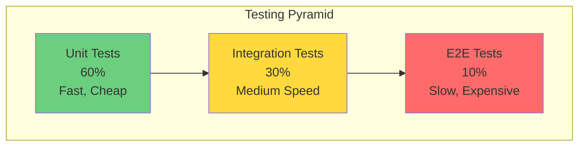

# Comprehensive Testing Strategy Guide

## Overview

This guide defines the testing strategy for the HomeWarehouse project, covering all layers from unit tests to end-to-end tests, with specific patterns for hexagonal architecture and DDD.

## Testing Pyramid



## Unit Tests (60% of tests)

### Domain Layer Testing

**Goal:** Test business logic in isolation without any framework dependencies

**Characteristics:**
- Pure Java, no Spring annotations
- No database, no network
- Fast execution (< 1ms per test)
- High coverage (>90%)

#### Value Object Tests

```java
// test/java/com/homewarehouse/ledger/domain/model/MoneyTest.java
package com.homewarehouse.ledger.domain.model;

import org.junit.jupiter.api.Test;
import org.junit.jupiter.api.DisplayName;
import org.junit.jupiter.params.ParameterizedTest;
import org.junit.jupiter.params.provider.ValueSource;
import java.math.BigDecimal;

import static org.assertj.core.api.Assertions.*;

@DisplayName("Money Value Object")
class MoneyTest {

    @Test
    @DisplayName("Should create Money with valid amount and currency")
    void should_CreateMoney_When_ValidInput() {
        Money money = Money.of(100.50, "USD");

        assertThat(money.amount()).isEqualByComparingTo("100.50");
        assertThat(money.currency()).isEqualTo("USD");
    }

    @Test
    @DisplayName("Should throw exception when amount is negative")
    void should_ThrowException_When_NegativeAmount() {
        assertThatThrownBy(() -> Money.of(-10.00, "USD"))
            .isInstanceOf(IllegalArgumentException.class)
            .hasMessageContaining("cannot be negative");
    }

    @Test
    @DisplayName("Should throw exception when currency is invalid")
    void should_ThrowException_When_InvalidCurrency() {
        assertThatThrownBy(() -> Money.of(100.00, "US"))
            .isInstanceOf(IllegalArgumentException.class)
            .hasMessageContaining("Currency must be 3 characters");
    }

    @Test
    @DisplayName("Should add two Money values of same currency")
    void should_AddMoney_When_SameCurrency() {
        Money m1 = Money.of(100.00, "USD");
        Money m2 = Money.of(50.00, "USD");

        Money result = m1.add(m2);

        assertThat(result.amount()).isEqualByComparingTo("150.00");
    }

    @Test
    @DisplayName("Should throw exception when adding different currencies")
    void should_ThrowException_When_AddingDifferentCurrencies() {
        Money usd = Money.of(100.00, "USD");
        Money eur = Money.of(50.00, "EUR");

        assertThatThrownBy(() => usd.add(eur))
            .isInstanceOf(IllegalArgumentException.class)
            .hasMessageContaining("different currencies");
    }

    @ParameterizedTest
    @ValueSource(doubles = {0.01, 1.0, 100.0, 999999.99})
    @DisplayName("Should accept valid positive amounts")
    void should_Accept_When_ValidPositiveAmounts(double amount) {
        Money money = Money.of(amount, "USD");

        assertThat(money.amount()).isGreaterThan(BigDecimal.ZERO);
    }
}
```

#### Aggregate Tests

```java
// test/java/com/homewarehouse/ledger/domain/model/TransactionTest.java
@DisplayName("Transaction Aggregate")
class TransactionTest {

    private TransactionId transactionId;
    private AccountId accountId;
    private Money amount;
    private CategoryId categoryId;

    @BeforeEach
    void setUp() {
        transactionId = TransactionId.generate();
        accountId = AccountId.generate();
        amount = Money.of(100.00, "USD");
        categoryId = CategoryId.generate();
    }

    @Test
    @DisplayName("Should create expense transaction with valid data")
    void should_CreateExpense_When_ValidData() {
        Transaction transaction = Transaction.createExpense(
            transactionId,
            accountId,
            amount,
            "Groceries",
            LocalDate.now(),
            categoryId
        );

        assertThat(transaction.getId()).isEqualTo(transactionId);
        assertThat(transaction.getType()).isEqualTo(TransactionType.EXPENSE);
        assertThat(transaction.getAmount()).isEqualTo(amount);
        assertThat(transaction.getDescription()).isEqualTo("Groceries");
    }

    @Test
    @DisplayName("Should throw exception when creating expense with negative amount")
    void should_ThrowException_When_NegativeExpense() {
        Money negativeAmount = Money.of(-100.00, "USD");

        assertThatThrownBy(() -> Transaction.createExpense(
            transactionId,
            accountId,
            negativeAmount,
            "Invalid",
            LocalDate.now(),
            categoryId
        )).isInstanceOf(IllegalArgumentException.class);
    }

    @Test
    @DisplayName("Should not allow transaction date in the future")
    void should_ThrowException_When_FutureDate() {
        LocalDate futureDate = LocalDate.now().plusDays(1);

        assertThatThrownBy(() -> Transaction.createExpense(
            transactionId,
            accountId,
            amount,
            "Future transaction",
            futureDate,
            categoryId
        ))
        .isInstanceOf(IllegalArgumentException.class)
        .hasMessageContaining("cannot be in the future");
    }

    @Test
    @DisplayName("Should update transaction description")
    void should_UpdateDescription_When_ValidInput() {
        Transaction transaction = Transaction.createExpense(
            transactionId,
            accountId,
            amount,
            "Original description",
            LocalDate.now(),
            categoryId
        );

        transaction.updateDescription("Updated description");

        assertThat(transaction.getDescription()).isEqualTo("Updated description");
        assertThat(transaction.getUpdatedAt()).isAfter(transaction.getCreatedAt());
    }
}
```

#### Domain Service Tests

```java
// test/java/com/homewarehouse/identityaccess/domain/service/BCryptPasswordServiceTest.java
@DisplayName("Password Service")
class BCryptPasswordServiceTest {

    private PasswordService passwordService;

    @BeforeEach
    void setUp() {
        passwordService = new BCryptPasswordService();
    }

    @Test
    @DisplayName("Should hash password successfully")
    void should_HashPassword_When_ValidPassword() {
        String plainPassword = "SecureP@ssw0rd";

        PasswordHash hash = passwordService.hashPassword(plainPassword);

        assertThat(hash.value()).isNotEmpty();
        assertThat(hash.value()).hasSize(60); // BCrypt hash length
        assertThat(hash.value()).startsWith("$2");
    }

    @Test
    @DisplayName("Should verify correct password")
    void should_VerifyPassword_When_CorrectPassword() {
        String plainPassword = "SecureP@ssw0rd";
        PasswordHash hash = passwordService.hashPassword(plainPassword);

        boolean matches = passwordService.verifyPassword(plainPassword, hash);

        assertThat(matches).isTrue();
    }

    @Test
    @DisplayName("Should reject incorrect password")
    void should_RejectPassword_When_IncorrectPassword() {
        PasswordHash hash = passwordService.hashPassword("SecureP@ssw0rd");

        boolean matches = passwordService.verifyPassword("WrongPassword", hash);

        assertThat(matches).isFalse();
    }

    @ParameterizedTest
    @ValueSource(strings = {
        "short",           // Too short
        "nouppercase1!",   // No uppercase
        "NOLOWERCASE1!",   // No lowercase
        "NoDigits!",       // No digits
        "NoSpecial1"       // No special characters
    })
    @DisplayName("Should reject weak passwords")
    void should_RejectWeakPasswords(String weakPassword) {
        assertThatThrownBy(() -> passwordService.validatePasswordStrength(weakPassword))
            .isInstanceOf(IllegalArgumentException.class);
    }
}
```

### Application Layer Testing

**Goal:** Test use case orchestration with mocked dependencies

```java
// test/java/com/homewarehouse/ledger/application/command/CreateTransactionHandlerTest.java
@ExtendWith(MockitoExtension.class)
@DisplayName("Create Transaction Handler")
class CreateTransactionHandlerTest {

    @Mock
    private TransactionRepository transactionRepository;

    @Mock
    private AccountRepository accountRepository;

    @Mock
    private CategoryRepository categoryRepository;

    @Mock
    private TransactionEventPublisher eventPublisher;

    @InjectMocks
    private CreateTransactionHandler handler;

    private Account account;
    private Category category;

    @BeforeEach
    void setUp() {
        account = Account.create(
            AccountId.generate(),
            "Checking",
            AccountType.CHECKING,
            Money.of(1000.00, "USD")
        );

        category = Category.create(
            CategoryId.generate(),
            "Groceries",
            CategoryType.EXPENSE
        );
    }

    @Test
    @DisplayName("Should create transaction successfully")
    void should_CreateTransaction_When_ValidCommand() {
        // Given
        CreateTransactionCommand command = new CreateTransactionCommand(
            account.getId().value(),
            TransactionType.EXPENSE,
            new BigDecimal("50.00"),
            "USD",
            "Weekly groceries",
            LocalDate.now(),
            category.getId().value()
        );

        when(accountRepository.findById(account.getId()))
            .thenReturn(Optional.of(account));
        when(categoryRepository.findById(category.getId()))
            .thenReturn(Optional.of(category));
        when(transactionRepository.save(any(Transaction.class)))
            .thenAnswer(invocation -> invocation.getArgument(0));

        // When
        CreateTransactionResult result = handler.handle(command);

        // Then
        assertThat(result.transactionId()).isNotNull();
        assertThat(result.amount()).isEqualByComparingTo("50.00");

        verify(transactionRepository).save(any(Transaction.class));
        verify(eventPublisher).publish(any(TransactionCreatedEvent.class));
    }

    @Test
    @DisplayName("Should throw exception when account not found")
    void should_ThrowException_When_AccountNotFound() {
        // Given
        CreateTransactionCommand command = new CreateTransactionCommand(
            UUID.randomUUID(),
            TransactionType.EXPENSE,
            new BigDecimal("50.00"),
            "USD",
            "Description",
            LocalDate.now(),
            category.getId().value()
        );

        when(accountRepository.findById(any(AccountId.class)))
            .thenReturn(Optional.empty());

        // When/Then
        assertThatThrownBy(() -> handler.handle(command))
            .isInstanceOf(IllegalArgumentException.class)
            .hasMessageContaining("Account not found");

        verify(transactionRepository, never()).save(any());
        verify(eventPublisher, never()).publish(any());
    }
}
```

## Integration Tests (30% of tests)

### Database Integration Tests

**Goal:** Test repository implementations with real database

```java
// test/java/com/homewarehouse/ledger/infrastructure/persistence/TransactionRepositoryIntegrationTest.java
@SpringBootTest
@Testcontainers
@DisplayName("Transaction Repository Integration Tests")
class TransactionRepositoryIntegrationTest {

    @Container
    static PostgreSQLContainer<?> postgres = new PostgreSQLContainer<>("postgres:16")
        .withDatabaseName("test")
        .withUsername("test")
        .withPassword("test");

    @DynamicPropertySource
    static void configureProperties(DynamicPropertyRegistry registry) {
        registry.add("spring.datasource.url", postgres::getJdbcUrl);
        registry.add("spring.datasource.username", postgres::getUsername);
        registry.add("spring.datasource.password", postgres::getPassword);
    }

    @Autowired
    private TransactionRepository transactionRepository;

    @Autowired
    private AccountRepository accountRepository;

    @Autowired
    private CategoryRepository categoryRepository;

    private Account account;
    private Category category;

    @BeforeEach
    void setUp() {
        account = Account.create(
            AccountId.generate(),
            "Test Account",
            AccountType.CHECKING,
            Money.of(1000.00, "USD")
        );
        accountRepository.save(account);

        category = Category.create(
            CategoryId.generate(),
            "Test Category",
            CategoryType.EXPENSE
        );
        categoryRepository.save(category);
    }

    @Test
    @DisplayName("Should save and retrieve transaction")
    void should_SaveAndRetrieve_When_ValidTransaction() {
        // Given
        Transaction transaction = Transaction.createExpense(
            TransactionId.generate(),
            account.getId(),
            Money.of(50.00, "USD"),
            "Test transaction",
            LocalDate.now(),
            category.getId()
        );

        // When
        Transaction saved = transactionRepository.save(transaction);
        Optional<Transaction> retrieved = transactionRepository.findById(saved.getId());

        // Then
        assertThat(retrieved).isPresent();
        assertThat(retrieved.get().getId()).isEqualTo(saved.getId());
        assertThat(retrieved.get().getDescription()).isEqualTo("Test transaction");
    }

    @Test
    @DisplayName("Should find transactions by account")
    void should_FindTransactions_When_FilterByAccount() {
        // Given
        Transaction tx1 = Transaction.createExpense(
            TransactionId.generate(),
            account.getId(),
            Money.of(50.00, "USD"),
            "Transaction 1",
            LocalDate.now(),
            category.getId()
        );
        Transaction tx2 = Transaction.createExpense(
            TransactionId.generate(),
            account.getId(),
            Money.of(75.00, "USD"),
            "Transaction 2",
            LocalDate.now(),
            category.getId()
        );

        transactionRepository.save(tx1);
        transactionRepository.save(tx2);

        // When
        List<Transaction> transactions = transactionRepository.findByAccountId(
            account.getId(),
            0,
            10
        );

        // Then
        assertThat(transactions).hasSize(2);
        assertThat(transactions)
            .extracting(Transaction::getDescription)
            .containsExactlyInAnyOrder("Transaction 1", "Transaction 2");
    }
}
```

### RabbitMQ Integration Tests

```java
// test/java/com/homewarehouse/ledger/infrastructure/messaging/RabbitMQEventPublisherIntegrationTest.java
@SpringBootTest
@Testcontainers
@DisplayName("RabbitMQ Event Publisher Integration Tests")
class RabbitMQEventPublisherIntegrationTest {

    @Container
    static RabbitMQContainer rabbitmq = new RabbitMQContainer("rabbitmq:3.12-management");

    @DynamicPropertySource
    static void configureProperties(DynamicPropertyRegistry registry) {
        registry.add("spring.rabbitmq.host", rabbitmq::getHost);
        registry.add("spring.rabbitmq.port", rabbitmq::getAmqpPort);
        registry.add("spring.rabbitmq.username", () -> "guest");
        registry.add("spring.rabbitmq.password", () -> "guest");
    }

    @Autowired
    private TransactionEventPublisher eventPublisher;

    @Autowired
    private RabbitTemplate rabbitTemplate;

    @Test
    @DisplayName("Should publish transaction created event")
    void should_PublishEvent_When_TransactionCreated() throws Exception {
        // Given
        TransactionCreatedEvent event = TransactionCreatedEvent.of(
            TransactionId.generate(),
            AccountId.generate(),
            TransactionType.EXPENSE,
            Money.of(100.00, "USD")
        );

        CountDownLatch latch = new CountDownLatch(1);
        List<TransactionCreatedEvent> receivedEvents = new ArrayList<>();

        // Setup test listener
        rabbitTemplate.setReceiveTimeout(5000);
        SimpleMessageListenerContainer container = createListener(latch, receivedEvents);
        container.start();

        try {
            // When
            eventPublisher.publish(event);

            // Then
            boolean messageReceived = latch.await(5, TimeUnit.SECONDS);
            assertThat(messageReceived).isTrue();
            assertThat(receivedEvents).hasSize(1);
            assertThat(receivedEvents.get(0).transactionId())
                .isEqualTo(event.transactionId());
        } finally {
            container.stop();
        }
    }
}
```

### Temporal Workflow Tests

```java
// test/java/com/homewarehouse/workflows/PurchaseRegistrationWorkflowTest.java
@DisplayName("Purchase Registration Workflow Tests")
class PurchaseRegistrationWorkflowTest {

    private TestWorkflowEnvironment testEnv;
    private Worker worker;
    private PurchaseActivities activities;

    @BeforeEach
    void setUp() {
        testEnv = TestWorkflowEnvironment.newInstance();
        worker = testEnv.newWorker("purchase-queue");

        worker.registerWorkflowImplementationTypes(PurchaseRegistrationWorkflowImpl.class);

        activities = mock(PurchaseActivities.class);
        worker.registerActivitiesImplementations(activities);

        testEnv.start();
    }

    @AfterEach
    void tearDown() {
        testEnv.shutdown();
    }

    @Test
    @DisplayName("Should complete purchase workflow successfully")
    void should_CompletePurchase_When_AllActivitiesSucceed() {
        // Given
        PurchaseInput input = new PurchaseInput(
            List.of(new PurchaseItem("Apple", 5, 1.50)),
            "Checking Account",
            LocalDate.now()
        );

        when(activities.validateInput(input)).thenReturn(ValidationResult.valid());
        when(activities.createTransaction(any())).thenReturn(UUID.randomUUID());
        when(activities.createUnits(any())).thenReturn(List.of(UUID.randomUUID()));

        // When
        PurchaseRegistrationWorkflow workflow = testEnv.getWorkflowClient()
            .newWorkflowStub(PurchaseRegistrationWorkflow.class);

        PurchaseResult result = workflow.registerPurchase(input);

        // Then
        assertThat(result.success()).isTrue();
        assertThat(result.transactionId()).isNotNull();
        assertThat(result.unitIds()).hasSize(1);

        verify(activities).validateInput(input);
        verify(activities).createTransaction(any());
        verify(activities).createUnits(any());
    }

    @Test
    @DisplayName("Should compensate when activity fails")
    void should_Compensate_When_ActivityFails() {
        // Given
        PurchaseInput input = new PurchaseInput(
            List.of(new PurchaseItem("Apple", 5, 1.50)),
            "Checking Account",
            LocalDate.now()
        );

        UUID transactionId = UUID.randomUUID();

        when(activities.validateInput(input)).thenReturn(ValidationResult.valid());
        when(activities.createTransaction(any())).thenReturn(transactionId);
        when(activities.createUnits(any()))
            .thenThrow(new RuntimeException("Unit creation failed"));

        // When
        PurchaseRegistrationWorkflow workflow = testEnv.getWorkflowClient()
            .newWorkflowStub(PurchaseRegistrationWorkflow.class);

        PurchaseResult result = workflow.registerPurchase(input);

        // Then
        assertThat(result.success()).isFalse();

        verify(activities).validateInput(input);
        verify(activities).createTransaction(any());
        verify(activities).createUnits(any());
        verify(activities).deleteTransaction(transactionId); // Compensation
    }
}
```

## End-to-End Tests (10% of tests)

### REST API E2E Tests

```java
// test/java/com/homewarehouse/e2e/TransactionFlowE2ETest.java
@SpringBootTest(webEnvironment = SpringBootTest.WebEnvironment.RANDOM_PORT)
@Testcontainers
@DisplayName("Transaction Flow E2E Tests")
class TransactionFlowE2ETest {

    @Container
    static PostgreSQLContainer<?> postgres = new PostgreSQLContainer<>("postgres:16");

    @Container
    static RabbitMQContainer rabbitmq = new RabbitMQContainer("rabbitmq:3.12");

    @LocalServerPort
    private int port;

    @Autowired
    private TestRestTemplate restTemplate;

    private String accessToken;

    @BeforeEach
    void setUp() {
        // Login and get access token
        LoginRequest loginRequest = new LoginRequest("admin", "password");

        ResponseEntity<AuthResponse> loginResponse = restTemplate.postForEntity(
            "/api/v1/auth/login",
            loginRequest,
            AuthResponse.class
        );

        accessToken = loginResponse.getBody().accessToken();
    }

    @Test
    @DisplayName("Should complete full transaction lifecycle")
    void should_CompleteTransactionLifecycle() {
        // Create transaction
        CreateTransactionRequest createRequest = new CreateTransactionRequest(
            UUID.randomUUID(), // accountId
            "EXPENSE",
            new BigDecimal("100.00"),
            "USD",
            "E2E Test Transaction",
            LocalDate.now(),
            UUID.randomUUID() // categoryId
        );

        HttpHeaders headers = new HttpHeaders();
        headers.setBearerAuth(accessToken);
        HttpEntity<CreateTransactionRequest> requestEntity =
            new HttpEntity<>(createRequest, headers);

        // When: Create
        ResponseEntity<TransactionResponse> createResponse = restTemplate.exchange(
            "/api/v1/ledger/transactions",
            HttpMethod.POST,
            requestEntity,
            TransactionResponse.class
        );

        // Then: Verify creation
        assertThat(createResponse.getStatusCode()).isEqualTo(HttpStatus.CREATED);
        assertThat(createResponse.getBody().id()).isNotNull();

        UUID transactionId = UUID.fromString(createResponse.getBody().id());

        // When: Retrieve
        ResponseEntity<TransactionResponse> getResponse = restTemplate.exchange(
            "/api/v1/ledger/transactions/" + transactionId,
            HttpMethod.GET,
            new HttpEntity<>(headers),
            TransactionResponse.class
        );

        // Then: Verify retrieval
        assertThat(getResponse.getStatusCode()).isEqualTo(HttpStatus.OK);
        assertThat(getResponse.getBody().description())
            .isEqualTo("E2E Test Transaction");

        // When: Update
        UpdateTransactionRequest updateRequest = new UpdateTransactionRequest(
            "Updated Description"
        );

        ResponseEntity<TransactionResponse> updateResponse = restTemplate.exchange(
            "/api/v1/ledger/transactions/" + transactionId,
            HttpMethod.PUT,
            new HttpEntity<>(updateRequest, headers),
            TransactionResponse.class
        );

        // Then: Verify update
        assertThat(updateResponse.getStatusCode()).isEqualTo(HttpStatus.OK);
        assertThat(updateResponse.getBody().description())
            .isEqualTo("Updated Description");

        // When: Delete
        ResponseEntity<Void> deleteResponse = restTemplate.exchange(
            "/api/v1/ledger/transactions/" + transactionId,
            HttpMethod.DELETE,
            new HttpEntity<>(headers),
            Void.class
        );

        // Then: Verify deletion
        assertThat(deleteResponse.getStatusCode()).isEqualTo(HttpStatus.NO_CONTENT);

        // Verify not found after deletion
        ResponseEntity<TransactionResponse> getDeletedResponse = restTemplate.exchange(
            "/api/v1/ledger/transactions/" + transactionId,
            HttpMethod.GET,
            new HttpEntity<>(headers),
            TransactionResponse.class
        );

        assertThat(getDeletedResponse.getStatusCode()).isEqualTo(HttpStatus.NOT_FOUND);
    }
}
```

## Frontend Testing

### Component Tests (React Testing Library)

```typescript
// web/src/features/ledger/components/__tests__/TransactionList.test.tsx
import { render, screen, waitFor } from '@testing-library/react';
import userEvent from '@testing-library/user-event';
import { QueryClient, QueryClientProvider } from '@tanstack/react-query';
import { TransactionList } from '../TransactionList';
import { vi } from 'vitest';

const createWrapper = () => {
  const queryClient = new QueryClient({
    defaultOptions: {
      queries: { retry: false },
      mutations: { retry: false },
    },
  });

  return ({ children }: { children: React.ReactNode }) => (
    <QueryClientProvider client={queryClient}>
      {children}
    </QueryClientProvider>
  );
};

describe('TransactionList', () => {
  it('renders transaction list', async () => {
    render(<TransactionList />, { wrapper: createWrapper() });

    await waitFor(() => {
      expect(screen.getByText(/transactions/i)).toBeInTheDocument();
    });
  });

  it('filters transactions by type', async () => {
    const user = userEvent.setup();
    render(<TransactionList />, { wrapper: createWrapper() });

    const filterSelect = screen.getByLabelText(/type/i);
    await user.selectOptions(filterSelect, 'EXPENSE');

    await waitFor(() => {
      expect(screen.queryByText(/income/i)).not.toBeInTheDocument();
    });
  });
});
```

## Performance Tests

### Load Testing with Gatling

```scala
// test/scala/simulations/TransactionApiSimulation.scala
class TransactionApiSimulation extends Simulation {

  val httpProtocol = http
    .baseUrl("http://localhost:8080")
    .acceptHeader("application/json")
    .contentTypeHeader("application/json")

  val scn = scenario("Transaction API Load Test")
    .exec(
      http("Login")
        .post("/api/v1/auth/login")
        .body(StringBody("""{"username":"admin","password":"password"}"""))
        .check(jsonPath("$.accessToken").saveAs("token"))
    )
    .pause(1)
    .repeat(10) {
      exec(
        http("Create Transaction")
          .post("/api/v1/ledger/transactions")
          .header("Authorization", "Bearer ${token}")
          .body(StringBody("""{"accountId":"...","type":"EXPENSE","amount":100.00}"""))
          .check(status.is(201))
      )
      .pause(1)
    }

  setUp(
    scn.inject(
      rampUsers(100).during(60.seconds)
    )
  ).protocols(httpProtocol)
   .assertions(
     global.responseTime.max.lt(2000),
     global.successfulRequests.percent.gt(95)
   )
}
```

## Test Coverage Requirements

### By Layer

| Layer | Coverage Target | Critical |
|-------|-----------------|----------|
| Domain | >90% | Yes |
| Application | >85% | Yes |
| Infrastructure | >70% | No |
| Overall | >80% | Yes |

### Measure Coverage

```bash
# Backend (Java)
./gradlew test jacocoTestReport

# Frontend (TypeScript)
cd web && npm run test:coverage
```

## Continuous Integration

### GitHub Actions Workflow

```yaml
# .github/workflows/test.yml
name: Tests

on: [push, pull_request]

jobs:
  backend-tests:
    runs-on: ubuntu-latest
    steps:
      - uses: actions/checkout@v3

      - name: Set up JDK 21
        uses: actions/setup-java@v3
        with:
          java-version: '21'
          distribution: 'temurin'

      - name: Run unit tests
        run: ./gradlew test

      - name: Run integration tests
        run: ./gradlew integrationTest

      - name: Generate coverage report
        run: ./gradlew jacocoTestReport

      - name: Upload coverage
        uses: codecov/codecov-action@v3

  frontend-tests:
    runs-on: ubuntu-latest
    steps:
      - uses: actions/checkout@v3

      - name: Setup Node.js
        uses: actions/setup-node@v3
        with:
          node-version: '18'

      - name: Install dependencies
        run: cd web && npm ci

      - name: Run tests
        run: cd web && npm run test:coverage

      - name: Upload coverage
        uses: codecov/codecov-action@v3
```

## Best Practices

1. **Test Naming:** Use `should_ExpectedBehavior_When_Condition` format
2. **AAA Pattern:** Arrange, Act, Assert in every test
3. **One Assertion:** Focus each test on a single behavior
4. **Test Independence:** Tests should not depend on each other
5. **Fast Tests:** Unit tests < 100ms, integration tests < 1s
6. **Clean Tests:** Follow same clean code principles as production code
7. **Mock Sparingly:** Only mock at architecture boundaries
8. **Test Data Builders:** Use builder pattern for complex test data
9. **Descriptive Names:** Test names should describe the scenario
10. **Coverage != Quality:** Focus on meaningful tests, not just coverage

## Summary

This testing strategy ensures:
- Comprehensive coverage across all layers
- Fast feedback loop with unit tests
- Confidence through integration tests
- Real-world validation with E2E tests
- Performance validation with load tests
- Automated testing in CI/CD pipeline
