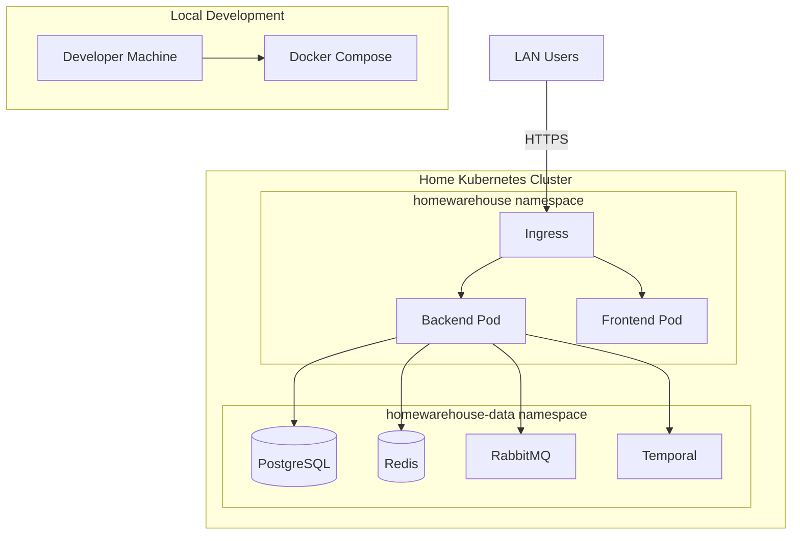

# HomeWarehouse - Infrastructure Plan

## Purpose

This document defines the infrastructure architecture for HomeWarehouse, including local development setup with Docker Compose, Kubernetes deployment with Helm, and Terraform provisioning for the home cluster.

## Scope

### In Scope

- Docker Compose for local development
- Helm chart structure for Kubernetes
- Terraform modules for cluster provisioning
- Network and security configuration
- Secret management approach
- Observability setup

### Out of Scope

- Cluster installation (assumes existing Kubernetes cluster)
- Hardware specifications
- Network infrastructure (routers, switches)
- Backup hardware/NAS configuration

## Deployment Overview



---

## Local Development (Docker Compose)

### Directory Structure

```
infrastructure/
├── docker/
│   ├── docker-compose.yml
│   ├── docker-compose.override.yml.template
│   └── .env.template
```

### Docker Compose Configuration

```yaml
# infrastructure/docker/docker-compose.yml
version: '3.8'

services:
  postgres:
    image: postgres:16-alpine
    container_name: homewarehouse-postgres
    environment:
      POSTGRES_DB: homewarehouse
      POSTGRES_USER: ${POSTGRES_USER:-homewarehouse}
      POSTGRES_PASSWORD: ${POSTGRES_PASSWORD:-devpassword}
    ports:
      - "5432:5432"
    volumes:
      - postgres_data:/var/lib/postgresql/data
      - ./init-scripts/postgres:/docker-entrypoint-initdb.d:ro
    healthcheck:
      test: ["CMD-SHELL", "pg_isready -U homewarehouse"]
      interval: 10s
      timeout: 5s
      retries: 5

  redis:
    image: redis:7-alpine
    container_name: homewarehouse-redis
    command: redis-server --requirepass ${REDIS_PASSWORD:-devpassword}
    ports:
      - "6379:6379"
    volumes:
      - redis_data:/data
    healthcheck:
      test: ["CMD", "redis-cli", "ping"]
      interval: 10s
      timeout: 5s
      retries: 5

  rabbitmq:
    image: rabbitmq:3.12-management-alpine
    container_name: homewarehouse-rabbitmq
    environment:
      RABBITMQ_DEFAULT_USER: ${RABBITMQ_USER:-homewarehouse}
      RABBITMQ_DEFAULT_PASS: ${RABBITMQ_PASSWORD:-devpassword}
      RABBITMQ_DEFAULT_VHOST: homewarehouse
    ports:
      - "5672:5672"
      - "15672:15672"
    volumes:
      - rabbitmq_data:/var/lib/rabbitmq
    healthcheck:
      test: ["CMD", "rabbitmq-diagnostics", "check_running"]
      interval: 10s
      timeout: 5s
      retries: 5

  temporal:
    image: temporalio/auto-setup:1.22
    container_name: homewarehouse-temporal
    environment:
      - DB=postgresql
      - DB_PORT=5432
      - POSTGRES_USER=${POSTGRES_USER:-homewarehouse}
      - POSTGRES_PWD=${POSTGRES_PASSWORD:-devpassword}
      - POSTGRES_SEEDS=postgres
      - DYNAMIC_CONFIG_FILE_PATH=/etc/temporal/config/dynamicconfig/development.yaml
    ports:
      - "7233:7233"
    volumes:
      - ./temporal-config:/etc/temporal/config/dynamicconfig:ro
    depends_on:
      postgres:
        condition: service_healthy

  temporal-ui:
    image: temporalio/ui:2.21
    container_name: homewarehouse-temporal-ui
    environment:
      - TEMPORAL_ADDRESS=temporal:7233
    ports:
      - "8088:8080"
    depends_on:
      - temporal

volumes:
  postgres_data:
  redis_data:
  rabbitmq_data:
```

### Environment Template

```bash
# infrastructure/docker/.env.template
# Copy to .env and customize

# PostgreSQL
POSTGRES_USER=homewarehouse
POSTGRES_PASSWORD=change-me-in-dev

# Redis
REDIS_PASSWORD=change-me-in-dev

# RabbitMQ
RABBITMQ_USER=homewarehouse
RABBITMQ_PASSWORD=change-me-in-dev

# JWT (generate with: openssl rand -base64 32)
JWT_SECRET=generate-a-secure-secret

# Application
SPRING_PROFILES_ACTIVE=local
```

### Local Development Commands

```bash
# Start all services
cd infrastructure/docker
docker-compose up -d

# View logs
docker-compose logs -f

# Stop services
docker-compose down

# Reset all data
docker-compose down -v

# Rebuild after changes
docker-compose up -d --build
```

---

## Kubernetes Deployment (Helm)

### Helm Chart Structure

```
infrastructure/
├── helm/
│   ├── homewarehouse/
│   │   ├── Chart.yaml
│   │   ├── values.yaml
│   │   ├── values-production.yaml
│   │   └── templates/
│   │       ├── _helpers.tpl
│   │       ├── namespace.yaml
│   │       ├── configmap.yaml
│   │       ├── secret.yaml
│   │       ├── backend-deployment.yaml
│   │       ├── backend-service.yaml
│   │       ├── frontend-deployment.yaml
│   │       ├── frontend-service.yaml
│   │       ├── ingress.yaml
│   │       ├── networkpolicy.yaml
│   │       └── serviceaccount.yaml
│   └── homewarehouse-deps/
│       ├── Chart.yaml
│       ├── values.yaml
│       └── templates/
│           ├── postgres-statefulset.yaml
│           ├── redis-statefulset.yaml
│           ├── rabbitmq-statefulset.yaml
│           └── temporal-deployment.yaml
```

### Main Chart (homewarehouse)

```yaml
# infrastructure/helm/homewarehouse/Chart.yaml
apiVersion: v2
name: homewarehouse
description: Personal wealth and inventory management system
type: application
version: 0.1.0
appVersion: "1.0.0"
dependencies:
  - name: homewarehouse-deps
    version: 0.1.0
    repository: file://../homewarehouse-deps
    condition: deps.enabled
```

### Values Configuration

```yaml
# infrastructure/helm/homewarehouse/values.yaml
global:
  namespace: homewarehouse

backend:
  replicaCount: 1
  image:
    repository: homewarehouse/backend
    tag: latest
    pullPolicy: IfNotPresent
  resources:
    requests:
      memory: "512Mi"
      cpu: "250m"
    limits:
      memory: "1Gi"
      cpu: "1000m"
  env:
    SPRING_PROFILES_ACTIVE: kubernetes
    JAVA_OPTS: "-XX:+UseContainerSupport -XX:MaxRAMPercentage=75.0"
  healthcheck:
    path: /healthz
    port: 8080

frontend:
  replicaCount: 1
  image:
    repository: homewarehouse/frontend
    tag: latest
    pullPolicy: IfNotPresent
  resources:
    requests:
      memory: "64Mi"
      cpu: "50m"
    limits:
      memory: "128Mi"
      cpu: "200m"

ingress:
  enabled: true
  className: nginx
  annotations:
    nginx.ingress.kubernetes.io/ssl-redirect: "true"
  hosts:
    - host: homewarehouse.local
      paths:
        - path: /api
          pathType: Prefix
          service: backend
          port: 8080
        - path: /
          pathType: Prefix
          service: frontend
          port: 80
  tls:
    - secretName: homewarehouse-tls
      hosts:
        - homewarehouse.local

secrets:
  # These are placeholders - actual values come from Kubernetes Secrets
  postgresPassword: ""
  redisPassword: ""
  rabbitmqPassword: ""
  jwtPrivateKey: ""
  jwtPublicKey: ""

deps:
  enabled: true
  postgres:
    enabled: true
    persistence:
      size: 10Gi
  redis:
    enabled: true
    persistence:
      size: 1Gi
  rabbitmq:
    enabled: true
    persistence:
      size: 2Gi
  temporal:
    enabled: true
```

### Backend Deployment Template

```yaml
# infrastructure/helm/homewarehouse/templates/backend-deployment.yaml
apiVersion: apps/v1
kind: Deployment
metadata:
  name: {{ include "homewarehouse.fullname" . }}-backend
  namespace: {{ .Values.global.namespace }}
  labels:
    {{- include "homewarehouse.labels" . | nindent 4 }}
    app.kubernetes.io/component: backend
spec:
  replicas: {{ .Values.backend.replicaCount }}
  selector:
    matchLabels:
      {{- include "homewarehouse.selectorLabels" . | nindent 6 }}
      app.kubernetes.io/component: backend
  template:
    metadata:
      labels:
        {{- include "homewarehouse.selectorLabels" . | nindent 8 }}
        app.kubernetes.io/component: backend
    spec:
      serviceAccountName: {{ include "homewarehouse.serviceAccountName" . }}
      securityContext:
        runAsNonRoot: true
        runAsUser: 1000
      containers:
        - name: backend
          image: "{{ .Values.backend.image.repository }}:{{ .Values.backend.image.tag }}"
          imagePullPolicy: {{ .Values.backend.image.pullPolicy }}
          ports:
            - name: http
              containerPort: 8080
              protocol: TCP
          env:
            - name: SPRING_PROFILES_ACTIVE
              value: {{ .Values.backend.env.SPRING_PROFILES_ACTIVE }}
            - name: JAVA_OPTS
              value: {{ .Values.backend.env.JAVA_OPTS }}
            - name: POSTGRES_HOST
              value: postgres.{{ .Values.global.namespace }}-data.svc.cluster.local
            - name: POSTGRES_PASSWORD
              valueFrom:
                secretKeyRef:
                  name: {{ include "homewarehouse.fullname" . }}-secrets
                  key: postgres-password
            - name: REDIS_HOST
              value: redis.{{ .Values.global.namespace }}-data.svc.cluster.local
            - name: REDIS_PASSWORD
              valueFrom:
                secretKeyRef:
                  name: {{ include "homewarehouse.fullname" . }}-secrets
                  key: redis-password
            - name: RABBITMQ_HOST
              value: rabbitmq.{{ .Values.global.namespace }}-data.svc.cluster.local
            - name: RABBITMQ_PASSWORD
              valueFrom:
                secretKeyRef:
                  name: {{ include "homewarehouse.fullname" . }}-secrets
                  key: rabbitmq-password
            - name: TEMPORAL_TARGET
              value: temporal.{{ .Values.global.namespace }}-data.svc.cluster.local:7233
          livenessProbe:
            httpGet:
              path: {{ .Values.backend.healthcheck.path }}
              port: {{ .Values.backend.healthcheck.port }}
            initialDelaySeconds: 60
            periodSeconds: 10
          readinessProbe:
            httpGet:
              path: {{ .Values.backend.healthcheck.path }}
              port: {{ .Values.backend.healthcheck.port }}
            initialDelaySeconds: 30
            periodSeconds: 5
          resources:
            {{- toYaml .Values.backend.resources | nindent 12 }}
```

### Network Policy

```yaml
# infrastructure/helm/homewarehouse/templates/networkpolicy.yaml
apiVersion: networking.k8s.io/v1
kind: NetworkPolicy
metadata:
  name: {{ include "homewarehouse.fullname" . }}-backend
  namespace: {{ .Values.global.namespace }}
spec:
  podSelector:
    matchLabels:
      app.kubernetes.io/component: backend
  policyTypes:
    - Ingress
    - Egress
  ingress:
    - from:
        - namespaceSelector:
            matchLabels:
              name: ingress-nginx
        - podSelector:
            matchLabels:
              app.kubernetes.io/component: frontend
      ports:
        - protocol: TCP
          port: 8080
  egress:
    - to:
        - namespaceSelector:
            matchLabels:
              name: {{ .Values.global.namespace }}-data
      ports:
        - protocol: TCP
          port: 5432  # PostgreSQL
        - protocol: TCP
          port: 6379  # Redis
        - protocol: TCP
          port: 5672  # RabbitMQ
        - protocol: TCP
          port: 7233  # Temporal
    - to:
        - namespaceSelector: {}
          podSelector:
            matchLabels:
              k8s-app: kube-dns
      ports:
        - protocol: UDP
          port: 53
```

---

## Terraform Configuration

### Directory Structure

```
infrastructure/
├── terraform/
│   ├── modules/
│   │   ├── namespace/
│   │   │   ├── main.tf
│   │   │   ├── variables.tf
│   │   │   └── outputs.tf
│   │   ├── helm-release/
│   │   │   ├── main.tf
│   │   │   ├── variables.tf
│   │   │   └── outputs.tf
│   │   └── secrets/
│   │       ├── main.tf
│   │       ├── variables.tf
│   │       └── outputs.tf
│   └── environments/
│       └── home-cluster/
│           ├── main.tf
│           ├── variables.tf
│           ├── outputs.tf
│           ├── terraform.tfvars.template
│           └── backend.tf
```

### Main Terraform Configuration

```hcl
# infrastructure/terraform/environments/home-cluster/main.tf
terraform {
  required_version = ">= 1.5.0"

  required_providers {
    kubernetes = {
      source  = "hashicorp/kubernetes"
      version = "~> 2.25"
    }
    helm = {
      source  = "hashicorp/helm"
      version = "~> 2.12"
    }
    random = {
      source  = "hashicorp/random"
      version = "~> 3.6"
    }
  }
}

provider "kubernetes" {
  config_path    = var.kubeconfig_path
  config_context = var.kubeconfig_context
}

provider "helm" {
  kubernetes {
    config_path    = var.kubeconfig_path
    config_context = var.kubeconfig_context
  }
}

# Namespaces
module "app_namespace" {
  source = "../../modules/namespace"

  name = "homewarehouse"
  labels = {
    environment = "production"
    app         = "homewarehouse"
  }
}

module "data_namespace" {
  source = "../../modules/namespace"

  name = "homewarehouse-data"
  labels = {
    environment = "production"
    app         = "homewarehouse"
    tier        = "data"
  }
}

# Generate secrets if not provided
resource "random_password" "postgres" {
  count   = var.postgres_password == "" ? 1 : 0
  length  = 32
  special = false
}

resource "random_password" "redis" {
  count   = var.redis_password == "" ? 1 : 0
  length  = 32
  special = false
}

resource "random_password" "rabbitmq" {
  count   = var.rabbitmq_password == "" ? 1 : 0
  length  = 32
  special = false
}

# Secrets
module "secrets" {
  source = "../../modules/secrets"

  namespace = module.app_namespace.name

  secrets = {
    "homewarehouse-secrets" = {
      "postgres-password" = coalesce(var.postgres_password, try(random_password.postgres[0].result, ""))
      "redis-password"    = coalesce(var.redis_password, try(random_password.redis[0].result, ""))
      "rabbitmq-password" = coalesce(var.rabbitmq_password, try(random_password.rabbitmq[0].result, ""))
      "jwt-private-key"   = var.jwt_private_key
      "jwt-public-key"    = var.jwt_public_key
    }
  }

  depends_on = [module.app_namespace]
}

# Copy secrets to data namespace
module "data_secrets" {
  source = "../../modules/secrets"

  namespace = module.data_namespace.name

  secrets = {
    "homewarehouse-secrets" = {
      "postgres-password" = coalesce(var.postgres_password, try(random_password.postgres[0].result, ""))
      "redis-password"    = coalesce(var.redis_password, try(random_password.redis[0].result, ""))
      "rabbitmq-password" = coalesce(var.rabbitmq_password, try(random_password.rabbitmq[0].result, ""))
    }
  }

  depends_on = [module.data_namespace]
}

# Helm release for dependencies
module "deps_release" {
  source = "../../modules/helm-release"

  name       = "homewarehouse-deps"
  namespace  = module.data_namespace.name
  chart_path = "${path.module}/../../../helm/homewarehouse-deps"

  values = {
    postgres = {
      enabled = true
      persistence = {
        size = var.postgres_storage_size
      }
    }
    redis = {
      enabled = true
    }
    rabbitmq = {
      enabled = true
    }
    temporal = {
      enabled = true
    }
  }

  depends_on = [module.data_secrets]
}

# Helm release for application
module "app_release" {
  source = "../../modules/helm-release"

  name       = "homewarehouse"
  namespace  = module.app_namespace.name
  chart_path = "${path.module}/../../../helm/homewarehouse"

  values = {
    global = {
      namespace = module.app_namespace.name
    }
    deps = {
      enabled = false  # Deployed separately
    }
    ingress = {
      enabled = true
      hosts = [{
        host = var.ingress_host
        paths = [
          { path = "/api", pathType = "Prefix", service = "backend", port = 8080 },
          { path = "/", pathType = "Prefix", service = "frontend", port = 80 }
        ]
      }]
    }
  }

  depends_on = [module.secrets, module.deps_release]
}
```

### Variables

```hcl
# infrastructure/terraform/environments/home-cluster/variables.tf
variable "kubeconfig_path" {
  description = "Path to kubeconfig file"
  type        = string
  default     = "~/.kube/config"
}

variable "kubeconfig_context" {
  description = "Kubernetes context to use"
  type        = string
}

variable "ingress_host" {
  description = "Hostname for ingress"
  type        = string
  default     = "homewarehouse.local"
}

variable "postgres_password" {
  description = "PostgreSQL password (generated if empty)"
  type        = string
  default     = ""
  sensitive   = true
}

variable "redis_password" {
  description = "Redis password (generated if empty)"
  type        = string
  default     = ""
  sensitive   = true
}

variable "rabbitmq_password" {
  description = "RabbitMQ password (generated if empty)"
  type        = string
  default     = ""
  sensitive   = true
}

variable "jwt_private_key" {
  description = "JWT signing private key (PEM format)"
  type        = string
  sensitive   = true
}

variable "jwt_public_key" {
  description = "JWT verification public key (PEM format)"
  type        = string
  sensitive   = true
}

variable "postgres_storage_size" {
  description = "PostgreSQL persistent volume size"
  type        = string
  default     = "10Gi"
}
```

### Terraform Commands

```bash
# Initialize
cd infrastructure/terraform/environments/home-cluster
terraform init

# Plan
terraform plan -var-file="terraform.tfvars"

# Apply
terraform apply -var-file="terraform.tfvars"

# Destroy (careful!)
terraform destroy -var-file="terraform.tfvars"
```

---

## Secret Management

### Secret Types

| Secret | Storage | Rotation | Notes |
|--------|---------|----------|-------|
| Database passwords | K8s Secret | Manual | Rotate annually |
| Redis password | K8s Secret | Manual | Rotate annually |
| RabbitMQ password | K8s Secret | Manual | Rotate annually |
| JWT keys | K8s Secret | Semi-annual | RSA key pair |
| TLS certificates | K8s Secret (cert-manager) | Automatic | Let's Encrypt or self-signed |

### Secret Generation

```bash
# Generate JWT key pair
openssl genrsa -out jwt-private.pem 2048
openssl rsa -in jwt-private.pem -pubout -out jwt-public.pem

# Generate random passwords
openssl rand -base64 32

# Create Kubernetes secret manually (if not using Terraform)
kubectl create secret generic homewarehouse-secrets \
  --namespace=homewarehouse \
  --from-literal=postgres-password=$(openssl rand -base64 32) \
  --from-literal=redis-password=$(openssl rand -base64 32) \
  --from-literal=rabbitmq-password=$(openssl rand -base64 32) \
  --from-file=jwt-private-key=jwt-private.pem \
  --from-file=jwt-public-key=jwt-public.pem
```

---

## Observability

### Metrics (Prometheus)

Backend exposes `/metrics` endpoint (Prometheus format).

```yaml
# ServiceMonitor for Prometheus Operator
apiVersion: monitoring.coreos.com/v1
kind: ServiceMonitor
metadata:
  name: homewarehouse-backend
  namespace: homewarehouse
spec:
  selector:
    matchLabels:
      app.kubernetes.io/component: backend
  endpoints:
    - port: http
      path: /metrics
      interval: 30s
```

### Logging

- Backend: Structured JSON logs to stdout
- Collect with Fluent Bit/Fluentd to Loki or Elasticsearch
- Log levels configurable via environment variable

### Health Checks

| Endpoint | Purpose | Checks |
|----------|---------|--------|
| /healthz | Liveness | Application running |
| /healthz | Readiness | DB, Redis, RabbitMQ, Temporal connectivity |
| /metrics | Metrics | Prometheus metrics |

---

## Deployment Runbook

### Initial Deployment

```bash
# 1. Ensure cluster access
kubectl cluster-info

# 2. Create terraform.tfvars from template
cp terraform.tfvars.template terraform.tfvars
# Edit terraform.tfvars with your values

# 3. Initialize and apply Terraform
terraform init
terraform plan
terraform apply

# 4. Verify deployment
kubectl get pods -n homewarehouse
kubectl get pods -n homewarehouse-data

# 5. Check ingress
kubectl get ingress -n homewarehouse

# 6. Verify health
curl -k https://homewarehouse.local/healthz
```

### Updating Application

```bash
# 1. Build new images
docker build -t homewarehouse/backend:v1.0.1 ./backend
docker build -t homewarehouse/frontend:v1.0.1 ./web

# 2. Push to registry (if using private registry)
docker push homewarehouse/backend:v1.0.1
docker push homewarehouse/frontend:v1.0.1

# 3. Update Helm values or image tag
helm upgrade homewarehouse ./helm/homewarehouse \
  --namespace homewarehouse \
  --set backend.image.tag=v1.0.1 \
  --set frontend.image.tag=v1.0.1

# 4. Verify rollout
kubectl rollout status deployment/homewarehouse-backend -n homewarehouse
```

### Rollback

```bash
# Helm rollback
helm rollback homewarehouse -n homewarehouse

# Or to specific revision
helm rollback homewarehouse 2 -n homewarehouse
```

---

## Security Posture

Even though this is LAN-only:

| Layer | Security Measure |
|-------|------------------|
| Network | Network policies restrict pod communication |
| Transport | TLS for all ingress traffic |
| Authentication | JWT with short-lived tokens |
| Authorization | RBAC on all endpoints |
| Secrets | Kubernetes Secrets (consider sealed-secrets for GitOps) |
| Containers | Non-root user, read-only filesystem where possible |
| Dependencies | Regular vulnerability scanning |

---

## Related Documents

- [Architecture](../architecture/01-architecture.md) - Application architecture
- [Security](../security/02-security.md) - Security requirements
- [Backlog](../backlog/09-backlog.md) - Infrastructure tasks
