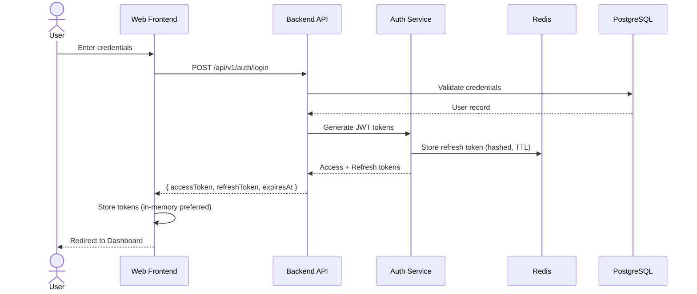
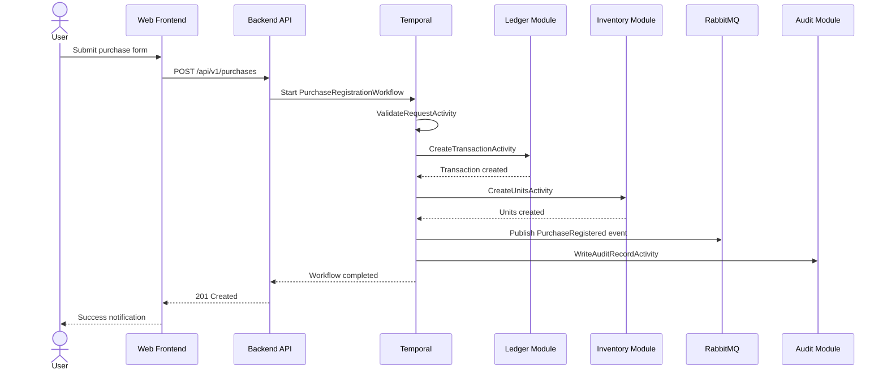
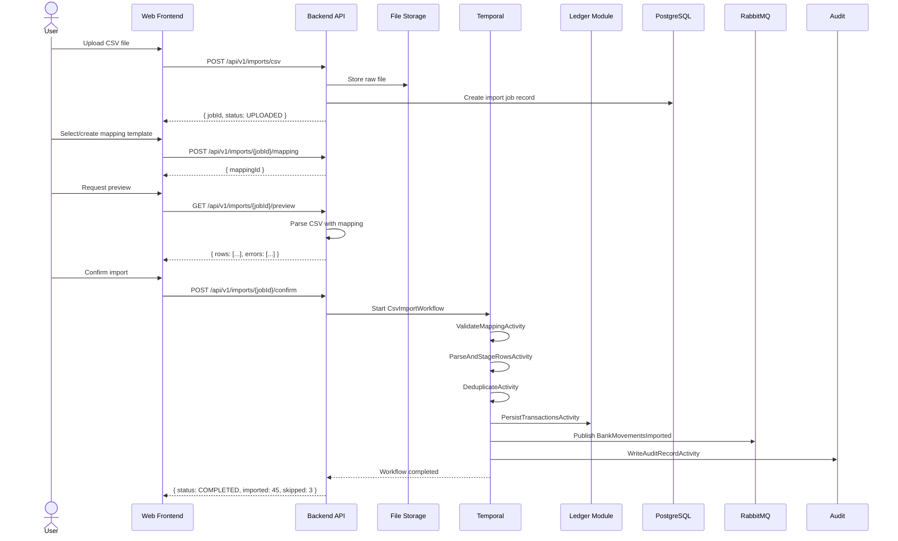
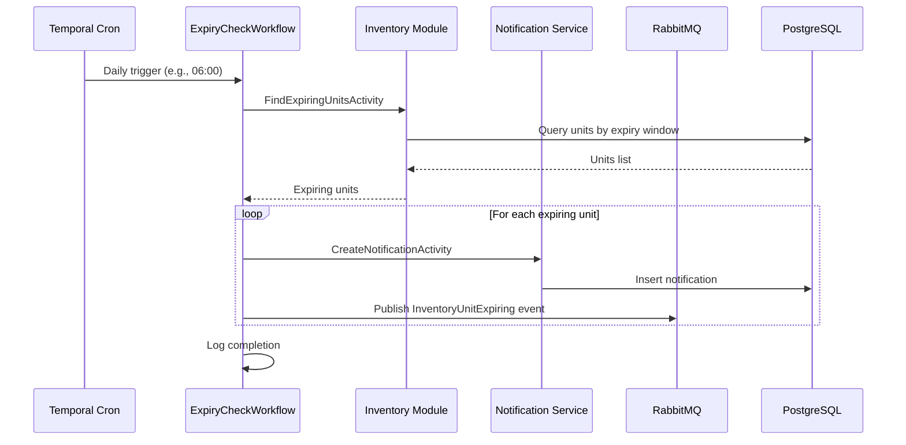
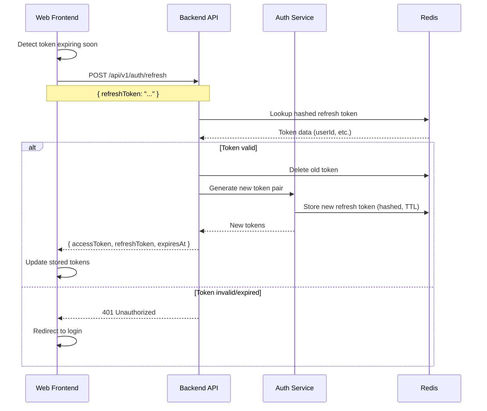
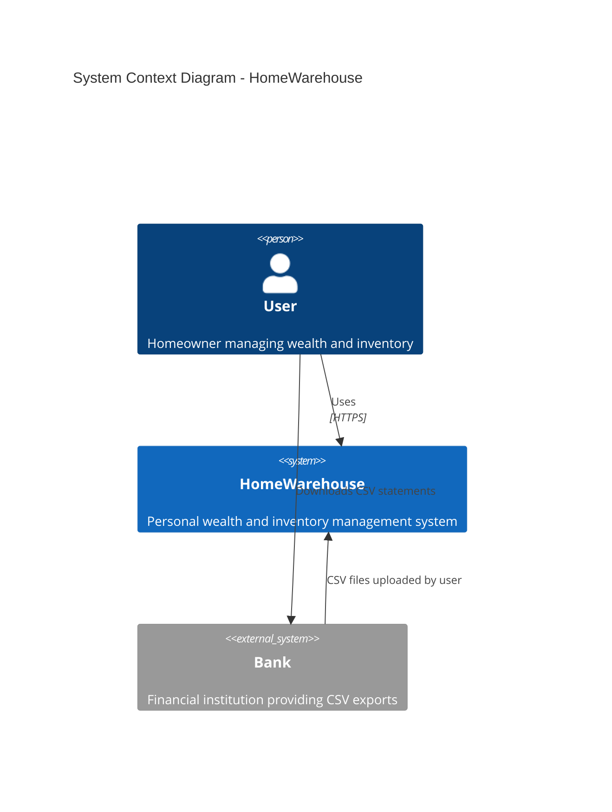

# HomeWarehouse - Product Overview

## Purpose

HomeWarehouse is a secure personal system for managing household wealth and home inventory. It provides comprehensive tracking of financial assets/liabilities with full accounting ledger capabilities, alongside detailed home inventory management with per-unit location tracking and expiry alerts.

## Scope

### In Scope

- Personal wealth management with dual model (ledger accounting + net-worth balance)
- Asset tracking across multiple categories (bank accounts, investments, property, etc.)
- Financial transaction recording with categorization and counterparty tracking
- Bank statement CSV import with customizable mapping templates
- Home inventory management with hierarchical location support
- Per-unit tracking for inventory items (not just item types)
- Perishable item management with expiry date tracking and alerts
- In-app notification system for expiry and other alerts
- Role-based access control with explicit permissions
- Comprehensive audit logging for all sensitive operations
- Data export capabilities (CSV/JSON)
- Web-based user interface (React + TypeScript)

### Out of Scope (v1)

- Multi-user/multi-household support (single-user assumed for v1)
- Automatic bank account synchronization (future automation)
- Real-time market data for investments (manual valuation only)
- External notification channels (email, Telegram) - extension points only
- Mobile applications (API designed to support future mobile apps)
- Barcode/QR code scanning for inventory
- Shopping list generation from inventory
- Recipe integration
- Shared household/family access controls

## Non-Goals

- This is NOT a commercial product; it is for personal/home use only
- This is NOT a multi-tenant SaaS application
- This does NOT replace professional accounting software for business use
- This does NOT provide financial advice or analysis beyond basic net-worth tracking
- This does NOT integrate with external financial institutions automatically

## Glossary

| Term | Definition |
|------|------------|
| Asset | Something of value owned (bank accounts, investments, property, vehicles, inventory value) |
| Liability | Debts or obligations owed (loans, mortgages, credit card balances) |
| Net Worth | Total assets minus total liabilities at a point in time |
| Ledger | A chronological record of financial transactions |
| Transaction | A single financial event (income, expense, or transfer) |
| Valuation | The assessed value of an asset at a specific point in time |
| Inventory Item | A catalog entry describing a type of product/item (e.g., "Canned Tomatoes 400g") |
| Inventory Unit | A specific physical instance of an inventory item with its own location and expiry |
| Location | A hierarchical place where inventory units are stored (e.g., "Kitchen > Pantry > Shelf 2") |
| Perishable | An inventory item that has a limited shelf life and expiration date |
| Best-Before Date | Recommended consumption date; item may still be usable after |
| Expiration Date | Date after which item should not be consumed |
| Purchase Registration | Combined workflow that records both ledger expense and inventory addition |
| RBAC | Role-Based Access Control - permissions granted through role assignments |
| Audit Log | Immutable record of who did what, when, to which entity |
| Workflow | A durable, orchestrated sequence of activities (managed by Temporal) |
| Domain Event | A significant occurrence in the domain published for interested consumers |
| Idempotency Key | A unique identifier ensuring an operation is processed exactly once |
| Correlation ID | An identifier linking related operations across system boundaries |

## User Stories

### Authentication & Authorization

| ID | Story | Priority |
|----|-------|----------|
| US-A01 | As a user, I can log in with username and password to access the system | Must |
| US-A02 | As a user, my session automatically refreshes so I stay logged in while active | Must |
| US-A03 | As a user, I can log out to end my session securely | Must |
| US-A04 | As an admin, I can manage roles and assign permissions to users | Must |

### Wealth Management - Accounts & Transactions

| ID | Story | Priority |
|----|-------|----------|
| US-W01 | As a user, I can create and manage financial accounts (checking, savings, credit cards, etc.) | Must |
| US-W02 | As a user, I can record transactions (income, expenses, transfers) with categories | Must |
| US-W03 | As a user, I can view a list of transactions with filtering and pagination | Must |
| US-W04 | As a user, I can edit or delete transactions I previously recorded | Must |
| US-W05 | As a user, I can categorize transactions for reporting purposes | Should |

### Wealth Management - Assets & Net Worth

| ID | Story | Priority |
|----|-------|----------|
| US-W10 | As a user, I can register assets across all supported categories | Must |
| US-W11 | As a user, I can record periodic valuations for my assets | Must |
| US-W12 | As a user, I can view my current net worth (total assets - total liabilities) | Must |
| US-W13 | As a user, I can see net worth history over time | Should |
| US-W14 | As a user, I can see asset allocation breakdown by category | Should |

### Wealth Management - Import & Export

| ID | Story | Priority |
|----|-------|----------|
| US-W20 | As a user, I can upload a CSV file from my bank to import transactions | Must |
| US-W21 | As a user, I can create and save mapping templates for different bank CSV formats | Must |
| US-W22 | As a user, I can preview imported data before confirming the import | Must |
| US-W23 | As a user, I can export my transactions to CSV/JSON | Must |
| US-W24 | As a user, duplicate transactions are detected and prevented during import | Must |

### Home Inventory - Items & Units

| ID | Story | Priority |
|----|-------|----------|
| US-I01 | As a user, I can create inventory item types (catalog entries) | Must |
| US-I02 | As a user, I can add units of an item with specific location and expiry info | Must |
| US-I03 | As a user, I can quickly add multiple units of the same item | Must |
| US-I04 | As a user, I can consume (decrement) units when I use them | Must |
| US-I05 | As a user, I can move a unit from one location to another | Must |
| US-I06 | As a user, I can view inventory organized by location | Must |

### Home Inventory - Locations

| ID | Story | Priority |
|----|-------|----------|
| US-I10 | As a user, I can create hierarchical storage locations | Must |
| US-I11 | As a user, I can view the contents of a specific location | Must |
| US-I12 | As a user, I can rename or reorganize location hierarchy | Should |

### Home Inventory - Expiry & Alerts

| ID | Story | Priority |
|----|-------|----------|
| US-I20 | As a user, I receive notifications for items nearing expiration | Must |
| US-I21 | As a user, I receive notifications for expired items | Must |
| US-I22 | As a user, I can see a list of items expiring soon on my dashboard | Must |
| US-I23 | As a user, I can configure how many days in advance to be warned about expiry | Should |

### Purchase Registration (Cross-Domain)

| ID | Story | Priority |
|----|-------|----------|
| US-P01 | As a user, I can register a purchase that creates both ledger expense and inventory units | Must |
| US-P02 | As a user, the purchase registration is atomic (both succeed or both fail) | Must |

### Audit & Admin

| ID | Story | Priority |
|----|-------|----------|
| US-AU01 | As an admin, I can view audit logs of all system changes | Must |
| US-AU02 | As an admin, I can filter audit logs by user, entity type, date range, action | Must |
| US-AU03 | As an admin, all IAM changes are audited automatically | Must |

### Dashboard

| ID | Story | Priority |
|----|-------|----------|
| US-D01 | As a user, I see a dashboard with net worth summary | Must |
| US-D02 | As a user, I see monthly cashflow (income vs expenses) on the dashboard | Should |
| US-D03 | As a user, I see expiring items summary on the dashboard | Must |
| US-D04 | As a user, I see recent notifications on the dashboard | Must |

## Key Flows

### Flow 1: User Login

### Flow 2: Purchase Registration

### Flow 3: CSV Import

### Flow 4: Expiry Check Process

### Flow 5: Token Refresh

## System Context

## Quality Attributes

| Attribute | Requirement | Rationale |
|-----------|-------------|-----------|
| Security | Must meet OWASP ASVS Level 2 | Financial and personal data requires strong protection |
| Reliability | 99% availability for LAN access | Personal use tolerates brief maintenance windows |
| Auditability | All mutations logged | Financial data requires complete audit trail |
| Maintainability | Modular architecture | Enable future microservices split and feature additions |
| Usability | Responsive web UI | Quick actions for daily inventory tasks |

## Constraints

| Constraint | Description |
|------------|-------------|
| Deployment | Home Kubernetes cluster, LAN-only access |
| Technology | Java Spring Boot backend, React TypeScript frontend |
| Database | PostgreSQL for persistence |
| Infrastructure | Must be reproducible via Terraform + Helm |
| Build System | Gradle multi-module with Kotlin DSL |
| Security | No secrets in repository |

## Assumptions

1. Single-user system (or small trusted family with shared credentials for v1)
2. User has basic technical knowledge to operate Kubernetes cluster
3. LAN provides a trust boundary but still requires full authN/authZ
4. Bank CSV formats vary; user must create mapping templates per bank
5. Manual asset valuations are acceptable for v1 (no real-time market data)
6. Internet connectivity for the cluster itself is not required after initial deployment

## Dependencies

| Dependency | Purpose | Version Strategy |
|------------|---------|------------------|
| PostgreSQL | Primary data store | Latest stable LTS |
| Redis | Cache, session store, token storage | Latest stable |
| RabbitMQ | Event messaging | Latest stable |
| Temporal | Workflow orchestration | Latest stable |
| Kubernetes | Container orchestration | Home cluster version |

## Related Documents

- [Architecture](../architecture/01-architecture.md) - System architecture and design
- [Security](../security/02-security.md) - Security model and requirements
- [Data Model](../database/03-data-model.md) - Database schema design
- [API](../api/04-api.md) - REST API specification
- [Backlog](../backlog/09-backlog.md) - Implementation plan and priorities
