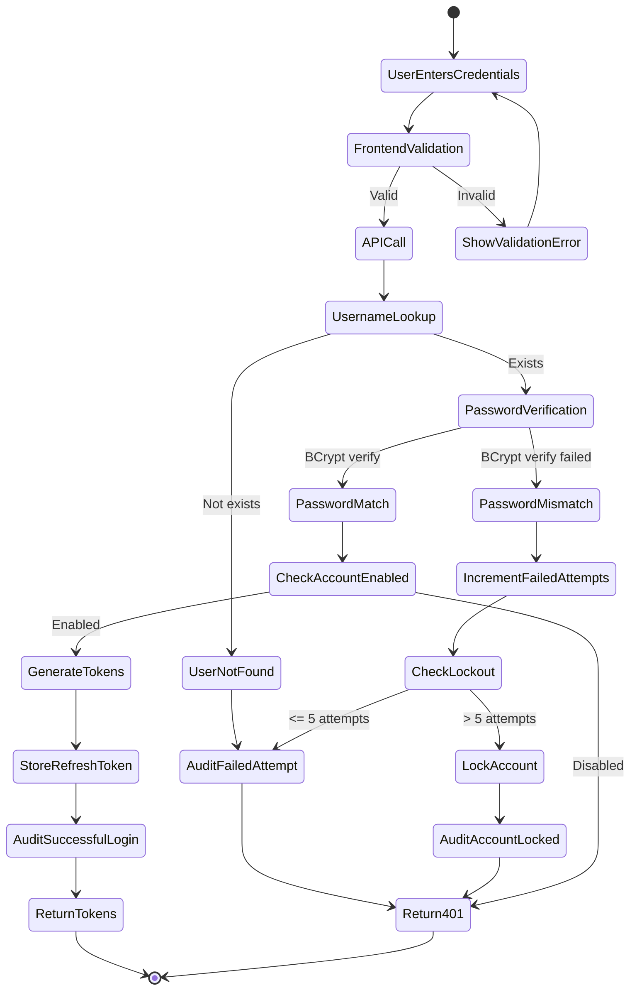

# Process: User Authentication

## Process Overview

| Attribute | Value |
|-----------|-------|
| Process ID | PROC-AUTH-001 |
| Process Name | User Authentication |
| Domain | Identity & Access Management |
| Trigger | User initiates login |
| Frequency | On-demand |
| Participants | User, Frontend, Backend API, Redis, PostgreSQL |

## Process Goal

Authenticate a user with credentials and provide secure JWT tokens for subsequent API access.

## Detailed Process Flow



## Step-by-Step Process

### Step 1: User Enters Credentials

**Actor:** User
**Action:** Enters username and password in login form

**Frontend Validation:**
```typescript
const loginSchema = z.object({
  username: z.string()
    .min(3, 'Username must be at least 3 characters')
    .max(100, 'Username too long'),
  password: z.string()
    .min(8, 'Password must be at least 8 characters')
});

// Validation before API call
const validationResult = loginSchema.safeParse(formData);
if (!validationResult.success) {
  // Show validation errors
  return;
}
```

**Inputs:**
- `username`: string (3-100 characters)
- `password`: string (8+ characters)

**Validation Rules:**
| Field | Rule | Error Message |
|-------|------|---------------|
| username | Required, 3-100 chars | Username must be at least 3 characters |
| password | Required, 8+ chars | Password must be at least 8 characters |

---

### Step 2: API Request

**Actor:** Frontend
**Action:** POST request to `/api/v1/auth/login`

**HTTP Request:**
```http
POST /api/v1/auth/login HTTP/1.1
Host: homewarehouse.local
Content-Type: application/json

{
  "username": "john.doe",
  "password": "SecureP@ssw0rd"
}
```

**Rate Limiting:**
- 5 requests per minute per IP address
- Returns `429 Too Many Requests` if exceeded

---

### Step 3: Username Lookup

**Actor:** Backend (AuthenticationService)
**Action:** Query database for user by username

**Database Query:**
```sql
SELECT
  id,
  username,
  email,
  password_hash,
  enabled,
  failed_login_attempts,
  locked_until
FROM iam_users
WHERE username = ?
  AND deleted_at IS NULL;
```

**Decision Points:**

#### 3.1: User Not Found
```java
if (userOptional.isEmpty()) {
    auditService.recordFailedLogin(username, ipAddress, "USER_NOT_FOUND");

    // Generic error message (don't reveal if user exists)
    throw new InvalidCredentialsException("Invalid username or password");
}
```

**Audit Record:**
```json
{
  "action": "LOGIN_FAILED",
  "username": "john.doe",
  "reason": "USER_NOT_FOUND",
  "ipAddress": "192.168.1.100",
  "occurredAt": "2024-01-15T10:30:00Z"
}
```

#### 3.2: Account Locked
```java
User user = userOptional.get();

if (user.getLockedUntil() != null &&
    user.getLockedUntil().isAfter(Instant.now())) {

    auditService.recordFailedLogin(user.getId(), ipAddress, "ACCOUNT_LOCKED");

    long minutesRemaining = Duration.between(
        Instant.now(),
        user.getLockedUntil()
    ).toMinutes();

    throw new AccountLockedException(
        String.format("Account locked for %d more minutes", minutesRemaining)
    );
}
```

---

### Step 4: Password Verification

**Actor:** Backend (AuthenticationService)
**Action:** Verify password using BCrypt

**Password Verification:**
```java
boolean passwordMatches = passwordEncoder.matches(
    loginRequest.getPassword(),
    user.getPasswordHash()
);

if (!passwordMatches) {
    handleFailedLoginAttempt(user, ipAddress);
    throw new InvalidCredentialsException("Invalid username or password");
}
```

**Failed Attempt Handling:**
```java
private void handleFailedLoginAttempt(User user, String ipAddress) {
    int newAttemptCount = user.incrementFailedLoginAttempts();

    if (newAttemptCount >= 5) {
        Instant lockUntil = Instant.now().plus(Duration.ofMinutes(15));
        user.lockAccount(lockUntil);

        auditService.recordEvent(
            user.getId(),
            "ACCOUNT_LOCKED",
            Map.of(
                "reason", "EXCESSIVE_FAILED_ATTEMPTS",
                "attemptCount", newAttemptCount,
                "lockedUntil", lockUntil
            )
        );
    }

    userRepository.save(user);

    auditService.recordFailedLogin(
        user.getId(),
        ipAddress,
        "INVALID_PASSWORD"
    );
}
```

---

### Step 5: Account Status Check

**Actor:** Backend
**Action:** Verify account is enabled

```java
if (!user.isEnabled()) {
    auditService.recordFailedLogin(
        user.getId(),
        ipAddress,
        "ACCOUNT_DISABLED"
    );

    throw new AccountDisabledException("Account has been disabled");
}
```

---

### Step 6: Generate JWT Tokens

**Actor:** Backend (TokenService)
**Action:** Generate access and refresh tokens

**Access Token Generation:**
```java
public String generateAccessToken(User user, List<String> permissions) {
    Instant now = Instant.now();
    Instant expiration = now.plus(Duration.ofMinutes(15));

    return JWT.create()
        .withIssuer("homewarehouse")
        .withAudience("homewarehouse-api")
        .withSubject(user.getId().toString())
        .withIssuedAt(Date.from(now))
        .withExpiresAt(Date.from(expiration))
        .withNotBefore(Date.from(now))
        .withJWTId(UUID.randomUUID().toString())
        .withClaim("roles", user.getRoles().stream()
            .map(Role::getName)
            .collect(Collectors.toList()))
        .withClaim("permissions", permissions)
        .sign(Algorithm.RSA256(publicKey, privateKey));
}
```

**Refresh Token Generation:**
```java
public RefreshToken generateRefreshToken(User user) {
    String tokenValue = generateSecureRandomToken(); // 256-bit random
    String tokenHash = hashToken(tokenValue); // SHA-256

    Instant expiration = Instant.now().plus(Duration.ofDays(7));

    RefreshToken refreshToken = new RefreshToken(
        tokenHash,
        user.getId(),
        expiration
    );

    return refreshToken;
}

private String generateSecureRandomToken() {
    byte[] randomBytes = new byte[32];
    secureRandom.nextBytes(randomBytes);
    return Base64.getUrlEncoder().withoutPadding()
        .encodeToString(randomBytes);
}

private String hashToken(String token) {
    try {
        MessageDigest digest = MessageDigest.getInstance("SHA-256");
        byte[] hash = digest.digest(token.getBytes(StandardCharsets.UTF_8));
        return Base64.getEncoder().encodeToString(hash);
    } catch (NoSuchAlgorithmException e) {
        throw new RuntimeException("SHA-256 not available", e);
    }
}
```

---

### Step 7: Store Refresh Token in Redis

**Actor:** Backend (TokenService)
**Action:** Store hashed refresh token with TTL

**Redis Storage:**
```java
public void storeRefreshToken(RefreshToken refreshToken) {
    String key = "refresh_token:" + refreshToken.getTokenHash();

    Map<String, String> tokenData = Map.of(
        "userId", refreshToken.getUserId().toString(),
        "createdAt", Instant.now().toString(),
        "expiresAt", refreshToken.getExpiresAt().toString()
    );

    // Store with TTL matching token expiration
    long ttlSeconds = Duration.between(
        Instant.now(),
        refreshToken.getExpiresAt()
    ).getSeconds();

    redisTemplate.opsForHash().putAll(key, tokenData);
    redisTemplate.expire(key, Duration.ofSeconds(ttlSeconds));
}
```

**Redis Data Structure:**
```
Key: "refresh_token:hashed_token_value"
Type: Hash
TTL: 604800 seconds (7 days)
Fields:
  - userId: "uuid"
  - createdAt: "ISO-8601 timestamp"
  - expiresAt: "ISO-8601 timestamp"
```

---

### Step 8: Reset Failed Login Attempts

**Actor:** Backend
**Action:** Clear failed login counter on successful login

```java
if (user.getFailedLoginAttempts() > 0 || user.getLockedUntil() != null) {
    user.resetFailedLoginAttempts();
    user.unlock();
    userRepository.save(user);
}
```

---

### Step 9: Audit Successful Login

**Actor:** Backend (AuditService)
**Action:** Record successful login event

**Audit Record:**
```java
auditService.recordEvent(
    user.getId(),
    "LOGIN_SUCCESS",
    "iam_users",
    user.getId(),
    null, // no before state
    null, // no after state
    ipAddress,
    userAgent,
    null, // no correlation ID for login
    Map.of(
        "loginMethod", "PASSWORD",
        "sessionDuration", "15 minutes"
    )
);
```

**Audit Log Entry:**
```json
{
  "id": "uuid",
  "userId": "user-uuid",
  "action": "LOGIN_SUCCESS",
  "entityType": "iam_users",
  "entityId": "user-uuid",
  "ipAddress": "192.168.1.100",
  "userAgent": "Mozilla/5.0...",
  "occurredAt": "2024-01-15T10:30:00Z",
  "metadata": {
    "loginMethod": "PASSWORD",
    "sessionDuration": "15 minutes"
  }
}
```

---

### Step 10: Return Tokens to Client

**Actor:** Backend
**Action:** Return auth response

**HTTP Response:**
```http
HTTP/1.1 200 OK
Content-Type: application/json

{
  "accessToken": "eyJhbGciOiJSUzI1NiIsInR5cCI6IkpXVCJ9...",
  "refreshToken": "random-secure-token-value",
  "expiresAt": "2024-01-15T10:45:00Z"
}
```

**Response Contract:**
- `accessToken`: JWT with 15-minute expiration
- `refreshToken`: Opaque token for refresh flow
- `expiresAt`: ISO-8601 timestamp of access token expiration

**IMPORTANT:** No user details, roles, or permissions in response. These are in the JWT claims.

---

### Step 11: Frontend Token Storage

**Actor:** Frontend
**Action:** Store tokens in memory

```typescript
// Store in Zustand store (in-memory)
const { accessToken, refreshToken, expiresAt } = response.data;

useAuthStore.getState().setTokens({
  accessToken,
  refreshToken,
  expiresAt
});

// DO NOT store in localStorage or sessionStorage
// Tokens live only in memory for security
```

---

## Error Scenarios

### ES-1: Invalid Username

**Condition:** Username doesn't exist in database

**Response:**
```json
{
  "error": {
    "code": "INVALID_CREDENTIALS",
    "message": "Invalid username or password",
    "correlationId": "uuid"
  }
}
```

**HTTP Status:** 401 Unauthorized

**Notes:** Generic message doesn't reveal if username exists (security)

---

### ES-2: Invalid Password

**Condition:** Password doesn't match stored hash

**Side Effects:**
- Increment failed login attempts
- Lock account if >= 5 attempts
- Audit failed attempt

**Response:** Same as ES-1 (generic message)

---

### ES-3: Account Locked

**Condition:** Too many failed attempts, account temporarily locked

**Response:**
```json
{
  "error": {
    "code": "ACCOUNT_LOCKED",
    "message": "Account locked due to too many failed attempts. Try again in 14 minutes.",
    "correlationId": "uuid"
  }
}
```

**HTTP Status:** 401 Unauthorized

**Lockout Duration:** 15 minutes

---

### ES-4: Account Disabled

**Condition:** Account administratively disabled

**Response:**
```json
{
  "error": {
    "code": "ACCOUNT_DISABLED",
    "message": "This account has been disabled. Contact support.",
    "correlationId": "uuid"
  }
}
```

**HTTP Status:** 401 Unauthorized

---

### ES-5: Rate Limit Exceeded

**Condition:** > 5 login attempts per minute from same IP

**Response:**
```json
{
  "error": {
    "code": "RATE_LIMITED",
    "message": "Too many login attempts. Please wait before trying again.",
    "correlationId": "uuid"
  }
}
```

**HTTP Status:** 429 Too Many Requests

**Retry-After Header:** 60 seconds

---

## Security Considerations

### Password Storage

| Aspect | Implementation |
|--------|----------------|
| Algorithm | BCrypt |
| Work Factor | 12 (2^12 = 4096 rounds) |
| Salt | Automatically generated per password |
| Pepper | Optional (future enhancement) |

### Timing Attack Prevention

```java
// Use constant-time comparison for password verification
// BCrypt.checkpw already does this, but for reference:

// WRONG: Can leak information via timing
if (hash.equals(stored)) { ... }

// CORRECT: Constant-time comparison
if (MessageDigest.isEqual(hash.getBytes(), stored.getBytes())) { ... }
```

### Brute Force Protection

| Mechanism | Configuration |
|-----------|---------------|
| Failed attempt tracking | Stored in database per user |
| Lockout threshold | 5 failed attempts |
| Lockout duration | 15 minutes |
| Rate limiting | 5 requests/minute per IP |

### Token Security

| Token Type | Security Measures |
|------------|-------------------|
| Access Token | Short-lived (15 min), signed with RS256 |
| Refresh Token | Stored hashed, 7-day TTL, single-use with rotation |

---

## Performance Considerations

### Database Optimization

```sql
-- Index on username for fast lookup
CREATE INDEX idx_iam_users_username ON iam_users(username)
WHERE deleted_at IS NULL;

-- Index on locked_until for cleanup queries
CREATE INDEX idx_iam_users_locked ON iam_users(locked_until)
WHERE locked_until IS NOT NULL;
```

### Redis Performance

- **Connection Pooling:** Use Lettuce connection pool (Spring default)
- **Pipeline:** Batch operations when storing multiple tokens
- **TTL:** Let Redis handle expiration automatically

### Expected Latency

| Operation | Target | Notes |
|-----------|--------|-------|
| Username lookup | < 50ms | With index |
| Password verification | 100-200ms | BCrypt work factor 12 |
| Token generation | < 10ms | RSA signing |
| Redis storage | < 5ms | Local network |
| **Total** | **< 300ms** | End-to-end |

---

## Testing Checklist

### Unit Tests

- [ ] Password verification with correct password
- [ ] Password verification with incorrect password
- [ ] Failed attempt incrementing
- [ ] Account locking after 5 attempts
- [ ] Account unlocking after timeout
- [ ] Token generation with correct claims
- [ ] Token expiration calculation

### Integration Tests

- [ ] Full login flow with valid credentials
- [ ] Login with non-existent user
- [ ] Login with disabled account
- [ ] Login with locked account
- [ ] Rate limiting enforcement
- [ ] Audit logging for all scenarios

### Security Tests

- [ ] Timing attack resistance (password verification)
- [ ] Token signature validation
- [ ] Token expiration enforcement
- [ ] Refresh token single-use
- [ ] No user enumeration via error messages

---

## Monitoring & Alerts

### Metrics to Track

```java
@Timed(value = "auth.login.duration", description = "Login duration")
@Counted(value = "auth.login.attempts", description = "Login attempts")
public AuthResponse login(LoginRequest request) {
    // ...
}
```

### Alerts

| Alert | Condition | Severity |
|-------|-----------|----------|
| High Failed Login Rate | > 100/minute globally | Warning |
| Account Lockout Spike | > 10/minute | Warning |
| Slow Login Response | p95 > 500ms | Warning |
| JWT Signing Failure | Any occurrence | Critical |

---

## Related Processes

- [PROC-AUTH-002: Token Refresh](./02-token-refresh-process.md)
- [PROC-AUTH-003: Logout](./03-logout-process.md)
- [PROC-AUDIT-001: Audit Logging](./audit-logging-process.md)

## References

- [Security Documentation](../security/02-security.md)
- [API Specification](../api/04-api.md#authentication-endpoints)
- [Architecture](../architecture/01-architecture.md)
