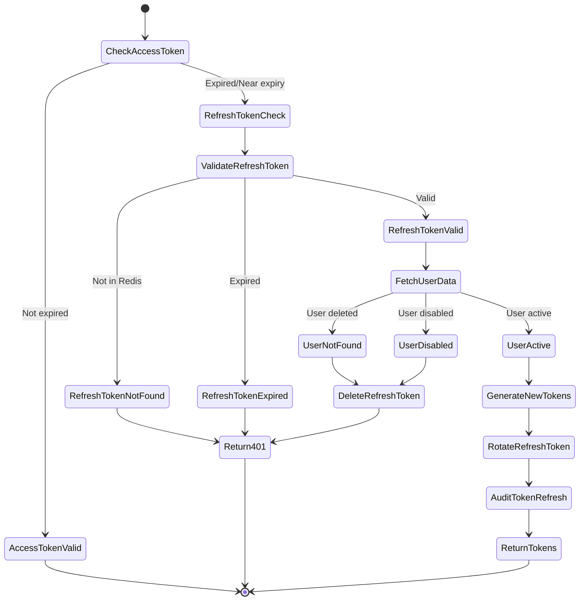

# Process: Token Refresh

## Process Overview

| Attribute | Value |
|-----------|-------|
| Process ID | PROC-AUTH-002 |
| Process Name | Token Refresh |
| Domain | Identity & Access Management |
| Trigger | Access token expiration or near-expiration |
| Frequency | On-demand (typically every 15 minutes) |
| Participants | Frontend, Backend API, Redis |

## Process Goal

Obtain a new access token using a valid refresh token without requiring the user to re-authenticate with credentials.

## Detailed Process Flow



## Step-by-Step Process

### Step 1: Detect Token Expiration

**Actor:** Frontend (Axios Interceptor)

**Trigger:** 401 Unauthorized response from API

**Detection Logic:**
```typescript
// src/api/client.ts
apiClient.interceptors.response.use(
  (response) => response,
  async (error: AxiosError) => {
    const originalRequest = error.config as InternalAxiosRequestConfig & { _retry?: boolean };

    // Detect 401 and ensure we haven't already tried to refresh
    if (error.response?.status === 401 && !originalRequest._retry) {
      originalRequest._retry = true;

      try {
        // Attempt token refresh
        const authStore = useAuthStore.getState();
        const refreshToken = authStore.refreshToken;

        if (!refreshToken) {
          // No refresh token available, logout
          authStore.logout();
          window.location.href = '/auth/login';
          return Promise.reject(error);
        }

        // Proceed with refresh flow...
      } catch (refreshError) {
        // Refresh failed, logout user
        useAuthStore.getState().logout();
        window.location.href = '/auth/login';
        return Promise.reject(refreshError);
      }
    }

    return Promise.reject(error);
  }
);
```

**Alternative Trigger:** Proactive refresh before expiration

```typescript
// Check token expiration on app initialization
useEffect(() => {
  const checkTokenExpiration = () => {
    const { expiresAt, isAuthenticated, refreshToken } = useAuthStore.getState();

    if (!isAuthenticated || !refreshToken) {
      return;
    }

    const expirationTime = new Date(expiresAt).getTime();
    const currentTime = Date.now();
    const timeUntilExpiry = expirationTime - currentTime;

    // Refresh if less than 2 minutes remaining
    if (timeUntilExpiry < 2 * 60 * 1000) {
      performTokenRefresh();
    }
  };

  // Check on mount
  checkTokenExpiration();

  // Check every minute
  const interval = setInterval(checkTokenExpiration, 60 * 1000);

  return () => clearInterval(interval);
}, []);
```

---

### Step 2: API Request to Refresh Endpoint

**Actor:** Frontend

**Action:** POST request to `/api/v1/auth/refresh`

**HTTP Request:**
```http
POST /api/v1/auth/refresh HTTP/1.1
Host: homewarehouse.local
Content-Type: application/json

{
  "refreshToken": "AbCdEfGhIjKlMnOpQrStUvWxYz0123456789"
}
```

**Request Schema:**
```json
{
  "refreshToken": "string (43 characters, base64url encoded)"
}
```

**Rate Limiting:**
- 10 requests per minute per refresh token
- Returns `429 Too Many Requests` if exceeded

---

### Step 3: Validate Refresh Token Format

**Actor:** Backend (AuthenticationService)

**Action:** Validate token format before Redis lookup

**Validation Logic:**
```java
@Service
public class TokenRefreshService {

    private static final Pattern REFRESH_TOKEN_PATTERN =
        Pattern.compile("^[A-Za-z0-9_-]{43}$");

    public AuthResponse refreshToken(RefreshTokenRequest request) {
        String refreshToken = request.getRefreshToken();

        // Validate format
        if (refreshToken == null || !REFRESH_TOKEN_PATTERN.matcher(refreshToken).matches()) {
            auditService.recordEvent(
                null,
                "TOKEN_REFRESH_FAILED",
                Map.of("reason", "INVALID_TOKEN_FORMAT")
            );

            throw new InvalidTokenException("Invalid refresh token format");
        }

        // Hash token for Redis lookup
        String tokenHash = hashToken(refreshToken);

        // Continue with validation...
    }

    private String hashToken(String token) {
        try {
            MessageDigest digest = MessageDigest.getInstance("SHA-256");
            byte[] hash = digest.digest(token.getBytes(StandardCharsets.UTF_8));
            return Base64.getEncoder().encodeToString(hash);
        } catch (NoSuchAlgorithmException e) {
            throw new RuntimeException("SHA-256 not available", e);
        }
    }
}
```

---

### Step 4: Lookup Refresh Token in Redis

**Actor:** Backend (TokenService)

**Action:** Query Redis for token data

**Redis Lookup:**
```java
public Optional<RefreshTokenData> findRefreshToken(String tokenHash) {
    String key = "refresh_token:" + tokenHash;

    Map<Object, Object> tokenData = redisTemplate.opsForHash().entries(key);

    if (tokenData.isEmpty()) {
        return Optional.empty();
    }

    RefreshTokenData data = new RefreshTokenData(
        UUID.fromString((String) tokenData.get("userId")),
        Instant.parse((String) tokenData.get("createdAt")),
        Instant.parse((String) tokenData.get("expiresAt"))
    );

    return Optional.of(data);
}
```

**Decision Points:**

#### 4.1: Refresh Token Not Found

```java
Optional<RefreshTokenData> tokenData = tokenService.findRefreshToken(tokenHash);

if (tokenData.isEmpty()) {
    auditService.recordEvent(
        null,
        "TOKEN_REFRESH_FAILED",
        Map.of("reason", "TOKEN_NOT_FOUND")
    );

    throw new InvalidTokenException("Invalid or expired refresh token");
}
```

**Audit Record:**
```json
{
  "action": "TOKEN_REFRESH_FAILED",
  "reason": "TOKEN_NOT_FOUND",
  "ipAddress": "192.168.1.100",
  "occurredAt": "2024-01-15T10:30:00Z"
}
```

#### 4.2: Refresh Token Expired

```java
RefreshTokenData data = tokenData.get();

if (data.expiresAt().isBefore(Instant.now())) {
    // Delete expired token from Redis
    tokenService.deleteRefreshToken(tokenHash);

    auditService.recordEvent(
        data.userId(),
        "TOKEN_REFRESH_FAILED",
        Map.of("reason", "TOKEN_EXPIRED")
    );

    throw new ExpiredTokenException("Refresh token has expired");
}
```

---

### Step 5: Fetch User Data

**Actor:** Backend (UserRepository)

**Action:** Query database for user

**Database Query:**
```sql
SELECT
  id,
  username,
  email,
  enabled,
  deleted_at
FROM iam_users
WHERE id = ?;
```

**User Validation:**
```java
RefreshTokenData tokenData = /* from Redis */;
UUID userId = tokenData.userId();

Optional<User> userOptional = userRepository.findById(userId);

if (userOptional.isEmpty()) {
    // User was deleted, invalidate refresh token
    tokenService.deleteRefreshToken(tokenHash);

    auditService.recordEvent(
        userId,
        "TOKEN_REFRESH_FAILED",
        Map.of("reason", "USER_NOT_FOUND")
    );

    throw new UserNotFoundException("User no longer exists");
}

User user = userOptional.get();

if (!user.isEnabled()) {
    // User disabled, invalidate refresh token
    tokenService.deleteRefreshToken(tokenHash);

    auditService.recordEvent(
        userId,
        "TOKEN_REFRESH_FAILED",
        Map.of("reason", "USER_DISABLED")
    );

    throw new AccountDisabledException("Account has been disabled");
}
```

---

### Step 6: Generate New Access Token

**Actor:** Backend (TokenService)

**Action:** Create new JWT access token

**Token Generation:**
```java
public String generateAccessToken(User user) {
    Instant now = Instant.now();
    Instant expiration = now.plus(Duration.ofMinutes(15));

    // Fetch user permissions
    List<String> permissions = permissionService.getUserPermissions(user.getId());

    return JWT.create()
        .withIssuer("homewarehouse")
        .withAudience("homewarehouse-api")
        .withSubject(user.getId().toString())
        .withIssuedAt(Date.from(now))
        .withExpiresAt(Date.from(expiration))
        .withNotBefore(Date.from(now))
        .withJWTId(UUID.randomUUID().toString())
        .withClaim("username", user.getUsername())
        .withClaim("roles", user.getRoles().stream()
            .map(Role::getName)
            .collect(Collectors.toList()))
        .withClaim("permissions", permissions)
        .sign(Algorithm.RSA256(publicKey, privateKey));
}
```

**Token Claims:**
```json
{
  "iss": "homewarehouse",
  "aud": "homewarehouse-api",
  "sub": "user-uuid",
  "iat": 1705318200,
  "exp": 1705319100,
  "nbf": 1705318200,
  "jti": "unique-jwt-id",
  "username": "john.doe",
  "roles": ["USER", "ADMIN"],
  "permissions": ["transaction:create", "transaction:read", "transaction:update"]
}
```

---

### Step 7: Rotate Refresh Token

**Actor:** Backend (TokenService)

**Action:** Generate new refresh token and invalidate old one

**Token Rotation Strategy:**
```java
public RefreshTokenRotationResult rotateRefreshToken(
    String oldTokenHash,
    User user
) {
    // Generate new refresh token
    String newTokenValue = generateSecureRandomToken();
    String newTokenHash = hashToken(newTokenValue);

    Instant expiration = Instant.now().plus(Duration.ofDays(7));

    RefreshTokenData newTokenData = new RefreshTokenData(
        user.getId(),
        Instant.now(),
        expiration
    );

    // Store new token in Redis
    String newKey = "refresh_token:" + newTokenHash;
    Map<String, String> tokenMap = Map.of(
        "userId", user.getId().toString(),
        "createdAt", newTokenData.createdAt().toString(),
        "expiresAt", newTokenData.expiresAt().toString()
    );

    long ttlSeconds = Duration.between(Instant.now(), expiration).getSeconds();

    redisTemplate.opsForHash().putAll(newKey, tokenMap);
    redisTemplate.expire(newKey, Duration.ofSeconds(ttlSeconds));

    // Delete old token
    String oldKey = "refresh_token:" + oldTokenHash;
    redisTemplate.delete(oldKey);

    return new RefreshTokenRotationResult(newTokenValue, newTokenData);
}
```

**Why Rotate?**
- **Security**: Limits window of opportunity if token is compromised
- **Single-use**: Old token immediately invalid, prevents replay attacks
- **Audit Trail**: Can track token usage patterns

---

### Step 8: Audit Token Refresh

**Actor:** Backend (AuditService)

**Action:** Record successful token refresh

**Audit Record:**
```java
auditService.recordEvent(
    user.getId(),
    "TOKEN_REFRESHED",
    "iam_users",
    user.getId(),
    null, // no before state
    null, // no after state
    ipAddress,
    userAgent,
    null, // no correlation ID
    Map.of(
        "oldTokenCreatedAt", oldTokenData.createdAt().toString(),
        "newTokenExpiresAt", newTokenData.expiresAt().toString()
    )
);
```

**Audit Log Entry:**
```json
{
  "id": "audit-uuid",
  "userId": "user-uuid",
  "action": "TOKEN_REFRESHED",
  "entityType": "iam_users",
  "entityId": "user-uuid",
  "ipAddress": "192.168.1.100",
  "userAgent": "Mozilla/5.0...",
  "occurredAt": "2024-01-15T10:30:00Z",
  "metadata": {
    "oldTokenCreatedAt": "2024-01-15T10:15:00Z",
    "newTokenExpiresAt": "2024-01-22T10:30:00Z"
  }
}
```

---

### Step 9: Return New Tokens

**Actor:** Backend

**Action:** Return auth response with new tokens

**HTTP Response:**
```http
HTTP/1.1 200 OK
Content-Type: application/json

{
  "accessToken": "eyJhbGciOiJSUzI1NiIsInR5cCI6IkpXVCJ9...",
  "refreshToken": "NewRandomSecureTokenValue0123456789",
  "expiresAt": "2024-01-15T10:45:00Z"
}
```

**Response Contract:**
```typescript
interface AuthResponse {
  accessToken: string;      // New JWT with 15-minute expiration
  refreshToken: string;     // New refresh token (old one is now invalid)
  expiresAt: string;        // ISO-8601 timestamp of access token expiration
}
```

---

### Step 10: Update Frontend State

**Actor:** Frontend (AuthStore)

**Action:** Store new tokens

**State Update:**
```typescript
// After successful refresh
const response = await axios.post('/api/v1/auth/refresh', {
  refreshToken: currentRefreshToken,
});

const { accessToken, refreshToken, expiresAt } = response.data;

// Update auth store
useAuthStore.getState().setTokens({
  accessToken,
  refreshToken,
  expiresAt,
});

// Retry original request with new token
if (originalRequest.headers) {
  originalRequest.headers.Authorization = `Bearer ${accessToken}`;
}

return apiClient(originalRequest);
```

---

## Error Scenarios

### ES-1: Invalid Token Format

**Condition:** Refresh token doesn't match expected format

**Response:**
```json
{
  "error": {
    "code": "INVALID_TOKEN",
    "message": "Invalid refresh token format",
    "correlationId": "uuid"
  }
}
```

**HTTP Status:** 401 Unauthorized

**Frontend Behavior:** Logout user and redirect to login

---

### ES-2: Token Not Found

**Condition:** Refresh token not in Redis (never existed or already used)

**Response:**
```json
{
  "error": {
    "code": "INVALID_TOKEN",
    "message": "Invalid or expired refresh token",
    "correlationId": "uuid"
  }
}
```

**HTTP Status:** 401 Unauthorized

**Frontend Behavior:** Logout user and redirect to login

---

### ES-3: Token Expired

**Condition:** Refresh token TTL has expired

**Response:**
```json
{
  "error": {
    "code": "TOKEN_EXPIRED",
    "message": "Refresh token has expired. Please log in again.",
    "correlationId": "uuid"
  }
}
```

**HTTP Status:** 401 Unauthorized

**Frontend Behavior:** Logout user and redirect to login with message

---

### ES-4: User Not Found

**Condition:** User was deleted after token was issued

**Side Effects:**
- Delete refresh token from Redis
- Audit event recorded

**Response:**
```json
{
  "error": {
    "code": "USER_NOT_FOUND",
    "message": "User no longer exists",
    "correlationId": "uuid"
  }
}
```

**HTTP Status:** 401 Unauthorized

---

### ES-5: User Disabled

**Condition:** User account was disabled after token was issued

**Side Effects:**
- Delete refresh token from Redis
- Audit event recorded

**Response:**
```json
{
  "error": {
    "code": "ACCOUNT_DISABLED",
    "message": "Account has been disabled",
    "correlationId": "uuid"
  }
}
```

**HTTP Status:** 401 Unauthorized

---

### ES-6: Rate Limit Exceeded

**Condition:** > 10 refresh requests per minute

**Response:**
```json
{
  "error": {
    "code": "RATE_LIMITED",
    "message": "Too many token refresh attempts. Please wait before trying again.",
    "correlationId": "uuid"
  }
}
```

**HTTP Status:** 429 Too Many Requests

**Retry-After Header:** 60 seconds

---

## Security Considerations

### Token Rotation Benefits

| Security Property | How It Helps |
|-------------------|--------------|
| **Replay Attack Prevention** | Old refresh token immediately invalid after use |
| **Breach Containment** | Compromised token has limited lifetime |
| **Audit Trail** | Each refresh creates audit record |
| **Token Revocation** | Can invalidate refresh token family |

### Concurrent Refresh Handling

**Problem:** Multiple tabs/requests refreshing simultaneously

**Solution:** Implement token refresh lock in Redis

```java
public AuthResponse refreshTokenWithLock(String refreshToken) {
    String lockKey = "refresh_lock:" + hashToken(refreshToken);

    // Try to acquire lock
    Boolean lockAcquired = redisTemplate.opsForValue()
        .setIfAbsent(lockKey, "locked", Duration.ofSeconds(5));

    if (Boolean.FALSE.equals(lockAcquired)) {
        // Another request is already refreshing this token
        throw new TokenRefreshInProgressException(
            "Token refresh already in progress"
        );
    }

    try {
        // Perform refresh
        return refreshToken(refreshToken);
    } finally {
        // Release lock
        redisTemplate.delete(lockKey);
    }
}
```

### Refresh Token Families

**Purpose:** Detect token theft

**Implementation:**
```java
// Store token family ID in Redis
Map<String, String> tokenData = Map.of(
    "userId", userId,
    "familyId", familyId,  // Track token family
    "generation", generation.toString(),  // Track rotation count
    "createdAt", createdAt,
    "expiresAt", expiresAt
);

// On refresh, check for replay attacks
if (oldGeneration != expectedGeneration) {
    // Token was already used - possible theft
    // Revoke entire token family
    revokeTokenFamily(familyId);

    auditService.recordSecurityEvent(
        userId,
        "REFRESH_TOKEN_REPLAY_DETECTED",
        Map.of("familyId", familyId)
    );

    throw new SecurityException("Token replay detected");
}
```

---

## Performance Considerations

### Redis Optimization

**Expected Latency:**
| Operation | Target | Notes |
|-----------|--------|-------|
| Redis lookup | < 5ms | Local network |
| Token generation | < 10ms | RSA signing |
| Database query | < 50ms | With index |
| **Total** | **< 100ms** | End-to-end |

**Connection Pooling:**
```java
@Configuration
public class RedisConfig {

    @Bean
    public LettuceConnectionFactory redisConnectionFactory() {
        GenericObjectPoolConfig<?> poolConfig = new GenericObjectPoolConfig<>();
        poolConfig.setMaxTotal(20);
        poolConfig.setMaxIdle(10);
        poolConfig.setMinIdle(5);

        LettuceClientConfiguration clientConfig = LettucePoolingClientConfiguration.builder()
            .poolConfig(poolConfig)
            .commandTimeout(Duration.ofMillis(500))
            .build();

        RedisStandaloneConfiguration serverConfig = new RedisStandaloneConfiguration();
        serverConfig.setHostName("localhost");
        serverConfig.setPort(6379);

        return new LettuceConnectionFactory(serverConfig, clientConfig);
    }
}
```

---

## Testing Checklist

### Unit Tests

- [ ] Generate new access token with correct claims
- [ ] Rotate refresh token (new token created, old deleted)
- [ ] Hash refresh token consistently
- [ ] Validate token format (reject invalid formats)
- [ ] Handle expired refresh tokens
- [ ] Handle non-existent tokens

### Integration Tests

- [ ] Full refresh flow with valid token
- [ ] Refresh with expired token
- [ ] Refresh with invalid token
- [ ] Refresh for deleted user
- [ ] Refresh for disabled user
- [ ] Concurrent refresh requests (lock behavior)
- [ ] Rate limiting enforcement
- [ ] Audit logging for all scenarios

### Security Tests

- [ ] Old refresh token invalid after rotation
- [ ] Cannot reuse refresh token
- [ ] Token replay detection
- [ ] Token family revocation
- [ ] Access token signature validation

---

## Monitoring & Alerts

### Metrics to Track

```java
@Service
public class TokenRefreshService {

    @Timed(value = "auth.token.refresh.duration", description = "Token refresh duration")
    @Counted(value = "auth.token.refresh.attempts", description = "Token refresh attempts")
    public AuthResponse refreshToken(RefreshTokenRequest request) {
        // Track success/failure
        if (success) {
            meterRegistry.counter("auth.token.refresh.success").increment();
        } else {
            meterRegistry.counter("auth.token.refresh.failure",
                "reason", failureReason
            ).increment();
        }

        // ...
    }
}
```

### Alerts

| Alert | Condition | Severity |
|-------|-----------|----------|
| High Refresh Failure Rate | > 10% failures | Warning |
| Token Replay Detected | Any occurrence | Critical |
| Slow Refresh Response | p95 > 200ms | Warning |
| Redis Connection Issues | Any error | Critical |

---

## Related Processes

- [PROC-AUTH-001: User Authentication](./01-user-authentication-process.md)
- [PROC-AUTH-003: Logout](./03-logout-process.md)
- [PROC-AUDIT-001: Audit Logging](./audit-logging-process.md)

## References

- [Security Documentation](../security/02-security.md)
- [API Specification](../api/04-api.md#authentication-endpoints)
- [Architecture](../architecture/01-architecture.md)
