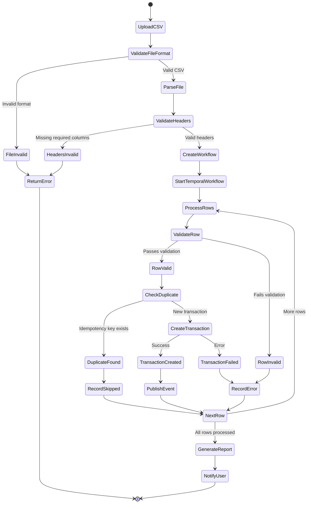

# Process: CSV Import (Transactions)

## Process Overview

| Attribute | Value |
|-----------|-------|
| Process ID | PROC-IMPORT-001 |
| Process Name | CSV Transaction Import |
| Domain | Ledger / Data Import |
| Trigger | User uploads CSV file |
| Frequency | On-demand |
| Participants | User, Frontend, Backend API, Temporal, RabbitMQ, PostgreSQL |

## Process Goal

Import multiple financial transactions from a CSV file into the system with validation, deduplication, and comprehensive error handling.

## Detailed Process Flow



## Step-by-Step Process

### Step 1: Upload CSV File

**Actor:** User (Frontend)

**Action:** User selects and uploads CSV file through web interface

**Frontend Upload Component:**
```typescript
// src/features/import/components/CsvUploadForm.tsx
import { useUploadCsvMutation } from '../hooks/use-csv-import';

export function CsvUploadForm() {
  const uploadCsv = useUploadCsvMutation();

  const handleFileChange = async (event: React.ChangeEvent<HTMLInputElement>) => {
    const file = event.target.files?.[0];

    if (!file) return;

    // Validate file type
    if (!file.name.endsWith('.csv')) {
      toast.error('Please select a CSV file');
      return;
    }

    // Validate file size (max 10MB)
    if (file.size > 10 * 1024 * 1024) {
      toast.error('File size must be less than 10MB');
      return;
    }

    // Upload
    const formData = new FormData();
    formData.append('file', file);

    try {
      const result = await uploadCsv.mutateAsync(formData);
      toast.success(`Import started: ${result.workflowId}`);
    } catch (error) {
      toast.error('Failed to upload file');
    }
  };

  return (
    <div>
      <input
        type="file"
        accept=".csv"
        onChange={handleFileChange}
        disabled={uploadCsv.isPending}
      />
      {uploadCsv.isPending && <Spinner />}
    </div>
  );
}
```

---

### Step 2: API Request

**Actor:** Frontend

**Action:** POST multipart request to `/api/v1/ledger/transactions/import`

**HTTP Request:**
```http
POST /api/v1/ledger/transactions/import HTTP/1.1
Host: homewarehouse.local
Authorization: Bearer <access_token>
Content-Type: multipart/form-data; boundary=----WebKitFormBoundary

------WebKitFormBoundary
Content-Disposition: form-data; name="file"; filename="transactions.csv"
Content-Type: text/csv

date,type,amount,currency,description,category,account
2024-01-15,EXPENSE,50.00,USD,Groceries,Food,checking
2024-01-16,INCOME,2000.00,USD,Salary,Income,checking
------WebKitFormBoundary--
```

**Expected CSV Format:**
| Column | Required | Type | Description |
|--------|----------|------|-------------|
| date | Yes | YYYY-MM-DD | Transaction date |
| type | Yes | INCOME/EXPENSE | Transaction type |
| amount | Yes | Decimal | Transaction amount (positive) |
| currency | Yes | 3-char code | Currency code (USD, EUR, etc.) |
| description | Yes | String | Transaction description |
| category | Yes | String | Category name |
| account | Yes | String | Account name |

---

### Step 3: Validate File Format

**Actor:** Backend (CsvImportController)

**Action:** Validate file structure and format

**Validation Logic:**
```java
@RestController
@RequestMapping("/api/v1/ledger/transactions")
public class CsvImportController {

    private static final long MAX_FILE_SIZE = 10 * 1024 * 1024; // 10MB
    private static final int MAX_ROWS = 10000;

    private final CsvImportService csvImportService;

    public CsvImportController(CsvImportService csvImportService) {
        this.csvImportService = csvImportService;
    }

    @PostMapping("/import")
    @PreAuthorize("hasAuthority('transaction:import')")
    public ResponseEntity<ImportResponse> importTransactions(
        @RequestParam("file") MultipartFile file,
        @AuthenticationPrincipal UserDetails currentUser
    ) {
        // Validate file
        validateFile(file);

        // Parse CSV
        List<CsvRow> rows = parseCsvFile(file);

        // Validate row count
        if (rows.size() > MAX_ROWS) {
            throw new IllegalArgumentException(
                "File contains too many rows. Maximum allowed: " + MAX_ROWS
            );
        }

        // Start import workflow
        String workflowId = csvImportService.startImport(
            rows,
            UUID.fromString(currentUser.getUsername())
        );

        ImportResponse response = new ImportResponse(
            workflowId,
            rows.size(),
            "Import started"
        );

        return ResponseEntity.accepted().body(response);
    }

    private void validateFile(MultipartFile file) {
        if (file.isEmpty()) {
            throw new IllegalArgumentException("File is empty");
        }

        if (file.getSize() > MAX_FILE_SIZE) {
            throw new IllegalArgumentException(
                "File size exceeds maximum allowed: " + (MAX_FILE_SIZE / 1024 / 1024) + "MB"
            );
        }

        String filename = file.getOriginalFilename();
        if (filename == null || !filename.endsWith(".csv")) {
            throw new IllegalArgumentException("File must be a CSV file");
        }

        String contentType = file.getContentType();
        if (contentType == null ||
            (!contentType.equals("text/csv") &&
             !contentType.equals("application/csv") &&
             !contentType.equals("text/plain"))) {
            throw new IllegalArgumentException("Invalid content type: " + contentType);
        }
    }

    private List<CsvRow> parseCsvFile(MultipartFile file) {
        try (Reader reader = new InputStreamReader(file.getInputStream(), StandardCharsets.UTF_8)) {
            CsvToBean<CsvRow> csvToBean = new CsvToBeanBuilder<CsvRow>(reader)
                .withType(CsvRow.class)
                .withIgnoreLeadingWhiteSpace(true)
                .withThrowExceptions(false)
                .build();

            List<CsvRow> rows = csvToBean.parse();

            // Check for parsing errors
            List<CsvException> exceptions = csvToBean.getCapturedExceptions();
            if (!exceptions.isEmpty()) {
                throw new CsvParsingException(
                    "CSV parsing errors: " + exceptions.size() + " rows failed"
                );
            }

            return rows;
        } catch (IOException e) {
            throw new RuntimeException("Failed to read CSV file", e);
        }
    }
}

// CSV Row DTO
public class CsvRow {
    @CsvBindByName(column = "date", required = true)
    private String date;

    @CsvBindByName(column = "type", required = true)
    private String type;

    @CsvBindByName(column = "amount", required = true)
    private String amount;

    @CsvBindByName(column = "currency", required = true)
    private String currency;

    @CsvBindByName(column = "description", required = true)
    private String description;

    @CsvBindByName(column = "category", required = true)
    private String category;

    @CsvBindByName(column = "account", required = true)
    private String account;

    // Getters and setters
}
```

---

### Step 4: Start Temporal Workflow

**Actor:** Backend (CsvImportService)

**Action:** Create and start Temporal workflow for async processing

**Workflow Start:**
```java
@Service
public class CsvImportService {

    private final WorkflowClient workflowClient;
    private final ImportRepository importRepository;

    public CsvImportService(
        WorkflowClient workflowClient,
        ImportRepository importRepository
    ) {
        this.workflowClient = workflowClient;
        this.importRepository = importRepository;
    }

    public String startImport(List<CsvRow> rows, UUID userId) {
        // Generate workflow ID
        String workflowId = "csv-import-" + UUID.randomUUID();

        // Create import record
        ImportRecord record = new ImportRecord(
            workflowId,
            userId,
            rows.size(),
            ImportStatus.PROCESSING
        );
        importRepository.save(record);

        // Start Temporal workflow
        CsvImportWorkflow workflow = workflowClient.newWorkflowStub(
            CsvImportWorkflow.class,
            WorkflowOptions.newBuilder()
                .setWorkflowId(workflowId)
                .setTaskQueue("csv-import-queue")
                .setWorkflowExecutionTimeout(Duration.ofHours(1))
                .build()
        );

        // Start workflow asynchronously
        WorkflowClient.start(workflow::importTransactions, rows, userId);

        return workflowId;
    }
}
```

---

### Step 5: Process Rows in Workflow

**Actor:** Temporal Workflow

**Action:** Iterate through CSV rows and create transactions

**Workflow Implementation:**
```java
@WorkflowInterface
public interface CsvImportWorkflow {
    @WorkflowMethod
    ImportResult importTransactions(List<CsvRow> rows, UUID userId);
}

@Component
public class CsvImportWorkflowImpl implements CsvImportWorkflow {

    private final CsvImportActivities activities = Workflow.newActivityStub(
        CsvImportActivities.class,
        ActivityOptions.newBuilder()
            .setStartToCloseTimeout(Duration.ofSeconds(30))
            .setRetryOptions(RetryOptions.newBuilder()
                .setMaximumAttempts(3)
                .build())
            .build()
    );

    @Override
    public ImportResult importTransactions(List<CsvRow> rows, UUID userId) {
        int totalRows = rows.size();
        int successCount = 0;
        int errorCount = 0;
        int skippedCount = 0;
        List<ImportError> errors = new ArrayList<>();

        for (int i = 0; i < rows.size(); i++) {
            CsvRow row = rows.get(i);
            int rowNumber = i + 2; // +2 for header and 0-index

            try {
                // Validate row
                ValidationResult validation = activities.validateRow(row);

                if (!validation.isValid()) {
                    errorCount++;
                    errors.add(new ImportError(
                        rowNumber,
                        validation.getErrors()
                    ));
                    continue;
                }

                // Check for duplicate
                String idempotencyKey = activities.generateIdempotencyKey(row);
                if (activities.isDuplicate(idempotencyKey)) {
                    skippedCount++;
                    continue;
                }

                // Create transaction
                activities.createTransaction(row, userId, idempotencyKey);
                successCount++;

            } catch (Exception e) {
                errorCount++;
                errors.add(new ImportError(
                    rowNumber,
                    "Unexpected error: " + e.getMessage()
                ));
            }
        }

        // Generate report
        ImportResult result = new ImportResult(
            totalRows,
            successCount,
            errorCount,
            skippedCount,
            errors
        );

        // Notify user
        activities.notifyUserImportComplete(userId, result);

        return result;
    }
}
```

---

### Step 6: Validate Each Row

**Actor:** Temporal Activity (ValidationActivity)

**Action:** Validate row data before creating transaction

**Validation Activity:**
```java
@Component
public class ValidationActivityImpl implements CsvImportActivities {

    @Override
    public ValidationResult validateRow(CsvRow row) {
        List<String> errors = new ArrayList<>();

        // Validate date
        try {
            LocalDate.parse(row.getDate());
        } catch (DateTimeParseException e) {
            errors.add("Invalid date format. Expected YYYY-MM-DD");
        }

        // Validate type
        if (!row.getType().equals("INCOME") && !row.getType().equals("EXPENSE")) {
            errors.add("Type must be INCOME or EXPENSE");
        }

        // Validate amount
        try {
            BigDecimal amount = new BigDecimal(row.getAmount());
            if (amount.compareTo(BigDecimal.ZERO) <= 0) {
                errors.add("Amount must be positive");
            }
            if (amount.compareTo(new BigDecimal("999999999.99")) > 0) {
                errors.add("Amount is too large");
            }
        } catch (NumberFormatException e) {
            errors.add("Invalid amount format");
        }

        // Validate currency
        if (row.getCurrency().length() != 3) {
            errors.add("Currency must be 3 characters");
        }

        // Validate description
        if (row.getDescription().isBlank()) {
            errors.add("Description is required");
        }
        if (row.getDescription().length() > 500) {
            errors.add("Description is too long (max 500 characters)");
        }

        // Validate category and account exist
        // (these would query the database)

        return new ValidationResult(errors.isEmpty(), errors);
    }
}
```

---

### Step 7: Check for Duplicates

**Actor:** Temporal Activity

**Action:** Use idempotency key to detect duplicates

**Idempotency Strategy:**
```java
@Override
public String generateIdempotencyKey(CsvRow row) {
    // Create idempotency key from row data
    String rawKey = String.join("|",
        row.getDate(),
        row.getType(),
        row.getAmount(),
        row.getCurrency(),
        row.getDescription(),
        row.getAccount()
    );

    // Hash to create consistent key
    try {
        MessageDigest digest = MessageDigest.getInstance("SHA-256");
        byte[] hash = digest.digest(rawKey.getBytes(StandardCharsets.UTF_8));
        return "csv-import:" + Base64.getEncoder().encodeToString(hash);
    } catch (NoSuchAlgorithmException e) {
        throw new RuntimeException("SHA-256 not available", e);
    }
}

@Override
public boolean isDuplicate(String idempotencyKey) {
    // Check if transaction with this idempotency key exists
    return transactionRepository.existsByIdempotencyKey(idempotencyKey);
}
```

---

### Step 8: Create Transaction

**Actor:** Temporal Activity

**Action:** Create transaction through ledger module

**Transaction Creation:**
```java
@Override
public void createTransaction(CsvRow row, UUID userId, String idempotencyKey) {
    // Map CSV row to command
    CreateTransactionCommand command = new CreateTransactionCommand(
        UUID.fromString(row.getAccount()), // account ID from name lookup
        TransactionType.valueOf(row.getType()),
        new BigDecimal(row.getAmount()),
        row.getCurrency(),
        row.getDescription(),
        LocalDate.parse(row.getDate()),
        UUID.fromString(row.getCategory()), // category ID from name lookup
        idempotencyKey
    );

    // Execute command
    CreateTransactionResult result = createTransactionHandler.handle(command);

    // Transaction created successfully
}
```

---

### Step 9: Publish Domain Event

**Actor:** Ledger Module

**Action:** Publish TransactionCreatedEvent to RabbitMQ

**Event Publishing:**
```java
// This happens automatically in the CreateTransactionHandler
TransactionCreatedEvent event = TransactionCreatedEvent.of(
    transaction.getId(),
    transaction.getAccountId(),
    transaction.getType(),
    transaction.getAmount()
);

eventPublisher.publish(event);
```

---

### Step 10: Generate Import Report

**Actor:** Temporal Workflow

**Action:** Create summary report of import results

**Report Generation:**
```java
public class ImportResult {
    private final int totalRows;
    private final int successCount;
    private final int errorCount;
    private final int skippedCount;
    private final List<ImportError> errors;

    // Constructor, getters

    public String generateSummary() {
        return String.format(
            "Import Complete:\n" +
            "Total Rows: %d\n" +
            "Successful: %d\n" +
            "Errors: %d\n" +
            "Skipped (duplicates): %d\n" +
            "Success Rate: %.1f%%",
            totalRows,
            successCount,
            errorCount,
            skippedCount,
            (successCount * 100.0) / totalRows
        );
    }

    public boolean hasErrors() {
        return errorCount > 0;
    }
}

public record ImportError(
    int rowNumber,
    String errorMessage
) {}
```

---

### Step 11: Notify User

**Actor:** Temporal Activity

**Action:** Send notification to user about import completion

**Notification Activity:**
```java
@Override
public void notifyUserImportComplete(UUID userId, ImportResult result) {
    // Update import record in database
    importRepository.updateStatus(
        userId,
        ImportStatus.COMPLETED,
        result
    );

    // Send email notification (if configured)
    if (shouldSendEmail()) {
        emailService.sendImportSummary(userId, result);
    }

    // Publish event for frontend notification
    UserNotificationEvent event = new UserNotificationEvent(
        userId,
        "CSV Import Complete",
        result.generateSummary(),
        result.hasErrors() ? NotificationType.WARNING : NotificationType.SUCCESS
    );

    notificationPublisher.publish(event);
}
```

---

## Error Scenarios

### ES-1: Invalid File Format

**Condition:** File is not CSV or has invalid structure

**Response:**
```json
{
  "error": {
    "code": "INVALID_FILE_FORMAT",
    "message": "File must be a valid CSV file",
    "correlationId": "uuid"
  }
}
```

**HTTP Status:** 400 Bad Request

---

### ES-2: Missing Required Columns

**Condition:** CSV missing required headers

**Response:**
```json
{
  "error": {
    "code": "MISSING_COLUMNS",
    "message": "Missing required columns: date, amount",
    "correlationId": "uuid"
  }
}
```

**HTTP Status:** 400 Bad Request

---

### ES-3: Row Validation Failure

**Condition:** Row data doesn't pass validation

**Behavior:**
- Row is skipped
- Error recorded in import report
- Processing continues with next row
- User notified of errors in final report

---

### ES-4: File Too Large

**Condition:** File exceeds 10MB or 10,000 rows

**Response:**
```json
{
  "error": {
    "code": "FILE_TOO_LARGE",
    "message": "File size exceeds maximum allowed: 10MB",
    "correlationId": "uuid"
  }
}
```

**HTTP Status:** 400 Bad Request

---

## Performance Considerations

### Batch Processing

**Strategy:** Process rows in batches to improve performance

```java
private static final int BATCH_SIZE = 100;

@Override
public ImportResult importTransactions(List<CsvRow> rows, UUID userId) {
    // Split into batches
    List<List<CsvRow>> batches = Lists.partition(rows, BATCH_SIZE);

    for (List<CsvRow> batch : batches) {
        // Process batch
        processBatch(batch, userId);

        // Add small delay between batches to avoid overwhelming system
        Workflow.sleep(Duration.ofMillis(100));
    }

    return generateResult();
}
```

### Expected Latency

| Operation | Target | Notes |
|-----------|--------|-------|
| File upload | < 5s | For 10MB file |
| Row validation | < 100ms | Per row |
| Transaction creation | < 200ms | Per transaction |
| **Total** | **1-5 min** | For 1000 transactions |

---

## Testing Checklist

### Unit Tests

- [ ] CSV parsing with valid format
- [ ] CSV parsing with invalid format
- [ ] Row validation with valid data
- [ ] Row validation with invalid data
- [ ] Idempotency key generation
- [ ] Duplicate detection

### Integration Tests

- [ ] Full import flow with valid CSV
- [ ] Import with some invalid rows
- [ ] Import with duplicate transactions
- [ ] Import with non-existent accounts/categories
- [ ] Concurrent imports
- [ ] Large file import (stress test)

### Workflow Tests

- [ ] Workflow completes successfully
- [ ] Workflow handles activity failures
- [ ] Workflow generates correct report
- [ ] Notification sent on completion

---

## Monitoring & Alerts

### Metrics to Track

```java
@Timed(value = "csv.import.duration", description = "CSV import duration")
@Counted(value = "csv.import.attempts", description = "CSV import attempts")
public String startImport(List<CsvRow> rows, UUID userId) {
    meterRegistry.counter("csv.import.rows.total").increment(rows.size());
    // ...
}

// Track success/error rates
meterRegistry.counter("csv.import.rows.success").increment(successCount);
meterRegistry.counter("csv.import.rows.errors").increment(errorCount);
meterRegistry.counter("csv.import.rows.skipped").increment(skippedCount);
```

### Alerts

| Alert | Condition | Severity |
|-------|-----------|----------|
| High Error Rate | > 50% rows fail | Warning |
| Import Timeout | Workflow exceeds 1 hour | Critical |
| Large File Upload | > 5MB | Info |
| Failed Import | Workflow fails | Warning |

---

## Related Processes

- [PROC-AUTH-001: User Authentication](./01-user-authentication-process.md)
- [PROC-LEDGER-001: Transaction Creation](./02-purchase-registration-process.md)
- [PROC-TEMPORAL-001: Workflow Patterns](../guides/temporal/temporal-implementation-guide.md)

## References

- [Temporal Documentation](../workflows/05-workflows-temporal.md)
- [Ledger Module](../guides/backend/ledger-module-implementation.md)
- [API Specification](../api/04-api.md)
