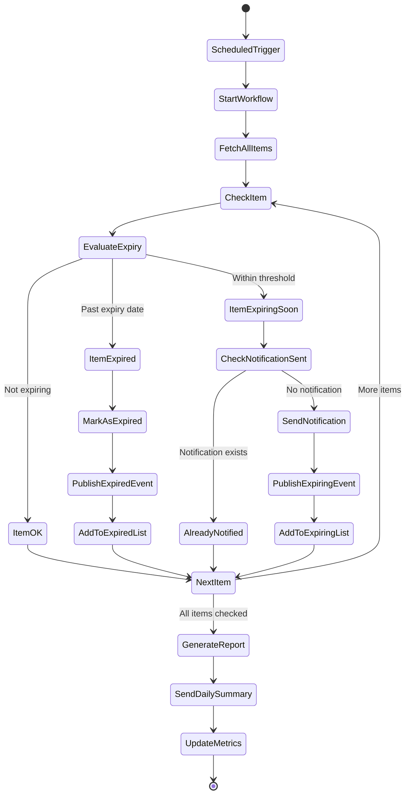

# Process: Inventory Expiry Check

## Process Overview

| Attribute | Value |
|-----------|-------|
| Process ID | PROC-INVENTORY-001 |
| Process Name | Inventory Expiry Check |
| Domain | Inventory Management |
| Trigger | Scheduled (daily at 06:00 AM) |
| Frequency | Daily |
| Participants | Temporal Workflow, Backend API, RabbitMQ, PostgreSQL, Notification Service |

## Process Goal

Automatically identify expiring and expired inventory items, update their status, send notifications to users, and optionally trigger reordering workflows.

## Detailed Process Flow



## Step-by-Step Process

### Step 1: Scheduled Trigger

**Actor:** Temporal Scheduler

**Action:** Start workflow at configured time daily

**Temporal Schedule Configuration:**
```java
@Component
public class ExpiryCheckScheduler {

    private final WorkflowClient workflowClient;

    public ExpiryCheckScheduler(WorkflowClient workflowClient) {
        this.workflowClient = workflowClient;
    }

    @PostConstruct
    public void scheduleExpiryCheck() {
        // Create schedule for daily expiry check
        ScheduleClient scheduleClient = workflowClient.newScheduleClient();

        String scheduleId = "daily-expiry-check";

        ScheduleOptions scheduleOptions = ScheduleOptions.newBuilder()
            .setSpec(
                ScheduleSpec.newBuilder()
                    // Run at 6:00 AM every day
                    .setCronExpressions("0 6 * * *")
                    .build()
            )
            .setAction(
                ScheduleActionStartWorkflow.newBuilder()
                    .setWorkflowType(ExpiryCheckWorkflow.class)
                    .setTaskQueue("expiry-check-queue")
                    .setArguments(LocalDate.now())
                    .build()
            )
            .build();

        try {
            scheduleClient.createSchedule(scheduleId, Schedule.newBuilder()
                .setSpec(scheduleOptions.getSpec())
                .setAction(scheduleOptions.getAction())
                .build());

            log.info("Created Temporal schedule: {}", scheduleId);
        } catch (ScheduleAlreadyRunningException e) {
            log.info("Schedule already exists: {}", scheduleId);
        }
    }
}
```

---

### Step 2: Start Workflow

**Actor:** Temporal

**Action:** Initialize ExpiryCheckWorkflow

**Workflow Interface:**
```java
@WorkflowInterface
public interface ExpiryCheckWorkflow {
    @WorkflowMethod
    ExpiryCheckResult checkExpiry(LocalDate checkDate);
}
```

**Workflow Implementation:**
```java
@Component
public class ExpiryCheckWorkflowImpl implements ExpiryCheckWorkflow {

    private final ExpiryCheckActivities activities = Workflow.newActivityStub(
        ExpiryCheckActivities.class,
        ActivityOptions.newBuilder()
            .setStartToCloseTimeout(Duration.ofMinutes(5))
            .setRetryOptions(RetryOptions.newBuilder()
                .setMaximumAttempts(3)
                .setBackoffCoefficient(2.0)
                .build())
            .build()
    );

    @Override
    public ExpiryCheckResult checkExpiry(LocalDate checkDate) {
        // Fetch configuration
        ExpiryCheckConfig config = activities.getConfiguration();

        // Initialize result
        List<UnitId> expiredUnits = new ArrayList<>();
        List<UnitId> expiringUnits = new ArrayList<>();
        int totalChecked = 0;

        // Fetch all items with units
        List<ItemId> itemIds = activities.getAllItemsWithUnits();

        for (ItemId itemId : itemIds) {
            // Fetch item with units
            Item item = activities.getItemWithUnits(itemId);

            // Check each unit
            for (Unit unit : item.getUnits()) {
                totalChecked++;

                if (unit.isExpired()) {
                    // Handle expired unit
                    activities.markUnitAsExpired(unit.getId());
                    expiredUnits.add(unit.getId());

                    // Publish event
                    activities.publishUnitExpiredEvent(unit);

                } else if (unit.isExpiringSoon(config.getExpiryWarningDays())) {
                    // Handle expiring soon unit
                    boolean notificationSent = activities.checkNotificationSent(
                        unit.getId(),
                        checkDate
                    );

                    if (!notificationSent) {
                        expiringUnits.add(unit.getId());

                        // Publish event
                        activities.publishUnitExpiringEvent(unit);

                        // Record notification sent
                        activities.recordNotificationSent(unit.getId(), checkDate);
                    }
                }
            }
        }

        // Generate summary report
        ExpiryCheckResult result = new ExpiryCheckResult(
            checkDate,
            totalChecked,
            expiredUnits.size(),
            expiringUnits.size(),
            expiredUnits,
            expiringUnits
        );

        // Send daily summary to admins
        activities.sendDailySummary(result);

        // Update metrics
        activities.updateMetrics(result);

        return result;
    }
}
```

---

### Step 3: Fetch All Items

**Actor:** Temporal Activity

**Action:** Query database for all items with units

**Activity Implementation:**
```java
@Component
public class ExpiryCheckActivitiesImpl implements ExpiryCheckActivities {

    private final ItemRepository itemRepository;
    private final UnitRepository unitRepository;
    private final ConfigurationService configService;

    public ExpiryCheckActivitiesImpl(
        ItemRepository itemRepository,
        UnitRepository unitRepository,
        ConfigurationService configService
    ) {
        this.itemRepository = itemRepository;
        this.unitRepository = unitRepository;
        this.configService = configService;
    }

    @Override
    public ExpiryCheckConfig getConfiguration() {
        return new ExpiryCheckConfig(
            configService.getExpiryWarningDays(), // Default: 7 days
            configService.getNotificationEnabled()
        );
    }

    @Override
    public List<ItemId> getAllItemsWithUnits() {
        // Query for items that have at least one unit
        return itemRepository.findAllWithUnits();
    }

    @Override
    public Item getItemWithUnits(ItemId itemId) {
        return itemRepository.findById(itemId)
            .orElseThrow(() -> new IllegalArgumentException("Item not found: " + itemId));
    }
}
```

---

### Step 4: Check Each Unit

**Actor:** Temporal Workflow

**Action:** Evaluate expiry status of each unit

**Expiry Evaluation Logic:**
```java
// In the workflow
for (Unit unit : item.getUnits()) {
    totalChecked++;

    // Check expiry date
    ExpiryDate expiryDate = unit.getExpiryDate();

    if (expiryDate.isExpired()) {
        // Unit has expired
        handleExpiredUnit(unit, item);
    } else if (expiryDate.isExpiringSoon(config.getExpiryWarningDays())) {
        // Unit is expiring soon
        handleExpiringSoonUnit(unit, item, checkDate);
    }
    // Otherwise, unit is OK - no action needed
}
```

**Expiry Status Determination:**
```java
// In ExpiryDate value object
public boolean isExpired() {
    return LocalDate.now().isAfter(date);
}

public boolean isExpiringSoon(int daysThreshold) {
    if (isExpired()) {
        return false; // Already expired, not "expiring soon"
    }

    LocalDate thresholdDate = LocalDate.now().plusDays(daysThreshold);
    return !date.isAfter(thresholdDate);
}

public long daysUntilExpiry() {
    return ChronoUnit.DAYS.between(LocalDate.now(), date);
}
```

---

### Step 5: Handle Expired Units

**Actor:** Temporal Activity

**Action:** Mark unit as expired and publish event

**Mark as Expired:**
```java
@Override
@Transactional
public void markUnitAsExpired(UnitId unitId) {
    Unit unit = unitRepository.findById(unitId)
        .orElseThrow(() -> new IllegalArgumentException("Unit not found: " + unitId));

    // Update unit status
    unit.markAsExpired();

    unitRepository.save(unit);

    log.info("Marked unit as expired: {}", unitId);
}
```

**Publish Expired Event:**
```java
@Override
public void publishUnitExpiredEvent(Unit unit) {
    UnitExpiredEvent event = UnitExpiredEvent.of(
        unit.getId(),
        unit.getItemId(),
        unit.getExpiryDate().date(),
        unit.getQuantity()
    );

    eventPublisher.publish(event);

    log.info("Published UnitExpiredEvent for unit: {}", unit.getId());
}
```

**Event Structure:**
```java
public record UnitExpiredEvent(
    UUID eventId,
    UnitId unitId,
    ItemId itemId,
    LocalDate expiredOn,
    Quantity quantity,
    Instant occurredAt
) {
    public static UnitExpiredEvent of(
        UnitId unitId,
        ItemId itemId,
        LocalDate expiredOn,
        Quantity quantity
    ) {
        return new UnitExpiredEvent(
            UUID.randomUUID(),
            unitId,
            itemId,
            expiredOn,
            quantity,
            Instant.now()
        );
    }
}
```

---

### Step 6: Handle Expiring Soon Units

**Actor:** Temporal Activity

**Action:** Check if notification already sent, then publish event

**Check Notification Status:**
```java
@Override
public boolean checkNotificationSent(UnitId unitId, LocalDate checkDate) {
    // Check if we've already sent notification for this unit on this date
    return notificationRepository.existsByUnitIdAndDate(unitId, checkDate);
}

@Override
@Transactional
public void recordNotificationSent(UnitId unitId, LocalDate checkDate) {
    ExpiryNotification notification = new ExpiryNotification(
        unitId,
        checkDate,
        Instant.now()
    );

    notificationRepository.save(notification);

    log.info("Recorded expiry notification for unit: {} on {}", unitId, checkDate);
}
```

**Publish Expiring Event:**
```java
@Override
public void publishUnitExpiringEvent(Unit unit) {
    UnitExpiringEvent event = UnitExpiringEvent.of(
        unit.getId(),
        unit.getItemId(),
        unit.getExpiryDate().date(),
        unit.daysUntilExpiry(),
        unit.getQuantity()
    );

    eventPublisher.publish(event);

    log.info("Published UnitExpiringEvent for unit: {} (expires in {} days)",
        unit.getId(), unit.daysUntilExpiry());
}
```

**Event Structure:**
```java
public record UnitExpiringEvent(
    UUID eventId,
    UnitId unitId,
    ItemId itemId,
    LocalDate expiresOn,
    long daysUntilExpiry,
    Quantity quantity,
    Instant occurredAt
) {
    public static UnitExpiringEvent of(
        UnitId unitId,
        ItemId itemId,
        LocalDate expiresOn,
        long daysUntilExpiry,
        Quantity quantity
    ) {
        return new UnitExpiringEvent(
            UUID.randomUUID(),
            unitId,
            itemId,
            expiresOn,
            daysUntilExpiry,
            quantity,
            Instant.now()
        );
    }
}
```

---

### Step 7: Event Consumers

**Actor:** RabbitMQ Consumer

**Action:** Listen for expiry events and send notifications

**Event Consumer:**
```java
@Component
public class ExpiryEventConsumer {

    private final NotificationService notificationService;
    private final UserRepository userRepository;

    public ExpiryEventConsumer(
        NotificationService notificationService,
        UserRepository userRepository
    ) {
        this.notificationService = notificationService;
        this.userRepository = userRepository;
    }

    @RabbitListener(queues = "inventory.expiry.notifications")
    public void handleUnitExpiring(UnitExpiringEvent event) {
        // Fetch item details
        Item item = itemRepository.findById(event.itemId())
            .orElse(null);

        if (item == null) {
            log.warn("Item not found for expiring event: {}", event.itemId());
            return;
        }

        // Get all admin users
        List<User> admins = userRepository.findByRole("ADMIN");

        for (User admin : admins) {
            // Send notification
            notificationService.sendExpiryWarning(
                admin.getId(),
                item,
                event.daysUntilExpiry()
            );
        }

        log.info("Sent expiry warnings for item: {}", item.getName());
    }

    @RabbitListener(queues = "inventory.expiry.expired")
    public void handleUnitExpired(UnitExpiredEvent event) {
        // Fetch item details
        Item item = itemRepository.findById(event.itemId())
            .orElse(null);

        if (item == null) {
            log.warn("Item not found for expired event: {}", event.itemId());
            return;
        }

        // Get all admin users
        List<User> admins = userRepository.findByRole("ADMIN");

        for (User admin : admins) {
            // Send urgent notification
            notificationService.sendExpiredAlert(
                admin.getId(),
                item,
                event.expiredOn()
            );
        }

        log.info("Sent expired alerts for item: {}", item.getName());
    }
}
```

---

### Step 8: Generate Daily Summary

**Actor:** Temporal Activity

**Action:** Create summary report of expiry check

**Summary Generation:**
```java
@Override
public void sendDailySummary(ExpiryCheckResult result) {
    // Get all admin users
    List<User> admins = userRepository.findByRole("ADMIN");

    if (admins.isEmpty()) {
        log.warn("No admin users found to send daily summary");
        return;
    }

    // Generate summary content
    String summary = String.format("""
        Daily Inventory Expiry Check Report
        Date: %s

        Summary:
        - Total Units Checked: %d
        - Expired: %d
        - Expiring Soon: %d

        %s

        Please review the inventory management system for details.
        """,
        result.checkDate(),
        result.totalChecked(),
        result.expiredCount(),
        result.expiringCount(),
        result.hasIssues() ? "⚠️ Action required!" : "✅ All OK"
    );

    // Send to each admin
    for (User admin : admins) {
        notificationService.sendDailySummary(
            admin.getId(),
            "Daily Expiry Check",
            summary
        );
    }

    log.info("Sent daily summary to {} admins", admins.size());
}
```

---

### Step 9: Update Metrics

**Actor:** Temporal Activity

**Action:** Record metrics for monitoring

**Metrics Recording:**
```java
@Override
public void updateMetrics(ExpiryCheckResult result) {
    // Update Prometheus metrics
    meterRegistry.gauge("inventory.expiry.check.total_checked",
        result.totalChecked());

    meterRegistry.gauge("inventory.expiry.check.expired_count",
        result.expiredCount());

    meterRegistry.gauge("inventory.expiry.check.expiring_count",
        result.expiringCount());

    meterRegistry.counter("inventory.expiry.check.runs").increment();

    // Record duration
    meterRegistry.timer("inventory.expiry.check.duration")
        .record(Duration.between(
            result.startTime(),
            Instant.now()
        ));

    log.info("Updated expiry check metrics");
}
```

---

## Result Object

```java
public record ExpiryCheckResult(
    LocalDate checkDate,
    int totalChecked,
    int expiredCount,
    int expiringCount,
    List<UnitId> expiredUnits,
    List<UnitId> expiringUnits
) {
    public boolean hasIssues() {
        return expiredCount > 0 || expiringCount > 0;
    }

    public double expiryRate() {
        if (totalChecked == 0) return 0.0;
        return ((double) (expiredCount + expiringCount) / totalChecked) * 100;
    }

    public String generateSummary() {
        return String.format(
            "Checked %d units: %d expired, %d expiring soon (%.1f%% expiry rate)",
            totalChecked,
            expiredCount,
            expiringCount,
            expiryRate()
        );
    }
}
```

## Configuration

```yaml
# application.yml
inventory:
  expiry:
    warning-days: 7  # Warn when expiring within 7 days
    notification-enabled: true
    schedule:
      cron: "0 6 * * *"  # Daily at 6:00 AM
      timezone: "UTC"
```

## Performance Considerations

### Batch Processing

For large inventories (>10,000 units), use batch processing:

```java
private static final int BATCH_SIZE = 500;

@Override
public ExpiryCheckResult checkExpiry(LocalDate checkDate) {
    List<ItemId> allItemIds = activities.getAllItemsWithUnits();

    // Process in batches
    List<List<ItemId>> batches = Lists.partition(allItemIds, BATCH_SIZE);

    for (List<ItemId> batch : batches) {
        processBatch(batch, checkDate);

        // Small delay between batches
        Workflow.sleep(Duration.ofMillis(100));
    }

    return aggregateResults();
}
```

### Expected Duration

| Inventory Size | Expected Duration | Notes |
|----------------|-------------------|-------|
| < 1,000 units | < 1 minute | Single batch |
| 1,000 - 10,000 | 1-5 minutes | Multiple batches |
| > 10,000 units | 5-15 minutes | Optimize with parallel processing |

---

## Testing Checklist

### Unit Tests

- [ ] ExpiryDate.isExpired() with past date
- [ ] ExpiryDate.isExpiringSoon() with various thresholds
- [ ] ExpiryDate.daysUntilExpiry() calculation
- [ ] Unit expiry status evaluation
- [ ] Notification deduplication logic

### Integration Tests

- [ ] Full workflow with expired units
- [ ] Full workflow with expiring units
- [ ] Full workflow with no issues
- [ ] Event publishing
- [ ] Notification sending
- [ ] Metrics recording

### Workflow Tests

```java
@Test
void should_IdentifyExpiredUnits_When_PastExpiryDate() {
    TestWorkflowEnvironment testEnv = TestWorkflowEnvironment.newInstance();
    Worker worker = testEnv.newWorker("expiry-check-queue");
    worker.registerWorkflowImplementationTypes(ExpiryCheckWorkflowImpl.class);

    // Mock activities
    ExpiryCheckActivities activities = mock(ExpiryCheckActivities.class);
    worker.registerActivitiesImplementations(activities);

    testEnv.start();

    // Setup test data
    when(activities.getAllItemsWithUnits()).thenReturn(List.of(itemId));
    when(activities.getItemWithUnits(itemId)).thenReturn(itemWithExpiredUnit);

    // Execute workflow
    ExpiryCheckWorkflow workflow = testEnv.getWorkflowClient()
        .newWorkflowStub(ExpiryCheckWorkflow.class);

    ExpiryCheckResult result = workflow.checkExpiry(LocalDate.now());

    // Verify
    assertThat(result.expiredCount()).isEqualTo(1);
    verify(activities).markUnitAsExpired(any());
    verify(activities).publishUnitExpiredEvent(any());

    testEnv.shutdown();
}
```

---

## Monitoring & Alerts

### Metrics to Track

```java
// Prometheus metrics
inventory_expiry_check_total_checked{} 1250
inventory_expiry_check_expired_count{} 15
inventory_expiry_check_expiring_count{} 42
inventory_expiry_check_runs_total{} 365
inventory_expiry_check_duration_seconds{} 2.5
```

### Alerts

| Alert | Condition | Severity |
|-------|-----------|----------|
| High Expiry Rate | > 10% expiry rate | Warning |
| Many Expired Units | > 50 expired units | Critical |
| Workflow Failure | Workflow fails | Critical |
| Long Duration | Duration > 10 minutes | Warning |

---

## Related Processes

- [PROC-INVENTORY-002: Unit Consumption](./unit-consumption-process.md)
- [Temporal Workflows](../guides/temporal/temporal-implementation-guide.md)
- [Inventory Module](../guides/backend/inventory-module-implementation.md)

## References

- [Workflows Documentation](../workflows/05-workflows-temporal.md)
- [Events Documentation](../events/06-events-rabbitmq.md)
- [API Specification](../api/04-api.md)
