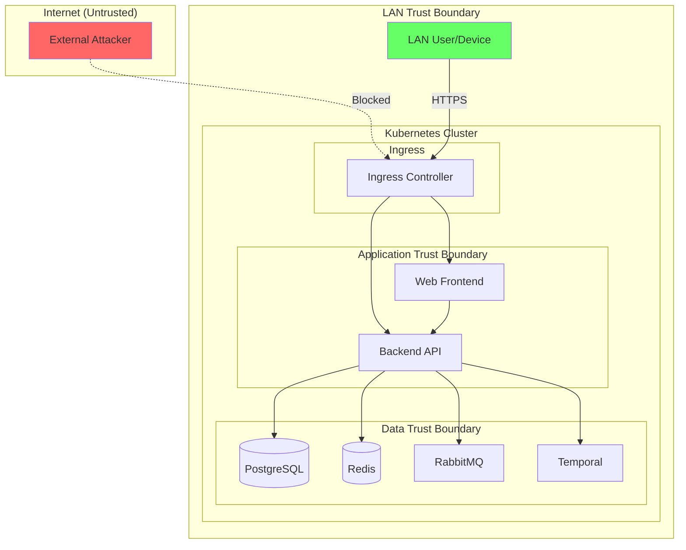
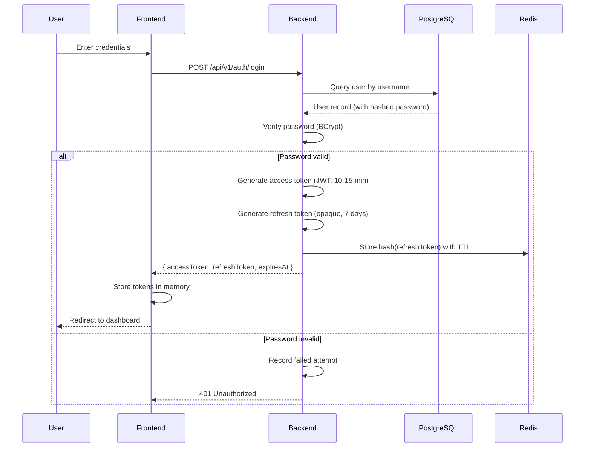
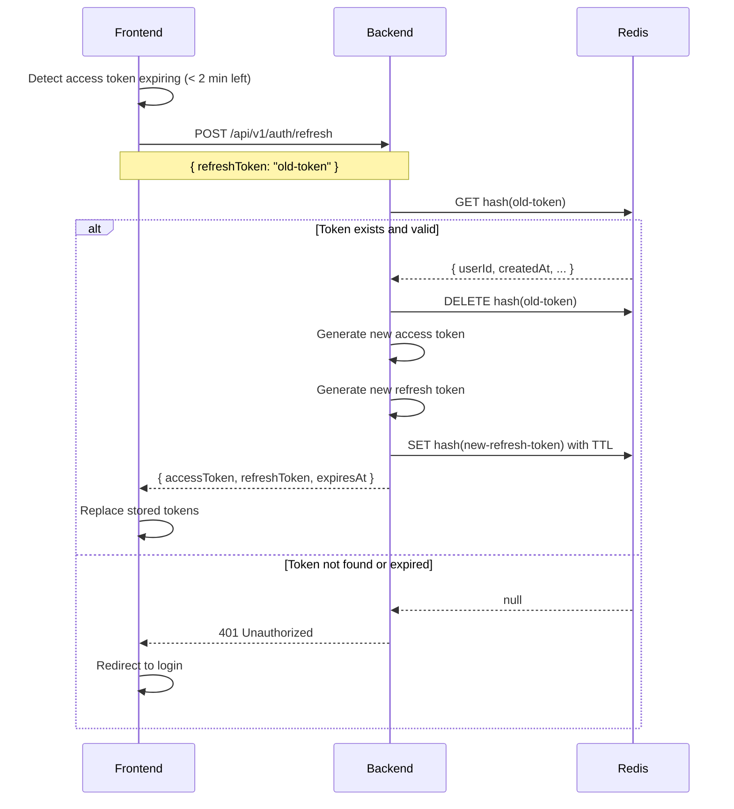
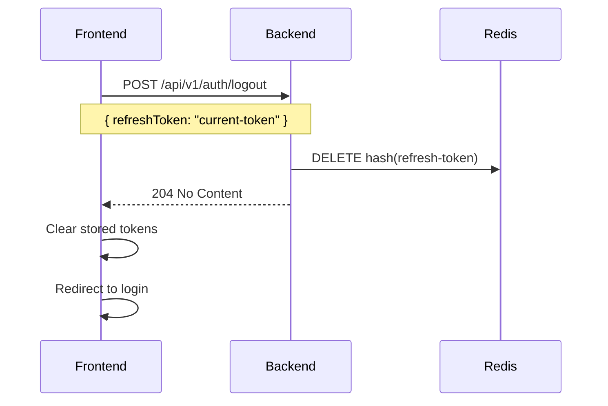
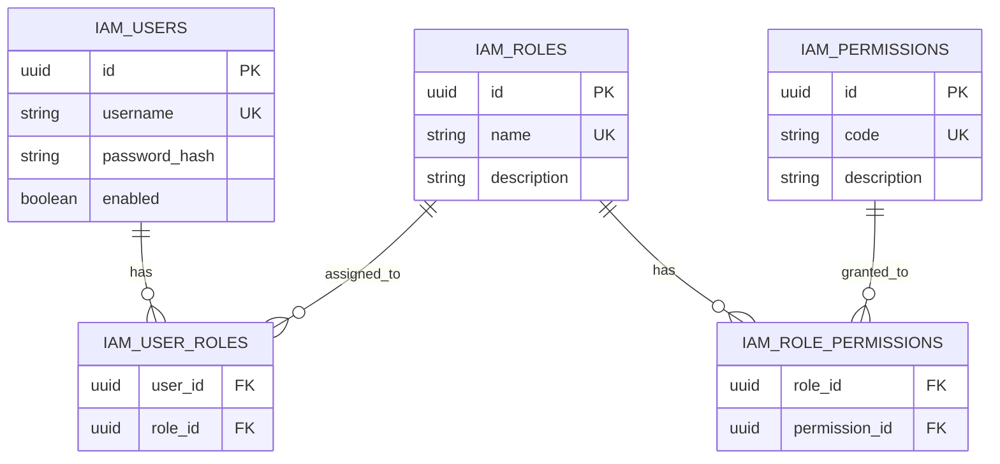

# HomeWarehouse - Security Architecture

## Purpose

This document defines the security architecture, threat model, and implementation requirements for HomeWarehouse. Security is treated as a first-class concern given the sensitive nature of financial data and personal inventory information.

## Scope

### In Scope

- Authentication and authorization design
- JWT implementation and validation
- Token management (access and refresh tokens)
- RBAC permission model
- OWASP ASVS compliance mapping
- Threat model for the system
- Audit requirements for security events
- Secret management approach
- Security testing requirements

### Out of Scope

- Infrastructure-level security (network policies, firewall rules) - see [Infrastructure](../infra/08-infra-plan.md)
- Detailed incident response procedures
- Penetration testing execution

## Security Standards Reference

| Standard | Version | Usage |
|----------|---------|-------|
| OWASP ASVS | 4.0.3 | Baseline security requirements |
| OWASP REST Security | Current | API security practices |
| OWASP JWT for Java | Current | JWT implementation guidance |
| OWASP Top 10 | 2021 | Vulnerability awareness |

## Threat Model Summary

### Assets Under Protection

| Asset ID | Asset | Classification | Protection Requirements |
|----------|-------|----------------|------------------------|
| A1 | User credentials | Critical | Encryption at rest, secure transport, no plaintext logging |
| A2 | Financial data (transactions, balances) | Critical | AuthN+AuthZ, audit trail, encryption at rest |
| A3 | Asset valuations | Critical | AuthN+AuthZ, audit trail |
| A4 | Personal inventory data | Sensitive | AuthN+AuthZ, encryption at rest |
| A5 | JWT tokens | Critical | Short-lived, secure storage, revocation capability |
| A6 | Refresh tokens | Critical | Hashed storage, rotation, revocation |
| A7 | Audit logs | High | Immutable, append-only, tamper detection |
| A8 | System configuration | High | No secrets in code, secure secret management |

### Threat Actors

| Actor | Trust Level | Capability | Motivation |
|-------|-------------|------------|------------|
| Authenticated User | Trusted | Valid credentials, assigned roles | Normal usage |
| LAN Attacker | Hostile | Network access to LAN | Data theft, manipulation |
| Malicious Insider | Hostile | Valid credentials, potentially elevated | Data exfiltration |
| Compromised Dependency | Hostile | Code execution in application | Supply chain attack |

### Trust Boundaries



### Key Threats and Mitigations

| Threat | Category | Likelihood | Impact | Mitigation |
|--------|----------|------------|--------|------------|
| JWT token theft | Spoofing | Medium | High | Short-lived tokens (10-15 min), in-memory storage |
| Refresh token hijacking | Spoofing | Medium | Critical | Rotation, Redis revocation, hashed storage |
| Privilege escalation | Elevation | Low | Critical | RBAC on every endpoint, ownership checks |
| SQL injection | Tampering | Low | Critical | Parameterized queries via JPA |
| XSS leading to token theft | Information Disclosure | Medium | High | CSP headers, HttpOnly where applicable, input sanitization |
| IDOR (Insecure Direct Object Reference) | Elevation | Medium | High | Resource ownership validation |
| Audit log tampering | Repudiation | Low | High | Append-only table, separate DB permissions |
| Brute force authentication | Denial of Service | Medium | Medium | Rate limiting, account lockout |
| Dependency vulnerability | Varies | Medium | Varies | OWASP Dependency-Check, regular updates |

## Authentication Architecture

### Authentication Flow



### Login Response Contract

The authentication endpoint MUST return exactly this structure:

```json
{
  "accessToken": "eyJhbGciOiJSUzI1NiIsInR5cCI6IkpXVCJ9...",
  "refreshToken": "opaque-refresh-token-string",
  "expiresAt": "2024-01-15T10:45:00Z"
}
```

**Strict Requirements:**
- No user details in response (fetch separately if needed)
- No roles or permissions in response (derived from access token claims)
- `expiresAt` is ISO-8601 format, represents access token expiration

### Password Storage

| Requirement | Implementation |
|-------------|----------------|
| Algorithm | BCrypt |
| Work Factor | Minimum 12 rounds |
| Salt | Automatically generated by BCrypt |
| Pepper | Optional application-level secret, consider for future |

## JWT Token Specification

### Access Token

| Attribute | Value | Rationale |
|-----------|-------|-----------|
| Type | JWT (JSON Web Token) | Standard, verifiable claims |
| Algorithm | RS256 (RSA + SHA-256) | Asymmetric, key rotation friendly |
| Lifetime | 10-15 minutes | Minimize exposure window |
| Storage (Frontend) | In-memory only | Not localStorage, not cookies |

### Access Token Claims

```json
{
  "iss": "homewarehouse",
  "aud": "homewarehouse-api",
  "sub": "user-uuid",
  "iat": 1705318800,
  "exp": 1705319700,
  "nbf": 1705318800,
  "jti": "unique-token-id",
  "roles": ["USER"],
  "permissions": ["ledger:read", "ledger:write", "inventory:read", "inventory:write"]
}
```

### JWT Validation Rules (MANDATORY)

```java
// Pseudocode for JWT validation
public void validateToken(String token) {
    DecodedJWT jwt = JWT.decode(token);

    // 1. Algorithm constraint - NEVER accept "none"
    if (jwt.getAlgorithm().equals("none")) {
        throw new InvalidTokenException("Algorithm 'none' is not allowed");
    }
    if (!jwt.getAlgorithm().equals("RS256")) {
        throw new InvalidTokenException("Only RS256 algorithm is accepted");
    }

    // 2. Signature verification
    verifySignature(jwt, publicKey);

    // 3. Issuer validation
    if (!jwt.getIssuer().equals("homewarehouse")) {
        throw new InvalidTokenException("Invalid issuer");
    }

    // 4. Audience validation
    if (!jwt.getAudience().contains("homewarehouse-api")) {
        throw new InvalidTokenException("Invalid audience");
    }

    // 5. Expiration with clock skew (max 30 seconds)
    Instant now = Instant.now();
    Instant exp = jwt.getExpiresAt().toInstant();
    if (now.isAfter(exp.plusSeconds(30))) {
        throw new TokenExpiredException("Token has expired");
    }

    // 6. Not-before with clock skew
    Instant nbf = jwt.getNotBefore().toInstant();
    if (now.isBefore(nbf.minusSeconds(30))) {
        throw new InvalidTokenException("Token not yet valid");
    }

    // 7. Issued-at sanity check
    Instant iat = jwt.getIssuedAt().toInstant();
    if (iat.isAfter(now.plusSeconds(30))) {
        throw new InvalidTokenException("Token issued in the future");
    }
}
```

### Refresh Token

| Attribute | Value | Rationale |
|-----------|-------|-----------|
| Type | Opaque (UUID or secure random) | No parseable claims, server-validated |
| Lifetime | 7 days (sliding window) | Balance security and UX |
| Storage (Backend) | Redis, hashed with TTL | Fast lookup, automatic expiry |
| Storage (Frontend) | In-memory (or secure cookie if needed) | Minimize exposure |

### Refresh Token Flow



### Token Revocation

**Logout:**


**Admin Revocation (all sessions):**
- Delete all refresh tokens for a user from Redis
- Add user ID to a short-term blocklist for access tokens (until they naturally expire)

## Role-Based Access Control (RBAC)

### Permission Model



### Default Roles

| Role | Description | Default Permissions |
|------|-------------|---------------------|
| ADMIN | Full system access | All permissions |
| USER | Standard user | ledger:*, assets:*, inventory:*, notifications:read |
| READONLY | View-only access | *:read |

### Permission Codes

| Module | Permission | Description |
|--------|------------|-------------|
| identity | identity:users:read | View users |
| identity | identity:users:write | Create/update users |
| identity | identity:roles:read | View roles |
| identity | identity:roles:write | Manage roles |
| identity | identity:permissions:read | View permissions |
| identity | identity:permissions:assign | Assign permissions to roles |
| ledger | ledger:accounts:read | View accounts |
| ledger | ledger:accounts:write | Manage accounts |
| ledger | ledger:transactions:read | View transactions |
| ledger | ledger:transactions:write | Create/edit transactions |
| ledger | ledger:import:execute | Execute CSV imports |
| ledger | ledger:export:execute | Export data |
| assets | assets:entities:read | View assets |
| assets | assets:entities:write | Manage assets |
| assets | assets:valuations:read | View valuations |
| assets | assets:valuations:write | Record valuations |
| inventory | inventory:items:read | View inventory items |
| inventory | inventory:items:write | Manage inventory items |
| inventory | inventory:units:read | View units |
| inventory | inventory:units:write | Manage units |
| inventory | inventory:locations:read | View locations |
| inventory | inventory:locations:write | Manage locations |
| notifications | notifications:read | View notifications |
| notifications | notifications:dismiss | Dismiss notifications |
| audit | audit:logs:read | View audit logs |

### Authorization Enforcement

Every endpoint MUST:

1. Verify the JWT access token is valid
2. Extract permissions from token claims
3. Check the required permission against user's permissions
4. For resource-specific operations, verify resource ownership

```java
@RestController
@RequestMapping("/api/v1/ledger/transactions")
public class TransactionController {

    @GetMapping
    @PreAuthorize("hasPermission('ledger:transactions:read')")
    public ResponseEntity<Page<TransactionDto>> getTransactions(...) {
        // Also filter by userId from SecurityContext
    }

    @PostMapping
    @PreAuthorize("hasPermission('ledger:transactions:write')")
    public ResponseEntity<TransactionDto> createTransaction(...) {
        // Validate accountId belongs to current user
    }
}
```

## OWASP ASVS Compliance Checklist

### V1: Architecture, Design and Threat Modeling

| ID | Requirement | Status | Implementation |
|----|-------------|--------|----------------|
| 1.1.1 | Verify secure SDLC is in use | Planned | Security reviews, dependency checks |
| 1.2.1 | Verify threat model exists | Done | This document |
| 1.4.1 | Verify access control points | Done | Controller-level authorization |

### V2: Authentication

| ID | Requirement | Status | Implementation |
|----|-------------|--------|----------------|
| 2.1.1 | Passwords at least 12 characters | Required | Frontend + backend validation |
| 2.1.7 | Breached password check | Optional | Can integrate HaveIBeenPwned |
| 2.2.1 | Anti-automation controls | Required | Rate limiting |
| 2.5.1 | Credential recovery secure | N/A | Single-user, admin reset only |
| 2.8.1 | Time-based OTP | Optional | Future enhancement |
| 2.9.1 | Cryptographic verifier | Done | BCrypt for passwords |

### V3: Session Management

| ID | Requirement | Status | Implementation |
|----|-------------|--------|----------------|
| 3.1.1 | URL does not expose session | Done | Tokens in headers only |
| 3.2.1 | Session invalidation on logout | Done | Redis token deletion |
| 3.3.1 | Session timeout | Done | 10-15 min access, 7 day refresh |
| 3.5.1 | Token-based session | Done | JWT + opaque refresh |
| 3.5.2 | Token signature verification | Done | RS256 validation |
| 3.5.3 | Token expiration | Done | exp claim enforced |

### V4: Access Control

| ID | Requirement | Status | Implementation |
|----|-------------|--------|----------------|
| 4.1.1 | Least privilege | Done | Granular permissions |
| 4.1.2 | Access control on every request | Done | Security filter + annotations |
| 4.1.3 | Deny by default | Done | No access without permission |
| 4.2.1 | IDOR prevention | Required | Ownership checks |
| 4.3.1 | Administrative access control | Done | Admin-only endpoints |

### V5: Validation, Sanitization and Encoding

| ID | Requirement | Status | Implementation |
|----|-------------|--------|----------------|
| 5.1.1 | Input validation | Required | Bean validation + domain |
| 5.2.1 | HTML sanitization | Required | Output encoding |
| 5.3.1 | SQL injection prevention | Done | JPA parameterized queries |
| 5.3.4 | OS command injection prevention | Done | No shell commands from user input |

### V7: Error Handling and Logging

| ID | Requirement | Status | Implementation |
|----|-------------|--------|----------------|
| 7.1.1 | Generic error messages | Required | Error handler sanitization |
| 7.1.2 | No stack traces to users | Required | Production error handler |
| 7.2.1 | Security event logging | Done | Audit log module |
| 7.2.2 | Log injection prevention | Required | Structured logging |

### V8: Data Protection

| ID | Requirement | Status | Implementation |
|----|-------------|--------|----------------|
| 8.1.1 | PII protection | Required | Access control, encryption |
| 8.2.1 | Memory protection | Done | In-memory token storage |
| 8.3.1 | Sensitive data not logged | Required | Log scrubbing |

### V13: API and Web Service

| ID | Requirement | Status | Implementation |
|----|-------------|--------|----------------|
| 13.1.1 | Same input validation for all clients | Done | Backend validation |
| 13.2.1 | RESTful authentication | Done | JWT Bearer tokens |
| 13.2.5 | Sensitive data not in URL | Done | POST bodies, headers |

## Security Headers

All API responses MUST include:

```
X-Content-Type-Options: nosniff
X-Frame-Options: DENY
X-XSS-Protection: 0
Content-Security-Policy: default-src 'self'
Strict-Transport-Security: max-age=31536000; includeSubDomains
Cache-Control: no-store
```

Frontend additional headers:
```
Content-Security-Policy: default-src 'self'; script-src 'self'; style-src 'self' 'unsafe-inline'
```

## Audit Requirements

### Security Events to Audit

| Event | Fields | Retention |
|-------|--------|-----------|
| Login success | userId, timestamp, ip | 1 year |
| Login failure | username, timestamp, ip, reason | 1 year |
| Logout | userId, timestamp | 1 year |
| Token refresh | userId, timestamp | 90 days |
| Password change | userId, timestamp, by | 1 year |
| Role assignment | userId, roleId, by, timestamp | Indefinite |
| Role revocation | userId, roleId, by, timestamp | Indefinite |
| Permission grant | roleId, permissionId, by, timestamp | Indefinite |
| Permission revoke | roleId, permissionId, by, timestamp | Indefinite |
| User creation | userId, by, timestamp | Indefinite |
| User deactivation | userId, by, timestamp | Indefinite |

### Audit Log Schema

```sql
CREATE TABLE audit_log (
    id UUID PRIMARY KEY DEFAULT gen_random_uuid(),
    user_id UUID NOT NULL,
    action VARCHAR(100) NOT NULL,
    entity_type VARCHAR(100) NOT NULL,
    entity_id UUID,
    before_state JSONB,
    after_state JSONB,
    ip_address INET,
    user_agent TEXT,
    correlation_id UUID,
    occurred_at TIMESTAMPTZ NOT NULL DEFAULT NOW()
);

-- Append-only: no UPDATE or DELETE permissions for application user
```

## Secret Management

### Local Development

1. Create `.env` file from `.env.template`
2. Never commit `.env` file (in `.gitignore`)
3. Use Spring profiles: `application-local.yml` reads from environment

### Kubernetes Deployment

| Secret | Storage | Rotation |
|--------|---------|----------|
| Database password | Kubernetes Secret | Manual, document procedure |
| Redis password | Kubernetes Secret | Manual |
| RabbitMQ password | Kubernetes Secret | Manual |
| JWT signing keys | Kubernetes Secret | Semi-annual |
| Application secrets | Kubernetes Secret | As needed |

### Secret Requirements

- Never commit secrets to repository
- Use sealed-secrets or external-secrets-operator for GitOps
- Document secret rotation procedures
- Minimum rotation: annually for all secrets

## Security Testing Requirements

### Static Analysis

| Tool | Purpose | Frequency |
|------|---------|-----------|
| SpotBugs + FindSecBugs | Security-focused static analysis | Every build |
| OWASP Dependency-Check | Dependency vulnerability scan | Every build |
| Checkstyle/PMD | Code quality (includes security patterns) | Every build |

### Dynamic Testing

| Tool | Purpose | Frequency |
|------|---------|-----------|
| OWASP ZAP | Automated API scanning | Weekly |
| Manual penetration testing | Deep security review | Annually |

### CI Pipeline Security Gates

```yaml
# Fail build if:
- High severity dependency vulnerability
- Critical findings from SpotBugs/FindSecBugs
- Secrets detected in commit (git-secrets)
```

## Frontend Token Security

### Storage Recommendations

| Option | Security | Tradeoffs |
|--------|----------|-----------|
| In-memory (JavaScript variable) | Best | Lost on page refresh, requires handling |
| HttpOnly secure cookie | Good | CSRF concerns, requires backend changes |
| sessionStorage | Acceptable | Vulnerable to XSS, but scoped to tab |
| localStorage | Not recommended | Persistent, vulnerable to XSS |

### Recommended Approach

1. Store access token in memory (React context/state)
2. Store refresh token in memory (or secure HttpOnly cookie)
3. On page load, attempt silent refresh
4. Implement token refresh before expiry (2 minutes buffer)

### XSS Mitigation

Even with in-memory storage:
- Implement strict CSP
- Sanitize all user inputs
- Encode outputs
- Use React's built-in XSS protection
- Avoid `dangerouslySetInnerHTML`

## Related Documents

- [Architecture](../architecture/01-architecture.md) - System architecture
- [Data Model](../database/03-data-model.md) - Database schema including IAM tables
- [API](../api/04-api.md) - API security implementation details
- [Infrastructure](../infra/08-infra-plan.md) - Infrastructure security
