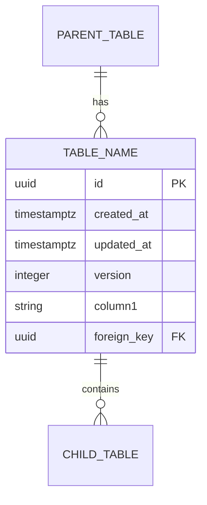

# Data Table: [table_name]

## Purpose

Describe the purpose of this table and what domain concept it represents.

## Ownership

| Attribute | Value |
|-----------|-------|
| Owning Module | [module-name] |
| Bounded Context | [context-name] |
| Aggregate Root | Yes / No |
| Parent Table | [parent_table_name] or N/A |

## Columns

| Column | Type | Nullable | Default | Description |
|--------|------|----------|---------|-------------|
| id | UUID | NO | gen_random_uuid() | Primary key |
| created_at | TIMESTAMPTZ | NO | NOW() | Creation timestamp |
| updated_at | TIMESTAMPTZ | NO | NOW() | Last update timestamp |
| version | INTEGER | NO | 1 | Optimistic locking version |
| [column_name] | [type] | YES/NO | [default] | [description] |

### Column Details

#### [column_name]

- **Business meaning:** What this column represents in business terms
- **Validation rules:** Any validation applied at domain or application level
- **Source:** Where this data comes from (user input, calculated, external system)

## Constraints

### Primary Key

```sql
CONSTRAINT pk_[table_name] PRIMARY KEY (id)
```

### Unique Constraints

| Constraint Name | Columns | Purpose |
|-----------------|---------|---------|
| uq_[table_name]_[columns] | col1, col2 | Ensures uniqueness of... |

```sql
CONSTRAINT uq_[table_name]_[columns] UNIQUE (col1, col2)
```

### Foreign Keys

| Constraint Name | Column | References | On Delete | On Update |
|-----------------|--------|------------|-----------|-----------|
| fk_[table]_[ref] | ref_id | ref_table(id) | CASCADE/RESTRICT/SET NULL | CASCADE |

```sql
CONSTRAINT fk_[table]_[ref] FOREIGN KEY (ref_id)
    REFERENCES ref_table(id) ON DELETE CASCADE
```

### Check Constraints

| Constraint Name | Expression | Purpose |
|-----------------|------------|---------|
| ck_[table]_[name] | column > 0 | Ensures positive value |

```sql
CONSTRAINT ck_[table]_[name] CHECK (column > 0)
```

### Idempotency Key Constraint

If this table supports idempotent operations:

```sql
CONSTRAINT uq_[table_name]_idempotency_key UNIQUE (idempotency_key)
```

## Indexes

| Index Name | Columns | Type | Purpose |
|------------|---------|------|---------|
| idx_[table]_[columns] | col1, col2 | BTREE | Query optimization for... |
| idx_[table]_[column]_gin | jsonb_col | GIN | Full-text search on... |

```sql
CREATE INDEX idx_[table]_[columns] ON [table_name] (col1, col2);
CREATE INDEX idx_[table]_[column]_gin ON [table_name] USING GIN (jsonb_col);
```

### Partial Indexes

```sql
CREATE INDEX idx_[table]_active ON [table_name] (status) WHERE status = 'ACTIVE';
```

## Relationships

### Parent Relationships (This table references)

| Related Table | Cardinality | Description |
|---------------|-------------|-------------|
| parent_table | N:1 | Each record belongs to one parent |

### Child Relationships (Other tables reference this)

| Related Table | Cardinality | Description |
|---------------|-------------|-------------|
| child_table | 1:N | One record has many children |

## Mermaid ERD Fragment



## Retention Policy

| Policy | Value | Notes |
|--------|-------|-------|
| Retention Period | Indefinite / 90 days / 1 year | Reason for policy |
| Archival Strategy | None / Move to archive table / Delete | How old data is handled |
| Soft Delete | Yes / No | If yes, uses deleted_at column |

### Retention Implementation

```sql
-- Example: Delete records older than 90 days
DELETE FROM [table_name] WHERE created_at < NOW() - INTERVAL '90 days';

-- Example: Archive to historical table
INSERT INTO [table_name]_archive SELECT * FROM [table_name] WHERE ...;
```

## Auditability

| Audited | Audit Table | Events Tracked |
|---------|-------------|----------------|
| Yes / No | audit_log | CREATE, UPDATE, DELETE |

### Audit Trigger (if applicable)

```sql
CREATE TRIGGER trg_[table_name]_audit
    AFTER INSERT OR UPDATE OR DELETE ON [table_name]
    FOR EACH ROW EXECUTE FUNCTION audit_trigger_function();
```

## Query Patterns

### Common Queries

1. **Query by [criteria]:**
   ```sql
   SELECT * FROM [table_name] WHERE col1 = ? AND col2 = ?;
   ```
   - Expected frequency: High / Medium / Low
   - Index used: idx_[table]_[columns]

2. **Query by [criteria]:**
   ```sql
   SELECT * FROM [table_name] WHERE ... ORDER BY created_at DESC LIMIT 20;
   ```
   - Expected frequency: High
   - Index used: idx_[table]_created_at

## Sample Data

```sql
INSERT INTO [table_name] (id, column1, column2) VALUES
    ('123e4567-e89b-12d3-a456-426614174000', 'value1', 'value2'),
    ('223e4567-e89b-12d3-a456-426614174001', 'value3', 'value4');
```

## Migration Notes

### Initial Creation (V1)

```sql
CREATE TABLE [table_name] (
    id UUID PRIMARY KEY DEFAULT gen_random_uuid(),
    created_at TIMESTAMPTZ NOT NULL DEFAULT NOW(),
    updated_at TIMESTAMPTZ NOT NULL DEFAULT NOW(),
    version INTEGER NOT NULL DEFAULT 1,
    -- additional columns
);

-- Indexes
CREATE INDEX idx_[table]_[columns] ON [table_name] (...);

-- Triggers
CREATE TRIGGER set_updated_at
    BEFORE UPDATE ON [table_name]
    FOR EACH ROW EXECUTE FUNCTION update_updated_at_column();
```

## Notes

- Additional implementation notes
- Known limitations
- Performance considerations
- Future enhancements planned

## Related Tables

- [related_table_1](./related-table-1.md) - Relationship description
- [related_table_2](./related-table-2.md) - Relationship description
