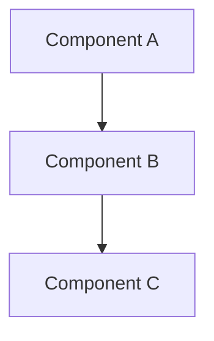

# [Document Title]

## Purpose

Describe the purpose of this document in 2-3 sentences. What does this document cover and why does it exist?

## Scope

### In Scope

- List what this document covers
- Be specific about boundaries

### Out of Scope

- List what this document does NOT cover
- Reference other documents where appropriate

## Non-Goals

- List explicit non-goals for this area/component
- Clarify what will NOT be implemented or addressed

## Glossary

| Term | Definition |
|------|------------|
| Term 1 | Definition of term 1 |
| Term 2 | Definition of term 2 |

## Overview

Provide a high-level overview of the subject matter. This section should be understandable by someone new to the project.

## [Main Content Sections]

Organize the main content into logical sections. Use headings appropriately.

### Subsection 1

Content...

### Subsection 2

Content...

## Diagrams

All diagrams must use Mermaid syntax. No ASCII diagrams.

### [Diagram Title]

## Dependencies

List any dependencies on other documents, systems, or components.

| Dependency | Type | Description |
|------------|------|-------------|
| Document X | Doc Reference | Provides details on... |
| System Y | Runtime | Required for... |

## Related Documents

- [Link to related document 1](./path-to-doc.md)
- [Link to related document 2](./path-to-doc.md)

## References

- [External reference 1](https://example.com)
- [External reference 2](https://example.com)

## Revision History

| Date | Author | Description |
|------|--------|-------------|
| YYYY-MM-DD | Name | Initial version |
