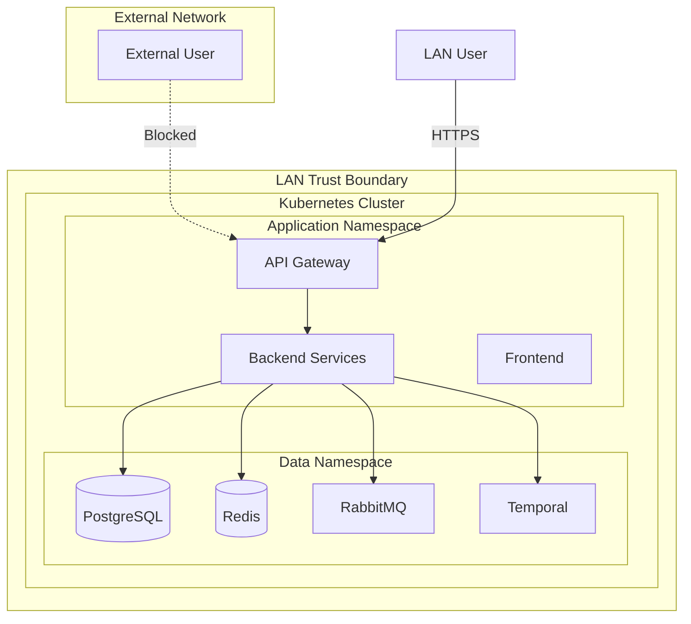
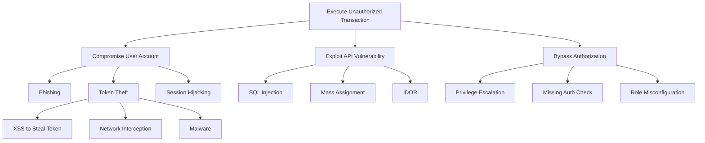

# Threat Model: [Component/Feature Name]

## Overview

Brief description of what is being threat modeled.

## Assets

Assets are what we're trying to protect.

| Asset ID | Asset | Classification | Description |
|----------|-------|----------------|-------------|
| A1 | User credentials | Critical | Passwords, tokens, session data |
| A2 | Financial data | Critical | Account balances, transactions |
| A3 | Personal inventory | Sensitive | Home inventory and locations |
| A4 | Audit logs | High | Security and compliance records |

### Asset Classification Levels

- **Critical:** Breach causes severe harm (financial loss, identity theft)
- **High:** Breach causes significant harm (privacy violation, compliance failure)
- **Sensitive:** Breach causes moderate harm (inconvenience, minor exposure)
- **Internal:** Breach causes minimal harm (operational data)

## Actors

| Actor ID | Actor | Trust Level | Description |
|----------|-------|-------------|-------------|
| AC1 | Authenticated User | Trusted | Valid user with appropriate roles |
| AC2 | Anonymous User | Untrusted | Unauthenticated visitor |
| AC3 | Administrator | Highly Trusted | Full system access |
| AC4 | Malicious Insider | Hostile | Compromised or malicious user account |
| AC5 | External Attacker | Hostile | Attacker from outside the network |
| AC6 | LAN Attacker | Hostile | Attacker with access to local network |

## Entry Points

| EP ID | Entry Point | Protocol | Trust Level | Description |
|-------|-------------|----------|-------------|-------------|
| EP1 | REST API | HTTPS | Authenticated | Main application API |
| EP2 | Web Frontend | HTTPS | Public | React SPA |
| EP3 | Database | PostgreSQL | Internal | Backend to database |
| EP4 | Redis | Redis Protocol | Internal | Cache and session store |
| EP5 | RabbitMQ | AMQP | Internal | Message broker |
| EP6 | Temporal | gRPC | Internal | Workflow engine |

## Trust Boundaries



### Trust Boundary Descriptions

| Boundary | Description | Controls |
|----------|-------------|----------|
| LAN Perimeter | Separation from internet | No external ingress, firewall |
| Cluster Boundary | Kubernetes cluster edge | Network policies, RBAC |
| Namespace Boundary | Logical isolation | Network policies, service accounts |
| Service Boundary | Individual service | Authentication, authorization |

## Threats (STRIDE Analysis)

### Spoofing (S)

| ID | Threat | Asset | Entry Point | Likelihood | Impact | Risk |
|----|--------|-------|-------------|------------|--------|------|
| S1 | JWT token theft and reuse | A1 | EP1 | Medium | High | High |
| S2 | Refresh token hijacking | A1 | EP1 | Medium | Critical | Critical |
| S3 | Session fixation | A1 | EP2 | Low | High | Medium |

### Tampering (T)

| ID | Threat | Asset | Entry Point | Likelihood | Impact | Risk |
|----|--------|-------|-------------|------------|--------|------|
| T1 | Modification of financial transactions | A2 | EP1 | Low | Critical | High |
| T2 | Audit log tampering | A4 | EP3 | Low | High | Medium |
| T3 | Request body manipulation | A2 | EP1 | Medium | High | High |

### Repudiation (R)

| ID | Threat | Asset | Entry Point | Likelihood | Impact | Risk |
|----|--------|-------|-------------|------------|--------|------|
| R1 | User denies financial transaction | A2, A4 | EP1 | Medium | Medium | Medium |
| R2 | Admin denies permission change | A1, A4 | EP1 | Low | High | Medium |

### Information Disclosure (I)

| ID | Threat | Asset | Entry Point | Likelihood | Impact | Risk |
|----|--------|-------|-------------|------------|--------|------|
| I1 | Financial data exposure via API | A2 | EP1 | Medium | Critical | Critical |
| I2 | Error messages leak internal details | All | EP1, EP2 | Medium | Medium | Medium |
| I3 | Log files contain sensitive data | A1, A2 | N/A | Medium | High | High |

### Denial of Service (D)

| ID | Threat | Asset | Entry Point | Likelihood | Impact | Risk |
|----|--------|-------|-------------|------------|--------|------|
| D1 | API rate limit exhaustion | All | EP1 | Medium | Medium | Medium |
| D2 | Database connection exhaustion | All | EP3 | Low | High | Medium |
| D3 | Message queue flooding | All | EP5 | Low | Medium | Low |

### Elevation of Privilege (E)

| ID | Threat | Asset | Entry Point | Likelihood | Impact | Risk |
|----|--------|-------|-------------|------------|--------|------|
| E1 | Horizontal privilege escalation | A2, A3 | EP1 | Medium | High | High |
| E2 | Vertical privilege escalation | All | EP1 | Low | Critical | High |
| E3 | SQL injection | All | EP1 | Low | Critical | High |

## Mitigations

### Mitigation Matrix

| Threat ID | Mitigation | Implementation | Status |
|-----------|------------|----------------|--------|
| S1 | Short-lived access tokens (10-15 min) | JWT exp claim validation | Required |
| S1 | Secure token storage (in-memory) | Frontend implementation | Required |
| S2 | Refresh token rotation | New token on each refresh | Required |
| S2 | Redis-backed token revocation | Store hashed tokens with TTL | Required |
| S3 | Regenerate session on auth | New tokens on login | Required |
| T1 | Input validation + domain invariants | DDD aggregate enforcement | Required |
| T1 | Immutable audit trail | Append-only audit_log table | Required |
| T2 | Database-level permissions | Separate audit DB user | Required |
| T3 | Request signing/validation | HMAC for sensitive operations | Optional |
| R1, R2 | Comprehensive audit logging | All mutations logged | Required |
| I1 | RBAC on all endpoints | Permission checks | Required |
| I1 | Field-level access control | DTO mapping per role | Optional |
| I2 | Generic error messages | Error handler sanitization | Required |
| I3 | Log scrubbing | No PII/secrets in logs | Required |
| D1 | Rate limiting | Per-user/IP limits | Required |
| D2 | Connection pooling | HikariCP configuration | Required |
| D3 | Message size limits | RabbitMQ configuration | Required |
| E1 | Resource ownership checks | Query filters by user | Required |
| E2 | Principle of least privilege | Minimal role permissions | Required |
| E3 | Parameterized queries | JPA/Spring Data | Required |

### Mitigation Details

#### M1: JWT Security Implementation

```
Requirements:
- Algorithm: RS256 or ES256 (no symmetric, no "none")
- Validate: iss, aud, exp, iat, nbf
- Clock skew: max 30 seconds
- Access token TTL: 10-15 minutes
- Refresh token TTL: 7 days (sliding window)
- Refresh rotation: mandatory
- Token revocation: Redis-backed blocklist
```

#### M2: Audit Logging Requirements

```
Every mutation must log:
- who: userId
- when: timestamp (UTC)
- what: entityType, entityId
- action: CREATE/UPDATE/DELETE/etc.
- before: JSON snapshot (for updates/deletes)
- after: JSON snapshot (for creates/updates)
- correlationId: workflow run ID or request ID
```

## Residual Risk

| Threat ID | Residual Risk | Justification | Acceptance |
|-----------|---------------|---------------|------------|
| S1 | Low | Short-lived tokens limit exposure window | Accepted |
| I3 | Low | Log scrubbing may miss edge cases | Accepted with monitoring |
| D1 | Low | LAN-only reduces external attack surface | Accepted |

## Attack Trees

### Attack Tree: Unauthorized Financial Transaction



## Security Testing Requirements

| Test Type | Scope | Frequency | Tools |
|-----------|-------|-----------|-------|
| SAST | All code | Every PR | SpotBugs, Checkstyle |
| Dependency Scan | Dependencies | Every build | OWASP Dependency-Check |
| DAST | APIs | Weekly | OWASP ZAP |
| Penetration Test | Full system | Annually | Manual |
| Secrets Scan | Repository | Every commit | git-secrets, truffleHog |

## References

- [OWASP ASVS](https://owasp.org/www-project-application-security-verification-standard/)
- [OWASP REST Security Cheat Sheet](https://cheatsheetseries.owasp.org/cheatsheets/REST_Security_Cheat_Sheet.html)
- [OWASP JWT Security](https://cheatsheetseries.owasp.org/cheatsheets/JSON_Web_Token_for_Java_Cheat_Sheet.html)
- [STRIDE Threat Modeling](https://docs.microsoft.com/en-us/azure/security/develop/threat-modeling-tool-threats)

## Review History

| Date | Reviewer | Findings | Actions |
|------|----------|----------|---------|
| YYYY-MM-DD | Name | Initial review | Created document |
