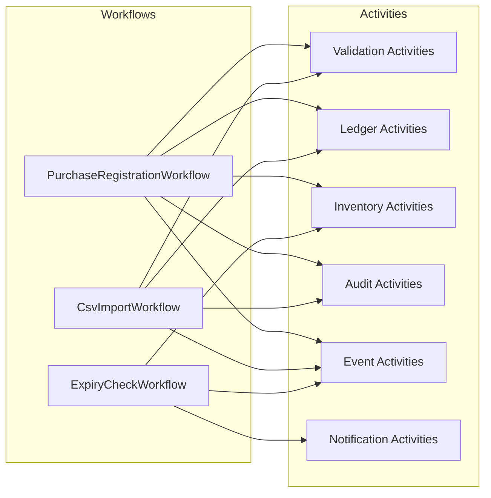
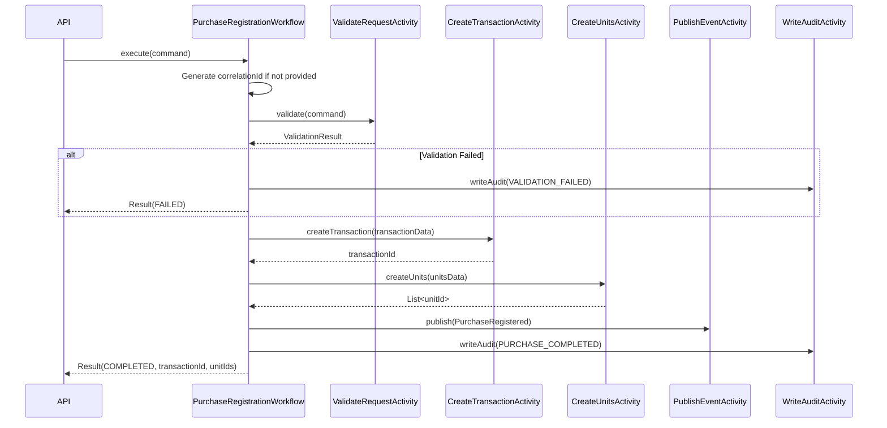
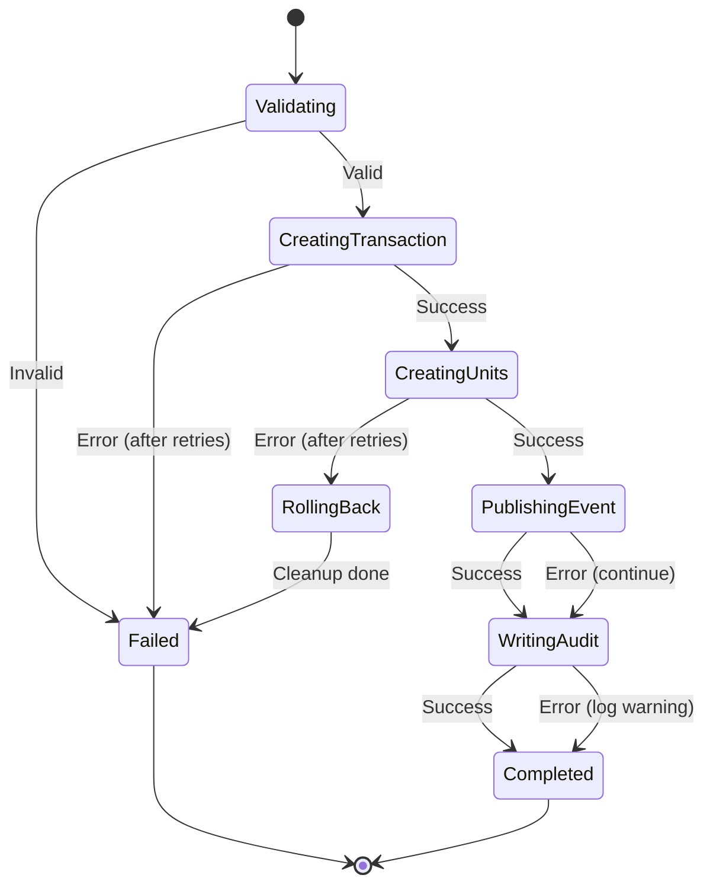
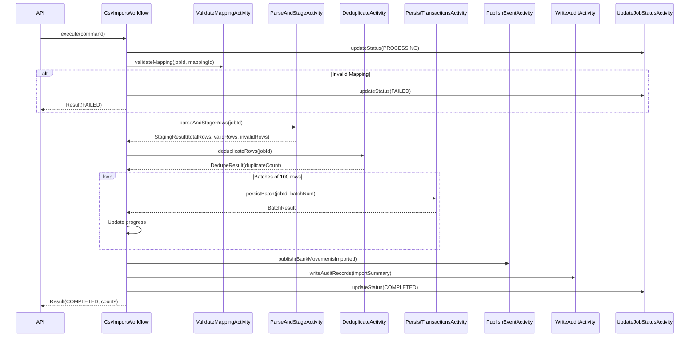
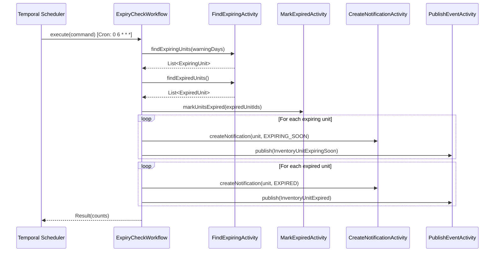

# HomeWarehouse - Temporal Workflows

## Purpose

This document defines the Temporal.io workflow implementations for HomeWarehouse, including workflow definitions, activities, retry policies, error handling, and testing strategies.

## Scope

### In Scope

- Workflow definitions and activity interfaces
- Retry and timeout policies
- Idempotency and correlation strategies
- Failure handling and compensation
- Testing approaches

### Out of Scope

- Temporal cluster deployment (see Infrastructure docs)
- Temporal UI configuration
- Performance tuning (will be addressed post-launch)

## Temporal Configuration

### Connection Settings

| Setting | Development | Production |
|---------|-------------|------------|
| Namespace | homewarehouse-dev | homewarehouse |
| Target | localhost:7233 | temporal.homewarehouse.svc:7233 |
| Task Queue | homewarehouse-tasks | homewarehouse-tasks |

### Spring Boot Integration

```yaml
spring:
  temporal:
    namespace: homewarehouse
    connection:
      target: ${TEMPORAL_TARGET:localhost:7233}
    workers:
      - task-queue: homewarehouse-tasks
        workflow-classes:
          - com.homewarehouse.ledger.infrastructure.temporal.PurchaseRegistrationWorkflow
          - com.homewarehouse.ledger.infrastructure.temporal.CsvImportWorkflow
          - com.homewarehouse.inventory.infrastructure.temporal.ExpiryCheckWorkflow
```

## Workflows Overview



---

## PurchaseRegistrationWorkflow

### Purpose

Orchestrates the atomic registration of a purchase, creating both a ledger transaction and inventory units while ensuring consistency and auditability.

### Workflow Definition

```java
@WorkflowInterface
public interface PurchaseRegistrationWorkflow {

    @WorkflowMethod
    PurchaseRegistrationResult execute(PurchaseRegistrationCommand command);

    @QueryMethod
    PurchaseRegistrationStatus getStatus();
}
```

### Input Command

```java
public record PurchaseRegistrationCommand(
    UUID userId,
    UUID accountId,
    LocalDate transactionDate,
    Money totalAmount,
    String counterparty,
    String description,
    UUID categoryId,
    List<PurchaseItem> items,
    UUID idempotencyKey,
    CorrelationId correlationId
) {}

public record PurchaseItem(
    UUID itemId,
    UUID locationId,
    int quantity,
    Money unitPrice,
    LocalDate bestBefore,
    LocalDate expiresAt
) {}
```

### Result

```java
public record PurchaseRegistrationResult(
    UUID correlationId,
    UUID transactionId,
    List<UUID> unitIds,
    PurchaseRegistrationStatus status,
    String errorMessage
) {}

public enum PurchaseRegistrationStatus {
    PROCESSING,
    COMPLETED,
    FAILED,
    ROLLED_BACK
}
```

### Workflow Sequence



### Activities

#### ValidateRequestActivity

```java
@ActivityInterface
public interface ValidationActivities {

    @ActivityMethod
    ValidationResult validatePurchaseRequest(PurchaseRegistrationCommand command);
}
```

**Validations:**
- User has required permissions
- Account exists and belongs to user
- All inventory items exist
- All locations exist and belong to user
- Amounts are positive
- Expiry dates are valid (expires_at >= best_before)
- Idempotency key is not already used

**Retry Policy:**
```java
RetryOptions.newBuilder()
    .setMaximumAttempts(3)
    .setInitialInterval(Duration.ofMillis(100))
    .setBackoffCoefficient(2.0)
    .setMaximumInterval(Duration.ofSeconds(10))
    .build()
```

#### CreateTransactionActivity

```java
@ActivityInterface
public interface LedgerActivities {

    @ActivityMethod
    UUID createTransaction(CreateTransactionData data);

    @ActivityMethod
    void deleteTransaction(UUID transactionId);
}
```

**Idempotency:** Uses idempotency_key in ledger_transactions table. If key exists, returns existing transaction ID.

**Retry Policy:**
```java
RetryOptions.newBuilder()
    .setMaximumAttempts(5)
    .setInitialInterval(Duration.ofSeconds(1))
    .setBackoffCoefficient(2.0)
    .setMaximumInterval(Duration.ofMinutes(1))
    .setDoNotRetry(
        BusinessRuleViolationException.class,
        ValidationException.class
    )
    .build()
```

#### CreateUnitsActivity

```java
@ActivityInterface
public interface InventoryActivities {

    @ActivityMethod
    List<UUID> createUnits(CreateUnitsData data);

    @ActivityMethod
    void deleteUnits(List<UUID> unitIds);

    @ActivityMethod
    List<ExpiringUnitInfo> findExpiringUnits(LocalDate beforeDate, int daysWarning);

    @ActivityMethod
    void markUnitsExpired(List<UUID> unitIds);
}
```

**Idempotency:** Uses idempotency_key derived from (command.idempotencyKey + item index). If units already exist with this key, returns existing unit IDs.

#### PublishEventActivity

```java
@ActivityInterface
public interface EventActivities {

    @ActivityMethod
    void publishEvent(DomainEvent event);
}
```

**At-Least-Once Delivery:** Events include idempotency_key for consumer-side deduplication.

#### WriteAuditActivity

```java
@ActivityInterface
public interface AuditActivities {

    @ActivityMethod
    void writeAuditRecord(AuditRecord record);
}
```

### Failure Handling



### Compensation (Saga Pattern)

If CreateUnitsActivity fails after CreateTransactionActivity succeeded:

```java
@Override
public PurchaseRegistrationResult execute(PurchaseRegistrationCommand command) {
    UUID transactionId = null;
    List<UUID> unitIds = null;

    try {
        validationActivities.validatePurchaseRequest(command);

        transactionId = ledgerActivities.createTransaction(toTransactionData(command));
        unitIds = inventoryActivities.createUnits(toUnitsData(command, transactionId));

        eventActivities.publishEvent(new PurchaseRegistered(...));
        auditActivities.writeAuditRecord(new AuditRecord(...));

        return new PurchaseRegistrationResult(
            command.correlationId(),
            transactionId,
            unitIds,
            COMPLETED,
            null
        );

    } catch (Exception e) {
        // Compensating actions
        if (unitIds != null && !unitIds.isEmpty()) {
            try {
                inventoryActivities.deleteUnits(unitIds);
            } catch (Exception ex) {
                // Log but continue cleanup
            }
        }
        if (transactionId != null) {
            try {
                ledgerActivities.deleteTransaction(transactionId);
            } catch (Exception ex) {
                // Log but continue
            }
        }

        auditActivities.writeAuditRecord(new AuditRecord(
            ..., "PURCHASE_FAILED", ..., e.getMessage()
        ));

        return new PurchaseRegistrationResult(
            command.correlationId(),
            null,
            List.of(),
            FAILED,
            e.getMessage()
        );
    }
}
```

### Timeouts

| Timeout Type | Value | Rationale |
|--------------|-------|-----------|
| Workflow Execution | 5 minutes | Complete workflow should finish quickly |
| Workflow Run | 5 minutes | Single run (no continue-as-new) |
| Activity Start-to-Close | 30 seconds | Individual activities are fast |
| Activity Schedule-to-Close | 2 minutes | Including retry time |
| Activity Heartbeat | 10 seconds | For long activities (not used here) |

---

## CsvImportWorkflow

### Purpose

Orchestrates the import of bank transactions from a CSV file, including validation, deduplication, and batch persistence.

### Workflow Definition

```java
@WorkflowInterface
public interface CsvImportWorkflow {

    @WorkflowMethod
    CsvImportResult execute(CsvImportCommand command);

    @QueryMethod
    CsvImportProgress getProgress();

    @SignalMethod
    void cancel();
}
```

### Input Command

```java
public record CsvImportCommand(
    UUID jobId,
    UUID userId,
    UUID accountId,
    UUID mappingId,
    UUID defaultCategoryId,
    CorrelationId correlationId
) {}
```

### Result

```java
public record CsvImportResult(
    UUID jobId,
    CorrelationId correlationId,
    int totalRows,
    int importedRows,
    int skippedRows,
    int errorRows,
    CsvImportStatus status,
    List<ImportError> errors
) {}

public record CsvImportProgress(
    int processedRows,
    int totalRows,
    CsvImportStatus status
) {}

public enum CsvImportStatus {
    PROCESSING,
    COMPLETED,
    FAILED,
    CANCELLED
}
```

### Workflow Sequence



### Activities

#### ValidateMappingActivity

Validates that:
- Job exists and is in correct state (PREVIEW_READY or CONFIRMING)
- Mapping exists and belongs to user
- Account exists and belongs to user

#### ParseAndStageActivity

```java
@ActivityInterface
public interface CsvParsingActivities {

    @ActivityMethod
    StagingResult parseAndStageRows(UUID jobId);
}
```

**Process:**
1. Read CSV file from storage
2. Apply column mapping
3. Parse each row into structured data
4. Validate each row (date format, amount format, required fields)
5. Insert into csv_import_staging_rows with status
6. Return summary

#### DeduplicateActivity

```java
@ActivityInterface
public interface CsvDeduplicationActivities {

    @ActivityMethod
    DedupeResult deduplicateRows(UUID jobId, UUID accountId);
}
```

**Idempotency Key Generation:**
```java
String generateIdempotencyKey(UUID accountId, ParsedRow row) {
    String input = String.join("|",
        accountId.toString(),
        row.transactionDate().toString(),
        row.amount().toString(),
        row.description(),
        Optional.ofNullable(row.reference()).orElse("")
    );
    return UUID.nameUUIDFromBytes(input.getBytes(UTF_8)).toString();
}
```

**Process:**
1. For each staged row, generate idempotency key
2. Check if key exists in ledger_transactions
3. Mark duplicates in staging table
4. Return count

#### PersistTransactionsActivity

```java
@ActivityInterface
public interface CsvPersistenceActivities {

    @ActivityMethod
    BatchResult persistBatch(UUID jobId, int batchNumber, int batchSize);
}
```

**Batch Processing:**
- Process 100 rows per batch
- Use database transactions per batch
- On failure, mark failed rows but continue
- Return success/failure counts

### Cancellation Handling

```java
@Override
public CsvImportResult execute(CsvImportCommand command) {
    cancelled = false;

    // Setup cancellation scope
    CancellationScope scope = Workflow.newCancellationScope(() -> {
        while (!cancelled && currentBatch < totalBatches) {
            try {
                Workflow.await(() -> cancelled);
            } catch (CanceledFailure e) {
                // Handle cancellation
            }
        }
    });

    // On cancel signal
    // @SignalMethod
    public void cancel() {
        cancelled = true;
        Workflow.cancelScope(scope);
    }
}
```

### Error Handling

```java
public record ImportError(
    int rowNumber,
    String field,
    String error,
    String rawValue
) {}

// Collect errors during processing
List<ImportError> errors = new ArrayList<>();

for (StagingRow row : rows) {
    try {
        processRow(row);
    } catch (RowProcessingException e) {
        errors.add(new ImportError(
            row.rowNumber(),
            e.getField(),
            e.getMessage(),
            e.getRawValue()
        ));
        updateStagingRowStatus(row.id(), "FAILED", e.getMessage());
    }
}
```

### Timeouts

| Timeout Type | Value | Rationale |
|--------------|-------|-----------|
| Workflow Execution | 30 minutes | Large files may take time |
| Parsing Activity | 5 minutes | File parsing |
| Dedup Activity | 5 minutes | Database checks |
| Persist Batch | 2 minutes | Per batch |

---

## ExpiryCheckWorkflow

### Purpose

Scheduled workflow that runs daily to find expiring inventory units and create notifications.

### Workflow Definition

```java
@WorkflowInterface
public interface ExpiryCheckWorkflow {

    @WorkflowMethod
    ExpiryCheckResult execute(ExpiryCheckCommand command);
}
```

### Cron Schedule

```java
WorkflowOptions options = WorkflowOptions.newBuilder()
    .setWorkflowId("expiry-check-daily")
    .setTaskQueue("homewarehouse-tasks")
    .setCronSchedule("0 6 * * *")  // Daily at 6:00 AM
    .build();
```

### Input Command

```java
public record ExpiryCheckCommand(
    int warningDaysAhead,  // Default: 7
    CorrelationId correlationId
) {}
```

### Result

```java
public record ExpiryCheckResult(
    int unitsExpiringSoon,
    int unitsExpired,
    int notificationsCreated,
    int eventsPublished
) {}
```

### Workflow Sequence



### Activities

#### FindExpiringUnitsActivity

```java
public record ExpiringUnitInfo(
    UUID unitId,
    UUID itemId,
    String itemName,
    UUID userId,
    UUID locationId,
    String locationPath,
    LocalDate expiresAt,
    int daysRemaining
) {}

@ActivityMethod
List<ExpiringUnitInfo> findExpiringUnits(
    LocalDate beforeDate,
    int warningDays
);
```

**Query:**
```sql
SELECT u.id, u.item_id, i.name, i.user_id, u.location_id,
       l.path, u.expires_at,
       u.expires_at - CURRENT_DATE as days_remaining
FROM inventory_units u
JOIN inventory_items i ON u.item_id = i.id
JOIN inventory_locations l ON u.location_id = l.id
WHERE u.status = 'AVAILABLE'
  AND u.expires_at IS NOT NULL
  AND u.expires_at BETWEEN CURRENT_DATE AND CURRENT_DATE + ?
ORDER BY u.expires_at ASC
```

#### CreateNotificationActivity

```java
@ActivityInterface
public interface NotificationActivities {

    @ActivityMethod
    UUID createNotification(CreateNotificationData data);
}

public record CreateNotificationData(
    UUID userId,
    NotificationType type,
    String title,
    String message,
    String referenceEntityType,
    UUID referenceEntityId
) {}
```

### Idempotency for Cron Workflows

Since cron workflows run daily:
- Use workflow ID: `expiry-check-{date}` for idempotency
- Check if notification already exists for unit+date
- Skip duplicate notifications

```java
String workflowId = "expiry-check-" + LocalDate.now().toString();
```

---

## Common Patterns

### Correlation ID Propagation

```java
// In workflow
CorrelationId correlationId = command.correlationId() != null
    ? command.correlationId()
    : new CorrelationId(Workflow.getInfo().getWorkflowId());

// Pass to all activities
CreateTransactionData data = new CreateTransactionData(
    ...,
    correlationId
);

// In activity implementation
transactionEntity.setCorrelationId(correlationId.value());
```

### Activity Options Factory

```java
public class ActivityOptionsFactory {

    public static ActivityOptions fastActivity() {
        return ActivityOptions.newBuilder()
            .setStartToCloseTimeout(Duration.ofSeconds(30))
            .setRetryOptions(RetryOptions.newBuilder()
                .setMaximumAttempts(3)
                .setInitialInterval(Duration.ofMillis(100))
                .setBackoffCoefficient(2.0)
                .build())
            .build();
    }

    public static ActivityOptions databaseActivity() {
        return ActivityOptions.newBuilder()
            .setStartToCloseTimeout(Duration.ofMinutes(2))
            .setRetryOptions(RetryOptions.newBuilder()
                .setMaximumAttempts(5)
                .setInitialInterval(Duration.ofSeconds(1))
                .setBackoffCoefficient(2.0)
                .setDoNotRetry(
                    BusinessRuleViolationException.class,
                    EntityNotFoundException.class
                )
                .build())
            .build();
    }

    public static ActivityOptions eventPublishingActivity() {
        return ActivityOptions.newBuilder()
            .setStartToCloseTimeout(Duration.ofSeconds(30))
            .setRetryOptions(RetryOptions.newBuilder()
                .setMaximumAttempts(10)
                .setInitialInterval(Duration.ofSeconds(1))
                .setBackoffCoefficient(2.0)
                .setMaximumInterval(Duration.ofMinutes(5))
                .build())
            .build();
    }
}
```

### Non-Retryable Exceptions

```java
public class BusinessRuleViolationException extends RuntimeException {}
public class ValidationException extends RuntimeException {}
public class EntityNotFoundException extends RuntimeException {}
public class InsufficientPermissionException extends RuntimeException {}
public class DuplicateEntityException extends RuntimeException {}
```

---

## Testing Strategy

### Unit Testing Workflows

```java
@ExtendWith(MockitoExtension.class)
class PurchaseRegistrationWorkflowTest {

    @RegisterExtension
    public static TestWorkflowExtension testWorkflow = TestWorkflowExtension.newBuilder()
        .setWorkflowTypes(PurchaseRegistrationWorkflowImpl.class)
        .setDoNotStart(true)
        .build();

    @Mock
    private ValidationActivities validationActivities;

    @Mock
    private LedgerActivities ledgerActivities;

    @Mock
    private InventoryActivities inventoryActivities;

    @Test
    void shouldCompletePurchaseSuccessfully() {
        // Arrange
        Worker worker = testWorkflow.newWorker(TASK_QUEUE);
        worker.registerActivitiesImplementations(
            validationActivities, ledgerActivities, inventoryActivities
        );
        testWorkflow.start();

        when(validationActivities.validatePurchaseRequest(any()))
            .thenReturn(ValidationResult.valid());
        when(ledgerActivities.createTransaction(any()))
            .thenReturn(UUID.randomUUID());
        when(inventoryActivities.createUnits(any()))
            .thenReturn(List.of(UUID.randomUUID()));

        // Act
        PurchaseRegistrationWorkflow workflow = testWorkflow
            .newWorkflowStub(PurchaseRegistrationWorkflow.class);
        PurchaseRegistrationResult result = workflow.execute(command);

        // Assert
        assertThat(result.status()).isEqualTo(COMPLETED);
        assertThat(result.transactionId()).isNotNull();
    }

    @Test
    void shouldRollbackOnInventoryFailure() {
        // Setup to fail on inventory creation
        when(inventoryActivities.createUnits(any()))
            .thenThrow(new RuntimeException("DB Error"));

        // Verify transaction rollback is called
        verify(ledgerActivities).deleteTransaction(any());
    }
}
```

### Integration Testing with TestContainers

```java
@SpringBootTest
@Testcontainers
class CsvImportWorkflowIntegrationTest {

    @Container
    static PostgreSQLContainer<?> postgres = new PostgreSQLContainer<>("postgres:16");

    @Container
    static GenericContainer<?> temporal = new GenericContainer<>("temporalio/auto-setup:1.22")
        .withExposedPorts(7233);

    @Autowired
    private TemporalClient temporalClient;

    @Test
    void shouldImportCsvSuccessfully() {
        // Create test job and file
        UUID jobId = createTestImportJob();

        // Start workflow
        CsvImportWorkflow workflow = temporalClient.newWorkflowStub(
            CsvImportWorkflow.class,
            WorkflowOptions.newBuilder()
                .setWorkflowId("test-import-" + jobId)
                .setTaskQueue("homewarehouse-tasks")
                .build()
        );

        CsvImportResult result = workflow.execute(new CsvImportCommand(
            jobId, userId, accountId, mappingId, categoryId, null
        ));

        assertThat(result.status()).isEqualTo(COMPLETED);
        assertThat(result.importedRows()).isGreaterThan(0);

        // Verify transactions in database
        int txCount = jdbcTemplate.queryForObject(
            "SELECT COUNT(*) FROM ledger_transactions WHERE correlation_id = ?",
            Integer.class,
            result.correlationId()
        );
        assertThat(txCount).isEqualTo(result.importedRows());
    }
}
```

### Testing Cron Workflows

```java
@Test
void shouldFindAndNotifyExpiringUnits() {
    // Insert test units with various expiry dates
    insertTestUnits();

    // Run workflow with simulated time
    testWorkflow.getWorkflowEnvironment().setCurrentTime(Instant.now());

    ExpiryCheckWorkflow workflow = testWorkflow.newWorkflowStub(
        ExpiryCheckWorkflow.class
    );

    ExpiryCheckResult result = workflow.execute(
        new ExpiryCheckCommand(7, null)
    );

    assertThat(result.unitsExpiringSoon()).isEqualTo(3);
    assertThat(result.notificationsCreated()).isEqualTo(3);

    // Verify notifications in database
    List<Notification> notifications = notificationRepository.findByType(EXPIRING_SOON);
    assertThat(notifications).hasSize(3);
}
```

---

## Monitoring

### Workflow Metrics

| Metric | Description |
|--------|-------------|
| workflow_started_total | Total workflows started by type |
| workflow_completed_total | Total workflows completed by type |
| workflow_failed_total | Total workflows failed by type |
| workflow_execution_time_seconds | Workflow execution duration |
| activity_execution_time_seconds | Activity execution duration |
| activity_retry_count | Number of activity retries |

### Dashboards

- Workflow execution success rate
- Average workflow duration
- Activity failure rates
- Queue backlog size

---

## Related Documents

- [Architecture](../architecture/01-architecture.md) - Module structure for activities
- [Events](../events/06-events-rabbitmq.md) - Event publishing from workflows
- [Data Model](../database/03-data-model.md) - Tables used by activities
- [Infrastructure](../infra/08-infra-plan.md) - Temporal deployment
